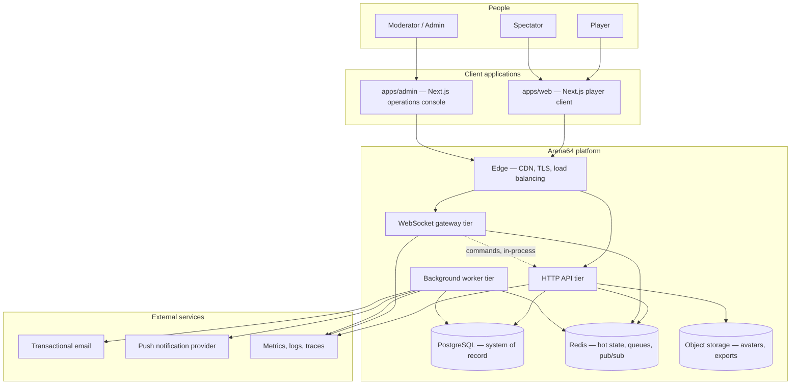
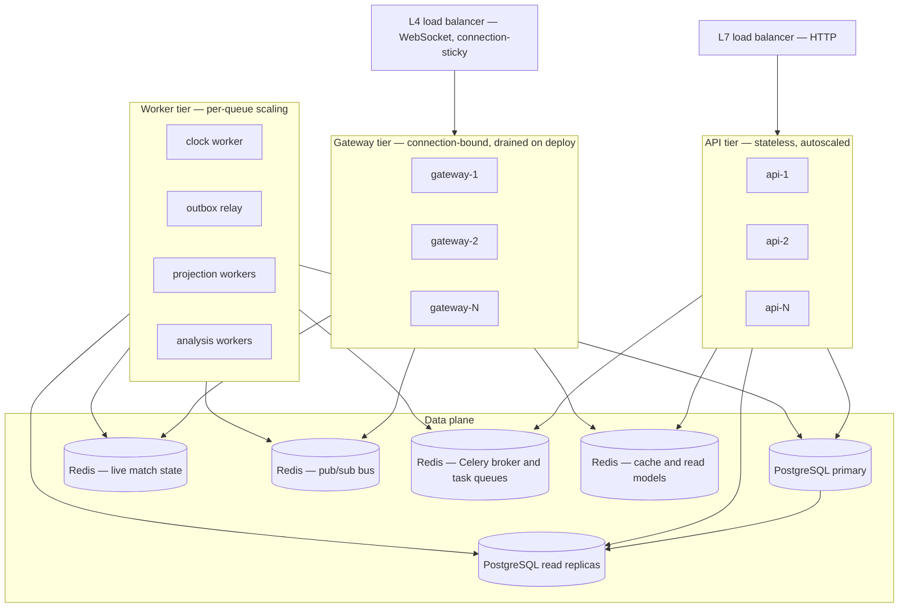
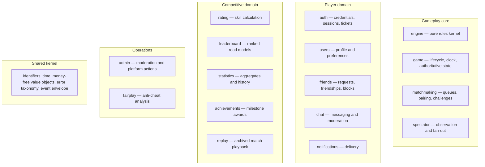
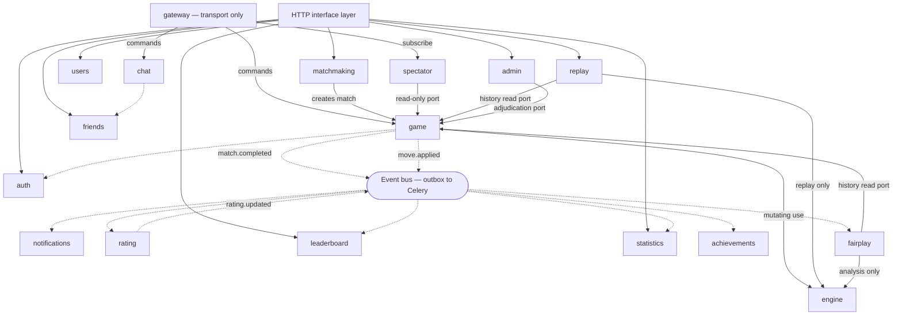
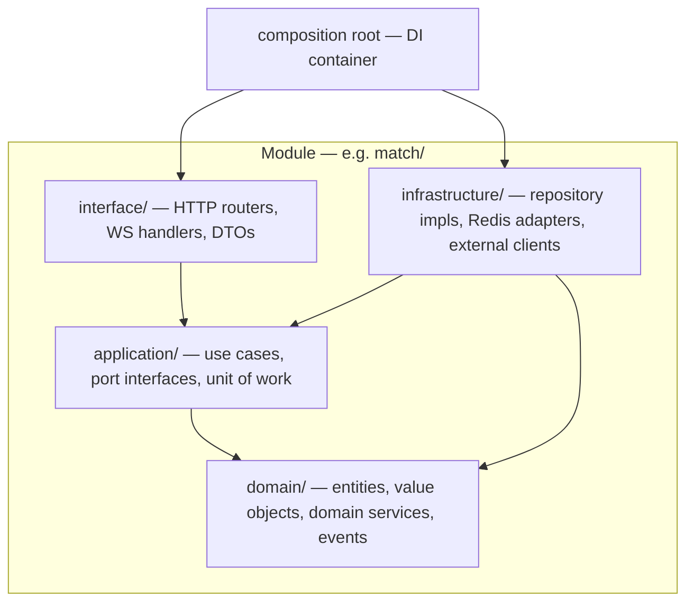
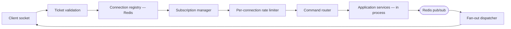
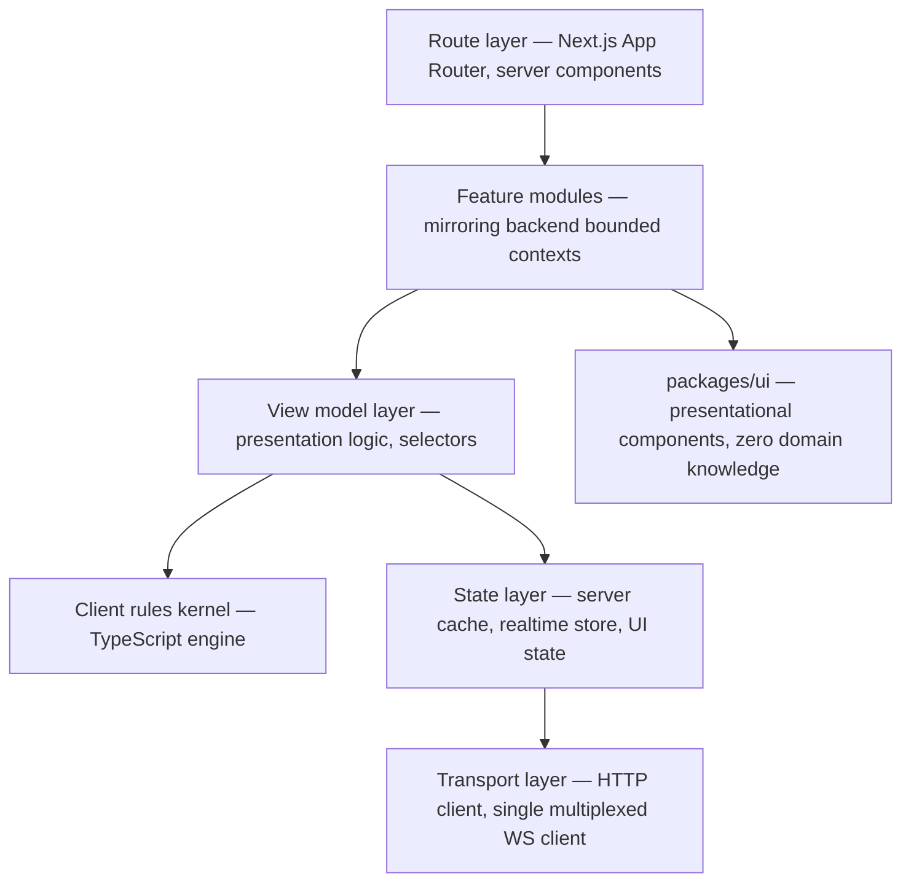
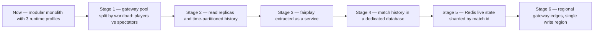

# Architecture Overview

> **Status:** Draft — proposed for review
> **Owner:** _Unassigned_
> **Last reviewed:** _Not yet reviewed_
> **Companion document:** [`system-design.md`](./system-design.md) — runtime behaviour, sequences, failure modes

## Purpose

Entry point for understanding how Arena64 is composed: its applications, modules, layers,
and the rules that govern the boundaries between them. This document defines **structure**
— what exists and what may depend on what. Its companion, `system-design.md`, defines
**behaviour** — how those pieces interact at runtime.

## Scope

The static architecture of the whole platform, and the reasoning behind each choice.
Subsystem detail is delegated to sibling documents ([`database.md`](./database.md),
[`websocket.md`](./websocket.md), [`events.md`](./events.md), [`caching.md`](./caching.md),
[`security.md`](./security.md)), which are still placeholders. Nothing here specifies
schema, endpoints, or code.

---

## 1. Assumptions and Inputs

`docs/00-overview/vision.md` and `roadmap.md` are still placeholders, so this architecture
is derived from the feature set enumerated in `specs/`, the existing monorepo layout, and
the intended stack recorded in the root `README.md`. The following assumptions are load
bearing — **if any is wrong, the design must be revisited**:

| # | Assumption | Consequence if wrong |
| --- | --- | --- |
| A-1 | Arena64 plays **checkers/draughts** with mandatory capture and multi-jump moves | The engine's complexity and the need for a shared client/server rules kernel change |
| A-2 | Matches are **two-player, turn-based, clocked**, with time controls from bullet to correspondence | Clock adjudication design changes fundamentally |
| A-3 | Target scale is **~500k registered, ~50k peak concurrent connections, ~20k concurrent matches** | Sizing in `system-design.md §10` changes; the modular monolith may become premature |
| A-4 | Ratings are **competitive and permanent** — a corrupted result is unacceptable | Exactly-once result processing could be relaxed, simplifying the outbox |
| A-5 | Spectating is a first-class feature with **fan-out far exceeding player traffic** | The player/spectator channel split becomes unnecessary |
| A-6 | The platform is a **single global deployment** initially, not multi-region active-active | Data ownership and consistency sections change substantially |

Every decision below is tagged `AD-nn` and carries its rationale. These are **candidates
for promotion to ADRs** in `docs/07-decisions/` — see §17.

---

## 2. Architectural Style

### AD-01 — Modular Monolith, not microservices

Arena64's backend is **one codebase and one deployable artifact**, internally partitioned
into bounded contexts with enforced boundaries.

**Why this, for Arena64 specifically:**

Nearly every domain in `specs/` orbits a single aggregate — the **Match**. Matchmaking
creates it, the game engine governs it, rating consumes its result, statistics and
leaderboards aggregate it, spectating observes it, chat is scoped to it. A microservice
decomposition would place a network hop in the middle of the move loop, which is the one
path where latency *is* the product: a player who waits 300ms to see their own move
perceives the platform as broken, regardless of how elegant the service topology is.

The second reason is transactional. Completing a match must atomically write the result,
the final move, and the event that triggers rating recalculation. In a monolith that is one
database transaction. Across services it is a saga with compensating actions, and the
failure mode of a botched saga is a corrupted rating — the exact failure Arena64 cannot
tolerate (A-4).

The third is team size. A modular monolith gives the *architectural* benefits of service
boundaries — clear ownership, testable seams, independent reasoning — without the
*operational* cost of distributed tracing across a dozen deployments, at a stage where the
project has no application code yet.

**What we give up:** independent deployment per domain, and independent technology choice
per domain. Both are recovered later at the seams described in §16, because the module +
port + event structure is exactly the extraction interface a service split needs.

**Revisit when:** a single module's scaling profile diverges enough to distort the whole
(see §16 triggers), or more than roughly four teams contend on the same deploy pipeline.

### AD-02 — One codebase, three runtime profiles

The single backend artifact is launched under three different entrypoints:

| Profile | Handles | Scales with | Restart tolerance |
| --- | --- | --- | --- |
| `api` | Stateless HTTP requests | Requests per second | High — a request retries |
| `gateway` | Long-lived WebSocket connections | Concurrent connections | **Low — a restart drops live matches** |
| `worker` | Queue and event consumers | Backlog depth per queue | High — work is redelivered |

**Why split the processes but not the codebase:** the three have incompatible operational
characteristics but identical domain logic. A gateway node holding 40,000 sockets must not
be recycled every time an API bugfix ships — that would interrupt tens of thousands of
games in progress for a change unrelated to gameplay. Conversely the HTTP tier needs to
autoscale aggressively on traffic spikes that the gateway does not see. Separate processes
give independent deploy cadence and independent resource tuning; a shared codebase means
the rules of the game exist in exactly one place, and a domain change cannot drift between
tiers.

### Foundations applied

| Principle | How it lands in Arena64 |
| --- | --- |
| **Domain-Driven Design** | Modules are bounded contexts named after the domain language players use — *match*, *challenge*, *flag*, *rating period*, *spectator*. The `specs/` directory is the context map. |
| **Clean Architecture** | Dependencies point inward toward the domain. The checkers rules never import FastAPI, SQLAlchemy, or Redis. |
| **Repository Pattern** | One repository per aggregate root, interface declared in the application layer, implementation in infrastructure. |
| **Service Layer** | Application services are the only transaction owners and the only entry point into a module from outside. |
| **Dependency Injection** | Every collaborator is injected at the composition root; nothing is constructed inside a consumer. |
| **Event-driven** | Asynchronous for everything downstream of a completed match; synchronous for everything a player is actively waiting on. |

---

## 3. Context Diagram

The dotted edge from gateway to API denotes that the gateway invokes **the same application
services in its own process**, not a network call — a direct consequence of AD-01.

---

## 4. Runtime Topology

### AD-03 — Redis is deployed as four role-separated instances, not one

**Why:** the four workloads have hostile interactions. A spectator fan-out storm on a
high-profile match floods pub/sub; if that shared a memory budget with live match state,
eviction would delete positions of games in progress. Queue backlogs during an incident
grow unboundedly; that must not evict the leaderboard read model. Role separation converts
a platform-wide outage into a single degraded feature, and lets each instance be sized and
persistence-configured for its own needs — live state runs with AOF, the cache runs with no
persistence at all.

---

## 5. Application Boundaries

| Application | Responsibility | Notes |
| --- | --- | --- |
| `apps/api` | The entire backend — HTTP, WebSocket, and workers under the three profiles of AD-02 | One artifact, three entrypoints |
| `apps/web` | Player-facing client: play, spectate, social, profile, leaderboards | Public SEO surface |
| `apps/admin` | Moderation, account actions, platform operations | Separate deployment; never shares a session with `apps/web` |

### AD-04 — The admin console is a separate application, not a route in the player client

**Why:** moderation tooling can read chat transcripts, suspend accounts, and adjudicate
matches. Shipping that code to every player's browser means the privileged surface is one
authorization bug away from exposure, and it inflates the bundle that gates time-to-first-move
for ordinary players. A separate origin, separate session, and separate deploy keeps
privileged capability off the public client entirely.

---

## 6. Module Map — Bounded Contexts

Each backend module is a bounded context with its own domain vocabulary. The mapping to
`specs/` is deliberate: a spec describes what a context does, the module implements it.

| Module | Bounded context | Spec | Aggregate roots |
| --- | --- | --- | --- |
| `engine` | Rules of checkers | `specs/game-engine.md` | *(none — pure functions and value objects)* |
| `game` | A single contest between two players | `specs/game-engine.md` | `Match` |
| `matchmaking` | Finding an opponent | `specs/matchmaking.md` | `QueueTicket`, `Challenge` |
| `spectator` | Watching a match | `specs/spectator.md` | *(none — read model over `game`)* |
| `auth` | Who a player is, and proof of it | `specs/authentication.md` | `Account`, `Session` |
| `users` | Public identity and preferences | `specs/profile.md`, `specs/settings.md` | `UserProfile` |
| `friends` | Relationships between players | `specs/friends.md` | `FriendRequest`, `Friendship`, `Block` |
| `chat` | Conversation | `specs/chat.md` | `ChatThread` |
| `notifications` | Reaching a player out-of-band | `specs/notifications.md` | `Notification` |
| `rating` | Measured skill | `specs/rating.md` | `PlayerRating` |
| `leaderboard` | Ranked standing | `specs/leaderboard.md` | *(none — projection)* |
| `statistics` | Aggregated performance | `specs/statistics.md` | *(none — projection)* |
| `achievements` | Milestone awards | *(no spec yet — see §18)* | `PlayerAchievement` |
| `replay` | Playback of archived matches | *(no spec yet — see §18)* | *(none — read side over `game`)* |
| `admin` | Platform intervention | `specs/admin.md` | `ModerationCase` |
| `fairplay` | Integrity of results | *(no spec yet — see §18)* | `IntegritySignal` |

**Why `settings` is folded into `users` rather than kept separate:** profile and preferences
are written only by their owner, share one lifecycle, are created and deleted together, and
are read together on every profile render. Two modules with one small aggregate each would
produce a permanent cross-module call on the platform's most-rendered page in exchange for
no isolation benefit.

**Why `replay` is a module rather than a feature of `game`:** playback reads archived
matches, generates notation and exports, and drives analysis playback — all read-only,
latency-tolerant work over cold data. Keeping it inside `game` would put non-critical
read paths in the module that owns the 5,000-moves-per-second hot path, and would make
`game` harder to reason about for the one thing it must get right.

### AD-05 — `fairplay` is a module from day one, even though no spec exists

**Why:** anti-cheat is not a feature that can be retrofitted, because it depends on data
that must be captured *at the moment a move is made* — per-move think time, client-reported
timing, input modality. If the move pipeline is built without those fields, the historical
record is permanently unanalysable and every game played before the retrofit is
un-auditable. Reserving the module now costs one directory; adding it later costs the
entire back catalogue.

---

## 7. Module Dependency Rules

Solid arrows are **synchronous in-process calls through a published port**. Dashed arrows
are **asynchronous domain events**. Any edge not drawn is forbidden.

### The rules

**R-1 — A module may only be reached through its published application services.**
Reaching into another module's domain entities, repositories, or ORM models is a boundary
violation, even though the Python import would succeed. *Why:* the import graph is the only
thing standing between a modular monolith and a big ball of mud; nothing about a monolith
enforces boundaries except discipline and CI.

**R-2 — Only `game`, `replay`, and `fairplay` may import `engine`, and only `game` may use
it to mutate state.**
The other two replay finished games; they never write. *Why:* see §11. The engine's
guarantee is that it is pure. If `chat` or `statistics` could import it, someone would
eventually add a database lookup to a rules function to satisfy a reporting requirement, and
the engine's testability — the thing protecting competitive integrity — would be gone. The
two read-only exceptions are the whole reason the engine is a peer module rather than a
private package inside `game`.

**R-3 — Only `game` may mutate match state.**
Rating, statistics, achievements, leaderboard, notifications, replay, fairplay and spectator
**never call into `game` to change anything**; they subscribe to its events. *Why:* two independent
benefits. It keeps the move hot path free of their latency, and it makes them
*non-critical* — a rating outage degrades a scoreboard, it does not stop people from
playing checkers. Inverting this (having `game` call `rating` on completion) would couple
the platform's core loop to its least critical subsystem.

**R-4 — Downstream competitive modules form a one-way chain.**
`game` → `rating` → `leaderboard`, and `game` → `statistics` → `achievements`. No back-edges. *Why:*
ratings must never depend on leaderboard state, or a leaderboard rebuild could alter
historical ratings.

**R-5 — The shared kernel is tiny and stable.**
It holds identifiers, the clock port, the error taxonomy, and the event envelope — nothing
with business rules. *Why:* every module depends on it, so every change to it is a change
to everything. Business logic placed there becomes un-evolvable.

**R-6 — Cyclic dependencies are prohibited, including through events.**
If two modules need each other synchronously, either the boundary is drawn in the wrong
place or a third context is hiding between them.

**R-7 — The gateway contains no domain logic.**
It validates, authenticates, rate-limits, routes, and fans out. It never decides whether a
move is legal. *Why:* see §10.

**Enforcement:** these rules are worthless as prose. They must be encoded as import-linter
contracts (or equivalent) in CI, so a violation fails a pull request rather than surviving
review. This is a required task in §18.

---

## 8. Backend Layers — Clean Architecture Inside a Module

Every module has the same four-layer interior. Uniformity matters more than local
optimisation: a contributor who has read one module can navigate all of them.

| Layer | Contains | May import | Must never import |
| --- | --- | --- | --- |
| `domain/` | Entities, value objects, domain services, domain events, invariants | Shared kernel, `engine` *(in `game`, `replay`, `fairplay` only)* | Anything else — no framework, no ORM, no Redis, no clock, no logging framework |
| `application/` | Use cases, **repository interfaces**, unit-of-work contract, DTO mapping | `domain/`, other modules' published ports | Concrete infrastructure, HTTP types |
| `infrastructure/` | SQLAlchemy repositories, Redis adapters, email and push clients | `application/`, `domain/` | Other modules' internals, `interface/` |
| `interface/` | FastAPI routers, WebSocket message handlers, request and response schemas | `application/` | `domain/` entities directly, `infrastructure/` |

### AD-06 — Repository interfaces live in `application/`, not `infrastructure/`

**Why:** this is the dependency inversion that makes the rest of the architecture possible.
The use case declares the persistence it needs; infrastructure satisfies it. Concretely for
Arena64: match history is append-only and read-mostly, and will eventually move to a read
replica and later possibly to its own database (§16). Because `MatchHistoryRepository` is a
port owned by the application layer, that migration replaces one adapter and touches no use
case and no test. Had the interface lived beside its SQLAlchemy implementation, every
consumer would depend on the storage decision.

### AD-07 — `domain/` may not read the clock

Time is injected as a port. **Why:** Arena64 is a clocked game. Half of the match domain's
rules are time-dependent — flag falls, increment application, abandonment thresholds,
correspondence deadlines. If domain code calls the system clock directly, none of that is
testable without sleeping, and tests that sleep are tests that get deleted. With an injected
clock, a two-week correspondence timeout is a unit test that runs in a microsecond.

---

## 9. Service Layer and Repository Boundaries

### Service layer

An **application service** is a use case: one public method, one intent, one transaction.

| Rule | Rationale |
| --- | --- |
| Application services are the **only** transaction owners | If repositories opened their own transactions, applying a move, appending to the move log, and writing the outbox row could not be atomic |
| A service method is the **only** entry point into a module from outside | Gives one place to enforce authorization, validation, and instrumentation per use case |
| Services orchestrate; they do not compute | Rules belong in `domain/` and `engine`. A service that contains an `if` about checkers is misplaced logic |
| Services never call another module's repository | They call the other module's service, or subscribe to its events (R-1) |
| Services return domain results or typed errors, never HTTP artifacts | The same service is called by an HTTP route, a WebSocket handler, an admin action, and a test |

The last row is not theoretical: `match.submit_move` is invoked from the WebSocket gateway
in normal play, from the HTTP API for correspondence games, from the clock worker's timeout
adjudication path, and from `admin` when a moderator adjudicates a disputed match. One
implementation, four callers, zero transport knowledge.

### Repository boundaries

| Rule | Rationale for Arena64 |
| --- | --- |
| **One repository per aggregate root, not per table** | `MatchRepository` returns a `Match` *including its move log*. A match without its moves cannot be replayed, audited, or analysed for fair play — it is not a valid aggregate |
| Repositories return **domain entities**, never ORM rows | The `Match` entity carries the engine's `Position` value object; a database row cannot express it. Leaking ORM objects would spread lazy-loading behaviour into use cases |
| Repositories are transaction **participants**, not owners | The unit of work is opened by the service (see above) |
| Query methods are **named for the use case**, not for SQL | `find_pairable_opponents` states intent; a generic filter API pushes matchmaking policy into callers where it cannot be tested as a unit |
| Cross-aggregate joins are **not** repository responsibilities | Multi-context reads (a profile page showing rating, stats, and recent matches) are served by a dedicated read model, not by a repository reaching across contexts |
| Every repository has an **in-memory fake** used by application-layer tests | Application tests must run without a database. If they need Postgres, they will be slow, and slow tests stop being run |

### AD-08 — Reads that span contexts use purpose-built read models, not repositories

**Why:** the player profile page needs identity, profile, rating, statistics, and recent
matches. Assembling that through five repositories means five round trips on a page that is
the platform's main SEO surface. A read model — a denormalised projection maintained by a
worker and cached in Redis — serves it in one lookup. The write side keeps its clean
aggregate boundaries; the read side is optimised independently. This is CQRS applied only
where it pays, not as a blanket policy.

---

## 10. WebSocket Gateway

The gateway terminates every realtime connection and owns nothing about checkers.

### Responsibilities

| Owns | Explicitly does not own |
| --- | --- |
| Connection lifecycle, heartbeat, liveness detection | Move legality |
| Handshake authentication and session binding | Clock adjudication |
| Channel subscription and authorization to subscribe | Match state |
| Inbound envelope validation and rate limiting | Rating, chat moderation policy |
| Outbound fan-out and per-channel sequencing | Any persistence to PostgreSQL |
| Reconnection and message replay | Any business decision whatsoever |

### AD-09 — Connections authenticate with a short-lived, single-use ticket

The client obtains a ticket from the HTTP API and presents it on connect; the gateway
exchanges it for a bound session.

**Why:** browsers cannot set custom headers on a `WebSocket` handshake, which leaves two
bad options — a long-lived token in the query string, which lands in load balancer access
logs, proxy logs, and browser history, or an unauthenticated socket that authenticates in
its first frame, which means the gateway must hold and account for unauthenticated
connections and becomes trivially floodable. A ticket that is valid for seconds and
redeemable once makes log leakage worthless to an attacker and lets the gateway drop
anything that fails to present a valid ticket immediately on connect.

### AD-10 — Player and spectator channels are separate, with independent policy

Each match exposes a bidirectional player channel and a broadcast-only spectator channel.

**Why, and this is specific to competitive board games:** if spectators shared the players'
channel, a spectator running an engine could relay the best move to a player in real time.
A separate broadcast channel can be **delayed** for high-profile or high-rated games, which
makes real-time coaching impossible without affecting the players' own latency at all.
Secondarily, the split isolates the two scaling profiles — a match with 5,000 spectators and
2 players must not let fan-out pressure interfere with the players' move round trip, and
the two channels can carry different rate limits, different QoS, and different payloads
(spectators never receive draw offers or takeback dialogue).

### AD-11 — One socket per client, multiplexed by channel

**Why:** browsers limit concurrent connections per origin, and mobile clients pay a battery
and handshake cost per socket. More importantly, separate sockets for moves and chat would
make cross-stream ordering undefined — a resignation and a chat message sent in that order
could arrive reversed, producing a confusing and occasionally accusatory user experience.
One ordered stream with channel-tagged envelopes makes ordering a solved problem.

### AD-12 — Every match message carries a per-match sequence number

**Why:** mobile networks drop connections mid-game constantly. Without sequencing, a
reconnecting client cannot know what it missed, so the only safe recovery is to refetch full
match state — expensive at scale and slow exactly when the player is already stressed by a
disconnect. With a sequence number the client sends its last-seen value and the gateway
replays the gap from a bounded Redis stream. Full-state resync becomes the fallback, not the
default.

Detailed protocol design — envelope shape, channel naming, backpressure, close codes — is
delegated to [`websocket.md`](./websocket.md).

---

## 11. Game Engine Isolation

The `engine` module is a **pure rules kernel**: no I/O, no clock, no randomness, no logging,
no framework, no database, no configuration. It exposes deterministic functions over
immutable value objects — legal move generation, move application, terminal-state detection,
and position hashing for repetition rules.

### AD-13 — The engine is a dependency-free, deterministic kernel

**Why, in order of importance:**

1. **It is the arbiter of a competitive result.** Under mandatory-capture rules a move
   generator bug does not produce a crash — it produces a *plausible but illegal* game that
   is rated, ranked, and permanently recorded. The only defence is exhaustive testing, and
   exhaustive testing requires purity: move-generation node counts verified against known
   reference values at increasing depth, property tests asserting that applying and undoing
   any legal move restores the position exactly, and differential testing against an
   independent implementation. None of that is possible if the engine can touch a database.
2. **The same rules must exist on the client.** The player client applies moves
   optimistically so the board responds instantly (`system-design.md §4.4`). A pure kernel
   with a fixed contract can be mirrored in TypeScript and held to the identical test
   corpus.
3. **It must run off the hot path too.** The `fairplay` module replays entire games and
   searches positions. That workload is CPU-bound and long-running; it can only be moved to
   a worker, or later to a compiled implementation, if the engine has no ambient
   dependencies to carry with it.

#### Status — the kernel exists, and AD-13 is enforced rather than asserted

`apps/api/app/modules/engine/` implements:

| Task | Contents |
| --- | --- |
| A64-014.1 | `BoardCoordinate`, `PlayerSide`, `PieceRank`, `Piece`, `BoardVariant`, `BoardGeometry`, `Board`, the opening position, and the failure taxonomy |
| A64-014.2 | `Position`, `Move` (a path, not a from/to pair), `Direction`, `CaptureObligation`, `MoveGenerator`, the rule axes on `BoardGeometry`, and the first corpus version |
| A64-014.3 | `MoveValidator`, `MoveApplier`, `IllegalMove`, `UnsupportedPieceMovement`, and the corpus's rejection cases |
| A64-014.4 | Complete capture sequences of any length, the taken-once rule, maximum-capture filtering, and the configured mid-sequence promotion rules |
| A64-014.5 | Kings — flying and short, quiet slides and captures, starting a ply. `BoardVariant.ENGLISH_8X8`, corpus v2, and the removal of `UnsupportedPieceMovement` |
| A64-014.6 | `EngineVersion` (AD-15), `TerminalState` and `TerminalStateEvaluator` — and, in the new `game` module, the `Match` lifecycle aggregate with its position history |

**The rules of movement are complete.** Men and kings, quiet moves and complete multi-jump
sequences, mandatory capture, the largest-capture obligation where a variant has one, and every
configured answer to crowning mid-jump.

Terminal detection is split across two modules, and the split is MT-12: "terminal detection
consults game **history**, not just the position." `TerminalStateEvaluator` sees one position and
can report only a loss — by material or by mobility — because every draw in draughts is
historical. `game.Match` is the half that remembers, and it holds the position occurrence counts
and the progress counter the draw rules will read. Those rules, and their thresholds, are
A64-014.7's.

Men and kings share one pipeline. A king differs in three answers — how far it travels, which
diagonals it slides along, which it jumps along — and everything else is written once. `kings_fly`
is read as a *reach* rather than as a branch, so a short king is a flying king that cannot see
past its neighbour and both use the same loop.

A64-014.3's `UnsupportedPieceMovement` is **deleted** with this task. It existed to stop an empty
move set meaning two things at once while kings were unimplemented — "this player has lost" and
"this build cannot answer" — and was documented as temporary from the day it was written. An
empty move set now means the first, unconditionally, which is what terminal-state detection
needs.

`MoveValidator` holds **no rules**: legality is membership in the generated move set, so mandatory
capture and every rule added later are enforced without a second implementation to disagree with
the first. See `specs/game-engine.md` §3 for the contract as stated to callers.

The generator reads `BoardGeometry` and never `BoardVariant` — the rule that keeps a second
variant a table entry rather than a search for hidden branches.

Two contracts in `apps/api/.importlinter` now hold the two rules this section states:

| Contract | Enforces |
| --- | --- |
| `engine-is-a-dependency-free-kernel` | AD-13 — the kernel may import `app.core` and nothing else. Every clause of "no I/O, no clock, no randomness, no logging, no framework, no database, no configuration" is a named forbidden module, `logging`, `random` and `datetime` included |
| `engine-has-three-permitted-consumers` | R-2 — `game`, `replay` and `fairplay` only. None exists yet, so the contract names every module that does and forbids all of them |

Both were verified to fail on a real violation before being relied on. The kernel is the one
module under `app/modules/` with no four-layer interior: the module map gives it no aggregate
roots, and AD-13 forbids it the I/O the other layers exist to separate from rules, so four of
the five packages would be permanently empty — an empty `infrastructure/` in the module whose
guarantee is that it has none reads as an oversight rather than a rule. The reasoning is
recorded in that package's docstring.

### AD-14 — Rules are shared as a conformance test corpus, not as shared code

The Python engine and the TypeScript client engine are two implementations governed by one
versioned corpus of positions, legal move sets, and expected outcomes, executed by both in
CI.

**Why:** the alternatives are worse. Transpiling Python to JavaScript couples the client
bundle to backend refactors and produces unreadable, undebuggable client code. Compiling to
WebAssembly adds a build toolchain and a multi-hundred-kilobyte download to the critical
path of a page whose whole job is showing a board quickly. Two idiomatic implementations
plus a shared corpus keeps each side natural, and — crucially — divergence is caught by a
failing test rather than by a player disputing a result. The corpus is the contract.

#### Status (A64-014.2) — the corpus exists, one implementation executes it

`specs/game-engine/corpus/v1/` holds the first version, in language-neutral JSON, with its
format and append-only versioning policy in that directory's `README.md`. It lives in `specs/`
rather than beside either engine on purpose: a corpus owned by one implementation is that
implementation's test suite, and the point is that neither owns it.

The Python engine executes it (`apps/api/tests/unit/test_engine_corpus.py`). There is no
TypeScript engine yet, so the corpus currently proves conformance to a contract rather than
agreement between two implementations — the second half of AD-14 arrives with the client.

**v2 (A64-014.5)** adds king cases and the mechanism for retiring one that a rules change
invalidates: a file may carry a `supersedes` array naming ids from earlier versions, and a reader
loads every version and drops those ids. Supersession is data rather than prose, so a second
implementation derives the same active set from the same files. v1 stays byte-for-byte what it
was; the one case it retires is the assertion that the engine refused a position containing a
king.

### AD-15 — Every match records the engine version it was played under

**Why:** rules implementations get fixed. If a repetition-detection bug is corrected in
2027, replaying a 2025 game under the new engine could yield a different outcome than the
one that was rated and displayed. Recording the version means historical games replay under
the semantics they were actually played under, and it makes the blast radius of a rules fix
precisely measurable — we can enumerate exactly which matches were played under the
defective version.

---

## 12. Communication Model

### Synchronous versus asynchronous — the deciding question

> **Is a player waiting for this to finish?**

If yes, it is synchronous and in-process. If no, it is an event.

| Interaction | Mode | Why |
| --- | --- | --- |
| Submit a move → validated, applied, acknowledged | **Sync** | The player is staring at the board. Every millisecond is visible |
| Join matchmaking queue → ticket issued | **Sync** | The player needs immediate confirmation they are queued |
| Pairing → match created | **Sync** within the pairing worker | Both players must be committed to the same match atomically |
| Match completed → rating recalculated | **Async** | Nobody is blocked; and rating must not be able to fail a game's completion |
| Match completed → statistics, leaderboard, notifications | **Async** | Same, and these are eventually-consistent by nature |
| Move applied → fair-play signal capture | **Async** | Analysis is CPU-heavy and must never touch the move latency budget |
| Friend request sent → notification delivered | **Async** | Delivery can retry; the request itself already succeeded |

### AD-16 — Events are published through a transactional outbox

Domain events are written to an outbox table **in the same transaction as the state change**.
A relay worker publishes them afterwards.

**Why this is non-negotiable for Arena64:** the alternative — publishing to Redis directly
from the service — has two failure modes and both are unacceptable. Publish before commit
and the transaction rolls back: the rating worker awards points for a match that does not
exist. Publish after commit and the process dies in between: a completed match is never
rated, and no retry exists because nothing recorded that the event was owed. The outbox
makes the event as durable as the fact that caused it. Given A-4, a lost or phantom rating
update is a permanent corruption of the competitive record.

**Consequence:** delivery is at-least-once, so **every consumer must be idempotent**, keyed
on event id. This is a hard requirement, not a recommendation — see `system-design.md §7`.

**Implemented by A64-013.7**, in `apps/api/app/platform/outbox/`, and its
placement is **enforced** since A64-013.8: `apps/api/.importlinter` fails CI
if anything under `app/platform` imports a bounded context. See
`docs/02-development/testing.md`. Three notes on what the first
implementation settled:

- **The producer cannot deliver.** `EventPublisher` stages an `INSERT` into the
  caller's transaction and has no other method, so "did this service fan out
  during the request" is answered by a constructor's type rather than by review.
- **The consumer ledger is `platform.processed_event`**, keyed `(consumer,
  event_id)` and filtered in one batched read per relay tick — the idempotency
  check must not itself become the N+1 the batch avoids.
- **Presence is the documented exception.** `users.PresenceOnline` and
  `PresenceOffline` describe a fact that lives in Redis, which cannot enlist in
  a PostgreSQL transaction, so their outbox row is committed *after* the Redis
  write rather than with it. A crash in between loses the event, not the
  presence — chosen over the reverse because a phantom "online" is worse than a
  missed one for a fact whose next transition re-establishes the truth. See
  `PresenceNotificationService`.

### AD-17 — Celery over Redis as the event transport

The outbox relay dispatches **one Celery task per (event, subscriber) pair**, routed to that
subscriber's queue. Celery is the platform's only asynchronous execution framework.

**Why:** the backend stack already mandates Celery for background work, and running Celery
*and* a second event bus would mean two retry models, two dead-letter mechanisms, two sets
of operational dashboards, and two places to look during an incident — for one platform
whose entire asynchronous workload is "react to a completed match." Celery supplies the
three properties the outbox actually needs from a transport: durable hand-off, per-consumer
retry with backoff, and queue-level isolation between SLO classes (AD-20).

**What this deliberately gives up:** stream replay and consumer offsets. Arena64 does not
need them, because the outbox table *is* the durable event log — retained and re-dispatchable
— and every event-driven consumer (`leaderboard`, `statistics`, `achievements`) is a
projection rebuildable from PostgreSQL by design (AD-19). Replay is a rebuild, not a
transport feature.

**Revisit when** any of: a consumer requires ordered replay of months of history that cannot
be reconstructed from PostgreSQL; sustained event throughput exceeds roughly a tenth of the
broker instance's capacity; or independent teams begin owning consumers with conflicting
delivery guarantees. At that point the outbox is unchanged and only the relay's dispatch
adapter is replaced — the migration cost was pre-paid by AD-16.

**Status (A64-013.7):** the outbox and its relay exist; the Celery dispatch does
not, and Celery is not yet a dependency of the build. The relay's single
subscriber is in-process, so its transport today is a function call.

That is the migration AD-17 pre-paid for rather than a departure from it: what
would have been expensive to retrofit is already in place — a claim that is safe
for N workers (`SELECT ... FOR UPDATE SKIP LOCKED`), a per-consumer idempotency
ledger, and bounded retry recorded on the row rather than in a broker. When
dispatch becomes `task.apply_async(...)`, the table and everything above it are
unchanged.

**Note:** the clock worker (AD-21) is *not* a Celery task. Its rationale is in
`docs/03-backend/services.md §1`.

Event catalogue, envelope schema, and versioning are delegated to [`events.md`](./events.md).

---

## 13. Data Ownership — PostgreSQL and Redis

### The dividing line

> **PostgreSQL owns anything a player would be upset to lose. Redis owns anything the
> platform can recompute or afford to lose.**

### PostgreSQL — system of record

| Data | Why it belongs here |
| --- | --- |
| Accounts, credentials, sessions | Durability and relational integrity are non-negotiable |
| Profiles, settings | Small, durable, rarely written |
| **Completed matches and their full move logs** | The permanent competitive record; append-only, audited, replayable |
| Rating history per rating period | Permanent; must reconcile exactly with match history |
| Friendships, blocks | Relational by nature; joins are the access pattern |
| Chat archive | Required for moderation and dispute resolution |
| Moderation cases, audit log | Legally and operationally significant |
| **Outbox** | Must be transactional with the state change (AD-16) |

### Redis — hot, ephemeral, and derived state

| Data | Structure | Why Redis, not PostgreSQL |
| --- | --- | --- |
| **Live match position** | Hash per match | A blitz game writes state every few seconds per player. At 20k concurrent matches that is thousands of writes per second of state whose useful life is minutes. Pushing that through the WAL would consume the primary's write capacity storing data that becomes irrelevant on completion |
| **Clock deadlines** | Sorted set, score = flag timestamp | Timeout adjudication is "which matches have expired" — an `O(log N)` range query on a sorted set. In PostgreSQL it is a polling scan over an index on every tick |
| **Matchmaking queues** | Sorted set per time control, score = rating | Pairing is "find the nearest rating within a widening window", which is precisely a score-range query. The queue is also inherently ephemeral — a player who closes the tab should vanish from it |
| **Connection registry** | Hash: player → gateway node | Needed on every outbound message to route to the right node. Read on the hot path; meaningless after a restart |
| **Presence** | Keys with TTL | Self-expiring by nature. A row that must be swept by a cron job is the wrong tool for a fact that is only true while a socket is open |
| **Pub/sub fan-out** | Channels | Cross-node broadcast; PostgreSQL `LISTEN`/`NOTIFY` does not fan out at this connection count |
| **Match update replay window** | Stream, bounded | Backs the reconnection gap-fill of AD-12; only recent entries have value |
| **Leaderboard read models** | Sorted set | Top-N and "my rank" are `O(log N)`. Computing rank from PostgreSQL means an ordered scan of every rated player on a page load |
| **Rate limit counters, idempotency keys, per-match locks** | Strings with TTL | Short-lived coordination primitives |
| **Response cache** | Strings with TTL | Recomputable by definition |

### AD-18 — Redis is authoritative for in-flight match state, PostgreSQL for the durable move log

Live position lives in Redis. Moves are appended durably to PostgreSQL; the complete match
record and its result are written transactionally at completion together with the outbox
event.

**Why:** it puts each store on the workload it is good at. Redis absorbs the high-frequency
transient churn; PostgreSQL receives an append-only stream and one transactional write per
match — the parts that must survive forever.

**The trade-off, stated plainly:** a Redis primary failure can lose in-flight positions.
The mitigations are that the durable move log allows a match to be reconstructed by replay
through the engine, and that a match which cannot be reconstructed unambiguously is
**aborted with no rating effect** rather than resolved by guessing. Concretely: we accept
that a Redis failure may interrupt games in progress; we do not accept that it may corrupt
a rating. Persistence configuration and the exact durability guarantee are delegated to
[`caching.md`](./caching.md) and [`database.md`](./database.md).

**Revisit when** measured Redis failover frequency makes interrupted matches a meaningful
share of games, or when correspondence chess-style multi-day time controls make "in-flight"
mean weeks rather than minutes — at which point long-running matches should live in
PostgreSQL and only bullet and blitz should stay hot.

### AD-19 — Nothing in Redis is the sole record of anything competitive

Ratings, results, and history are never Redis-only, even transiently. **Why:** Redis is
configured for speed, sized for a working set, and subject to eviction. A rating that exists
only in Redis is a rating that an eviction policy can delete, and there is no recovery path
because there is nothing to recover from.

---

## 14. Background Workers

### AD-20 — Workers are separated by service-level objective, not by convenience

| Worker | Trigger | Latency budget | Why it is isolated |
| --- | --- | --- | --- |
| **Clock** | Tick, ~100ms | **Sub-second** | A player must lose on time even if disconnected. Late adjudication is a correctness failure |
| **Outbox relay** | Poll or notify | Low seconds | Delay here delays every downstream effect on the platform |
| **Pairing** | Queue change | ~1s | Players stare at a "searching" spinner; perceived quality of matchmaking is mostly perceived speed |
| **Match archiver** | `match.completed` | Seconds | Produces the permanent record and notation |
| **Rating** | `match.completed` | Seconds to minutes | May run in rating periods; must be exactly-once |
| **Leaderboard projector** | `rating.updated` | Seconds | Rebuilds Redis sorted sets |
| **Statistics projector** | `match.completed` | Minutes | Pure aggregation; tolerates lag |
| **Notification dispatcher** | Various | Seconds | Talks to third parties that fail and rate-limit |
| **Fair-play analyzer** | `match.completed` | **Minutes to hours** | CPU-bound game replay and search |
| **Abandonment reaper** | Schedule | Minutes | Resolves matches both players abandoned |
| **Retention and erasure** | Schedule | Hours | Chat pruning, account deletion, export generation |

**Why separate queues rather than one shared pool:** the clock worker's budget is
sub-second; the fair-play analyzer may take minutes on a single game. Share a queue and a
backlog of analysis jobs delays flag adjudication — players stop losing on time, matches
hang, and the symptom presents as a performance problem while actually being a correctness
failure in the game's most basic rule. Separate queues with separate scaling make that
class of interference structurally impossible.

### AD-21 — The clock is adjudicated by a worker against Redis, not by in-process timers

**Why:** an in-process `asyncio` timer per match lives on one gateway node. If that node is
deployed, crashes, or is rescheduled, every timer it held silently disappears and those
matches never flag — they simply hang forever. Deadlines in a Redis sorted set are owned by
no node, survive any single failure, and are adjudicated by whichever clock worker is
healthy. It also makes the rule uniform across a 1-minute bullet game and a 3-day
correspondence game, where an in-process timer is obviously untenable.

---

## 15. Frontend Architecture

| Layer | Responsibility | Rule |
| --- | --- | --- |
| Route | URL structure, server rendering, layout, auth gating | No business logic |
| Feature module | One bounded context, mirroring the backend name | Features never import each other's internals — the same rule as R-1 |
| View model | Derivations, formatting, selectors | Pure and unit-testable without React |
| Client rules kernel | Legal move highlighting, optimistic application | Governed by AD-14's shared corpus |
| State | Server cache, realtime store, ephemeral UI state | Three categories, never conflated |
| Transport | HTTP and WebSocket clients | The only layer that knows a network exists |
| `packages/ui` | Buttons, dialogs, layout primitives | **No domain knowledge** — it is shared with `apps/admin`, which has no board |

### AD-22 — Three state categories, never merged

Server state (fetched, cacheable, revalidated), realtime state (WebSocket-driven, sequenced,
server-authoritative), and UI state (local, ephemeral) are held in different mechanisms.

**Why:** they have irreconcilable invalidation semantics. A leaderboard is stale-tolerant
and revalidates on a timer. A board position is *never* stale-tolerant and is invalidated
only by a sequenced server message. Forcing the board through a request-cache abstraction
produces the two worst bugs in a realtime game client: a stale position rendered as current,
and a refetch racing a live update to overwrite the true board with an older one.

### AD-23 — The board is optimistic, the server is authoritative

The client validates a move with its local kernel, renders it immediately, then reconciles
with the server's sequenced acknowledgement, rolling back on rejection.

**Why:** on a 120ms connection, a server round trip before the piece moves makes the board
feel broken — and checkers multi-jumps compound this, since a single move can involve
several hops that would each appear to lag. Optimistic application makes the interaction
instant while keeping the server the only authority on the record. Rejection is rare by
construction, because the client is running the same rules corpus (AD-14).

### AD-24 — Public read surfaces render on the server; the board does not

Profiles, leaderboards, and completed match pages are server-rendered. The live board is a
client component.

**Why:** profiles and leaderboards are the platform's discovery and SEO surface, and they
are read far more often than they change — server rendering makes them fast and indexable.
The live board has no SEO value, cannot be meaningfully pre-rendered because its state
changes every few seconds, and needs the WebSocket connection anyway.

---

## 16. Future Scalability

### Scaling axes, in the order Arena64 will actually hit them

| # | Constraint | First response | Why this order |
| --- | --- | --- | --- |
| 1 | **Concurrent connections** | Add gateway nodes | Connections grow with users; move throughput does not. A player makes a move every few seconds, but holds a socket for an hour |
| 2 | **Spectator fan-out** | Dedicated spectator gateway pool; delayed broadcast tier | One popular match can outweigh thousands of ordinary ones. This is the most spiky and least predictable load on the platform |
| 3 | **PostgreSQL read load** | Route profile, leaderboard, statistics and history reads to replicas | These are read-mostly and stale-tolerant; the primary should serve writes and the move log |
| 4 | **Move log volume** | Partition matches and moves by time; archive cold partitions | The move log is the fastest-growing table and is almost never read after a few weeks |
| 5 | **PostgreSQL write load** | Extract match history to its own database | Append-only and read-mostly — the cleanest possible seam, already isolated behind a port (AD-06) |
| 6 | **Redis live-state capacity** | Shard by match id | Match state is perfectly partitionable: no operation ever spans two matches |
| 7 | **Fair-play CPU** | Extract `fairplay` as an independent service | Already asynchronous, already event-driven, no synchronous callers — extraction is a deployment change, not a redesign |

### The extraction path

The modular monolith is not an end state; it is a starting point whose seams are
pre-cut. A module becomes a candidate for extraction when **all four** hold:

1. It has no synchronous callers, or only through a narrow port
2. Its scaling profile diverges materially from the monolith's
3. It owns data no other module writes
4. Its failure is tolerable without stopping gameplay

Measured against those criteria today: `fairplay` qualifies on all four, `statistics` on
three, `chat` on three. `game` fails all four by design and must never be extracted — it
*is* the core.

### AD-25 — Multi-region is deferred, and the deferral is deliberate

Arena64 will run one write region, with gateway edges regionalised later (Stage 6).

**Why:** a match is a synchronous contest between two players who may be on different
continents. Multi-region *write* replication cannot fix that — the two players' moves must
be serialised somewhere, and cross-region consensus on every move would add more latency
than it removes. What regionalisation *can* fix is connection setup and non-match traffic.
So the correct sequence is regional edges over a single authoritative core, not active-active
data. Pairing players by geography (a matchmaking policy, not an infrastructure change) buys
more perceived latency improvement than any replication topology.

---

## 17. Key Architectural Decisions

All decisions above are **Proposed**. Each should be promoted to a numbered ADR in
`docs/07-decisions/` using `templates/architecture-decision.md`.

| ID | Decision | Section |
| --- | --- | --- |
| AD-01 | Modular monolith over microservices | §2 |
| AD-02 | One codebase, three runtime profiles | §2 |
| AD-03 | Four role-separated Redis instances | §4 |
| AD-04 | Admin console as a separate application | §5 |
| AD-05 | `fairplay` module reserved from day one | §6 |
| AD-06 | Repository interfaces in the application layer | §8 |
| AD-07 | Clock injected as a port; domain never reads it | §8 |
| AD-08 | Cross-context reads use read models, not repositories | §9 |
| AD-09 | Short-lived single-use WebSocket tickets | §10 |
| AD-10 | Separate player and spectator channels | §10 |
| AD-11 | One multiplexed socket per client | §10 |
| AD-12 | Per-match sequence numbers with replay | §10 |
| AD-13 | Pure, deterministic, dependency-free engine | §11 |
| AD-14 | Shared conformance corpus, not shared code | §11 |
| AD-15 | Engine version recorded per match | §11 |
| AD-16 | Transactional outbox for all domain events | §12 |
| AD-17 | Celery over Redis as the event transport | §12 |
| AD-18 | Redis authoritative for live state, PostgreSQL for the durable log | §13 |
| AD-19 | Nothing competitive lives only in Redis | §13 |
| AD-20 | Workers separated by SLO | §14 |
| AD-21 | Clock adjudicated by a worker against Redis | §14 |
| AD-22 | Three state categories on the client | §15 |
| AD-23 | Optimistic board, authoritative server | §15 |
| AD-24 | Server-render public reads, not the board | §15 |
| AD-25 | Single write region, regional edges later | §16 |

---

## 18. Related Documents

| Document | Relationship |
| --- | --- |
| [`system-design.md`](./system-design.md) | Runtime behaviour, sequence flows, failure modes, capacity |
| [`database.md`](./database.md) | Realises §13's PostgreSQL ownership — *placeholder* |
| [`caching.md`](./caching.md) | Realises §13's Redis ownership and AD-18's durability posture — *placeholder* |
| [`websocket.md`](./websocket.md) | Realises §10's protocol detail — *placeholder* |
| [`events.md`](./events.md) | Realises §12's catalogue and envelope — *placeholder* |
| [`security.md`](./security.md) | Threat model behind AD-09, AD-10, AD-04 — *placeholder* |
| `docs/02-development/CLAUDE.md` | Binding engineering rules this architecture assumes |
| `docs/03-backend/*` | Layer-level guidance realising §8 and §9 — *placeholders* |
| `docs/04-frontend/*` | Layer-level guidance realising §15 — *placeholders* |
| `specs/` | Per-context behaviour; the context map of §6 |

## TODO

- [ ] Ratify or correct assumptions A-1 through A-6 by drafting `vision.md` and `roadmap.md`
- [ ] Promote AD-01 through AD-25 to numbered ADRs in `docs/07-decisions/`
- [ ] **Encode the §7 dependency rules as CI import contracts** — unenforced boundaries decay
- [ ] Write `specs/fairplay.md` to cover the module reserved in AD-05
- [ ] Assign a document owner and move status from Draft to Approved
