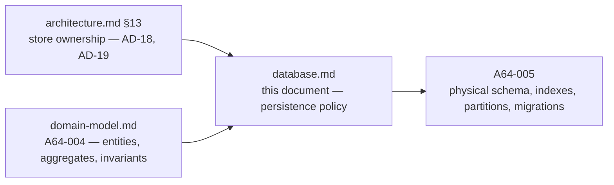

# Database Architecture

> **Status:** Draft — proposed for review
> **Owner:** _Unassigned_
> **Last reviewed:** _Not yet reviewed_
> **Companion document:** [`domain-model.md`](./domain-model.md) — the business domain this persists
> **Upstream:** [`architecture.md`](./architecture.md) §13 · [`system-design.md`](./system-design.md) §6–§8 ·
> [`../03-backend/repositories.md`](../03-backend/repositories.md)

## Purpose

Defines the persistence strategy: which store owns what, who owns each schema, how data is
classified by durability class, how migrations are governed, and what is retained for how long.

## Scope

**In scope:** store selection and data ownership, schema ownership boundaries, the durability
classification of every entity in the domain model, migration governance, and retention and
erasure policy.

**Out of scope, and deliberately deferred to A64-005:** tables, columns, types, keys, indexes,
partition boundaries, constraint definitions, and ORM models. This document states *what must be
true*; A64-005 decides *how the schema makes it true*.

### Where this document sits

Decisions introduced here are tagged `DB-nn`. `AD-nn`, `BE-nn`, `RP-nn` and `DM-nn` cite
[`architecture.md`](./architecture.md), [`../03-backend/services.md`](../03-backend/services.md),
[`../03-backend/repositories.md`](../03-backend/repositories.md), and
[`domain-model.md`](./domain-model.md).

---

## 1. Engine and Rationale

### 1.1 The two stores, and the line between them

Restated from `architecture.md §13` because everything below depends on it:

> **PostgreSQL owns anything a player would be upset to lose. Redis owns anything the platform
> can recompute or afford to lose.**

| Store | Role | Authoritative for |
| --- | --- | --- |
| **PostgreSQL** | System of record | Accounts, profiles, the social graph, chat, the **completed match record and its move log**, ratings and adjustments, achievements, moderation, audit, the outbox |
| **Redis** | Hot, ephemeral, derived | Live match state, clock deadlines, queue tickets, connection registry, presence, pub/sub fan-out, the reconnection replay window, leaderboard orderings, coordination primitives |

Redis is deployed as four role-separated instances (AD-03); the cache instance runs without
persistence, the live-state instance does not.

### 1.2 Why a relational store is the right system of record for Arena64

| Property | Why Arena64 needs it |
| --- | --- |
| **Transactional multi-statement writes** | Completing a match writes the final state, the move log, the result, and the outbox row as one fact (AD-16). Splitting them produces a completed match nothing will ever rate, with no record that rating was owed |
| **Declarative uniqueness** | BE-06: a rating may affect a match exactly once, and only a constraint is correct under concurrency — including for the repair script written at 3am during an incident |
| **Referential integrity within a context** | The move log's relationship to its match is not advisory; an orphaned move is an unreplayable game |
| **Relational access patterns** | The social graph, moderation evidence, and match history are joins by nature |
| **Mature time-partitioning and replication** | `architecture.md §16` axes 3 and 4 are the first two scaling responses the platform will need |

### DB-01 — Storage authority is a property of a match's phase, not of two different records

A live match is authoritative in Redis; the same match, once completed, is authoritative in
PostgreSQL. This is one record with one identity throughout (DM-07).

**Why this belongs in the persistence document:** the temptation at schema time is to build a
"live matches" structure and an "archived matches" structure, because there are two repositories
(RP §7). That would fork the definition of a match, and the two definitions would diverge on
exactly the properties that get disputed. The durable side is written throughout the match's life
as a write-behind append (BE-09); completion transitions authority, it does not create a new
record.

---

## 2. Logical Data Model

The complete entity model is [`domain-model.md`](./domain-model.md) and is not restated. What
follows is its **persistence classification** — the input A64-005 needs.

### 2.1 Durability classes

Every piece of state in Arena64 falls into one of five classes. The class, not the module,
determines how it is stored, backed up, and retained.

| Class | Definition | Write pattern | Loss tolerance | Examples |
| --- | --- | --- | --- | --- |
| **C1 — Permanent record** | Facts the platform promises never to change or lose | Append-only; never updated in place | **Zero** | Archived `Match`, `Move` log, `RatingAdjustment`, `PlayerAchievement`, `ModerationCase`, `AuditEntry`, `IntegritySignal` |
| **C2 — Durable mutable** | Current state a player would be upset to lose | Read-modify-write, low frequency | Zero | `Account`, `UserProfile`, `Friendship`, `Block`, `PlayerRating`, `Sanction`, `ChatThread` |
| **C3 — Transactional infrastructure** | State that exists to make C1 correct | Insert then mark | Zero | `OutboxEntry`, `ProcessedEvent` |
| **C4 — Live authoritative** | In-flight state that is authoritative *now* and worthless later | High-frequency compare-and-set | **Bounded** — loss aborts affected matches unrated (AD-18, T-2) | Live `Match` position and clocks, `QueueTicket`, `ClockDeadline`, `Offer` |
| **C5 — Derived** | Anything reconstructible from C1 and C2 | Rebuildable projection | **Total** — rebuild | `LeaderboardEntry`, `PlayerStatistics`, `HeadToHead`, `AchievementProgress`, all caches, all presence |

### DB-02 — C1 is append-only, and the schema must enforce it rather than trust convention

No update path, no delete path, no in-place correction. A correction to a C1 record is a **new**
record that references the original — a moderation reversal is a new case (§13.2 of the domain
model), a rating correction is a new adjustment, an engine-defect remediation is a recorded
adjudication.

**Why the schema must enforce it:** every argument for append-only is an argument about what
happens under pressure — a bad deploy, an incident, a manual repair. Those are precisely the
moments when a convention is bypassed, and C1 is precisely the data whose corruption cannot be
detected afterwards because there is nothing to compare against.

### 2.2 Classification by entity

| Entity | Module | Class | Store | Notes |
| --- | --- | --- | --- | --- |
| `Account`, `Credential`, `EmailVerification`, `PasswordResetToken` | auth | C2 | PostgreSQL | Credential material is never recoverable |
| `Session` | auth | C2 | PostgreSQL | Bulk-revoked on password change and suspension |
| `WebSocketTicket` | auth | C4 | Redis | Seconds-long, single-use (AD-09) |
| `UserProfile`, `HandleAssignment` | users | C2 | PostgreSQL | `HandleAssignment` is C1-like: history, never rewritten |
| `Presence` | users | C5 | Redis | TTL-decayed |
| `FriendRequest`, `Friendship`, `Block` | friends | C2 | PostgreSQL | |
| `ChatThread`, `Message` | chat | C2 | PostgreSQL | Messages are immutable; redaction clears the body and keeps the fact |
| `Notification`, `NotificationDelivery`, `DeviceRegistration` | notifications | C2 | PostgreSQL | |
| `QueueTicket` | matchmaking | C4 | **Redis** | Loss means a player is silently unqueued — recoverable by re-entry |
| `Challenge` | matchmaking | C2 | PostgreSQL | Outlives a session |
| `Match` — live, with `Offer` | game | C4 | **Redis** | Authoritative in flight (AD-18) |
| `Match` — archived, `MatchParticipant` | game | **C1** | PostgreSQL | The competitive record |
| `Move` log | game | **C1** | PostgreSQL | Write-behind append during play; permanent afterwards |
| `ClockDeadline` | game | C4 | **Redis** | Sorted by deadline (AD-21) |
| `PlayerRating` | rating | C2 | PostgreSQL | Current value; must reconcile with its adjustments |
| `RatingAdjustment` | rating | **C1** | PostgreSQL | |
| `RatingPeriod` | rating | C2 | PostgreSQL | Exists only if the rating system is batched — §4 Q-3 |
| `AchievementDefinition` | achievements | C2 (reference) | PostgreSQL | Versioned; a retune never revokes an award (DM-11) |
| `PlayerAchievement` | achievements | **C1** | PostgreSQL | |
| `AchievementProgress` | achievements | C5 | PostgreSQL + Redis | Rebuildable |
| `PlayerStatistics`, `HeadToHead` | statistics | C5 | PostgreSQL + Redis | Rebuildable from match history |
| `LeaderboardEntry` | leaderboard | C5 | **Redis** | Ordering, not a property of a player |
| `IntegritySignal` | fairplay | **C1** | PostgreSQL | Retained even when dismissed |
| `Report`, `ModerationCase`, `Sanction`, `AuditEntry` | admin | **C1** except `Sanction` (C2 — it expires) | PostgreSQL | |
| `OutboxEntry`, `ProcessedEvent` | platform | C3 | PostgreSQL | |
| `ErasureRequest`, `DataExportRequest` | platform | C2 | PostgreSQL | Obligations with a due instant |
| `Connection`, `SpectatorSubscription`, rate-limit and idempotency keys, match locks | gateway / platform | C5 | Redis | Meaningless after a restart |

### 2.3 What each class implies for A64-005

| Class | Physical design implication |
| --- | --- |
| C1 | Time-partitioned where it grows without bound; no update or delete privilege; the primary target for archival to cold storage; the source every C5 rebuild reads |
| C2 | Conventional; optimistic version where `repositories.md §8.4` requires it; the target of erasure anonymisation |
| C3 | Sized and indexed for a claim-and-mark workload; retained after publication as the durable event log (AD-17) |
| C4 | Not in PostgreSQL at all, except as the write-behind durability log that C1 receives |
| C5 | Must have a documented, executable rebuild path. A projection with no rebuild procedure is an undeclared system of record (AD-19) |

---

## 3. Schema Ownership

### DB-03 — One schema namespace per module; no referential integrity across module boundaries

Each bounded context owns its own namespace and is the only writer to it. Cross-context
references carry `PlayerId` — or another context's aggregate identifier — as an **opaque value**,
with no database-level foreign key.

**Why no cross-context foreign keys, given that they are free correctness:** they are not free.
They are the specific mechanism that makes `architecture.md §16` stages 4 and 5 — extracting
match history to its own database, extracting `fairplay` as a service — a rewrite rather than an
adapter change. BR-4 already forbids cross-module joins in code; a foreign key would enforce the
opposite at the storage layer, and the storage layer wins.

**What replaces them:** referential correctness across contexts is maintained by the domain
(`services.md §3`) and repaired by rebuildable projections, not by the database. Within a
context, foreign keys are used freely and are expected — an orphaned `Move` is an unreplayable
game (§1.2).

### 3.1 Ownership map

| Namespace | Owner module | Written by | Read by |
| --- | --- | --- | --- |
| `auth` | `auth` | `auth` only | `auth`; identity resolution port |
| `users` | `users` | `users`; `platform` during erasure | `users`; profile read model |
| `friends` | `friends` | `friends` | `friends`; `chat` and `matchmaking` via ports |
| `chat` | `chat` | `chat`; `admin` for redaction via port | `chat`, `admin` |
| `notifications` | `notifications` | `notifications` | `notifications` |
| `matchmaking` | `matchmaking` | `matchmaking` | `matchmaking` |
| `game` | `game` | **`game` only** (R-3) | `game`; `replay`, `fairplay`, `spectator`, `admin` through published ports (BE-04) |
| `rating` | `rating` | `rating` | `rating`; `leaderboard` via events |
| `achievements` | `achievements` | `achievements` | `achievements` |
| `statistics` | `statistics` | `statistics` | `statistics` |
| `fairplay` | `fairplay` | `fairplay` | `fairplay`, `admin` |
| `admin` | `admin` | `admin` | `admin` |
| `platform` | outbox relay, retention worker | platform components | platform components |

### DB-04 — `game` is the sole writer of match data, and the sole owner of the move log

No other namespace holds a copy of the move log, and no other module writes to `game`'s
namespace.

**Why it needs restating at the storage layer:** BE-04 already routes `replay` and `fairplay`
through a read port. The storage-level statement matters because the move log is the largest
dataset the platform owns, and the natural optimisation — "project the moves each consumer needs
into its own tables" — would duplicate the competitive record twice over and create two things
that can silently disagree with it. One copy of the truth, read through one port.

---

## 4. Indexing Strategy

**Owned by A64-005.** The principles it must follow are already fixed upstream:

| Principle | Source | Consequence for index design |
| --- | --- | --- |
| Every query has an owner and a name | RP §8.3 | Indexes are designed per named repository query, never speculatively. A query nobody owns gets no index and should not exist |
| Keyset pagination, never offset | RP-03 | Every paginated query needs a stable, indexed ordering key. The keys for match history and the leaderboard are still undecided |
| No cross-context joins | DB-03, BR-4 | No index exists to serve a join across namespaces |
| Cross-context reads use read models | AD-08 | The profile page is served by a projection, not by an index strategy spanning five contexts |
| Match history is read-mostly and append-heavy | `architecture.md §16` axis 4 | Write amplification from over-indexing the move log is the first thing to get wrong |

### The queries that will decide the schema

A64-005 should design outward from these, because they are the ones with real volume or real
latency budgets:

1. Append one move to a match — ~5,000/s, idempotent on `(match, ply)`.
2. Load one archived match with its complete move log — replay, audit, fair play.
3. A player's match history, paginated, filtered by variant and time control.
4. Whether a match has already been rated — the exactly-once guard (BE-06).
5. Claim unpublished outbox rows in order — the outbox relay's only query.
6. The social-graph reads: friends of a player, blocks of a player, pending requests.
7. Moderation search over reports, cases, and chat by subject and time window.

---

## 5. Migration Policy

### DB-05 — Migrations are expand–contract, and no migration takes a long lock on C1

Every schema change is decomposed into an expanding change, a backfill, a code cutover, and a
contracting change — deployed separately.

**Why this is stricter here than in a typical service:** the gateway tier holds tens of thousands
of long-lived connections and is deliberately *not* recycled on ordinary deploys (AD-02). A
migration that requires all application code to change simultaneously cannot be deployed without
draining those connections, which interrupts live matches — the outcome tenet T-2 exists to
prevent. Expand–contract is what lets schema evolve while games are in progress.

| Rule | Reason |
| --- | --- |
| Migrations are forward-only; a mistake is corrected by a new migration | A "down" migration against C1 data is a data-loss operation dressed as a rollback |
| Every migration runs against production-scale data in a rehearsal environment before release | The move log's size makes "it was fast in staging" meaningless |
| Any operation that rewrites or long-locks a C1 relation requires explicit sign-off | These are the tables where an outage is also a durability risk |
| Migrations never contain business backfill logic inline for large datasets | A backfill is a batched, resumable, observable job — not a statement inside a deploy |
| Schema and code deploy independently, in that order | AD-02's three profiles do not deploy simultaneously |

Migration *scripts* live in `apps/api/alembic/`; this document owns the *policy*, and A64-005
owns the initial baseline.

---

## 6. Backup and Retention

### 6.1 Backup posture by class

| Class | Backup requirement | Recovery objective |
| --- | --- | --- |
| C1 | Point-in-time recovery, verified restores, offsite copies | **Zero data loss.** This is the platform's core promise (A-4) |
| C2 | Point-in-time recovery | Minutes of loss is survivable but should not happen |
| C3 | Recovered with C1 — the outbox is only meaningful alongside the state it describes | Same as C1 |
| C4 | Not backed up. AD-18's stated trade-off: a Redis failure may interrupt matches; matches that cannot be reconstructed are aborted **unrated** | Reconstructed from the durable move log, or aborted |
| C5 | Not backed up. Rebuilt | Rebuild time, measured and tested |

### DB-06 — A backup that has not been restored is not a backup

Restore rehearsal is a scheduled, measured exercise, and the measured restore time for C1 is a
published number. **Why it is stated as a decision:** the platform's central promise is that the
competitive record survives. That promise is only as good as the last successful restore, and an
untested backup of the move log is the single largest unquantified risk in the architecture.

### 6.2 Retention

Retention is defined **per entity**, not globally, because the correct answer differs by an order
of magnitude across the domain.

| Data | Retention posture | Reason |
| --- | --- | --- |
| Archived matches, move logs, rating adjustments, achievements | **Indefinite**, with cold-partition archival | The competitive record is the product |
| Moderation cases, sanctions, audit entries | Long, policy-driven | Appeals and accountability |
| Integrity signals | Long — retained even when dismissed | Patterns across time are the detection mechanism (IS-3) |
| Chat messages | Bounded; **open question** | Moderation value decays; privacy liability does not |
| Notifications | Short | Nobody reads a three-month-old "your turn" |
| Sessions, tickets, presence, connections | Expiry-driven | Self-expiring by nature |
| Outbox entries | Retained past publication, then pruned | AD-17 makes the outbox the durable event log that C5 rebuilds read |
| Aborted matches | **Open question** | They have no competitive value but do have fair-play value |

Concrete durations are blocked on `domain-model.md §18 Q-15`.

### 6.3 Erasure

Erasure follows DM-13: the **person** is anonymised, the **competitive record** is preserved.
Practically, that means erasure is a field-level operation across the identity aggregates and the
communication aggregates, and touches nothing in C1 except by leaving a tombstoned identifier in
place.

| Requirement | Reason |
| --- | --- |
| The set of personal data reachable from a `PlayerId` is enumerated explicitly and tested | "We think we got it all" is not a compliance position |
| Erasure is driven by an `ErasureRequest` with a due instant, and completion is recorded | A silent failure is a breach with no evidence it was attempted |
| Erasure never deletes a `MatchParticipant` row | Deleting participation retroactively invalidates the *opponent's* rating, statistics, and achievements — punishing other people for one person's exercise of a right |
| Backups are covered by a documented policy, not by silence | Backups outlive erasure by design; the reconciliation must be stated |

**This posture is a policy position and is blocked on [`domain-model.md`](./domain-model.md) §18 Q-16.**

---

## 7. What A64-005 Must Decide

Everything in this section is deliberately unanswered here.

| # | Decision | Blocked on |
| --- | --- | --- |
| 1 | The physical realisation of the `Match` aggregate and its move log | — |
| 2 | Time-partitioning boundaries for matches and moves, and the cold-archival path | Growth model, `system-design.md §10` |
| 3 | The outbox's physical shape, claim strategy, and pruning horizon | — |
| 4 | Index set, derived from the named queries in §4 and `repositories.md` | — |
| 5 | Keyset ordering keys for match history and the leaderboard | RP-03, still open |
| 6 | Representation of a move as a capture path | `domain-model.md` R-15 |
| 7 | Whether `RatingPeriod` exists at all | `domain-model.md` Q-3 — rating algorithm |
| 8 | Whether variants and time controls are reference data or constants | `domain-model.md` Q-4 |
| 9 | Concrete retention durations per entity | `domain-model.md` Q-15 |
| 10 | The migration baseline and the initial partition set | Items 1–3 |

The full recommendation set — including the invariants the schema must enforce as constraints
rather than as application checks — is [`domain-model.md §19`](./domain-model.md).

---

## 8. Database Decisions

All are **Proposed** and should be promoted to numbered ADRs in `docs/07-decisions/`.

| ID | Decision | Section |
| --- | --- | --- |
| DB-01 | Storage authority is a phase of a match, not two records | §1 |
| DB-02 | The permanent record is append-only, enforced by the schema | §2 |
| DB-03 | One schema namespace per module; no cross-module referential integrity | §3 |
| DB-04 | `game` is the sole writer and owner of match data | §3 |
| DB-05 | Expand–contract migrations; no long locks on the permanent record | §5 |
| DB-06 | A backup that has not been restored is not a backup | §6 |

## 9. Related Documents

| Document | Relationship |
| --- | --- |
| [`domain-model.md`](./domain-model.md) | The entities, aggregates, and invariants this document persists — A64-004 |
| [`architecture.md`](./architecture.md) | AD-18 and AD-19 data ownership; §16 scaling axes |
| [`system-design.md`](./system-design.md) | §6 consistency, §7 idempotency, §8 failure modes |
| [`caching.md`](./caching.md) | The Redis side of §2's C4 and C5 — *placeholder* |
| [`events.md`](./events.md) | The outbox's payload contracts — *placeholder* |
| [`../03-backend/repositories.md`](../03-backend/repositories.md) | The ports this schema serves; RP-01 … RP-05 |
| [`../03-backend/services.md`](../03-backend/services.md) | Transaction policy, BE-06 constraints, BE-09 cross-store ordering |

## TODO

- [ ] Assign a document owner
- [ ] Complete §4, §5 and §7 as part of A64-005
- [ ] Resolve `domain-model.md` Q-3, Q-4, Q-15 and Q-16 — each blocks a section above
- [ ] Promote DB-01 … DB-06 to numbered ADRs in `docs/07-decisions/`
- [ ] Publish the measured C1 restore time (DB-06)
- [ ] Review and promote status from Draft to Approved
