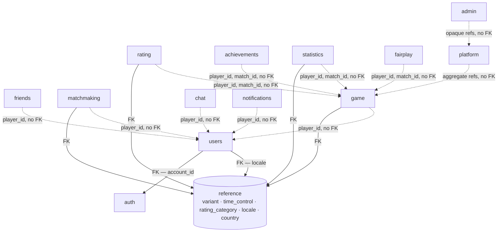
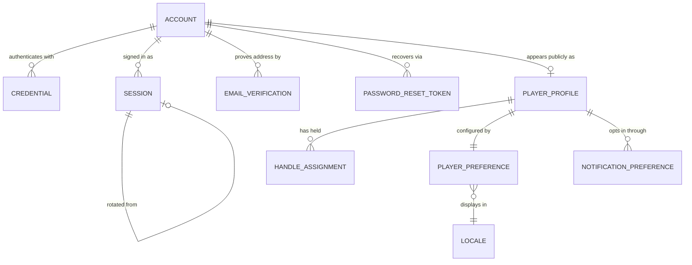
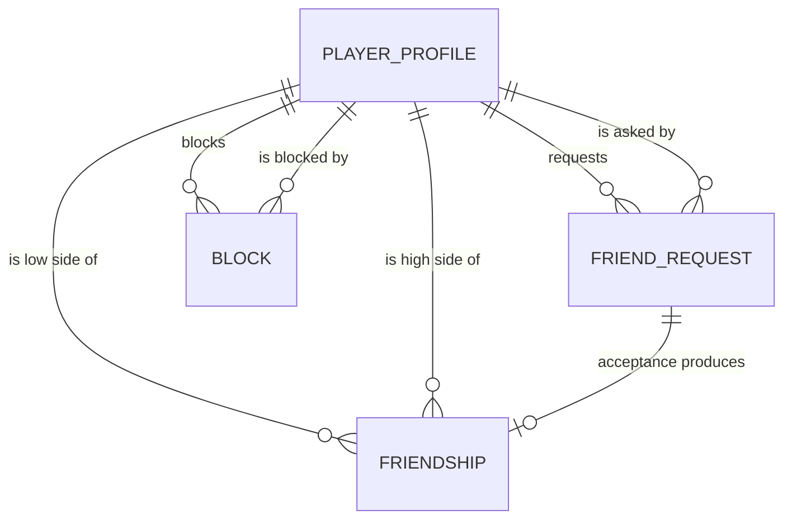
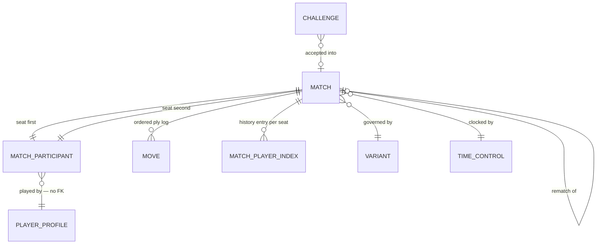
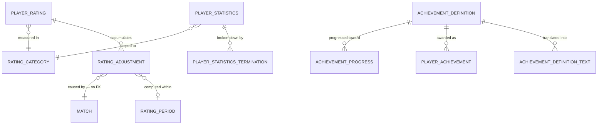
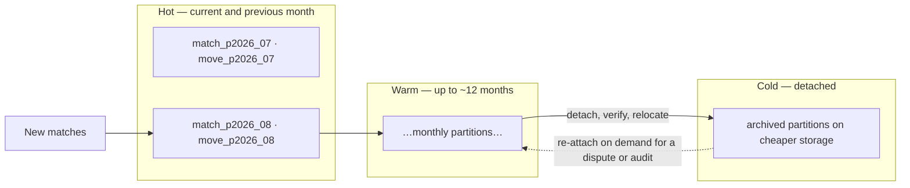

# Database Architecture

> **Status:** Draft — proposed for review
> **Owner:** _Unassigned_
> **Last reviewed:** _Not yet reviewed_
> **Task:** A64-005 — production database design
> **Companion document:** [`domain-model.md`](./domain-model.md) — the business domain this persists
> **Upstream:** [`architecture.md`](./architecture.md) §13 · [`system-design.md`](./system-design.md) §5–§8 ·
> [`../03-backend/repositories.md`](../03-backend/repositories.md) · [`../03-backend/services.md`](../03-backend/services.md)

## Purpose

The complete persistence design for Arena64: store selection, schema ownership, the physical
relation catalogue, keys, constraints, indexes, partitioning, pooling, security posture, and
internationalisation strategy.

`domain-model.md` decided **what the business is about**. This document decides **how that
survives a power cut, a redeploy, and five years of growth**.

## Scope and constraints

**In scope:** every relation the platform needs at launch, its columns, its keys, the constraints
that make the domain's invariants true, the indexes that make its queries fast, and the
operational policy around all of it.

**Deliberately not present, per the task's constraints:** DDL, ORM models, migration scripts, and
code of any kind. Relations are specified as a **data dictionary** — name, type, nullability,
meaning — which is the artefact A64-006 implements from. Where a rule needs a predicate, it is
stated in prose.

### Technology

| Layer | Choice | Notes |
| --- | --- | --- |
| Database | **PostgreSQL 17** | Single primary, streaming replicas (§13.2) |
| ORM | **SQLAlchemy 2**, async | Async engine over `asyncpg` |
| Migrations | **Alembic** | Single linear branch (§16) |
| Pooler | **PgBouncer**, transaction mode | With the caveats of §13.3 |
| Hot state | **Redis** | Not designed here — [`caching.md`](./caching.md) |

Decisions here are tagged `DB-nn`. `AD-nn`, `BE-nn`, `RP-nn`, `DM-nn` cite
[`architecture.md`](./architecture.md), [`../03-backend/services.md`](../03-backend/services.md),
[`../03-backend/repositories.md`](../03-backend/repositories.md) and
[`domain-model.md`](./domain-model.md).

---

## 1. Engine and Rationale

### 1.1 The two stores

Restated from `architecture.md §13`, because everything below depends on it:

> **PostgreSQL owns anything a player would be upset to lose. Redis owns anything the platform
> can recompute or afford to lose.**

| Store | Authoritative for |
| --- | --- |
| **PostgreSQL** | Accounts, profiles, the social graph, chat, the **completed match record and its move log**, ratings and adjustments, achievements, moderation, audit, the outbox |
| **Redis** | Live match position and clocks, clock deadlines, queue tickets, connection registry, presence, pub/sub, the reconnection replay window, leaderboard orderings, coordination primitives |

**Nothing designed below has a Redis counterpart that is authoritative for the same fact.** Where
both stores hold related data — the live match and the durable move log — the ownership split is
by *phase*, not by *copy* (DB-01).

### 1.2 Why PostgreSQL specifically

| Property | Why Arena64 needs it |
| --- | --- |
| **Multi-statement ACID transactions** | Completing a match writes the final state, the last move, the result and the outbox row as one fact (AD-16). Splitting them yields a completed match nothing will ever rate, with no record that rating was owed |
| **Declarative uniqueness under concurrency** | BE-06 — a match may affect a rating exactly once, and only a constraint is correct under concurrency, including for a repair script run during an incident |
| **Declarative range partitioning** | The move log is the fastest-growing relation on the platform (`architecture.md §16` axis 4); dropping a cold partition is the only sane archival mechanism |
| **Rich index types** | B-tree, partial, covering, GIN and **BRIN** — §11 uses all five, and BRIN is what makes a multi-billion-row append-only move log affordable |
| **Generated columns and expression indexes** | Handle normalisation (§14.3) and canonical-pair ordering (§7.3) are enforced, not merely intended |
| **Logical and physical replication** | §13.2's read-replica routing, with PostgreSQL 17's slot failover making replica promotion non-destructive to logical consumers |

### 1.3 Version-specific choices

| PostgreSQL 17 capability | Used for |
| --- | --- |
| Improved vacuum memory management | The `outbox` and `notification` relations, whose churn is the platform's main bloat source (§13.4) |
| Streaming I/O for sequential scans | Cold-partition analytical reads by `fairplay` and statistics rebuilds |
| `MERGE ... RETURNING` | Projection upserts in `statistics` and `achievements` — one round trip instead of read-then-write |
| Logical replication slot failover | §13.2 — a replica promotion no longer forces every logical consumer to resynchronise |
| `pg_stat_progress_*` and expanded wait events | §13.5's operational visibility, particularly during partition maintenance |

### DB-01 — Storage authority is a phase of a match, not two different records

A live match is authoritative in Redis; the same match, once completed, is authoritative in
PostgreSQL. One record, one identity, throughout.

**Why this belongs in the persistence document:** the temptation at schema time is to build a
"live matches" structure and an "archived matches" structure, because there are two repositories
(RP §7). That would fork the definition of a match, and the two definitions would diverge on
exactly the properties that get disputed. The durable side is written throughout the match's life
as a write-behind append (BE-09); completion transitions authority, it does not create a second
record. This is why `game.match` has one relation and one primary key across every status.

### DB-07 — UUIDv7 identifiers are generated by the application, not by the database

PostgreSQL 17 ships `gen_random_uuid()`, which is **v4** — uniformly random. A native `uuidv7()`
function is a PostgreSQL 18 feature. Arena64 therefore generates v7 identifiers **in Python**, and
uses the database default only as a safety net for rows created outside the application.

**Why v7 rather than v4:** a v4 primary key inserts at a random point in the B-tree. On the move
log at ~5,000 inserts per second that means every insert dirties a different leaf page, the
working set of the index never fits in cache, and WAL volume inflates with full-page writes. A v7
key is time-ordered, so inserts land at the right edge of the index — the same access pattern a
sequence gives, without a sequence's coordination.

**Why generated in the application rather than by a database default:** the service must know the
identifier **before** it commits. `game.SubmitMove` writes the outbox payload containing the match
and move identifiers in the same transaction as the state change (AD-16), and the gateway
acknowledges with a sequence tied to that identity. A database-generated default would require a
round trip to discover the id, inside the CP-1 latency budget.

**Why not an extension (`pg_uuidv7`):** it adds a deployment dependency to every environment
including CI and every developer's laptop, in exchange for a function that is nine lines of Python.
When PostgreSQL 18 is adopted, the built-in becomes the safety-net default and application
generation is unchanged.

**The trade-off, stated:** v7 embeds a creation timestamp, so an identifier leaks when its row was
created. For matches, profiles and messages that is already public. For `auth` relations it is
not sensitive either — an account id is never exposed publicly (§4.2). No relation in the design
requires an unguessable, time-opaque identifier; if one appears, it takes a v4 key and the
exception is documented.

---

## 2. Naming Conventions

Conventions are not aesthetics. Alembic's autogenerate produces whatever names the metadata
dictates, and a constraint whose name is machine-generated cannot be referenced in a migration, an
alert, or an incident. These names are **binding** and must be encoded once in SQLAlchemy's
metadata naming convention (§17 R-1).

### 2.1 Rules

| Object | Convention | Example |
| --- | --- | --- |
| Schema | Module name, lowercase | `game`, `friends`, `platform` |
| Table | `snake_case`, **singular** | `match`, `match_participant`, `friend_request` |
| Column | `snake_case` | `created_at`, `player_id`, `clock_remaining_ms` |
| Primary key column | `id`, or the composite natural key | `id`; `(match_id, ply)` |
| Foreign key column | `<referenced_table>_id` | `match_id`, `account_id` |
| Timestamp column | `<past_participle>_at`, always `timestamptz` | `created_at`, `revoked_at`, `earned_at` |
| Duration column | `<name>_ms`, integer milliseconds | `think_time_ms`, `base_time_ms` |
| Boolean column | `is_<adjective>` / `has_<noun>` | `is_rated`, `is_provisional` |
| Enum type | Singular noun, in the owning schema | `game.match_status`, `admin.sanction_kind` |
| Primary key constraint | `pk_<table>` | `pk_match` |
| Foreign key constraint | `fk_<table>__<column>` | `fk_move__match_id` |
| Unique constraint | `uq_<table>__<columns>` | `uq_rating_adjustment__match_player` |
| Check constraint | `ck_<table>__<rule>` | `ck_match__result_iff_terminal` |
| Exclusion constraint | `ex_<table>__<rule>` | `ex_sanction__one_active_per_kind` |
| B-tree index | `ix_<table>__<columns>` | `ix_match_participant__player_id` |
| Partial index | `ix_<table>__<columns>__<predicate_hint>` | `ix_outbox__id__unpublished` |
| GIN index | `gin_<table>__<column>` | `gin_player_profile__handle_trgm` |
| BRIN index | `brin_<table>__<column>` | `brin_move__created_at` |
| Partition | `<table>_p<yyyy_mm>` | `move_p2026_08` |

### 2.2 Why singular table names

A row is one entity; a foreign key column is `match_id`, not `matches_id`; and the ORM class,
the domain entity, the table and the repository then share one word. The cost of the alternative
is a permanent, low-grade translation tax on every conversation about the model.

### 2.3 The 63-character limit is a real constraint

PostgreSQL truncates identifiers at 63 bytes, silently. `uq_rating_adjustment__rating_category_id_player_id_match_id` is 60 and safe;
adding one more column would truncate and two constraints could collide. **Rule:** when a
generated name would exceed 55 characters, the constraint takes a documented short name of the
form `<prefix>_<table>__<semantic_name>` — named for *what it enforces*, not for its columns. The
semantic name is better documentation anyway: `uq_rating_adjustment__once_per_match_player` says
what it means.

---

## 3. Schema Map and Ownership

### DB-03 — One schema per module; no referential integrity across module schemas

Each bounded context owns a schema and is its only writer. Cross-context references carry
`player_id` — or another context's aggregate identifier — as an **opaque `uuid` value with no
foreign key**.

**Why not cross-schema foreign keys, given that they are free correctness:** they are not free.
They are the mechanism that makes `architecture.md §16` stages 4 and 5 — extracting match history
to its own database, extracting `fairplay` as a service — a rewrite rather than an adapter swap.
BR-4 already forbids cross-module joins in code; a foreign key would enforce the opposite at the
storage layer, and the storage layer wins every argument.

**What replaces them:** the domain maintains cross-context correctness (`services.md §3`), and a
scheduled reconciliation job detects orphans (§17 R-9). This is a real cost and it appears in
§19 as RK-4, not as a solved problem.

**Within a schema, foreign keys are mandatory and expected.** An orphaned `move` is an
unreplayable game.

### DB-08 — `reference` is the single sanctioned cross-schema foreign key target

Variants, time controls, rating categories, locales and countries are referenced by `game`,
`matchmaking`, `rating` and `statistics` alike. They live in a `reference` schema, and foreign keys
to it are permitted from anywhere.

**Why the carve-out is safe where DB-03 is not:** `reference` is small, read-mostly, deployed with
the application as versioned seed data, written only by migrations, and **owned by no bounded
context** — so it is never on either side of an extraction. Its rows are configuration, not domain
state. A module extracted to its own database carries a copy of `reference` with it, which is
sound precisely because the data is deployed rather than accumulated.

**Why not duplicate the reference values into every schema instead:** a variant's rules would then
exist in five places, and the first divergence would mean two matches recorded under "the same"
variant were governed by different rules — the exact class of corruption AD-15 exists to prevent.

### 3.1 The schemas

| Schema | Owner module | Contains | Notes |
| --- | --- | --- | --- |
| `reference` | *(platform, deployed)* | `variant`, `time_control`, `rating_category`, `locale`, `country` | DB-08; seeded by migration |
| `auth` | `auth` | `account`, `credential`, `email_verification`, `password_reset_token`, `session` | Most sensitive schema on the platform |
| `users` | `users` | `player_profile`, `handle_assignment`, `player_preference`, `notification_preference` | `player_id` originates here |
| `friends` | `friends` | `friend_request`, `friendship`, `block` | |
| `matchmaking` | `matchmaking` | `queue_ticket`, `queue_cooldown`, `queue_cooldown_audit`, `pairing_timeline`, `challenge` | `queue_ticket` exists since A64-014.1 and **is PostgreSQL-authoritative** — see §8.1, which this reverses. `queue_cooldown` since A64-015.5 (§8.1b); the two append-only audit relations since A64-015.6 (§8.1c, §8.1d). `challenge` is not built yet |
| `game` | `game` | `match` | `match` exists since A64-015.4 and carries the part a pairing needs — who, which rules, from which pairing, and whether both agreed. §8.2 describes the relation it grows into; §8.2a describes what actually ships |
| `game` | `game` | `match`, `match_participant`, `move`, `match_player_index` | Partitioned; the largest schema |
| `rating` | `rating` | `player_rating`, `rating_adjustment`, `rating_period` | Holds the platform's hardest invariant |
| `achievements` | `achievements` | `achievement_definition`, `achievement_definition_text`, `player_achievement`, `achievement_progress` | |
| `statistics` | `statistics` | `player_statistics`, `player_statistics_termination`, `head_to_head` | Entirely rebuildable |
| `chat` | `chat` | `chat_thread`, `chat_thread_participant`, `chat_message` | |
| `notifications` | `notifications` | `notification`, `notification_delivery`, `device_registration` | |
| `fairplay` | `fairplay` | `analysis_run`, `integrity_signal` | |
| `admin` | `admin` | `role_assignment`, `report`, `moderation_case`, `case_evidence`, `sanction`, `audit_entry` | |
| `platform` | *(platform)* | `outbox`, `processed_event`, `erasure_request`, `data_export_request` | Plus Alembic's version table. The first two exist since A64-013.7; the code that owns them is `apps/api/app/platform/outbox/`, which is deliberately outside `app/modules/` because no bounded context owns them |
| *(none)* | `leaderboard` | — | **Redis only.** A leaderboard is an ordering over `rating`, rebuildable in seconds; a PostgreSQL copy would be a second source of rank that can disagree |
| *(reserved)* | `tournaments` | — | §18.3 — created empty when the feature is specified |

### 3.2 Schema dependency diagram

Solid arrows are **enforced foreign keys**. Dashed arrows are **opaque identifier references with
no database-level integrity** (DB-03). The single upward FK — `users.player_profile.account_id` →
`auth.account` — is discussed in §4.2.

### DB-04 — `game` is the sole writer and owner of match data

No schema other than `game` holds a copy of the move log, and no module other than `game` writes to
the `game` schema.

**Why it needs restating at the storage layer:** BE-04 already routes `replay` and `fairplay`
through a read port. The storage-level statement matters because the move log is the largest
dataset the platform owns, and the natural optimisation — "project the moves each consumer needs
into its own relations" — would duplicate the competitive record twice over and create two things
that can silently disagree with it. One copy of the truth, read through one port, enforced by
DB-09's grants.

### DB-09 — Module ownership is enforced by PostgreSQL roles, not only by code review

| Role | Privileges | Rationale |
| --- | --- | --- |
| `arena64_migrate` | DDL on all schemas; used only by Alembic | The runtime must never be able to alter the schema, including through an injection defect |
| `arena64_app` | DML per §11.1's class rules; **no DDL**; **no `UPDATE`/`DELETE` on append-only relations** | This is how DB-02 becomes true rather than aspirational |
| `arena64_readonly` | `SELECT` only; used by replicas, analytics, and the admin console's read paths | A read path that cannot write cannot be tricked into writing |
| `arena64_ops` | `SELECT` plus narrowly granted maintenance rights | Incident response without handing over the app role |

`search_path` is pinned explicitly for every role rather than inherited, so a relation created in
`public` can never shadow a real one.

---

## 4. Identity and Access — `auth` and `users`

### 4.1 Entity group overview

### DB-10 — `player_id` is a distinct identifier from `account_id`, and only `player_id` leaves `auth`

`users.player_profile.id` is the platform-wide `player_id`. `auth.account.id` is a credential-domain
identifier that appears in no other schema and in no URL.

**Why not one identifier, which would remove a join:** because a player is not always an account.
`match_participant.player_id` must be able to identify a **bot** (`domain-model.md §16.2`) or a
**guest** (Q-13) — neither of which has credentials. Collapsing the two identifiers makes both
features a migration of the permanent competitive record, which is the one dataset the platform
promises not to migrate. It also means the identifier printed in every public profile URL is the
same value that keys the credential store, so any enumeration of one enumerates the other.

**The cost, stated:** resolving a session to a player requires one extra lookup. It is a
single-row index probe on a relation small enough to be permanently cached, and the resolved
`player_id` is carried on the request context thereafter (`services.md §4.1`), so it happens once
per request, not once per query.

### 4.2 `auth.account`

| Column | Type | Null | Notes |
| --- | --- | --- | --- |
| `id` | `uuid` | no | PK, v7 |
| `email` | `text` | yes | As entered; null once erased |
| `email_normalized` | `text` | yes | Generated stored — case-folded and NFKC-normalised; the uniqueness target |
| `status` | `auth.account_status` | no | `pending_verification`, `active`, `suspended`, `deactivated`, `erased` |
| `email_verified_at` | `timestamptz` | yes | |
| `failed_attempt_count` | `smallint` | no | Default 0 |
| `locked_until` | `timestamptz` | yes | Throttling, not sanction |
| `last_sign_in_at` | `timestamptz` | yes | |
| `deactivated_at` | `timestamptz` | yes | Reversible within the grace window (AC-4) |
| `erased_at` | `timestamptz` | yes | Irreversible; identity columns are null from this point |
| `created_at` | `timestamptz` | no | |
| `updated_at` | `timestamptz` | no | |

**Constraints.**

| Name | Kind | Rule | Domain source |
| --- | --- | --- | --- |
| `uq_account__email_normalized` | Unique | One account per normalised address | AC-1 |
| `ck_account__erased_has_no_identity` | Check | When `erased_at` is set, `email` and `email_normalized` are null | AC-5, DM-13 |
| `ck_account__verified_implies_active_path` | Check | `email_verified_at` is null while status is `pending_verification` | AC-2 |

**No `deleted_at`.** Deactivation and erasure are domain states with different meanings and
different reversibility; a generic soft-delete flag would conflate them (§11.2).

### 4.3 `auth.credential`

| Column | Type | Null | Notes |
| --- | --- | --- | --- |
| `id` | `uuid` | no | PK |
| `account_id` | `uuid` | no | FK → `auth.account`, `ON DELETE CASCADE` |
| `kind` | `auth.credential_kind` | no | `password`, `oauth`, `passkey` |
| `secret_hash` | `text` | yes | Argon2id encoded hash; null for `oauth` |
| `hash_algorithm` | `text` | yes | Recorded per row so parameters can be raised (§14.2) |
| `provider` | `text` | yes | For `oauth` |
| `provider_subject` | `text` | yes | For `oauth` |
| `created_at` | `timestamptz` | no | |
| `rotated_at` | `timestamptz` | yes | |
| `revoked_at` | `timestamptz` | yes | |

**Constraints.** Unique `(account_id, kind)` **partial**, covering only rows where `kind` is
`password` and `revoked_at` is null — one live password per account, but many passkeys. Unique
`(provider, provider_subject)` where `provider` is not null — one external identity maps to one
account. Check: a `password` row has `secret_hash` and `hash_algorithm`; an `oauth` row has
`provider` and `provider_subject` and no `secret_hash`.

**Why `secret_hash` and never `password`:** a column named `password` will eventually be logged,
exported, or displayed by someone who trusts the name. The name is a control.

### 4.4 `auth.session`

| Column | Type | Null | Notes |
| --- | --- | --- | --- |
| `id` | `uuid` | no | PK |
| `account_id` | `uuid` | no | FK → `auth.account`, `ON DELETE CASCADE` |
| `refresh_token_hash` | `bytea` | no | SHA-256 of the token (§14.3) |
| `parent_session_id` | `uuid` | yes | FK → `auth.session` — the rotation chain |
| `chain_id` | `uuid` | no | Root of the rotation chain; reuse detection revokes by this |
| `device_label` | `text` | yes | Player-visible, e.g. "Chrome on macOS" |
| `user_agent_hash` | `bytea` | yes | For anomaly detection without storing the string |
| `ip_first` | `inet` | yes | Truncated per §14.5 retention |
| `ip_last` | `inet` | yes | |
| `created_at` | `timestamptz` | no | |
| `last_seen_at` | `timestamptz` | no | |
| `absolute_expires_at` | `timestamptz` | no | |
| `idle_expires_at` | `timestamptz` | no | |
| `revoked_at` | `timestamptz` | yes | |
| `revoked_reason` | `auth.session_revoke_reason` | yes | `player`, `password_change`, `suspension`, `reuse_detected`, `expired` |

**Constraints.** Unique on `refresh_token_hash`. Check: `revoked_at` is set if and only if
`revoked_reason` is set.

**Why both an absolute and an idle expiry:** an idle expiry alone lets a stolen refresh token be
kept alive indefinitely by using it; an absolute expiry alone logs out a daily player mid-session.
Both together bound the damage of theft without punishing normal use.

### 4.5 `auth.email_verification` and `auth.password_reset_token`

Structurally identical: `id`, `account_id` (FK, cascade), `token_hash bytea`, `expires_at`,
`consumed_at`, `requested_ip inet`, `created_at`. Unique on `token_hash`; a partial unique index on
`account_id` covering only rows where `consumed_at` is null and the row has not expired keeps at
most one live token per account.

**Why the token is hashed rather than stored:** a database read — a backup, a replica, a support
query — must not yield a working password reset. The token is high-entropy random, so SHA-256 is
sufficient; §14.3 explains why this differs from password hashing.

**These two relations are hard-deleted on a schedule.** They are the only tables in the design
whose rows are routinely removed, because a consumed reset token has no evidentiary value and
retaining it is pure liability.

### 4.6 `users.player_profile`

| Column | Type | Null | Notes |
| --- | --- | --- | --- |
| `id` | `uuid` | no | PK, v7 — **this is `player_id`** |
| `account_id` | `uuid` | yes | FK → `auth.account`; null for bots and guests (DB-10) |
| `kind` | `users.player_kind` | no | `human`, `bot`, `guest` |
| `handle` | `text` | yes | As chosen; null once anonymised |
| `handle_folded` | `text` | yes | Generated stored — case-folded, NFKC |
| `handle_skeleton` | `text` | yes | Application-computed confusable skeleton (§14.6) |
| `display_name` | `text` | yes | Free-form; falls back to `handle` |
| `avatar_object_key` | `text` | yes | Object-storage key, not a URL |
| `country_code` | `char(2)` | yes | FK → `reference.country` |
| `bio` | `text` | yes | Length-bounded by check |
| `title` | `text` | yes | Reserved for §18.4's optional titles |
| `joined_at` | `timestamptz` | no | |
| `anonymised_at` | `timestamptz` | yes | DM-13 |
| `created_at` | `timestamptz` | no | |
| `updated_at` | `timestamptz` | no | |

**Constraints.**

| Name | Kind | Rule |
| --- | --- | --- |
| `uq_player_profile__account_id` | Unique | One profile per account — the 1:1 of §5.1 |
| `uq_player_profile__handle_folded` | Unique | Case-insensitive handle uniqueness (UP-1) |
| `uq_player_profile__handle_skeleton` | Unique | Confusable-collapsed uniqueness (UP-1, §14.6) |
| `ck_player_profile__human_has_account` | Check | `kind = 'human'` implies `account_id` is not null |
| `ck_player_profile__anonymised_has_no_identity` | Check | When `anonymised_at` is set, `handle`, `display_name`, `avatar_object_key`, `country_code` and `bio` are null |

**Why two normalised handle columns rather than one:** `handle_folded` is a *generated* column —
PostgreSQL computes it, so it cannot be wrong. `handle_skeleton` requires Unicode confusable
mapping, which PostgreSQL cannot compute natively, so the application supplies it. Keeping them
separate means case-insensitive uniqueness is guaranteed by the database unconditionally, and only
the confusable layer depends on application correctness. That distinction is the difference
between one risk and two (§19 RK-3).

### 4.7 `users.handle_assignment`

`id`, `player_id` (FK, cascade), `handle`, `handle_folded`, `assigned_at`, `released_at`,
`released_reason`. Append-only: a row is inserted on assignment and its `released_at` set once, on
release. A partial unique index on `handle_folded` covering only rows where `released_at` is null
duplicates the live-handle guarantee from a second direction; the historical rows are what make
UP-2 and UP-3 — rename history and reuse cooldown — enforceable and auditable.

### 4.8 `users.player_preference` — 1:1 with the profile

| Column | Type | Null | Notes |
| --- | --- | --- | --- |
| `player_id` | `uuid` | no | PK **and** FK → `users.player_profile`, cascade |
| `locale` | `text` | no | FK → `reference.locale`; default `'en'` (§15) |
| `timezone` | `text` | no | IANA name; default `'UTC'` |
| `board_theme`, `piece_set` | `text` | no | Client-rendered themes |
| `board_orientation` | `users.board_orientation` | no | `own_side`, `always_first` |
| `is_auto_promote`, `is_confirm_move`, `is_premove_enabled`, `is_sound_enabled` | `boolean` | no | Gameplay preferences |
| `profile_visibility` | `users.visibility` | no | `public`, `friends`, `private` |
| `challenge_from`, `direct_message_from`, `online_status_to` | `users.audience` | no | `everyone`, `friends`, `nobody` |
| `created_at`, `updated_at` | `timestamptz` | no | |

**Why preferences are a separate relation from the profile, when the domain calls them one
aggregate:** an aggregate boundary is a *transaction* boundary, not a storage boundary. The profile
is read by **other players** on every profile render and every match card; preferences are read
only by the owner and by the notification dispatcher. Keeping them together would widen the hottest
read on the platform with fifteen columns nobody reading it wants, and every preference toggle
would invalidate the cache of a row that other people are reading. One aggregate, two relations,
one transaction — which is exactly what a repository is for.

### 4.9 `users.notification_preference`

`player_id` (FK, cascade), `category` (`notifications.notification_category`), `channel`
(`notifications.delivery_channel`), `is_enabled`, `updated_at`. PK `(player_id, category, channel)`.

**Why a relation rather than a `jsonb` blob on `player_preference`:** the notification dispatcher's
question is "is this player opted in to this category on this channel", asked once per notification
per channel at ~60 events per second fanned out. That is an index probe against a composite key. In
`jsonb` it is a fetch of the whole document plus a key extraction, and it cannot be joined against
a batch of recipients. The blob also has no per-key constraint, so an unknown category silently
becomes a valid preference.

---

## 5. Cardinality Reference

Every relationship in the design is one of four shapes. This section names them once so §6 – §8
can be terse.

| Shape | Realised as | Example | Why that realisation |
| --- | --- | --- | --- |
| **1:1** | Shared primary key, or a unique FK | `player_preference.player_id` is both PK and FK | The child cannot exist twice and cannot exist without the parent; a surrogate key on the child would permit both |
| **1:N** | FK on the many side | `move.match_id` → `match` | Conventional |
| **N:M** | An association relation with a composite PK | `chat_thread_participant(thread_id, player_id)` | The pair *is* the identity; a surrogate key would allow the same player to join a thread twice |
| **N:M, self-referential, symmetric** | One row per unordered pair, with a canonical ordering check | `friendship(player_low_id, player_high_id)` | §7.3 |

### DB-11 — Association relations use composite primary keys, not surrogate keys

**Why:** a surrogate `id` on `chat_thread_participant` makes duplicate membership *representable*.
The uniqueness would then be an additional constraint someone can forget, rather than the table's
shape. The exception is an association that is itself an entity with its own lifecycle —
`friendship` has a start date, an end, and a source request, so it carries a surrogate key and
uniqueness is a separate constraint.

---

## 6. Reference Data — `reference`

Seeded and versioned by migration (DB-08). No runtime writes.

### 6.1 `reference.variant`

`id smallint` PK, `code` (unique, e.g. `english_8x8`, `international_10x10`), `board_squares`,
`playable_squares`, `has_flying_kings`, `requires_maximum_capture`, `does_promotion_end_ply`,
`first_mover`, `repetition_draw_count`, `moveless_draw_plies`, `is_active`, `created_at`,
`updated_at`.

**Why a `smallint` key here, when everything else is a UUID:** this relation has fewer than a dozen
rows and is referenced from the two largest relations on the platform. A `smallint` FK on `match`
costs 2 bytes against a UUID's 16, and it is present on every row of a relation projected to grow
into the hundreds of millions. Reference keys are also stable and human-meaningful, which matters
because they appear in seed migrations that engineers read.

**Why the rules are columns rather than a `jsonb` rule blob:** each of these flags changes legal
move generation. As columns they are queryable ("which matches were played under maximum-capture
rules?"), constrainable, and visible in a diff when someone changes one. In `jsonb` a rule change
is invisible to review.

### 6.2 `reference.time_control`

**Shipped in A64-020.5A-pre**, and the first relation in the `reference` schema. It differs from
this section as originally written in three ways, each recorded rather than silently applied.

| Specified | Shipped | Why |
| --- | --- | --- |
| `id smallint` PK plus a unique `code` | `id` **is** the code — a native `reference.time_control_id` enum (`bullet_1_0`, `blitz_3_2`, `rapid_10_0`, `classical_30_0`) | A surrogate key would be a second name for one thing, and the code is what appears in a queue pool identifier and on every ticket. A pool identifier carrying a `smallint` is unreadable in a log line; carrying the code makes the `smallint` decoration |
| `delay_ms` | Absent | `game.domain.clock.TimeControl` implements Fischer increment only. A column the adjudicator would ignore is a promise the platform cannot keep — it lands with simple or Bronstein delay |
| `is_rated_eligible` | Absent | Whether a *result* counts is `rated` on the match, decided by the pool's mode (`ranked`/`casual`). A second, per-control switch would be a way for the two to disagree |

`label` was added: free text a menu renders (`"3+2"`), editable, and copied by nothing durable.
`display_order` is unique, so a picker's order cannot be ambiguous.

**Why `speed_class` is stored rather than derived at query time** — unchanged, and A64-020.5A-pre
strengthened it. It is *not* derived from base time and increment anywhere in code: SPEC-RATING §19
leaves the boundaries between bullet, blitz and rapid an open product decision, so each row simply
carries its class and the choice travels as data from the picker to the rating key. That removes
the risk `domain-model.md` §15.3 warns about by construction rather than by immutability — there is
no derivation for an edited row to disagree with.

**What copies from here, and what references it.** Nothing holds a foreign key. A queue ticket and
a match take a **snapshot** of the durable fields (`base_time_ms`, `increment_ms`, `speed_class`)
at the moment a player chooses, because both are permanent records of a decision and re-reading a
catalogue somebody may edit would let a correction change what a waiting player asked for. Retiring
a control (`is_active = false`) removes it from the menu and refuses new tickets; it changes nothing
already recorded, and the tickets already waiting still pair.

### 6.3 `reference.rating_category`

`id smallint` PK, `code` (unique), `variant_id` (FK), `speed_class`, `is_active`. Unique
`(variant_id, speed_class)`.

This relation is the physical realisation of DM-10 — ratings keyed by `(variant, speed class)` from
day one. It exists even if only one row is seeded at launch.

### 6.4 `reference.locale` and `reference.country`

`reference.locale`: `code` PK (BCP-47 — `en`, `ru`, `uz`), `english_name`, `native_name`,
`fallback_code` (self-FK), `text_search_configuration`, `is_active`, `sort_order`. See §15.

`reference.country`: `code char(2)` PK (ISO 3166-1 alpha-2), `is_active`.

---

## 7. Social Graph — `friends`

### 7.1 `friends.friend_request`

`id`, `requester_id`, `addressee_id`, `status` (`pending`, `accepted`, `declined`, `withdrawn`,
`expired`, `voided`), `message`, `version integer`, `created_at`, `responded_at`, `expires_at`.

| Constraint | Kind | Rule | Source |
| --- | --- | --- | --- |
| `uq_friend_request__one_pending_per_pair` | Unique, **partial** on `(requester_id, addressee_id)` covering only rows where `status` is `pending` | One live request per ordered pair | FR-1 |
| `ck_friend_request__not_self` | Check | `requester_id <> addressee_id` | |
| `ck_friend_request__responded_iff_resolved` | Check | `responded_at` is set exactly when `status` is not `pending` | |

**Why partial rather than a plain unique constraint:** a plain unique on the pair would permit only
one request ever between two players, so a friendship that ended could never be re-requested. The
partial index constrains the *live* state, which is what FR-1 actually says, and leaves the
historical rows — which FR-5's decline cooldown reads — untouched.

**Why a `version` column here and almost nowhere else:** `repositories.md §8.4` names
`FriendRequest` status transitions as one of exactly two places needing optimistic concurrency. Two
devices resolving the same request concurrently is a real race with a visible wrong outcome
(accepted *and* declined).

### 7.2 `friends.block`

`id`, `blocker_id`, `blocked_id`, `created_at`. Unique `(blocker_id, blocked_id)`; check
`blocker_id <> blocked_id`.

Deliberately minimal and deliberately **hard-deleted on unblock**. A block has no history worth
keeping, and retaining released blocks would make BL-2's matchmaking filter — already the most
performance-sensitive use of this relation — read rows it must then exclude.

### 7.3 `friends.friendship` and the canonical-pair pattern

`id`, `player_low_id`, `player_high_id`, `source_request_id`, `created_at`, `ended_at`,
`ended_reason`.

| Constraint | Kind | Rule |
| --- | --- | --- |
| `ck_friendship__canonical_order` | Check | `player_low_id < player_high_id` |
| `uq_friendship__pair` | Unique, **partial** on `(player_low_id, player_high_id)` covering only rows where `ended_at` is null | One live friendship per unordered pair |

### DB-12 — Symmetric relationships are stored once, in canonical identifier order

The two participants are sorted by UUID and stored as `low`/`high`, with a check constraint that
makes any other ordering unrepresentable.

**Why one row rather than two mirrored rows:** two rows for one relationship is two facts that can
disagree, and when they do, neither is authoritative — there is no principled repair. The common
argument for mirroring is read convenience ("all friendships of player X" becomes one indexed
scan instead of two). That is bought instead with **two indexes on one row** (§12.3), which costs
index space rather than correctness.

**Why a check constraint rather than a convention:** without it, `(B, A)` is insertable and the
unique constraint does not fire, so the invariant fails exactly once — silently, in production,
under the concurrency that produced the out-of-order write.

The same pattern applies to `statistics.head_to_head`.

---

## 8. Gameplay — `matchmaking` and `game`

This is where the design earns or loses. Every other schema is conventional; this one carries
~5,000 writes per second, the platform's permanent record, and its hardest invariants.

### 8.1 `matchmaking.challenge`

`id`, `challenger_id`, `opponent_id` (null for an open challenge), `variant_id` (FK),
`time_control_id` (FK), `is_rated`, `colour_preference`, `link_token_hash bytea` (open challenges),
`status` (`offered`, `accepted`, `declined`, `withdrawn`, `expired`, `voided`), `created_at`,
`expires_at`, `responded_at`, `resulting_match_id` (opaque — cross-schema, no FK).

Constraints: check `challenger_id <> opponent_id`; check that `resulting_match_id` is set exactly
when `status` is `accepted`; partial unique on `(challenger_id, opponent_id, variant_id,
time_control_id)` covering only `offered` rows, so re-sending a challenge does not create a
duplicate the recipient must resolve twice.

### 8.1a `matchmaking.queue_ticket` — A64-014.1

> **This section reverses what §8.1 said until 2026-08-01.** It read: "Queue tickets are absent
> from PostgreSQL entirely. They are Redis-authoritative (AD-18) and their lifetime is seconds. A
> durable ticket would need sweeping, would survive a closed tab, and would put a PostgreSQL write
> on the queue-entry path for state that is meaningless the moment the player disconnects."
> domain-model.md row 17 said the same. Both are changed as of A64-014.1 (CLAUDE.md §3.11), and
> the reversal is argued rather than asserted below.

`id`, `player_id` (opaque — cross-schema, no FK, DM-06), `queue_type` (`ranked`, `casual`),
`region` (`global`, `europe`, `north_america`, `south_america`, `asia`, `africa`, `oceania`),
`rating_snapshot integer`, `entered_at`, `expires_at`, `status` (`waiting`, `reserved`,
`matched`, `cancelled`, `expired`), `resolved_at`, `reserved_until`, `source_ticket_id`.

`reserved` arrived with A64-015.3's two-phase pairing claim. `reserved_until` (A64-015.4) is
the deadline a reservation may stand before it is reconciled, and it is **the same instant**
the match created from that pairing carries as its `acceptance_deadline` — one number in two
rows in two schemas. `source_ticket_id` (A64-015.5) is the ticket a **requeue** replaced, when
the platform put a player back in the queue after their opponent declined or fell silent.

| Name | Kind | Rule | Source |
| --- | --- | --- | --- |
| `uq_queue_ticket__one_live_per_player` | Unique, **partial** on `(player_id)` covering live rows | One live ticket per player, **across all pools** | QT-1 |
| `uq_queue_ticket__requeued_from` | Unique, partial on `source_ticket_id IS NOT NULL` | One replacement per requeued ticket — idempotency under concurrent delivery | A64-015.5 §2 |
| `ck_queue_ticket__resolved_iff_terminal` | Check | `resolved_at` is non-null **exactly when** `status` is terminal | |
| `ck_queue_ticket__reserved_iff_deadline` | Check | `reserved_until` is non-null **exactly when** `status` is `reserved` | A64-015.4 |
| `ck_queue_ticket__window_positive` | Check | `expires_at > entered_at` | |
| `ck_queue_ticket__rating_non_negative` | Check | `rating_snapshot >= 0` | |
| `ix_queue_ticket__pool` | Index, partial on **`waiting` alone** | `(variant, queue_type, region, entered_at, id)` — the pairing scan. Deliberately not widened to `reserved`: that is what makes a reserved pair invisible to every other scan | |
| `ix_queue_ticket__due` | Index, partial on live | `(expires_at)` — the expiry claim, deliberately pool-blind | |
| `ix_queue_ticket__stale_reservation` | Index, partial on `reserved` | `(reserved_until)` — the reconciler's claim | A64-015.4 |
| `ix_queue_ticket__retention` | Index, partial on `resolved_at IS NOT NULL` | `(resolved_at)` — retention's claim. **A live ticket is not in this index**, so no horizon can reach one | A64-015.5 §8 |

**Why the reversal.** The three objections §8.1 raised are answered, and one argument it did not
consider decides it:

| §8.1's objection | Answer |
| --- | --- |
| "A durable ticket would need sweeping" | It does, and it is `QueueService.expire_due`. That is not a cost the Redis design avoided: a `ZADD`ed member does not expire — only whole keys do — so a sorted set would have needed either a key per ticket (losing the score-range query that was its whole point) or the identical sweeper against Redis |
| "It would survive a closed tab" | For at most `MATCHMAKING_TICKET_TTL_SECONDS`, which is a feature: a player whose connection drops for forty seconds keeps their place, and `expires_at` bounds how long a genuinely departed one occupies a pool |
| "A PostgreSQL write on the queue-entry path" | One indexed insert, on an endpoint a human pressed. The comparison is not "write versus no write" but "write versus what the alternative costs", below |

**The argument that decides it, in two parts.**

- **QT-4's atomic claim is unimplementable in Redis without inventing a concurrency mechanism.**
  "Claiming both tickets is atomic" over a sorted set means a Lua script reimplementing row
  locking, an optimistic retry loop, or a distributed lock. `SELECT ... FOR UPDATE SKIP LOCKED` is
  the platform's proven answer to exactly this problem — it already carries the outbox (§10.5) —
  and it exists only here.
- **A-4 makes double-pairing a permanent corruption.** QT-1 is a *constraint under concurrency*.
  In PostgreSQL it is a partial unique index the database checks; in Redis it is a check-then-act
  in application code, correct until two joins race, and the consequence of losing that race is a
  player in two simultaneous matches with one to be abandoned.

**What is not claimed:** that this is cheaper. It is one write where there would have been none,
and ten thousand waiting players are ten thousand rows rather than one sorted set. Both are
affordable at the target concurrency, and neither buys back the two properties above.

**Redis is not gone from matchmaking.** caching.md's `matchmaking` allocation now describes what
it keeps: a sorted set per pool scored by rating remains the right *index* for a widening-window
scan — derived from this table and rebuildable from it (AD-19), never authoritative. It arrives
when a measurement asks for it.

**No `fillfactor`, unlike `platform.outbox`.** The churn shape is identical — written once,
updated once, then dead — so DB-18 looks like it applies. It does not: `fillfactor` buys HOT
updates, an update is HOT only when no *indexed* column changes, and all three indexes above are
predicated on `status`, which is the one column the one update writes.

**Retention, since A64-015.5.** `MATCHMAKING_TICKET_RETENTION_HOURS` (default **72**) bounds
this relation, measured on `resolved_at`. The horizon was a product decision — "how long is
*why was I matched with them* answerable?" — and three days covers a Friday-evening complaint
read on Monday morning.

The **predicate is the safety property**, not the horizon: `resolved_at IS NOT NULL` is
`ck_queue_ticket__resolved_iff_terminal` read from the other side, so a `waiting` or `reserved`
ticket is unreachable from the delete however the window is configured. A misconfigured horizon
can lose history; it cannot delete a player out of a queue, and it cannot delete the stranded
reservation reconciliation is about to recover.

### 8.1b `matchmaking.queue_cooldown` — A64-015.5

`player_id` (**primary key**), `reason` (`declined_match`), `expires_at`, `created_at`.

A player who declines a match is barred from re-queueing for
`MATCHMAKING_DECLINE_COOLDOWN_SECONDS` (default 60). It bounds queue churn — cycling the queue
until it produces an opponent you like the look of, which is a rating-manipulation vector rather
than a load problem — and it is **not** a sanction: no appeal, no record beyond its own expiry,
no escalation. Anything that should escalate belongs to `admin`.

**Silence earns no cooldown.** A player whose acceptance window closed without an answer is not
treated as having declined; the enum has one member so that stays structural.

| Name | Kind | Rule | Source |
| --- | --- | --- | --- |
| `pk_queue_cooldown` | Primary key on `(player_id)` | One live cooldown per player | |
| `ck_queue_cooldown__window_positive` | Check | `expires_at > created_at` | |
| `ix_queue_cooldown__expiry` | Index | `(expires_at)` — retention's claim | |

**The player is the key, not a surrogate id**, which departs from DB-07 and is the design rather
than an oversight. A cooldown is a *current fact about a player* of which there is at most one,
so keying on the player makes "a repeated decline extends rather than accumulates" a single
`INSERT ... ON CONFLICT DO UPDATE ... GREATEST(...)` — a constraint under concurrency instead of
a read-then-write two declines can interleave inside.

With a surrogate key the same rule needs a partial unique index on `player_id WHERE expires_at >
now()`, which is not a legal predicate (`now()` is not immutable). The alternative is a
`SELECT ... FOR UPDATE` on the queue-join path for a row that usually does not exist.

What it costs is history: a second decline overwrites the first's `expires_at` and nothing
records there were two. Deliberate — see above on why this is a delay rather than a file — and
since A64-015.6 the history it discards is kept beside it in §8.1c.

Retention is `MATCHMAKING_COOLDOWN_RETENTION_HOURS` (default 1), the shortest horizon on the
platform: a cooldown that has lifted answers no question anybody will ask.

### 8.1c `matchmaking.queue_cooldown_audit` — A64-015.6

`id` (**primary key**, UUIDv7), `player_id`, `reason`, `source_match_id`, `applied_at`,
`expires_at`, `extended_existing`.

§8.1b keys enforcement on the player and extends it with `GREATEST`, which is the right shape for
the join path and **discards history**: a second decline overwrites the first's expiry and nothing
records that there were two. This relation is the record, and it is separate rather than merged
because the hot read and the audit read want opposite shapes — a primary-key lookup on one side,
a bounded scan of a player's history on the other.

| Name | Kind | Rule | Source |
| --- | --- | --- | --- |
| `pk_queue_cooldown_audit` | Primary key on `(id)` | | DB-07 |
| `uq_queue_cooldown_audit__source` | Unique, **partial** on `(player_id, source_match_id)` where the match is non-null | One row per decline, under concurrent redelivery | A64-015.6 §3 |
| `ck_queue_cooldown_audit__window_positive` | Check | `expires_at > applied_at` | |
| `ix_queue_cooldown_audit__player` | Index | `(player_id, applied_at)` — the support query, ordered so the walk stops at the limit | |
| `ix_queue_cooldown_audit__retention` | Index | `(applied_at)` — retention's claim, player-blind | |

**The unique index is the idempotency, and it is not decoration.** The writer is an outbox
consumer under AD-16's at-least-once contract, so a redelivered `game.match_declined` reaches it
twice by design; the `processed_event` ledger stops the ordinary case and cannot stop two relays
delivering concurrently. A check-then-insert would pass for both and produce two rows, which for
an audit trail means two different answers to one question.

The index is partial because `source_match_id` is nullable and reserved for a future non-match
reason. Nulls are distinct in a unique index anyway, so the predicate is about size rather than
correctness.

**`extended_existing` is read before the write.** "Was a bar in force when this landed", not "did
the stored expiry differ from the requested one" — the second reading misses the ordinary repeat
offender, whose decline pushes the expiry out and leaves the two identical.

**No foreign key on `source_match_id`.** It names a row in the `game` schema, on a shorter horizon
than this one (§8.2a). Provenance that outlives its subject is answered with a dangling identifier,
not with a constraint that would either block retention or cascade a deletion into the record of
what happened.

Retention: `MATCHMAKING_COOLDOWN_AUDIT_RETENTION_HOURS`, default 2160 (90 days), against the bar's
own one hour. The dispute arrives after the window closed.

### 8.1d `matchmaking.pairing_timeline` — A64-015.6

`id` (**primary key**, UUIDv7), `event_id`, `ticket_id`, `player_id`, `action`, `match_id`,
`pairing_id`, `occurred_at`, `recorded_at`.

A projection (AD-19) of `matchmaking.pairing_reconciled`, which had been published since A64-015.5
and read by nobody. The log line beside it is aggregated per tick — it says *five tickets were
settled*, not which — sits on the log pipeline's retention rather than the platform's, and cannot
be joined to a ticket id, which is the only identifier a support conversation starts from.

| Name | Kind | Rule | Source |
| --- | --- | --- | --- |
| `pk_pairing_timeline` | Primary key on `(id)` | | DB-07 |
| `uq_pairing_timeline__event` | Unique on `(event_id)` | One row per outbox entry — duplicate delivery is a no-op | A64-015.6 §4 |
| `ix_pairing_timeline__ticket` | Index | `(ticket_id, occurred_at)` — the operator query | |
| `ix_pairing_timeline__pairing` | Index, **partial** on `pairing_id IS NOT NULL` | The by-pairing query §4 requires | |
| `ix_pairing_timeline__retention` | Index | `(occurred_at)` — retention's claim | |

`event_id` is both the idempotency key and the join back to the outbox rows the projection was
built from, which is what makes it rebuildable rather than a second source of truth.

**`ix_pairing_timeline__pairing` indexes a column that is always null**, and that is stated rather
than left to be discovered. `PairingReconciled` carries a *ticket*, because the reconciler claims
whatever bounded batch it locks and may hold one half of a pair without the other. The partial
index costs one catalogue entry and no pages while the column stays null, and adding it now is
cheaper than a migration on a populated relation later.

**`occurred_at` and `recorded_at` are both kept.** The first comes from the event, the second from
the clock, and the gap between them is relay lag — which is exactly what an operator asking "why
was this late" wants and is not derivable from either alone.

Retention: `MATCHMAKING_TIMELINE_RETENTION_HOURS`, default 336 (14 days), bounded by
`OUTBOX_RETENTION_DAYS` — keeping a projection longer than the events it is built from would leave
a timeline nothing could rebuild.

**Neither relation is reachable from a route.** Both are for operations and support; the
identifiers they hold are internal ones a player has no use for and an attacker would.

### 8.2 `game.match`

**Partitioned by range on `created_at`, monthly.**

| Column | Type | Null | Notes |
| --- | --- | --- | --- |
| `created_at` | `timestamptz` | no | **Partition key**, and part of the PK |
| `id` | `uuid` | no | v7 — its embedded timestamp agrees with `created_at` |
| `variant_id` | `smallint` | no | FK → `reference.variant` |
| `time_control_id` | `smallint` | no | FK → `reference.time_control` |
| `rating_category_id` | `smallint` | yes | FK → `reference.rating_category`; null when casual |
| `is_rated` | `boolean` | no | Immutable after creation (MT-2) |
| `status` | `game.match_status` | no | `created`, `active`, `paused`, `flagged`, `completed`, `aborted`, `abandoned` |
| `origin` | `game.match_origin` | no | `queue`, `challenge`, `rematch`, `tournament` |
| `origin_ref` | `uuid` | yes | Opaque reference to the originating challenge, tournament round, or series (R-25) |
| `previous_match_id` | `uuid` | yes | Rematch chain, opaque within the same schema by design |
| `engine_version` | `text` | no | AD-15 |
| `started_at` | `timestamptz` | yes | Clocks start (§4.3 of `system-design.md`) |
| `ended_at` | `timestamptz` | yes | |
| `result` | `game.match_result` | yes | `first_won`, `second_won`, `draw` |
| `termination_reason` | `game.termination_reason` | yes | The full closed enumeration of §8.6 |
| `ply_count` | `integer` | no | Default 0; the authoritative length |
| `final_position_hash` | `bytea` | yes | |
| `sequence_high` | `integer` | no | Highest per-match sequence issued (AD-12) |
| `chat_thread_id` | `uuid` | yes | Opaque — `chat` owns the thread |
| `updated_at` | `timestamptz` | no | |

**Primary key: `(created_at, id)`.**

### DB-13 — Partitioned relations carry their partition key inside the primary key, and that key is immutable

PostgreSQL requires every unique or primary key on a partitioned relation to include the partition
key. `game.match` and `game.move` therefore have composite primary keys beginning with a timestamp,
and `game.move` carries a **denormalised `match_created_at`** so it can be partitioned alongside
its parent.

**Why accept the denormalisation:** the alternative is hash partitioning by `match_id`, which
distributes evenly but makes archival impossible — and archival is the entire point
(`architecture.md §16` axis 4). A cold month of matches must be detachable and movable in one
operation; with hash partitioning, every partition contains rows from every month forever.

**Why it is safe:** `match_created_at` is written once, at insert, from the parent's value, and the
runtime role has no `UPDATE` privilege on `move` (DB-09). An immutable denormalised column cannot
drift. It is nonetheless the design's sharpest edge, and it appears in §19 as RK-2.

**Constraints on `game.match`.**

| Name | Kind | Rule | Source |
| --- | --- | --- | --- |
| `ck_match__result_iff_terminal` | Check | `result` and `termination_reason` are non-null **exactly when** `status` is `completed`; both null otherwise | R-13, DM-08 |
| `ck_match__rated_has_category` | Check | `is_rated` implies `rating_category_id` is not null | DM-10 |
| `ck_match__timestamps_ordered` | Check | `created_at ≤ started_at ≤ ended_at` where each is present | |
| `ck_match__started_iff_not_created` | Check | `started_at` is null exactly when `status` is `created` | §3 of `system-design.md` |
| `fk_match__variant_id`, `fk_match__time_control_id`, `fk_match__rating_category_id` | FK → `reference` | DB-08 |

**Why `ck_match__result_iff_terminal` is the most valuable constraint in this schema:** the rating
worker's input is "completed matches". A completed match with no result, or a live match with one,
is a row that either silently skips rating or rates a game still in progress. Both are permanent
corruptions of the competitive record (A-4), and both are the kind of state that arises from a
half-applied completion transaction — precisely the case application code cannot check.

### 8.2a `game.match` as it actually ships — A64-015.4, A64-015.5

§8.2 describes the relation `game.match` grows into: partitioned monthly, with `reference`
foreign keys, clocks, a result and a ply count. **None of that is built.** What ships is the
subset a *pairing* needs, and the divergence is recorded here rather than discovered
(CLAUDE.md §3.11).

`id`, `pairing_id`, `variant` (`game.match_variant`), `rated`, `engine_version integer`,
`light_player_id`, `light_ticket_id`, `light_accepted_at`, `dark_player_id`, `dark_ticket_id`,
`dark_accepted_at`, `created_at`, `acceptance_deadline`, `status` (`game.match_status`:
`pending_acceptance`, `active`, `cancelled`, `expired`), `declined_by` (`game.player_side`),
`settled_at`.

| Name | Kind | Rule | Source |
| --- | --- | --- | --- |
| `uq_match__pairing_id` | Unique on `(pairing_id)` | **One pairing, one match** | A64-015.4 §3 |
| `uq_match__light_ticket`, `uq_match__dark_ticket` | Unique | A queue ticket produces at most one match. Also the reconciler's read | |
| `ck_match__settled_iff_answered` | Check | `settled_at` non-null **exactly when** `status` is not `pending_acceptance` | |
| `ck_match__declined_iff_cancelled` | Check | `declined_by` non-null **exactly when** `status` is `cancelled` | |
| `ck_match__active_iff_both_accepted` | Check | An `active` match has both `accepted_at` instants | A64-015.4 §4 |
| `ck_match__acceptance_window_positive` | Check | `acceptance_deadline > created_at` | |
| `ix_match__pending_light`, `ix_match__pending_dark` | Index, partial on pending | "Which match must this player answer" | |
| `ix_match__pending_deadline` | Index, partial on pending | `(acceptance_deadline)` — the expiry sweep | |
| `ix_match__light_player_recent`, `ix_match__dark_player_recent` | Index | `(player_id, created_at)` — QT-3's rematch guard | |
| `ix_match__abandoned` | Index, partial on `cancelled, expired` | `(settled_at)` — retention's claim. **An `active` match is not in this index** | A64-015.5 §8 |

**`uq_match__pairing_id` is the load-bearing object.** A64-015.4 §3 forbids in-memory
deduplication and check-then-insert, for the reason QT-1 is an index rather than an `if`: two
pairing workers retrying one pairing both pass any read, both insert, and two players who agreed
to one game have two. A-4 makes that permanent. The repository inserts inside a `SAVEPOINT`,
lets the index refuse the loser, and re-reads by `pairing_id`.

**The differences from §8.2, and why each.**

| §8.2 | Shipped | Why |
| --- | --- | --- |
| Partitioned monthly, composite PK | One relation, `uuid` PK | Partitioning is for archival at volume (architecture.md §16 axis 4). There are no matches yet, and DB-13's denormalised `match_created_at` only earns its sharpness once `game.move` exists |
| `variant_id`, `time_control_id`, `rating_category_id` → `reference` | A native `variant` enum; `time_control_initial_ms` / `time_control_increment_ms` as a snapshot; no rating category | A64-020.5A-pre shipped `reference.time_control` (§6.2) and a match records what was chosen rather than pointing at it — a permanent record must not change meaning when a catalogue row is corrected. `reference.rating_category` (§6.3) is still absent: SPEC-RATING §7.1 keys a rating by `(variant, speed_class)` directly and says a third concept between them would be a mapping that can disagree with itself |
| `origin`, `origin_ref`, `previous_match_id` | Absent | Every match comes from the queue today. `pairing_id` is `origin_ref` under the one origin that exists |
| `engine_version text` | `integer` | `EngineVersion` is a single ordered integer, so "played under a version older than the fix" is an indexable comparison rather than a parse |
| `status` with seven members | Four | The four a match reaches *before* it is played. `paused`, `flagged` and `abandoned` all need a clock |
| `result`, `termination_reason`, `ply_count`, `final_position_hash`, `sequence_high`, `started_at`, `ended_at` | Absent | Nothing can be played yet |
| `game.match_participant` (§8.3) | Two seats inlined as columns | Two seats is a closed set of exactly two; a child relation would make every read a join for a cardinality the type system already fixes. It becomes §8.3's relation when a seat gains a clock and an outcome |

**No foreign key on the two ticket columns**, though both name rows in
`matchmaking.queue_ticket`. Cross-context references are opaque (DM-06), a foreign key would
make the two schemas undeployable apart, and it would outlive its usefulness immediately: queue
tickets are prunable history on a 72-hour horizon and matches are permanent, so the constraint
would forbid the retention §8.1a now has.

**Retention applies to the churn, never to a game — A64-015.5.** A match that was *played* is
the permanent record A-4 is about and has no horizon. Cancelled and expired rows — pairings that
never became games — are bounded by `MATCHMAKING_ABANDONED_MATCH_RETENTION_HOURS` (default
**168**), longer than the queue's because "why did my opponent decline" is where a support
conversation starts a week later. The sweep is published as
`game.public.AbandonedMatchRetention` and driven by `matchmaking`: `game` owns the rows, and the
horizon is the same product judgement as the queue's own.

The predicate is the safety property. `active` and `pending_acceptance` are excluded by the
`WHERE`, so no configuration reaches a game — and a *pending* match older than the whole horizon
is deliberately kept and **counted**, because it is a reconciliation failure the sweep must
surface rather than delete the evidence of.

### 8.3 `game.match_participant`

**Partitioned by range on `match_created_at`, monthly, aligned with `game.match`.**

| Column | Type | Null | Notes |
| --- | --- | --- | --- |
| `match_created_at` | `timestamptz` | no | Partition key |
| `match_id` | `uuid` | no | |
| `seat` | `game.seat` | no | `first`, `second` — *which side moves first is a variant property* |
| `player_id` | `uuid` | no | Opaque; no FK (DB-03) |
| `rating_value` | `numeric(9,4)` | yes | Rating **at match start** (MT-4) |
| `rating_deviation` | `numeric(9,4)` | yes | |
| `is_provisional` | `boolean` | yes | |
| `outcome` | `game.participant_outcome` | yes | `won`, `lost`, `drew` — from this seat's view |
| `clock_remaining_ms` | `integer` | yes | At match end |
| `disconnect_count` | `smallint` | no | Default 0 |
| `disconnected_ms` | `integer` | no | Default 0 |
| `joined_at` | `timestamptz` | yes | The `Created → Active` join (MT-11) |

**Primary key: `(match_created_at, match_id, seat)`.**

| Constraint | Kind | Rule | Source |
| --- | --- | --- | --- |
| `fk_match_participant__match` | FK → `game.match (created_at, id)`, cascade | Aggregate child | RP §2 |
| `uq_match_participant__one_seat_per_player` | Unique `(match_created_at, match_id, player_id)` | **A player cannot occupy both seats** | MT-1, Q-14 |
| `ck_match_participant__rated_has_rating` | Check | A participant in a rated match has `rating_value` and `rating_deviation` | MT-4, PR-3 |

**Why seats are `first`/`second` rather than a colour:** colour naming differs by variant (Red and
White in English draughts, White and Black in international), and which colour moves first differs
too. Storing the *seat* and deriving the colour from `variant` means a second variant is a
reference row, not a data migration of the permanent record.

**Why exactly two rows are not enforced by a constraint:** PostgreSQL cannot express "this parent
has exactly two children" declaratively without a trigger or a deferred constraint, both of which
cost more than they are worth on the hottest insert path. The invariant is enforced by the seat
enumeration plus the seat uniqueness — at most two rows are representable — and by the completion
transaction, which writes both seats or neither. A nightly reconciliation asserts the count.

### 8.4 `game.move` — the platform's largest relation

**Partitioned by range on `match_created_at`, monthly, aligned with `game.match`.**

| Column | Type | Null | Notes |
| --- | --- | --- | --- |
| `match_created_at` | `timestamptz` | no | Partition key (DB-13) |
| `match_id` | `uuid` | no | |
| `ply` | `integer` | no | 1-based, contiguous (MT-5) |
| `seat` | `game.seat` | no | Redundant with parity, but see below |
| `path` | `smallint[]` | no | Ordered PDN square numbers — **the move** (R-15) |
| `captured` | `smallint[]` | yes | Squares of pieces removed |
| `did_promote` | `boolean` | no | |
| `position_hash` | `bytea` | no | Resulting position — repetition detection |
| `think_time_ms` | `integer` | no | AD-05 — capturable only at move time |
| `clock_remaining_ms` | `integer` | no | Mover's clock after the move |
| `received_at` | `timestamptz` | no | **Gateway receive instant** — the flag-race authority (MT-9) |
| `client_move_id` | `uuid` | no | Idempotency key |
| `engine_version` | `text` | no | Stamped per move, not only per match |
| `created_at` | `timestamptz` | no | Server append instant |

**Primary key: `(match_created_at, match_id, ply)`.**

| Constraint | Kind | Rule | Source |
| --- | --- | --- | --- |
| `fk_move__match` | FK → `game.match (created_at, id)`, cascade | Aggregate child | |
| `uq_move__client_move_id` | Unique `(match_created_at, match_id, client_move_id)` | Retry of a move command cannot double-apply | §7 of `system-design.md` |
| `ck_move__path_is_a_move` | Check | `path` has at least two elements and every element is within the variant's playable range | §2.1 of `domain-model.md` |
| `ck_move__ply_positive` | Check | `ply ≥ 1` | |
| `ck_move__capture_path_consistency` | Check | When `captured` is non-null it is non-empty, and its length is less than `path`'s | Cheap structural guard; the real rule is the engine's |

**No `updated_at`. No `deleted_at`. No `UPDATE` or `DELETE` privilege for the runtime role.**

**Why `path` is a `smallint[]` and not two columns, a string, or `jsonb`:**
a multi-jump reaches its destination by a specific route capturing specific pieces, and two routes
can share endpoints. Origin-and-destination is therefore *lossy* — it produces an archive that
cannot replay its own games (§2.1 of the domain model). Notation is lossy for the same reason and
is derived on read (DM-09). `jsonb` would carry per-row key names for a fixed-shape list, roughly
tripling the size of the platform's largest relation. A `smallint[]` is compact, ordered,
constrainable, and directly consumable by the engine.

**Why `seat` is stored although it is derivable from `ply` parity:** takebacks (Q-6) and adjudicated
corrections would break the parity assumption, and every consumer that derived seat from parity
would silently mis-attribute every move after the first correction. Two bytes per row buys
independence from a rule that may change.

**Why `received_at` and `created_at` are both present:** they are different facts. `received_at` is
when the gateway saw the frame and is the temporal authority for the flag race (MT-9);
`created_at` is when the row was appended, which is later by the width of the write-behind batch
(BE-09). Collapsing them would make the platform's own queueing delay part of the flag decision —
the outcome tenet T-2 forbids.

### 8.5 `game.match_player_index` — the history-pagination relation

| Column | Type | Null | Notes |
| --- | --- | --- | --- |
| `player_id` | `uuid` | no | |
| `match_created_at` | `timestamptz` | no | Keyset ordering key |
| `match_id` | `uuid` | no | Keyset tiebreaker |
| `seat` | `game.seat` | no | |
| `opponent_id` | `uuid` | no | |
| `rating_category_id` | `smallint` | yes | |
| `variant_id`, `time_control_id` | `smallint` | no | Filter columns |
| `is_rated` | `boolean` | no | |
| `outcome` | `game.participant_outcome` | yes | |
| `termination_reason` | `game.termination_reason` | yes | |

**Primary key: `(player_id, match_created_at DESC, match_id)`.** Not partitioned.

### DB-14 — Player-scoped match history is served by a dedicated index relation, not by scanning partitions

**Why this relation exists at all:** PostgreSQL has **no global indexes on partitioned tables**. An
index on `match_participant(player_id)` is really one index per monthly partition. "This player's
last twenty games" must therefore visit partitions newest-first until twenty rows are found — one
partition for an active player, but potentially dozens for a returning one, each an index probe
that finds nothing. That query is the profile page, which is the platform's main SEO surface
(AD-24), and its cost would grow with the platform's age rather than with the player's activity.

**What it costs:** two extra rows written per completed match, in the same transaction as
completion, plus the discipline that it is derived data which must nonetheless be exactly right —
keyset pagination is only stable if the ordering relation is complete (RP-03).

**Why not a materialised view:** it must be transactionally consistent with completion and
incrementally maintained; a materialised view is neither.

**Why not simply denormalise onto `match_participant`:** the columns are already there. The problem
is not the columns, it is the partitioning — and this relation exists precisely to be *unpartitioned
and ordered by player*.

### 8.6 The closed enumerations

`game.termination_reason` is seeded complete at launch, per R-19: `no_legal_moves`,
`all_pieces_captured`, `resignation`, `agreed_draw`, `repetition`, `move_limit`, `flag`,
`flag_insufficient_material`, `abandonment`, `adjudication`, `abort`.

### DB-15 — Closed domain enumerations are native enum types; extensible catalogues are relations

| Kind | Realisation | Examples |
| --- | --- | --- |
| Closed, stable, high-volume | Native `enum` type | `match_status`, `termination_reason`, `seat`, `delivery_channel` |
| Operator-extensible | Reference or catalogue relation | `variant`, `time_control`, `achievement_definition`, `locale` |

**Why native enums for the first group:** four bytes, self-documenting in `\d`, and an invalid value
is unrepresentable rather than merely unexpected. On `move` and `match_participant` — hundreds of
millions of rows — the storage difference against a `text` column is measured in gigabytes.

**The cost, and why it is acceptable here:** `ALTER TYPE ... ADD VALUE` cannot be used in the same
transaction that adds it, and values cannot be removed. That is a genuine migration burden — and
it is precisely the friction R-19 wants. Adding a termination reason should require a domain
decision, not a code change. For anything operations must add without a deploy, DB-15 sends it to
a relation instead.

---

## 9. Competitive Record — `rating`, `achievements`, `statistics`

### 9.1 `rating.player_rating`

`player_id`, `rating_category_id` (FK → `reference`), `rating_value numeric(9,4)`,
`rating_deviation numeric(9,4)`, `volatility numeric(9,6)`, `is_provisional`, `games_played`,
`peak_rating numeric(9,4)`, `peak_at`, `last_played_at`, `frozen_reason` (null when not frozen),
`version integer`, `created_at`, `updated_at`.

**Primary key: `(player_id, rating_category_id)`** — a natural composite. There is no surrogate id,
because a second rating for the same player in the same category is not a thing that should be
representable.

### DB-16 — Ratings are `numeric`, not `double precision`, and the triple is always stored

**Why `numeric`:** a rating is displayed to players, compared against thresholds, used for
matchmaking windows, and reconciled against its adjustment history (PR-1's "current rating equals
the fold of its adjustments"). Binary floating point makes that reconciliation approximate, and an
approximate reconciliation cannot distinguish "rounding" from "we lost an update". `numeric`
arithmetic is exact and identical on the primary and every replica, so the reconciliation is a
comparison rather than a tolerance check.

**Why deviation and volatility exist even if launch uses Elo (Q-3):** R-17. A rating recorded
without its uncertainty cannot be migrated to Glicko-2 later, because the deviations that produced
each historical change were never recorded. Two nullable columns now, versus an unmigratable
competitive history later.

### 9.2 `rating.rating_adjustment` — where the platform's hardest invariant lives

`id`, `player_id`, `rating_category_id`, `match_id` (opaque), `match_created_at` (carried for
partition-aligned archival later), `rating_before`, `rating_after`, `deviation_before`,
`deviation_after`, `volatility_before`, `volatility_after`, `opponent_rating`,
`opponent_deviation`, `expected_score numeric(6,5)`, `actual_score numeric(2,1)`,
`algorithm_version`, `rating_period_id` (nullable FK), `created_at`.

| Constraint | Kind | Rule | Source |
| --- | --- | --- | --- |
| **`uq_rating_adjustment__once_per_match_player`** | **Unique `(match_id, player_id)`** | A match adjusts a player's rating **exactly once** | **R-6, PR-1, A-4** |
| `ck_rating_adjustment__score_domain` | Check | `actual_score` is 0, 0.5 or 1 | |
| `ck_rating_adjustment__expected_in_range` | Check | `expected_score` between 0 and 1 | |

**Why this one constraint is the most important object in the entire database:** event delivery is
at-least-once (AD-16), so the rating worker **will** receive duplicate `match.completed` events —
not might, will. An application-level "have we rated this already?" check is a
time-of-check-to-time-of-use race that two concurrent redeliveries both pass (BE-06). The unique
constraint is the only mechanism that is correct under concurrency, and it also protects the paths
nobody planned for: the backfill script, the manual replay after an incident, the migration that
re-emits events. Remove it and the platform's single non-negotiable guarantee — that the
competitive record is exact — depends on every future code path remembering to check.

**Why the adjustment records its inputs rather than just the delta:** PR-4. "Why did I lose 14
points" must be answerable from stored data, not by re-running an algorithm that may since have
been retuned. `algorithm_version` is what makes a historical adjustment explicable when the current
code would produce a different number (R-18).

**Append-only.** No `updated_at`, no `deleted_at`, no runtime `UPDATE`/`DELETE` privilege. A
correction is a compensating adjustment row, which is why `rating_before`/`rating_after` are stored
rather than a signed delta — a chain of deltas cannot be audited without replaying all of them.

### 9.3 `rating.rating_period`

`id`, `rating_category_id` (FK), `starts_at`, `ends_at`, `status` (`open`, `closing`, `closed`),
`closed_at`. Unique `(rating_category_id, starts_at)`; check `starts_at < ends_at`.

**This relation is conditional on Q-3.** If the launch algorithm is incremental Elo, it is created
empty and `rating_adjustment.rating_period_id` stays null. Designing it now — rather than adding it
later — costs one nullable FK and avoids altering the platform's largest append-only relation after
it holds production data.

### 9.4 `achievements`

**`achievement_definition`** — `id`, `code` (unique), `version smallint`, `category`,
`criteria jsonb`, `points`, `is_repeatable`, `is_active`, `superseded_by_id` (self-FK),
`created_at`, `updated_at`. Unique `(code, version)`.

**`achievement_definition_text`** — `definition_id` (FK, cascade), `locale` (FK →
`reference.locale`), `name`, `description`. PK `(definition_id, locale)`. See §15.3.

**`player_achievement`** — `id`, `player_id`, `definition_id` (FK), `definition_version smallint`,
`occurrence smallint` (default 1), `earned_at`, `source_match_id` (opaque), `created_at`.

| Constraint | Kind | Rule | Source |
| --- | --- | --- | --- |
| `uq_player_achievement__once` | Unique `(player_id, definition_id, occurrence)` | Idempotent award under redelivery | R-12, DM-11 |
| `ck_player_achievement__occurrence_positive` | Check | `occurrence ≥ 1` | |

**Why `definition_version` is copied onto the award rather than joined:** DM-11. If operations
retune a criterion, the award must continue to say what it was earned for. A join to the current
definition would retroactively change the meaning of every historical badge, and a rebuild would
strip awards from players who did nothing wrong.

**`achievement_progress`** — `player_id`, `definition_id`, `current_value`, `target_value`,
`updated_at`, PK `(player_id, definition_id)`. **A projection** (DM-03): truncatable and
rebuildable, and never the input to an award decision.

### 9.5 `statistics` — projections

**`player_statistics`** — PK `(player_id, rating_category_id)`; counters for games, wins, draws,
losses, wins and losses by seat, aggregate think time, average ply count, current and longest
streaks, `last_match_at`, `rebuilt_at`, and `source_watermark timestamptz` (the completion instant
of the most recent match folded in).

**`player_statistics_termination`** — PK `(player_id, rating_category_id, termination_reason)`,
with a count. A separate relation rather than eleven columns on the parent, because R-19's
enumeration is closed but not frozen, and because "wins by resignation versus wins on time" is
queried as a distribution.

**`head_to_head`** — canonical pair (DB-12): PK `(player_low_id, player_high_id,
rating_category_id)`, with `low_wins`, `high_wins`, `draws`, `last_match_at`.

**Why `source_watermark` exists on every projection:** it makes "is this projection behind, and by
how much" a query rather than an inference, and it makes a rebuild resumable. Without it, a
rebuild is all-or-nothing over the platform's entire match history.

---

## 10. Communication, Integrity, Operations

### 10.1 `chat`

**`chat_thread`** — `id`, `scope` (`match`, `direct`, `system`), `scope_ref uuid` (the match id, the
canonical pair key, or null), `status` (`open`, `closed`, `frozen`), `message_seq bigint`
(default 0), `created_at`, `closed_at`, `updated_at`. Unique `(scope, scope_ref)` where `scope_ref`
is not null.

**`chat_thread_participant`** — PK `(thread_id, player_id)`; `joined_at`, `last_read_seq`,
`is_muted`, `hidden_at`.

**`chat_message`** — `id uuid` (v7), `thread_id` (FK, cascade), `seq bigint`, `sender_id`,
`body text`, `sent_at`, `client_message_id uuid`, `redacted_at`, `redacted_by_case_id`.
Unique `(thread_id, seq)`; unique `(thread_id, client_message_id)`.

### DB-17 — Message ordering uses a per-thread sequence allocated in the writing transaction, not a timestamp

`chat_thread.message_seq` is incremented under a row lock in the same transaction that inserts the
message, and the new value becomes `chat_message.seq`.

**Why not order by `sent_at`, or by a v7 identifier:** CT-3 requires a **total, stable** order. Two
messages inserted in the same millisecond by different nodes have no defined order under either
scheme, and v7's monotonicity is per-generator, not global. A conversation that renders in a
different order to the two participants is not a cosmetic defect in a competitive context — it is
the evidence a moderator reads when adjudicating an abuse report.

**Why the row lock is affordable here and would not be on `move`:** a chat thread has two
participants and a few messages per minute. Contention is effectively zero, and the same lock
yields `last_read_seq`-based unread counts for free. The move path, at 5,000 per second, uses
Redis compare-and-set instead (AD-18).

**Redaction, not deletion.** `redacted_at` clears the body and retains the row (CT-5): moderation
must be able to prove a message existed and was removed.

### 10.2 `notifications`

**`notification`** — `id uuid` (v7), `recipient_id`, `category`, `template_key text`,
`params jsonb`, `event_id uuid`, `correlation_id uuid`, `created_at`, `read_at`, `dismissed_at`,
`expires_at`. Unique `(recipient_id, event_id, category)` — NT-2's idempotency under at-least-once
delivery.

**No rendered text is stored.** §15.2 explains why this is an internationalisation decision rather
than a storage one.

**`notification_delivery`** — `id`, `notification_id` (FK, cascade), `channel`, `status`
(`pending`, `sent`, `delivered`, `failed`, `dropped`), `attempt_count`, `last_attempt_at`,
`delivered_at`, `failure_code`, `provider_message_id`. Unique `(notification_id, channel)`.

**`device_registration`** — `id`, `player_id`, `platform` (`web`, `ios`, `android`), `token text`,
`token_fingerprint bytea`, `locale`, `created_at`, `last_seen_at`, `revoked_at`, `revoked_reason`.
Unique on `token_fingerprint`.

**Why the push token is stored in full while every other secret is hashed:** it is not a credential
the platform verifies, it is an address the platform *sends to*. A hash cannot be delivered to. It
is therefore protected by restriction rather than by hashing — narrow role grants, exclusion from
exports, never logged — and revoked immediately on provider signal. This is the one genuine
plaintext-secret exception in the design, and it is called out here so it is never generalised.

### 10.3 `fairplay`

**`analysis_run`** — `id`, `match_id` (opaque), `analysis_version`, `status`, `started_at`,
`completed_at`, `failure_reason`. Unique `(match_id, analysis_version)` — the analyzer's own
idempotency guard, so a redelivered `match.completed` does not re-burn minutes of CPU.

**`integrity_signal`** — `id`, `subject_player_id`, `match_id` (opaque, nullable),
`analysis_run_id` (FK), `kind`, `score numeric(6,4)`, `inputs jsonb`, `analysis_version`,
`computed_at`, `review_status` (`unreviewed`, `dismissed`, `escalated`), `case_id` (opaque).
Append-only apart from `review_status` and `case_id`.

Retained even when dismissed (IS-3); never exposed to players (IS-4).

### 10.4 `admin`

| Relation | Key columns | Notes |
| --- | --- | --- |
| `role_assignment` | `account_id`, `role`, `granted_by`, `granted_at`, `revoked_at` | Moderator authority is data, and its grant is auditable |
| `report` | `id`, `reporter_id`, `subject_player_id`, `category`, `context_type`, `context_ref`, `body`, `status`, `case_id`, `created_at`, `triaged_at` | A reporter's accusation, with its own lifecycle |
| `moderation_case` | `id`, `subject_player_id`, `category`, `status`, `opened_by`, `opened_at`, `closed_at`, `decision`, `reasoning`, `reverses_case_id` | Immutable once closed; a reversal is a new case |
| `case_evidence` | PK `(case_id, evidence_type, evidence_ref)` | Polymorphic references across schemas — no FK by construction (DB-03) |
| `sanction` | `id`, `player_id`, `case_id` (FK), `kind`, `starts_at`, `expires_at`, `lifted_at`, `lifted_by`, `created_at` | The hot authorization read (DM-12) |
| `audit_entry` | `id`, `actor_type`, `actor_id`, `action`, `subject_type`, `subject_ref`, `before jsonb`, `after jsonb`, `correlation_id`, `created_at` | Append-only; future partition candidate |

**Sanction expiry is evaluated on read, never by a job.** A scheduled "expire sanctions" job that
fails leaves players banned past their sentence — a failure mode where the safe direction is
inaction, and inaction is the harm. `expires_at` in the past simply means not active.

### 10.5 `platform`

**`outbox`** — `id uuid` (v7), `aggregate_type`, `aggregate_id uuid`, `event_type`,
`event_version smallint`, `payload jsonb`, `occurred_at`, `correlation_id`, `causation_id`,
`published_at`, `attempt_count`, `next_attempt_at`, `claimed_at`, `claimed_by`, `last_error`.

Created by A64-013.7. Two columns were added to this specification in the same
change, both required by CLAUDE.md §9.10's bounded retry:

| Column | Why |
| --- | --- |
| `next_attempt_at` | Exponential backoff needs a "not before" instant. Without one, retry is a tight loop against whatever is failing — a transient outage plus a thundering herd. Null means due, so a row that has never been tried has no schedule to respect |
| `last_error` | The failure is otherwise only in a log line, whose retention nobody chose for this purpose. This is the column an operator queries when asked why an event never arrived. Truncated by the writer; it holds an exception type and message, never a payload |

**An exhausted entry stays unpublished.** When `attempt_count` reaches the
configured ceiling the relay stops claiming it, and there is deliberately no
`failed_at` column and no dead-letter table: "oldest unpublished row" is the
number an operator already watches (`system-design.md §9`), and an event that
gave up should make that number grow rather than tidy itself away.

**`processed_event`** — PK `(consumer, event_id)`, plus `processed_at`. The consumer-side ledger
that makes at-least-once delivery safe (`system-design.md §7`).

**`erasure_request` / `data_export_request`** — `id`, `player_id`, `requested_at`, `due_at`,
`status`, `completed_at`, `artefact_key`, `verification jsonb`. An obligation with a clock (§14.7).

### DB-18 — The outbox is the one relation designed around its churn, not around its reads

The outbox is written once, updated once (marked published), and then dead. At ~60 completions per
second fanning out to five subscribers plus every social and auth event, it is the platform's
highest-churn relation and its primary bloat source.

Three design consequences:

1. **A low fillfactor**, so the mark-published update is a HOT update that reuses the page and
   leaves the indexes untouched.
2. **A partial index on unpublished rows only** (§12.5) — the relay's sole query never touches the
   published majority, and the index shrinks to nothing when the relay is healthy.
3. **Range partitioning by `occurred_at`** as the retention mechanism, so pruning published rows is
   a partition detach rather than a bulk `DELETE` that would generate more dead tuples than the
   rows it removed.

**Why the outbox is retained after publication at all:** AD-17 makes it the durable event log from
which every projection is rebuilt. Its retention horizon is therefore a function of rebuild policy,
not of the relay.

### DB-18.1 — Outbox retention, cleanup and partitioning (A64-013.8)

A64-013.7 built the outbox and left three operational questions open. The
audit closes them **as decisions**, and deliberately implements none of them:
there is no production volume, and a retention job written against a guess is
a job that deletes the wrong rows on the day it first matters.

**Retention: 90 days.** Long enough to rebuild any C5 projection from
scratch, which is the only reason AD-17 keeps published rows at all —
`player_statistics`, `head_to_head` and the leaderboard read models are all
derived, and a rebuild reaches back as far as the events do. Short enough
that the table stays a working set rather than an archive. **Nothing is
retained for audit here:** `admin.audit_entry` is the audit trail, with its
own retention set by policy, and conflating the two would put an engineering
retention number in front of a compliance question.

**Cleanup: partition detach, never `DELETE`.** A bulk delete on this relation
would generate more dead tuples than the rows it removed and would leave the
autovacuum debt behind — which is precisely the failure DB-18 designs against.
The mechanism is:

    detach the oldest partition -> drop it

as one operation on a partition whose whole range is older than the horizon.
It is O(1), it takes no row locks on live data, and it is reversible right up
to the `DROP`.

**Partitioning: range on `occurred_at`, monthly, when it is warranted.**

| | |
| --- | --- |
| **Key** | `occurred_at` — already leads `ix_outbox__unpublished`, so the conversion is a table rewrite and not an index redesign |
| **Granularity** | Monthly. Three to four live partitions at a 90-day horizon, which is few enough that planning stays cheap |
| **Pre-creation** | At least two months ahead. A missing partition is an `INSERT` failure on the platform's hottest write path — the one operational hazard this scheme has, and the reason `system-design.md §9` already tracks "age of the newest pre-created partition" |
| **Trigger to implement** | Sustained table size past a few million rows, **or** the first projection rebuild that needs a bounded scan. Not a date |

**Why not now.** A partitioned table with one partition is operational weight
— a creation job, a monitoring check, a runbook — bought before there is
anything to weigh. What this build owes that future is the partition key
leading every index, which it already does. Until then the table grows
monotonically and its size is a graphed number, which is the honest state for
a platform with no traffic.

**`processed_event` follows the outbox.** Its rows are meaningless once the
event they name is gone, so it is pruned on the same horizon — and it is
partitioned only if it is ever partitioned *with* the outbox. It carries no
foreign key to `outbox.id` precisely so that a detach cannot be blocked by a
ledger row that outlived it.

#### Retention, as implemented — A64-014.1

The paragraph above said "until then the table grows monotonically". That is
no longer true, and the mechanism is a bounded `DELETE` rather than the
partition detach DB-18 designs for. Both relations now have a horizon.

| | Outbox | Ledger |
| --- | --- | --- |
| Setting | `OUTBOX_RETENTION_DAYS`, default 14 | `OUTBOX_LEDGER_RETENTION_DAYS`, default 30 |
| Measured on | `occurred_at` | `processed_at` |
| Predicate | `occurred_at < cutoff AND published_at IS NOT NULL` | `processed_at < cutoff` |
| Index added | `ix_outbox__occurred_at` | `ix_processed_event__processed_at` |

Five properties, each of which is a defect if reversed:

- **An unpublished entry is never pruned, at any age.** An exhausted event is
  still owed to somebody, and §10.5 requires it to stay visible in the
  backlog rather than be tidied into a dead-letter table nobody watches. The
  pruner counts what it kept for this reason and logs it at `WARNING`; that
  count is also the answer to "why can the oldest partition not be detached".
- **The cutoff is `occurred_at`, not `published_at`** — the partition key
  above, so this predicate and a future `DETACH PARTITION` select the same
  rows and the eventual migration replaces an implementation rather than a
  policy.
- **The ledger's horizon is at or beyond the outbox's**, and the policy
  refuses to construct otherwise. Dropping a ledger row while its entry can
  still be claimed lets that entry be redelivered *and* re-handled — the
  double effect the ledger exists to prevent. The outbox is pruned first
  within a run for the same reason.
- **Both deletes are bounded and claim with `FOR UPDATE SKIP LOCKED`**, so
  two pruners take disjoint batches instead of blocking on each other and no
  statement takes a lock proportional to the backlog.
- **`ix_outbox__occurred_at` is unconditional**, not partial on
  `published_at IS NOT NULL`. A partial index would match the predicate more
  closely and would put `published_at` in a *second* index's definition —
  and that column's one `UPDATE` is the mark-published write DB-18's
  fillfactor exists to keep cheap. One index already pays that price.

This supersedes §11.1's C3 grant line, which reads "`DELETE` only via
partition detach": the runtime role's maintenance path now issues bounded
`DELETE`s, and partition detach remains the destination rather than the
current mechanism.

---

## 11. Audit Fields, Soft Delete, and Row Lifecycle

### 11.1 Audit fields are assigned by durability class, not applied uniformly

`domain-model.md §2.1` classifies every entity as C1 (permanent record), C2 (durable mutable),
C3 (transactional infrastructure), C4 (live, Redis) or C5 (derived). The class decides the audit
columns and the role grants.

| Class | `created_at` | `updated_at` | `deleted_at` | `created_by` | Runtime grants |
| --- | --- | --- | --- | --- | --- |
| **C1** — `match`*, `move`, `match_participant`, `rating_adjustment`, `player_achievement`, `audit_entry`, `integrity_signal`, `handle_assignment` | **Yes** | **No** | **No** | Only where the actor is not otherwise identified | `SELECT`, `INSERT` |
| **C2** — `account`, `player_profile`, `friendship`, `player_rating`, `sanction`, `chat_thread`, `notification` | Yes | Yes | **No** — see §11.2 | Where an actor other than the subject can act | `SELECT`, `INSERT`, `UPDATE` |
| **C3** — `outbox`, `processed_event` | Yes (`occurred_at`) | No | No | No | `SELECT`, `INSERT`, `UPDATE` on the publication columns; `DELETE` only via partition detach |
| **C5** — `achievement_progress`, `player_statistics`, `head_to_head` | No | `updated_at` + `source_watermark` | No | No | Full DML including `TRUNCATE` — they are rebuilt |

\* `game.match` is C1 in substance but has a mutable phase: it is written at creation and updated
as it progresses through `Created → Active → Completed`. It therefore carries `updated_at` and
holds `UPDATE` privilege, and becomes effectively immutable at completion — enforced by
`ck_match__result_iff_terminal` plus the rule that no use case transitions out of a terminal status
except a recorded adjudication (MT-10).

### DB-02 — The permanent record is append-only, and privileges enforce it rather than convention

C1 relations have no update path and no delete path. A correction is a **new** row that references
the original — a moderation reversal is a new case, a rating correction is a compensating
adjustment, an engine-defect remediation is a recorded adjudication.

**Why privileges rather than discipline:** every argument for append-only is an argument about what
happens under pressure — a bad deploy, an incident, a manual repair at 3am. Those are exactly the
moments when a convention is bypassed, and C1 is exactly the data whose corruption cannot be
detected afterwards, because there is nothing left to compare against. Withholding `UPDATE` and
`DELETE` from the runtime role (DB-09) makes the guarantee hold for code nobody reviewed, including
code that does not exist yet.

### DB-19 — `created_at` and `updated_at` are set by the application from the injected clock, with database defaults as a backstop only

**Why not a trigger, which cannot be forgotten:** AD-07 makes time an injected port precisely
because half of `game`'s rules are time-dependent, and a three-day correspondence timeout must be a
microsecond-long unit test. A trigger stamping `clock_timestamp()` means the value a test asserts
on is not the value the test controls, and every time-dependent test acquires a database
dependency. The application already holds the clock; using it is free.

**Why defaults exist anyway:** rows are occasionally created outside the application — a seed
migration, an incident repair. A default guarantees those rows are not null, without ever
competing with the application on the normal path.

**Why `updated_at` is absent from C1 rather than merely unused:** a column named `updated_at` on an
append-only relation is an invitation. Its absence, combined with the missing `UPDATE` grant, makes
the intent unambiguous to the next engineer and unrepresentable to the next repair script.

### 11.2 Soft delete

### DB-20 — No relation in Arena64 uses a generic `deleted_at`

Every case that looks like soft delete is really a **named domain state**, and naming it correctly
is what keeps its semantics enforceable.

| What looks like soft delete | What it actually is | Why the distinction matters |
| --- | --- | --- |
| A "deleted" account | `deactivated_at` (reversible) **or** `erased_at` (not) | They have opposite reversibility and different legal meaning. One flag cannot carry both, and code branching on `deleted_at` would treat a player taking a break as a person exercising an erasure right |
| A "deleted" session | `revoked_at` + `revoked_reason` | Why a session ended is a security signal. `deleted_at` discards it |
| A "deleted" friendship | `ended_at` + `ended_reason` | A friendship that ended is a fact with a date; the row is history, not debris |
| A "deleted" sanction | `lifted_at` / `expires_at` | Expiry and lifting are different — one is time, one is a decision by a named person |
| A "deleted" chat message | `redacted_at` | CT-5: moderation must prove the message existed and was removed |
| A "deleted" conversation | `chat_thread_participant.hidden_at` | It is per-participant visibility, not deletion. The other party's copy is untouched — modelling it as deletion would let one participant destroy the other's evidence |
| A "deleted" notification | `dismissed_at` | Dismissal is a read-state, and the record still feeds NT-2's idempotency |

**Where soft delete is actively forbidden:** every C1 relation. A `deleted_at` on `match` would
mean some matches are hidden, and every rating, statistic, leaderboard and achievement computation
would need to learn that filter — a filter that, forgotten in one place, produces two
irreconcilable views of the competitive record. The domain has no concept of a hidden match; a
match that should not have counted is `aborted`, which is a status, not an erasure.

**Where hard delete is correct:** consumed and expired verification and reset tokens, released
blocks, revoked device registrations past their horizon, `processed_event` past its horizon,
published outbox partitions, and C5 projections on rebuild. In every case the row has no
evidentiary value and retaining it is liability or bloat.

**The test for a future `deleted_at`:** it must (a) not be C1, (b) have no more specific domain name
than "deleted", and (c) have exactly one meaning across every reader. Nothing at launch passes all
three.

### 11.3 `created_by`

Present only where the acting party is not already identifiable from the row:
`admin.audit_entry.actor_id`, `admin.moderation_case.opened_by`, `admin.sanction.lifted_by`,
`admin.role_assignment.granted_by`, `chat_message.redacted_by_case_id`.

**Deliberately absent** from `match` (the participants are the actors), `move` (`seat` is the
actor), `friend_request` (`requester_id`), and every C5 projection (a worker is not an actor). A
`created_by` that duplicates a domain column is a second source of truth for the same fact, and the
two will eventually disagree in exactly the audit query that needed them.

---

## 12. Index Strategy

Indexes are designed per **named repository query** (RP §8.3). An index with no owning query is
speculative, and a speculative index on the move log is a permanent write tax.

### 12.1 The queries that justify the indexes

| # | Query | Owner | Volume / budget |
| --- | --- | --- | --- |
| Q1 | Append one move | `MoveAppender` | ~5,000/s, must not slow down |
| Q2 | Load one match with its full move log | `MatchRepository` | Replay, audit, fair play |
| Q3 | A player's match history, keyset-paginated, filtered | `MatchHistory` | The profile page (AD-24) |
| Q4 | Has this match already adjusted this player's rating? | `PlayerRatingRepository` | Every completion, ×2 |
| Q5 | Claim the next unpublished outbox rows in order | `OutboxRelayStore` | Continuous |
| Q6 | Is this player sanctioned right now? | `admin` port | Every sign-in, message, queue entry |
| Q7 | Friends of a player / blocks of a player / pending requests | `friends` repositories | Every social page, every pairing tick |
| Q8 | Messages in a thread, newest-first, keyset | `ChatThreadRepository` | Every match |
| Q9 | Undelivered notifications for a recipient | `NotificationRepository` | Every connect |
| Q10 | Handle lookup, exact and prefix | `UserProfileRepository` | Search box, sign-up |

### 12.2 `game` — the indexes that matter most

| Index | Definition | Serves | Rationale |
| --- | --- | --- | --- |
| `pk_move` | `(match_created_at, match_id, ply)` | Q1, Q2 | The primary key **is** the access path. A match's moves are physically clustered and read in one range scan; ply ordering is free |
| `uq_move__client_move_id` | `(match_created_at, match_id, client_move_id)` | Q1 idempotency | Required by BE-09's replayable flusher |
| `brin_move__created_at` | BRIN on `created_at` | Archival scans, fair-play backfills | A BRIN over an append-only, time-ordered relation is kilobytes where a B-tree would be gigabytes. It is useless for point lookups and perfect for "everything in this window", which is the only way this column is queried |
| `pk_match` | `(created_at, id)` | Q2 | Partition-aligned |
| `ix_match__status__live` | Partial B-tree on `(status)` covering only rows where `status` is `created`, `active` or `paused` | Reaper, ops dashboards | The predicate excludes ~100% of rows within days, so the index stays permanently tiny while answering "what is live right now" |
| `pk_match_player_index` | `(player_id, match_created_at DESC, match_id)` | **Q3** | The keyset ordering key. Descending because history is always read newest-first (RP-03) |
| `ix_match_player_index__filtered` | `(player_id, rating_category_id, match_created_at DESC, match_id)` | Q3 with a category filter | The profile page's variant tabs |

**No index on `move.position_hash`.** Repetition detection happens against the live match's history
in Redis, never by querying the archive. An index there would cost ~40 bytes per row on the largest
relation to serve a query nobody issues.

**No index on `match_participant.player_id` beyond the uniqueness constraint.** DB-14 explains why:
a per-partition index cannot serve player-scoped pagination, so `match_player_index` serves it
instead and this one would be write cost for nothing.

### 12.3 `friends` — two indexes on one row

DB-12 stores a friendship once, in canonical order. Reads ask "friendships of player X" without
knowing which side X is on, so both directions are indexed:
`ix_friendship__low` on `(player_low_id)` and `ix_friendship__high` on `(player_high_id)`, each
partial on rows where `ended_at` is null.

**Why two indexes rather than two rows:** index entries are cheap and derived; rows are facts that
can disagree. This is the cost DB-12 chose to pay.

`friends.block` carries `uq_block__pair` on `(blocker_id, blocked_id)` — which also serves the
pairing filter — plus `ix_block__blocked_id` for the reverse question ("who has blocked me",
needed to suppress delivery without telling the sender).

### 12.4 `rating` — the constraint is the index

`uq_rating_adjustment__once_per_match_player` on `(match_id, player_id)` **is** Q4's index. The
exactly-once guard and the "was this rated?" lookup are the same object, so the check cannot
succeed while the constraint is missing.

`ix_rating_adjustment__player_created` on `(player_id, rating_category_id, created_at DESC)` serves
the rating-history graph on the profile.

### 12.5 `platform` — the partial index that disappears

`ix_outbox__unpublished` is a partial B-tree on `(occurred_at, id)` covering **only rows where
`published_at` is null**.

**Why partial:** the relay's query is "the oldest unpublished rows". A full index would carry every
row the platform has ever emitted in order to answer a question about the few hundred that are
pending. Partial, it contains only the backlog — so when the relay is healthy the index is
effectively empty, and its size becomes a direct, graphable measure of relay health (`system-design.md §9`).

**Why `occurred_at` leads rather than `id`:** publication order must follow causation order, and
`id` is v7 so the two nearly agree — but "nearly" is not a guarantee across generators with clock
skew (§19 RK-1). Ordering by the recorded instant makes the intent explicit.

`processed_event` needs no secondary index: its primary key `(consumer, event_id)` is the only way
it is ever read.

### 12.6 `admin` — the hot authorization index, and a PostgreSQL limitation

Q6 runs on every sign-in, every message send and every queue entry. The natural index would be
"active sanctions for this player", but **a partial index predicate must be immutable, so `now()`
cannot appear in it**.

The design therefore uses `ix_sanction__player_expiry`, a B-tree on `(player_id, expires_at)`
partial on rows where `lifted_at` is null — the immutable part of the predicate — and the time
comparison happens as a cheap filter on the handful of rows returned. Lifted sanctions, which
accumulate forever, never enter the index.

### 12.7 `chat`, `notifications`, `users`

| Index | Serves | Note |
| --- | --- | --- |
| `uq_chat_message__thread_seq` on `(thread_id, seq)` | Q8 | The ordering guarantee and the pagination key are one object (DB-17) |
| `ix_notification__recipient_undelivered`, partial on rows where `read_at` and `dismissed_at` are null | Q9 | Shrinks as players read; the badge count is a small index-only scan |
| `uq_player_profile__handle_folded` | Q10 exact | Case-insensitive by construction |
| `gin_player_profile__handle_trgm`, GIN with `pg_trgm` | Q10 prefix and fuzzy | §15.6 explains why trigram rather than a text-search configuration |

### DB-21 — Case-insensitive uniqueness uses a generated column, not `citext` or a nondeterministic collation

**Why not `citext`:** it is an extension whose behaviour is a per-column surprise, and its
comparison semantics are not locale-aware in the way Cyrillic and Latin handles require (§15.6).

**Why not a nondeterministic ICU collation, which PostgreSQL 17 supports natively:** nondeterministic
collations **disable pattern matching** — `LIKE`, and by extension prefix search — on the column.
The handle column's second most important query is the search box's prefix lookup (Q10), so a
nondeterministic collation would solve uniqueness by breaking search.

A generated, stored, case-folded column gives deterministic uniqueness, keeps the raw handle
displayable exactly as chosen, and leaves both columns fully indexable.

---

## 13. Performance

### 13.1 Partitioning

**Partitioned at launch:** `game.match`, `game.match_participant`, `game.move` — range on the
match creation instant, **monthly**.

**Partitioned when volume warrants (designed for, not created yet):** `platform.outbox`,
`chat.chat_message`, `notifications.notification`, `admin.audit_entry`, and eventually
`rating.rating_adjustment` — each already carries the timestamp column its future partition key
would use, so attaching partitioning does not alter a primary key.

### DB-22 — The move log is partitioned from day one, because the partition key cannot be added later

**Why not defer it like everything else:** the partition key must be part of the primary key
(DB-13). Adding it later means rewriting the primary key of the platform's largest relation, after
it holds hundreds of millions of rows — an operation that rewrites the table and its indexes under
a lock, on a system where the write path is a 25ms budget. The cost of partitioning now is one
denormalised column and a maintenance job; the cost of partitioning later is an outage.

**Why monthly rather than daily or yearly:** at ~5,000 moves per second peak, a month is on the
order of a few billion rows in the busiest periods — large, but within the range where a partition
is still a manageable unit to detach, move, or restore. Daily partitions would produce ~1,800
partitions in five years across three relations, and planning time grows with partition count.
Yearly partitions would make archival granularity useless.

**What partitioning buys, concretely:**

| Benefit | Mechanism |
| --- | --- |
| Archival | Detach a cold partition and move it to cheaper storage; the online relation shrinks instantly |
| Retention | Dropping a partition is a catalogue operation; a bulk `DELETE` of the same rows would produce more dead tuples than rows removed |
| Vacuum | Autovacuum works per partition, so a cold partition is never revisited |
| Query pruning | Time-bounded reads — fair-play backfills, exports, analytics — touch only relevant partitions |
| Index size | Each partition's indexes stay individually cacheable |

**What it costs, stated plainly:** no global indexes (DB-14's whole reason for existing), a
maintenance job that must create future partitions before they are needed, and a hard failure mode
if that job stops — an insert with no matching partition **fails**. §17 R-6 makes the pre-creation
window and its alert a launch requirement, not an operational nicety.

### 13.2 Read replicas

Two streaming replicas at launch, scaled by read latency rather than by write load.

| Read path | Target | Why |
| --- | --- | --- |
| Profile, leaderboard, statistics, match history, replay | **Replica** | Read-mostly and stale-tolerant; these are the platform's SEO surface (AD-24) and its highest read volume |
| Fair-play analysis and exports | **Replica** | Long-running, CPU-heavy, latency-tolerant — exactly what must not run on the primary |
| Any read inside a write transaction | **Primary, always** | A read-modify-write against a replica is a lost update |
| The exactly-once rating check (Q4) | **Primary, always** | Replica lag would let a duplicate pass the check and fail on the constraint — correct, but it turns a cheap check into an exception path under load |
| A player's own just-completed match | **Primary** | `system-design.md §6` grants read-your-writes within a match; the result page must never say "not found" |

**How routing is expressed:** a use case declares itself read-only (`services.md §9.1`) and the
unit of work selects the engine. **The service never knows a replica exists**, which is what allows
the routing policy to change without touching a use case.

**Lag handling:** replication lag is a monitored budget. Past the threshold, affected reads fall
back to the primary or serve cached values with a staleness indicator (`system-design.md §8`).
PostgreSQL 17's logical replication slot failover means promoting a replica no longer forces
logical consumers to resynchronise from scratch — relevant because the outbox relay and any future
CDC consumer would otherwise re-read the entire event log after a failover.

### 13.3 Connection pooling

**PgBouncer in transaction pooling mode**, with a separate pool per runtime profile.

| Profile | Pool sizing driver | Why separate |
| --- | --- | --- |
| `api` | Concurrent HTTP requests | Autoscales on traffic; must not consume the gateway's headroom |
| `gateway` | **Concurrent in-flight commands, not connections** | RP §5.3 — one unit of work per *command*, never per connection. 40,000 sockets do not imply 40,000 sessions; they imply the few hundred commands in flight at any instant |
| `worker` | Concurrent tasks per queue | A fair-play backlog must not be able to starve the move path of connections |
| `clock` | Very small | One unit of work per *adjudication*, not per tick (RP §5.3) — most ticks need no session at all |

### DB-23 — Transaction-mode pooling forbids session state, and `asyncpg`'s default prepared-statement cache is session state

This is the single most common way an async SQLAlchemy + PgBouncer deployment fails in production,
and it fails intermittently under load rather than at startup.

| Forbidden under transaction pooling | Consequence if used | Arena64's position |
| --- | --- | --- |
| Server-side prepared statement cache | A statement prepared on one backend is executed on another — random `prepared statement does not exist` errors | The driver's statement cache is **disabled**, or PgBouncer's prepared-statement support is enabled and pinned to a version that has it. A64-006 must choose one and prove it under concurrency (§17 R-4) |
| `LISTEN` / `NOTIFY` | Notifications silently never arrive | Not used. The outbox relay polls its partial index (§12.5); this is one reason AD-17 chose Celery over `LISTEN`/`NOTIFY` |
| Session-level advisory locks | Released at an unpredictable point | Not used. Locking is row-level or Redis-based |
| `SET` outside a transaction | Applies to a random future client | All settings are per-role or per-transaction |

**Per-role timeouts** are set rather than left to defaults: a short `statement_timeout` for the
gateway and API roles, a long one for analysis, and `idle_in_transaction_session_timeout` set
aggressively everywhere. An idle-in-transaction session holds locks and blocks vacuum; on a
platform where one relation grows by billions of rows a year, a blocked vacuum is a durability
problem, not a performance one.

### 13.4 Vacuum and bloat

| Relation | Pattern | Treatment |
| --- | --- | --- |
| `game.move`, `game.match_participant` | Insert-only | Autovacuum only for freezing and index-only-scan visibility maps; tuned to run early and cheaply per partition |
| `platform.outbox` | Insert then one update, then dead | The platform's main bloat source — low fillfactor for HOT updates, aggressive autovacuum, and partition drops instead of deletes (DB-18) |
| `notifications.notification` | Insert, then updated on read | Similar; the partial index of §12.7 shrinks naturally as rows are read |
| `game.match` | Insert then several updates through its lifecycle | Fillfactor below 100 so lifecycle updates stay on-page |
| C5 projections | Frequent upserts | Regular, and rebuildable if bloat ever wins |

### 13.5 What is measured

Beyond `system-design.md §9`: table and index bloat per relation, dead-tuple ratio on the outbox,
oldest unpublished outbox row age, partition count and the age of the newest pre-created partition,
replica lag per replica, pool saturation and wait time per profile, and the count of statements
exceeding the per-role `statement_timeout`.

**The single most important database metric is the age of the oldest unpublished outbox row.** It
is the earliest indicator that the entire asynchronous half of the platform has stalled, and it
leads every downstream symptom — missing ratings, stale leaderboards, undelivered notifications —
by minutes.

---

## 14. Security

### 14.1 Data classification

| Class | Data | Handling |
| --- | --- | --- |
| **Secret** | Password material, refresh tokens, reset and verification tokens, WebSocket tickets | Never stored in recoverable form (§14.2, §14.3). Never logged, never exported |
| **Credential-adjacent** | Push device tokens | Stored in full because they must be *sent*, protected by restriction (§10.2) |
| **Personal** | Email, IP addresses, user-agent, device labels, chat bodies, biography, country | Minimised, retention-bounded, in scope for erasure (§14.7) |
| **Public** | Handle, avatar, ratings, match records, achievements | The product |

### 14.2 Password storage

**Argon2id**, with the algorithm and its parameters recorded per credential row.

**Why per-row parameters rather than a global setting:** hardening is a moving target, and raising
the cost factor globally would invalidate every stored hash at once. Per-row parameters let a
sign-in verify against the parameters the hash was made with and transparently rehash at the
current settings — a rolling upgrade with no forced reset, and no cliff on the sign-in path.

Never stored: the password, any reversible transformation, any hint, any security answer. Never
logged: any field of the credential row.

### DB-24 — High-entropy tokens are hashed with SHA-256; low-entropy secrets are hashed with Argon2id

Refresh tokens, reset tokens, verification tokens and ticket values are **generated by the platform
from a cryptographic random source**. Passwords are **chosen by humans**.

**Why the distinction is not sloppiness:** Argon2id's cost exists to defeat brute force against a
small guessable space. A 256-bit random token has no such space — an attacker with the hash gains
nothing from any amount of computation. Applying Argon2id to refresh tokens would put tens of
milliseconds of deliberate work on the token-refresh path, which every connected client executes
repeatedly, in exchange for no additional security. Applying SHA-256 to passwords would be a
serious defect. Same operation, opposite reasoning, and getting them backwards is common.

### 14.3 Session and refresh-token management

- Only `refresh_token_hash` is stored; the token itself exists only in transit and in the client.
- **Rotation on every use**, with the old token invalidated and `parent_session_id` recording the chain.
- **Reuse detection:** presenting an already-rotated token means the token was captured. The
  entire `chain_id` is revoked immediately with reason `reuse_detected`, not just the presented
  link — because the attacker and the legitimate user now both hold links in the same chain, and
  there is no way to tell which one is presenting.
- **Absolute and idle expiry both**, per §4.4.
- Revocation is immediate and total on password change (SE-1) and on suspension (SE-3).
- **WebSocket tickets never touch PostgreSQL.** They live in Redis with a seconds-long TTL and are
  redeemed by an atomic compare-and-delete (AD-09). A durable ticket would be a replayable
  credential sitting in backups.

### 14.4 Access control at the database

Per DB-09: four roles, least privilege, `search_path` pinned. Two consequences worth stating
separately:

- **The runtime role cannot `UPDATE` or `DELETE` any C1 relation.** This is what makes DB-02 true.
  An SQL-injection defect, a mistaken ORM cascade, or a well-intentioned repair script cannot alter
  the competitive record, because the connection it would use lacks the privilege.
- **The runtime role cannot execute DDL.** Schema change requires the migration role, which is used
  only by Alembic in a deploy step.

**Row-level security was considered and deliberately not used.** Authorization in Arena64 is per
use case and richer than any row predicate — visibility depends on friendship, blocks, match
participation, moderation role and privacy preferences, evaluated together (`services.md §6`).
Expressing a subset of that as RLS policies would put the same policy in two languages, and the two
would diverge silently; the subset expressible in RLS is also the part the application already gets
right. RLS earns its place when untrusted clients connect directly to the database, which they
never do here.

### 14.5 Personal data minimisation

- IP addresses are stored as `inet` for a **bounded** security window, then truncated to network
  prefix. Full addresses are needed for credential-stuffing and multi-account detection; they are
  not needed forever, and an indefinite IP history is a liability with no matching benefit.
- User-agent strings are stored **hashed**, with a human-readable `device_label` derived at capture
  time. The label is what a player needs in order to recognise a session; the raw string is a
  fingerprint.
- Chat bodies are stored once, in `chat.chat_message`, and **never copied to logs**
  (`services.md §8.5`).
- Email appears only in `auth.account`. No other schema stores it (DM-06).

### 14.6 Handle confusables

UP-1 requires that "Player1" and "PIayer1" cannot both exist. Arena64 serves English, Russian and
Uzbek speakers, so Latin/Cyrillic homoglyphs — Cyrillic `о`, `а`, `е`, `р`, `с` against their Latin
twins — are a routine, not exotic, impersonation vector.

The design applies two layers: `handle_folded` (generated by PostgreSQL — case folding and NFKC)
and `handle_skeleton` (application-computed Unicode confusable skeleton), each with its own unique
index.

**The honest limitation:** PostgreSQL cannot compute a confusable skeleton natively, so the second
layer's *correctness* depends on application code even though its *uniqueness* is database-enforced.
A defect in skeleton computation produces a missed collision, not a duplicate. This is recorded as
§19 RK-3 with its mitigation.

### 14.7 Erasure

Per DM-13, erasure **anonymises the person and preserves the competitive record**:

| Schema | Action on erasure |
| --- | --- |
| `auth` | `email`, `email_normalized` nulled; credentials deleted; sessions revoked; tokens deleted; `erased_at` set |
| `users` | `handle`, `display_name`, `avatar_object_key`, `country_code`, `bio` nulled; `anonymised_at` set; handle released to cooldown |
| `chat` | Message bodies redacted where the erased player is the sender |
| `notifications` | Device registrations deleted; notifications deleted |
| `friends` | Rows deleted — a relationship is personal data about both parties |
| `game`, `rating`, `achievements`, `statistics`, `admin`, `fairplay` | **Untouched.** `player_id` remains as a tombstone |

**Why `game` is untouched:** deleting a player's participation would retroactively invalidate the
**opponent's** rating, statistics and achievements — punishing other people for one person's
exercise of a right. The tombstoned identifier renders as an anonymous player.

Backups outlive erasure by design; the reconciliation policy is stated rather than left silent, and
is blocked on `domain-model.md` Q-16.

---

## 15. Internationalisation

Supported locales at launch: **`en`, `ru`, `uz`.**

### 15.1 Four kinds of text, four strategies

The mistake to avoid is a single "translations" mechanism. Arena64 has four categories of
user-visible text with genuinely different lifecycles, and forcing them through one mechanism makes
three of them wrong.

| Category | Examples | Where it lives | Why |
| --- | --- | --- | --- |
| **1. Static interface text** | Buttons, labels, error copy, board tooltips | **Client bundles.** Not in the database at all | It changes with the frontend release, not with data. Putting it in the database means a copy fix requires a database write and a cache bust, and the text is unversioned against the UI that renders it |
| **2. Server-generated messages** | Notifications, system chat, transactional email | **Template key + parameters** (§15.2) | Rendered at read time in the reader's *current* locale |
| **3. Operator-authored catalogue** | Achievement names and descriptions, moderation reason text, announcements | **Side translation relations** (§15.3) | Editable by operations without a deploy; coverage must be measurable |
| **4. User-authored content** | Chat messages, biographies, display names, reports | **Stored verbatim, never translated** | It is the user's own words. Translating them would misrepresent what was said — in a moderation context, dangerously so |

### 15.2 Server-generated messages: store the key, not the sentence

`notifications.notification` stores `template_key` and `params jsonb`. It never stores rendered
text.

### DB-25 — User-facing server-generated text is rendered at read time, never at write time

**Why this is the decisive i18n choice:** a player who used the platform in Russian for a year and
switches to English would, under write-time rendering, keep seeing a year of Russian notifications
forever — because those rows were rendered in the locale that was current when the *event*
happened, not when the *reading* happens. Language is a property of the reader at the moment of
reading, not a property of the event.

Three further consequences, each of which would otherwise be impossible:

1. **A translation fix retroactively corrects history.** Correct a clumsy Uzbek phrasing and every
   past notification using that key is correct on next render.
2. **Adding a locale requires no data migration.** A fourth language ships as new template files;
   the millions of stored notifications are already locale-neutral.
3. **Storage shrinks.** A key plus a small parameter object is a fraction of a rendered sentence,
   across the platform's highest-volume user-facing relation.

**Push notifications are the one place rendering happens at send time**, because the payload
delivered to a device is text. It is rendered from `device_registration.locale` — the locale of the
*device*, not of the account — so a shared or secondary device in another language behaves
correctly, and a locale change updates future pushes without touching stored rows.

### 15.3 Operator-authored catalogue: side relations, not JSON columns

`achievements.achievement_definition_text` — PK `(definition_id, locale)`, columns `name` and
`description`, both `NOT NULL`. Same pattern for any future translatable catalogue.

### DB-26 — Catalogue translations are rows keyed by locale, not a `jsonb` map of locale to text

**Why not `{"en": "...", "ru": "...", "uz": "..."}` in one column:**

| Problem with the JSON map | What the relation gives instead |
| --- | --- |
| No `NOT NULL` per locale — a missing translation is invisible | The row's absence *is* the missing translation |
| "Which achievements lack Uzbek copy?" requires scanning and unpacking every document | It is a left-join with a null check — the actual operational question, asked constantly during a locale launch |
| No per-locale full-text index | Each locale's text is indexable with its own configuration (§15.6) |
| Any write rewrites the whole document | Adding Uzbek touches only Uzbek rows |
| No referential integrity against supported locales | `FK → reference.locale` makes an unsupported locale unrepresentable |

**Fallback is data, not code.** `reference.locale.fallback_code` defines the chain; resolution takes
the requested locale, then its fallback, then the platform default `en`. The default chain is
`uz → en` and `ru → en`, and **whether `uz` should fall back to `ru` instead is a product research
question, not a technical one** — it is a configuration row either way.

### 15.4 The user's locale

`users.player_preference.locale`, `NOT NULL`, default `'en'`, FK → `reference.locale`.

**Why a foreign key to a reference relation rather than an enum:** DB-15's rule. Locales are exactly
the kind of set operations must be able to extend — a fourth language, or a script variant — without
an enum migration. It is also the set most likely to grow.

**Why `text` holding a BCP-47 tag rather than a fixed two-character column:** `uz` denotes Uzbek in
the Latin script, which is the official script. Uzbek Cyrillic remains in use, and if it is ever
offered it is `uz-Cyrl` — a five-character tag. A `char(2)` column would make that a schema change;
BCP-47 makes it a reference row.

**Locale resolution order at request time:** the authenticated player's stored preference, then the
`Accept-Language` header for anonymous or pre-sign-in requests, then `en`. Only the first is
persisted — the header is a hint, and storing it would silently override a player's explicit choice
whenever they used a borrowed device.

### 15.5 Collation

The database is created with a **deterministic ICU collation** and `UTF8` encoding. Per-column ICU
collations are applied where display ordering matters — a player list sorted for a Russian reader
should order Cyrillic correctly, which a byte-order collation does not.

**Why the database default is deterministic:** DB-21 — a nondeterministic default would disable
pattern matching platform-wide.

### 15.6 Text search across three languages

| Need | Mechanism | Why |
| --- | --- | --- |
| Handle exact match | `handle_folded` unique index | §12.7 |
| Handle prefix and fuzzy search | **`pg_trgm` GIN index** | A handle is not natural language. Stemming it is meaningless, and trigram search handles prefixes, typos and mixed scripts uniformly |
| Moderation search over chat | Per-locale text search configuration where one exists | PostgreSQL ships configurations for English and Russian |
| Moderation search over **Uzbek** chat | **`simple` configuration plus trigram** | **PostgreSQL ships no Uzbek text-search configuration.** Stemming is unavailable, so Uzbek search falls back to unstemmed tokens plus trigram similarity |

This last row is a genuine capability gap, not an oversight: moderation search quality in Uzbek will
be measurably worse than in English or Russian until a stemmer or dictionary is sourced. It is
recorded as §19 RK-8 so that it is a known limitation rather than a support mystery.

**A related operational point:** `chat.chat_message` carries no `locale` column at launch, but
routing an Uzbek-language report to a moderator who reads Uzbek is a real need. If it becomes one,
the column stores a *detected* locale used **only for moderator routing** — never for translation
and never displayed, because a detection error must not misrepresent what a player wrote.

---

## 16. Migration Policy

### DB-05 — Expand–contract, and no migration takes a long lock on the permanent record

Every schema change decomposes into an expanding change, a backfill, a code cutover, and a
contracting change — deployed separately.

**Why this is stricter for Arena64 than for a typical service:** gateway nodes hold tens of
thousands of long-lived connections and are deliberately not recycled on ordinary deploys (AD-02).
A migration requiring all application code to change simultaneously cannot deploy without draining
those connections, which interrupts live matches — the outcome tenet T-2 exists to prevent.

| Rule | Reason |
| --- | --- |
| **Forward-only.** A mistake is corrected by a new migration, never by a down-migration | A "down" migration against C1 data is a data-loss operation dressed as a rollback |
| **A single linear branch.** No merge points | Alembic branch merges produce an ordering that is correct in the graph and ambiguous to a human reading the history during an incident |
| **`lock_timeout` set for every migration session**, with the migration failing rather than queueing | A migration blocked behind a long read will block every subsequent write on that relation. Failing fast is recoverable; a lock queue on `game.match` is an outage |
| **Autogenerate is a draft, never a commit** | Alembic cannot see partial indexes' intent, check constraints' meaning, partition attachment, or role grants — all of which this design depends on |
| **Reference data is seeded by migration**, versioned with the code | `reference` rows are configuration, and configuration that drifts between environments produces bugs that reproduce nowhere |
| **Partition creation is a maintenance job, not a migration** | Partitions are created continuously on a schedule; a deploy-time artefact cannot keep up |
| **Role grants are migrations** | DB-09's privileges are schema objects. If they are applied by hand, the append-only guarantee is one environment away from being false |
| **Rehearsed against production-scale data before release** | The move log's size makes "it was fast in staging" meaningless |
| **Schema deploys before code, in a separate step** | AD-02's three runtime profiles do not deploy simultaneously |

Migration *scripts* live in `apps/api/alembic/`; this document owns the *policy*.

---

## 17. Recommendations for A64-006 — Backend Bootstrap

Ordered by the cost of getting them wrong later.

### 17.1 Encode the design so it cannot drift

| # | Recommendation | Why it belongs in the bootstrap, not later |
| --- | --- | --- |
| **R-1** | Configure SQLAlchemy's `MetaData` **naming convention** to produce §2's constraint and index names, before the first model exists | Alembic names constraints from this configuration. Set it after the first migration and every existing constraint keeps a machine-generated name that no alert, migration or runbook can reference |
| **R-2** | Create one `MetaData` **per schema**, and assert in a test that no mapper declares a relationship or foreign key crossing a schema boundary except to `reference` | DB-03 and DB-08 are the extraction seam. A single `relationship()` across schemas defeats them silently, and review will not catch the hundredth one |
| **R-3** | Disable lazy loading globally — every relationship configured to raise on unexpected access | RP-04. Async SQLAlchemy fails on lazy access *outside* the session context, which means the defect appears in production and not in the test that used an open session |
| **R-4** | Prove the **PgBouncer + `asyncpg` prepared-statement** configuration under concurrency in the bootstrap, not at launch | DB-23. The failure is intermittent and load-dependent; discovering it during a load test is cheap, discovering it in production is not |
| **R-5** | Apply DB-09's **role grants in a migration**, and add a test asserting the runtime role has no `UPDATE`/`DELETE` on any C1 relation | This test *is* DB-02. Without it, "append-only" is a comment |

### 17.2 Make the operational machinery exist before it is needed

| # | Recommendation | Why |
| --- | --- | --- |
| **R-6** | Ship the **partition pre-creation job** and its "next partition missing" alert with the first partitioned relation | An insert with no matching partition **fails**. This is the design's only self-inflicted hard outage, and it is entirely preventable by a job that runs monthly and an alert that fires weekly in advance |
| **R-7** | Ship the **outbox depth and oldest-unpublished-row age** metrics with the outbox itself | §13.5 — it leads every downstream symptom by minutes |
| **R-8** | Seed `reference` — variants, time controls, rating categories, locales, countries — in the **baseline migration** | Every environment must agree on what "blitz" and "English 8×8" mean, including CI |
| **R-9** | Ship a **cross-schema reconciliation job** that reports orphaned opaque references | DB-03 trades database-enforced integrity for the extraction seam. That trade is only honest if someone is checking |
| **R-10** | Run repository contract tests (RP-05) against a **real PostgreSQL 17** container | Generated columns, partial indexes, partition routing, enum types and check constraints are exactly the behaviours an in-memory fake cannot reproduce — and exactly what this design relies on |

### 17.3 Sequence the work

| # | Recommendation | Why |
| --- | --- | --- |
| **R-11** | Build `reference`, `auth`, `users` first | Everything references `player_id`; nothing can be integration-tested until an identity exists |
| **R-12** | Build `game` **with partitioning from the first migration** | DB-22 — the partition key is in the primary key, and adding it later rewrites the largest relation on the platform |
| **R-13** | Build `platform.outbox` **before** the first event consumer | AD-16. A module built to publish inline is a module that must be rewritten, and its tests reinforce the wrong shape |
| **R-14** | Defer `rating` schema implementation until `domain-model.md` **Q-3 is answered** | The rating algorithm decides whether `rating_period` exists and whether the deviation columns are populated. Building it on a guess means altering an append-only relation after it holds production rows |
| **R-15** | Treat every C5 projection's **rebuild procedure** as part of its definition of done | AD-19. A projection without a tested rebuild is an undeclared system of record, and the day it is discovered is the day it is corrupt |

---

## 18. Backup, Retention, and Future Readiness

### 18.1 Backup posture by class

| Class | Requirement | Objective |
| --- | --- | --- |
| C1 | Point-in-time recovery, verified restores, offsite copies | **Zero data loss** — the platform's core promise (A-4) |
| C2 | Point-in-time recovery | Minutes of loss survivable, but should not happen |
| C3 | Recovered with C1 — an outbox is meaningless apart from the state it describes | As C1 |
| C4 (Redis) | Not backed up. AD-18's stated trade: matches that cannot be reconstructed are **aborted unrated** | Reconstructed from the move log, or aborted |
| C5 | Not backed up. **Rebuilt** | Rebuild time, measured |

### DB-06 — A backup that has not been restored is not a backup

Restore rehearsal is scheduled, measured, and its result for C1 is a published number.

**Why it is a decision and not a caveat:** the platform's central promise is that the competitive
record survives. That promise is exactly as good as the last successful restore, and an untested
backup of a partitioned, multi-terabyte move log is the largest unquantified risk in the
architecture. Detached cold partitions must be included in the rehearsal — an archive that cannot
be re-attached is not an archive.

### 18.2 Retention

Defined per relation, not globally.

| Data | Posture | Reason |
| --- | --- | --- |
| Matches, moves, participants, rating adjustments, achievements | **Indefinite**, cold partitions archived | The competitive record is the product |
| Moderation cases, sanctions, audit entries | Long, policy-driven | Appeals and accountability |
| Integrity signals | Long, retained even when dismissed | Patterns over time *are* the detection mechanism (IS-3) |
| Chat messages | Bounded — **duration open** (Q-15) | Moderation value decays; privacy liability does not |
| Notifications | Short | Nobody reads a three-month-old "your turn" |
| Sessions, tokens, device registrations | Expiry-driven, then hard-deleted | §11.2 |
| Outbox | Retained past publication as the rebuild source, then partition-dropped | AD-17 |
| Aborted matches | **Open question** (Q-15) | No competitive value, some fair-play value |

### 18.3 Tournament readiness

Tournaments require **no new mechanism** (`services.md §11.3`). What this design has already done
to keep that true:

| Requirement | Already satisfied by |
| --- | --- |
| A match must know it came from a tournament, without `game` knowing what a tournament is | `game.match.origin` = `tournament` and `origin_ref` as an **opaque** uuid (R-25) |
| A tournament must consume `match.completed` | `platform.outbox` is subscriber-agnostic (BE-10) |
| A tournament must call `game.CreateMatch` | The same port `matchmaking` uses |
| Tournament standings must not duplicate rating logic | Standings are a projection over `match_completed`, exactly like `leaderboard` |
| A schema must exist to own it | `tournaments` is reserved in §3.1, created empty when specified |

**What a tournament must never do:** write to `game`'s schema (R-3), or reference `game` relations
with a foreign key (DB-03).

### 18.4 Other reserved extensions

| Future | Reserved by |
| --- | --- |
| `MatchSeries` (best-of-N) | `match.origin_ref` and `previous_match_id`; seat alternation is expressible because seats are rows (§8.3) |
| `Season` | `reference.rating_category` can gain a season dimension; leaderboards are Redis-only and rebuildable |
| Bot opponents | `player_profile.kind` and the nullable `account_id` (DB-10) — no change to the permanent record |
| Guest play | Same |
| `uz-Cyrl` and further locales | `reference.locale` holds BCP-47 tags (§15.4) |
| Player titles and badges | `player_profile.title`, and the achievement catalogue's translation pattern |
| Appeals | `moderation_case.reverses_case_id` |

---

## 19. Potential Risks

Ordered by expected damage. Each names its mitigation and the signal that would show it is
happening.

| # | Risk | Why it is real here | Mitigation | Signal |
| --- | --- | --- | --- | --- |
| **RK-1** | **UUIDv7 is generated on several nodes; clock skew can invert ordering** | API, gateway, worker and clock processes all mint identifiers. Two matches created in the same millisecond on skewed nodes may sort against their true order | Ordering is **never** a correctness dependency: sequencing uses `ply`, `seq` and per-match sequence numbers; the outbox orders by `occurred_at`, not by `id`. NTP discipline is an operational requirement | Monotonicity violations detected by a sampling check on `occurred_at` versus `id` ordering |
| **RK-2** | **The denormalised `match_created_at` on `move` could disagree with its parent** | It is the partition key (DB-13). A wrong value routes a move to the wrong partition, and the composite FK would reject it — or, worse, accept it if the parent moved | Written once at insert from the parent; runtime role has no `UPDATE` on `move`; composite FK to `(created_at, id)` makes an inconsistent pair unrepresentable | FK violation rate on `move`; nightly count reconciliation between `match.ply_count` and `move` rows |
| **RK-3** | **Confusable-handle uniqueness depends on application-computed skeletons** | PostgreSQL cannot compute Unicode confusable skeletons (§14.6). A defect yields a *missed* collision, and impersonation is precisely the harm UP-1 exists to prevent | Case-folding is a generated column and cannot be wrong; the skeleton has its own unique index so a computed value is still enforced; a periodic job recomputes skeletons for all handles and reports mismatches | Mismatches from the recompute job; impersonation reports |
| **RK-4** | **Cross-schema references have no database integrity** | DB-03 trades it for the extraction seam. Orphaned `player_id` values are representable everywhere | Erasure tombstones rather than deletes (§14.7), so the common cause simply does not arise; R-9's reconciliation job reports the rest | Orphan counts per schema |
| **RK-5** | **Partition pre-creation is a hard dependency with a hard failure** | An insert with no matching partition fails outright. On `game.move` that stops gameplay | R-6: the job plus a lead-time alert; partitions created months ahead, not days | Age of the newest pre-created partition |
| **RK-6** | **The outbox is the platform's bloat and stall point** | Highest churn relation; a stalled relay backs up every asynchronous consequence on the platform | DB-18's low fillfactor, partial index, and partition-drop retention | Oldest unpublished row age — the single most important database metric (§13.5) |
| **RK-7** | **`reference` weakens the extraction seam it is exempted from** | DB-08 permits foreign keys into it from every schema. An extracted module must carry a copy | The data is deployed seed configuration, not accumulated state, so a copy is sound. The exemption is limited to `reference` and enumerated in §3.1 | Any proposal to write `reference` at runtime |
| **RK-8** | **Uzbek moderation search is measurably weaker than English or Russian** | PostgreSQL ships no Uzbek text-search configuration (§15.6) | `simple` configuration plus trigram similarity; source a stemmer or dictionary if moderation volume justifies it | Moderator-reported search misses by locale |
| **RK-9** | **`jsonb` payloads have no schema** | `outbox.payload`, `achievement_definition.criteria`, `notification.params`, `integrity_signal.inputs` | Every one carries an explicit version alongside it (`event_version`, `definition_version`, `analysis_version`, `template_key`); consumers validate on read and dead-letter on failure (`services.md §7.3`) | Dead-letter rate per event type |
| **RK-10** | **Read-replica lag can violate read-your-writes on a result page** | A player who just won opens their profile | §13.2 routes own-match and post-completion reads to the primary; derived views are explicitly allowed to lag (`system-design.md §6`) | Replica lag; "match not found" rate immediately after completion |
| **RK-11** | **Four domain questions remain open and touch this schema** | Q-3 (rating algorithm → `rating_period`, deviation columns), Q-4 (reference vs constants), Q-15 (retention durations), Q-16 (erasure posture) | R-14 defers the `rating` schema; the others affect data policy rather than structure | The questions themselves — tracked in `domain-model.md §18` |
| **RK-12** | **`game.match_player_index` is derived data that must be exactly right** | Keyset pagination is only stable if the ordering relation is complete (RP-03). A missing row silently omits a match from a player's history | Written in the same transaction as completion; reconciled nightly against `match_participant` | Row-count divergence between the two relations |
| **RK-13** | **Native enums make adding a value a migration** | DB-15's deliberate friction can become an incident if a value is genuinely missing under time pressure | R-19's enumeration is seeded complete at launch; anything operations may extend is a relation instead | Requests to add an enum value |

---

## 20. Database Design Summary

### 20.1 What was designed

| | |
| --- | --- |
| Schemas | **14** — one per bounded context, plus `reference` and `platform`; `tournaments` reserved |
| Relations | **43** at launch |
| Partitioned relations | **3** at launch (`match`, `match_participant`, `move`); 5 more designed for it |
| Relations with no PostgreSQL presence | Queue tickets, connection registry, presence, live match state, leaderboards — Redis only |
| Primary key strategy | Application-generated **UUIDv7**; composite natural keys where the pair *is* the identity |
| Cross-schema foreign keys | **None**, except into `reference` |
| Relations with `deleted_at` | **Zero** |
| Locales at launch | `en`, `ru`, `uz` — extensible without migration |

### 20.2 The five choices that carry the design

1. **The move is stored as a capture path.** Everything the platform promises about replay, audit
   and fair play depends on the archive being lossless, and origin-and-destination is not
   (§8.4, R-15).
2. **`uq_rating_adjustment__once_per_match_player`.** At-least-once delivery makes duplicate rating
   events a certainty; a database constraint is the only guard that holds under concurrency and in
   the repair script (§9.2, BE-06).
3. **Partitioning `game` from the first migration.** The partition key lives inside the primary key,
   so the choice is made once — now, cheaply, or later, during an outage (DB-13, DB-22).
4. **Role grants, not conventions, enforce append-only.** The runtime role cannot alter the
   competitive record, so no defect, cascade or repair script can (DB-09, DB-02).
5. **Server-generated text is stored as a key, not a sentence.** Language belongs to the reader at
   read time, which is what makes a locale switch, a translation fix, and a fourth language all
   free (DB-25).

### 20.3 What was deliberately not done

- **No cross-context foreign keys**, so extraction stays an adapter change (DB-03).
- **No leaderboard relation**, because rank is an ordering over ratings and a second copy could
  disagree (§3.1).
- **No row-level security**, because authorization is richer than a row predicate and two copies of
  a policy diverge (§14.4).
- **No soft delete anywhere**, because every case has a more precise domain name (DB-20).
- **No move-log projection into `replay` or `fairplay`**, because one copy of the truth is the point
  (BE-04, DB-04).

### 20.4 Where it will strain first

| Order | Constraint | Response |
| --- | --- | --- |
| 1 | Move-log volume | Detach and archive cold partitions (§13.1) — already built |
| 2 | Read load on profiles, history, leaderboards | Replica routing (§13.2) — already built |
| 3 | Outbox churn | Partition and drop (DB-18) |
| 4 | Player-scoped history at depth | `match_player_index` (DB-14) — already built |
| 5 | Write throughput on the primary | Extract match history behind its existing port (AD-06, `architecture.md §16` stage 4) |

---

## 21. Database Decisions

All are **Proposed** and should be promoted to numbered ADRs in `docs/07-decisions/`.

| ID | Decision | Section |
| --- | --- | --- |
| DB-01 | Storage authority is a phase of a match, not two records | §1 |
| DB-02 | The permanent record is append-only, enforced by privileges | §11 |
| DB-03 | One schema per module; no cross-module referential integrity | §3 |
| DB-04 | `game` is the sole writer and owner of match data | §3 |
| DB-05 | Expand–contract migrations; no long locks on the permanent record | §16 |
| DB-06 | A backup that has not been restored is not a backup | §18 |
| DB-07 | Application-generated UUIDv7 primary keys | §1 |
| DB-08 | `reference` is the one sanctioned cross-schema FK target | §3 |
| DB-09 | Module ownership enforced by PostgreSQL roles | §3 |
| DB-10 | `player_id` is distinct from `account_id` | §4 |
| DB-11 | Association relations use composite primary keys | §5 |
| DB-12 | Symmetric relationships stored once in canonical order | §7 |
| DB-13 | Partition keys live inside primary keys and are immutable | §8 |
| DB-14 | Player-scoped history served by a dedicated index relation | §8 |
| DB-15 | Closed enumerations are native enums; extensible catalogues are relations | §8 |
| DB-16 | Ratings are `numeric`, and the full triple is always stored | §9 |
| DB-17 | Per-thread message sequence, not timestamp ordering | §10 |
| DB-18 | The outbox is designed around churn, not reads | §10 |
| DB-19 | Timestamps set by the application from the injected clock | §11 |
| DB-20 | No relation uses a generic `deleted_at` | §11 |
| DB-21 | Case-insensitive uniqueness via generated column | §12 |
| DB-22 | The move log is partitioned from day one | §13 |
| DB-23 | Transaction pooling forbids session state, including prepared statements | §13 |
| DB-24 | SHA-256 for high-entropy tokens; Argon2id for passwords | §14 |
| DB-25 | Server-generated text rendered at read time, never stored rendered | §15 |
| DB-26 | Catalogue translations are locale-keyed rows, not JSON maps | §15 |

## 22. Related Documents

| Document | Relationship |
| --- | --- |
| [`domain-model.md`](./domain-model.md) | The entities, aggregates and invariants this schema realises — A64-004 |
| [`architecture.md`](./architecture.md) | AD-18/AD-19 data ownership; §16 scaling axes |
| [`system-design.md`](./system-design.md) | §5 concurrency, §6 consistency, §7 idempotency, §8 failure modes |
| [`caching.md`](./caching.md) | The Redis side of C4 and C5 — *placeholder* |
| [`events.md`](./events.md) | Outbox payload contracts and event versioning — *placeholder* |
| [`security.md`](./security.md) | The threat model behind §14 — *placeholder* |
| [`../03-backend/repositories.md`](../03-backend/repositories.md) | The ports this schema serves; RP-01 … RP-05 |
| [`../03-backend/services.md`](../03-backend/services.md) | Transaction policy, BE-06 constraints, BE-09 cross-store ordering |

## TODO

- [ ] Assign a document owner
- [ ] Resolve `domain-model.md` Q-3 before implementing the `rating` schema (R-14)
- [ ] Resolve Q-4, Q-15 and Q-16 — reference-vs-constant, retention durations, erasure posture
- [ ] Promote DB-01 … DB-26 to numbered ADRs in `docs/07-decisions/`
- [ ] Fix the keyset ordering keys in `repositories.md` against §8.5 and §12.2 (RP-03 is still open there)
- [ ] Publish the measured C1 restore time, including cold-partition re-attachment (DB-06)
- [ ] Add this document's relation catalogue to the module READMEs as each module is built
- [ ] Review and promote status from Draft to Approved
