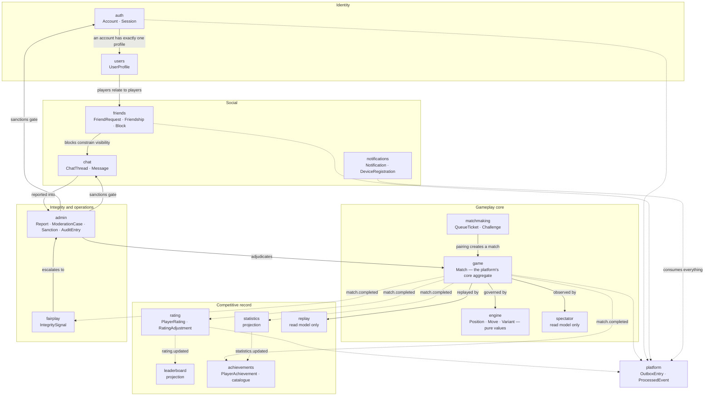
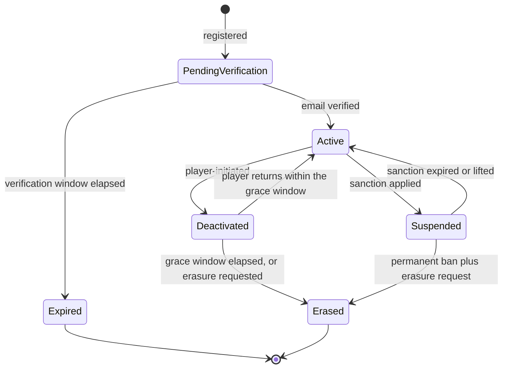
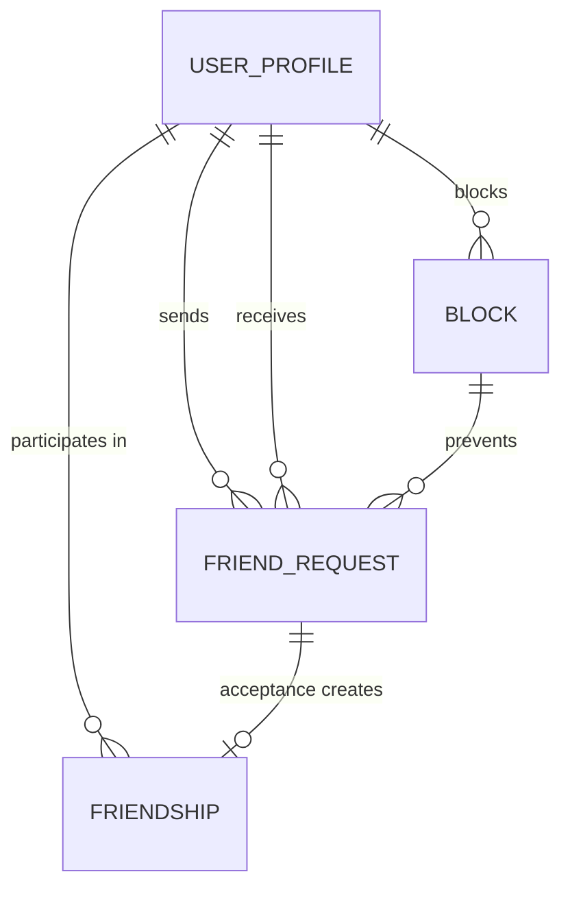
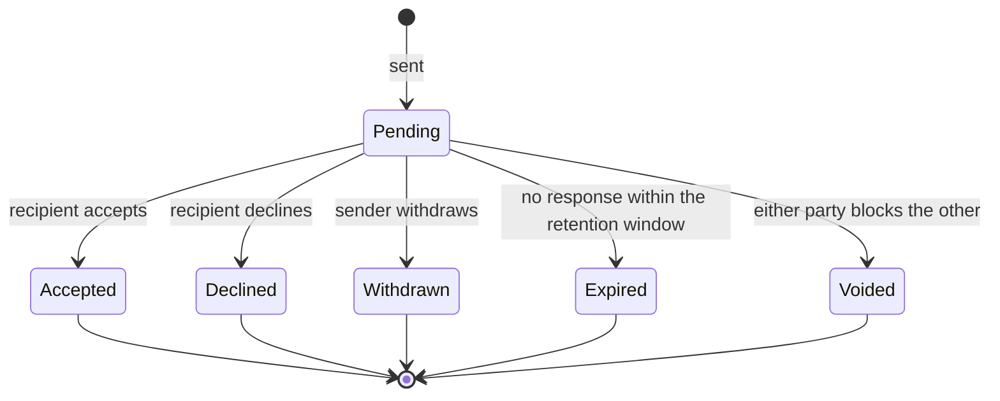
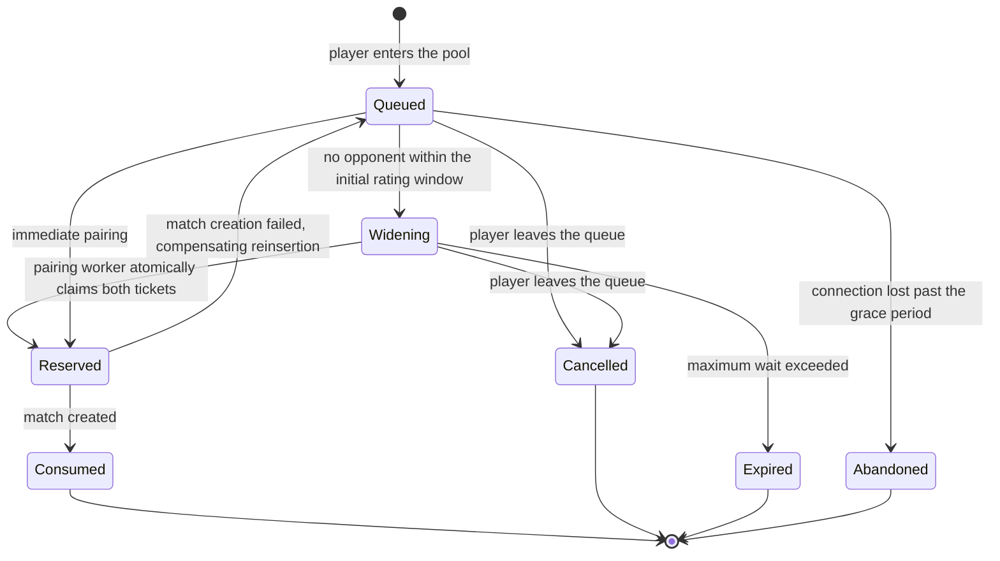
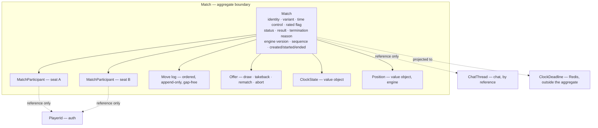
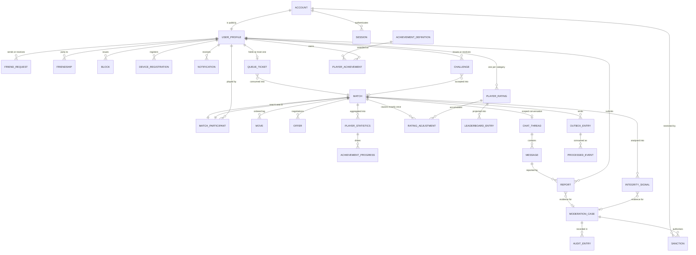

# Domain Model

> **Status:** Draft — proposed for review
> **Owner:** _Unassigned_
> **Last reviewed:** _Not yet reviewed_
> **Task:** A64-004 — business domain definition, ahead of schema design (A64-005)
> **Upstream:** [`architecture.md`](./architecture.md) · [`system-design.md`](./system-design.md) ·
> [`../03-backend/services.md`](../03-backend/services.md) · [`../03-backend/repositories.md`](../03-backend/repositories.md)
> **Downstream:** [`database.md`](./database.md) · [`events.md`](./events.md) · `specs/`

## Purpose

Defines **what Arena64 is about** — every business entity the platform reasons over, why it
exists, what owns it, how it is born and how it dies, and which rules it must never violate.

`architecture.md` decided **what modules exist**. `services.md` decided **how a use case
behaves**. This document decides **what the use cases are about**. It is the last document
written in the domain's own language before the domain is expressed as a schema.

## Scope

The complete business domain: entities, aggregates, value objects, lifecycles, ownership,
invariants, and the relationships between them.

**Explicitly out of scope, and deliberately absent:** tables, columns, types, keys, indexes,
constraint syntax, ORM mappings, and code of any kind. Where this document says something the
database must guarantee, it says it as an **invariant**, not as a constraint definition —
§18 collects those for A64-005.

Decisions introduced here are tagged `DM-nn`. `AD-nn`, `BE-nn` and `RP-nn` cite
[`architecture.md`](./architecture.md), [`services.md`](../03-backend/services.md), and
[`repositories.md`](../03-backend/repositories.md) respectively.

---

## 1. How to Read This Document

| Section | Answers |
| --- | --- |
| §2 Ubiquitous language | What the words mean, so the model is unambiguous |
| §3 Modelling rules | Why something is an entity rather than a value, a projection, or nothing |
| §4 Context map | Which context owns which part of the domain |
| §5 Entity catalogue | The complete inventory, at a glance |
| §6 – §13 | Per-context detail: purpose, responsibilities, lifecycle, relationships, ownership, rules |
| §14 Aggregate roots | Where the consistency boundaries are drawn, and why there |
| §15 Value objects | What has no identity, and why that matters here |
| §16 Rejected, future, optional | What was considered and deliberately excluded |
| §17 Domain summary | The model in one page |
| §18 – §19 | Open business questions, and the handover to A64-005 |

---

## 2. Ubiquitous Language

The model uses the vocabulary players and moderators actually use. Terms below are binding:
code, specs, events, and schema must use these words and no synonyms.

### 2.1 The game

| Term | Meaning in Arena64 | Not to be confused with |
| --- | --- | --- |
| **Variant** | A named rule set — board size, king mobility, capture obligations, draw rules | "Game mode", "difficulty" |
| **Man** | An unpromoted piece | "Pawn", "checker" |
| **King** | A promoted piece, crowned on reaching the far rank | "Queen", "double" |
| **Square** | One of the 32 playable dark squares on an 8×8 board (50 on 10×10), numbered per PDN | Board coordinates |
| **Position** | The complete placement of men and kings, plus side to move | "Board", "state" |
| **Ply** | One player's turn. A multi-jump of four hops is **one ply** | "Move number", which covers both sides |
| **Move** | The transition a player commits: an ordered **path of squares**, plus every piece captured along it | A from/to pair |
| **Mandatory capture** | If a capture is available it must be played; some variants additionally require the *maximum* capture | An option |
| **Promotion** | A man reaching the crownhead becomes a king; in most variants this ends the ply even if further jumps exist | A player choice |
| **Flag** | A clock reaching zero | Losing |
| **Terminal position** | No legal moves for the side to move, or a draw rule is satisfied | Game over — a game can also end by resignation, agreement, or adjudication |

**Why the "path of squares" definition of a move is load-bearing:** a multi-jump in draughts
can reach the same destination square by different capture paths, capturing different pieces.
A move recorded as *from → to* is therefore **ambiguous**, and an ambiguous move log cannot be
replayed, cannot be audited, and cannot be analysed for fair play. Every downstream promise the
platform makes about its permanent record depends on this one modelling choice.

### 2.2 The contest

| Term | Meaning |
| --- | --- |
| **Match** | One complete contest between two players under one time control and one variant |
| **Seat** | One of the two sides of a match, held by one player, with a colour and a clock |
| **Rated / Casual** | Whether the outcome may change ratings. Fixed at match creation, never afterwards |
| **Abort** | A match ended before it counts; no result, no rating effect |
| **Adjudicate** | To determine a result by rule rather than by play — flag, abandonment, or moderator decision |
| **Termination reason** | *How* a match ended, distinct from *who won* |

### 2.3 The platform

| Term | Meaning |
| --- | --- |
| **Account** | The credential and security identity a person signs in with |
| **Profile** | The public identity other players see, plus that player's preferences |
| **Handle** | The unique, player-chosen display name |
| **Rating category** | The bucket a rating is kept in — one per (variant, speed class) |
| **Sanction** | An active restriction on an account: muted, suspended, or banned |
| **Integrity signal** | A machine-produced observation suggesting assistance or manipulation — never a verdict |

---

## 3. Modelling Rules

Five rules decide every classification in this document. They are stated first so the
classifications are checkable rather than asserted.

### DM-01 — Something is an **entity** only if the platform must be able to say "*that* one"

If two instances with identical attributes are interchangeable to the business, it is a
**value object**. If the business needs to refer to one specific instance across time —
to amend it, resolve it, audit it, or dispute it — it is an entity.

*Applied:* a `FriendRequest` is an entity (it is accepted or declined, and which one matters).
A `Position` is a value object (two identical positions are the same position — indeed the
repetition draw rule **requires** them to compare equal).

### DM-02 — Something is an **aggregate root** only if it owns an invariant that spans more than one object

An aggregate exists to make a rule enforceable in one transaction. If an object has no rule
binding it to anything else, it is a standalone entity that happens to have its own repository,
not an aggregate with children.

*Applied:* `Match` is an aggregate root because "the move log is exactly the sequence of plies
that produced the recorded result" is an invariant spanning the match, its seats, and every
move. `Notification` is an aggregate root with no children — a trivial aggregate, honestly
labelled.

### DM-03 — Anything **rebuildable from other durable data is a projection**, never an entity

Projections have no invariants of their own, cannot be commanded, and are disposable
(AD-19, BE §2.3, RP-03 §6.3). Calling one an entity invites someone to put a rule in it, and a
rule inside a projection is a rule that vanishes on the next rebuild.

*Applied:* leaderboards, statistics, head-to-head records, and achievement *progress* are
projections. Achievement *awards* are not — see §11.4.

### DM-04 — Anything whose disappearance costs nothing is **ephemeral state**, not domain data

Presence, connections, spectator subscriptions, and rate-limit counters are true facts about
right now. They are not part of the persistent domain and appear in this model only so that
nobody later "promotes" them to entities.

*Applied:* `Connection` and `Presence` are ephemeral. `QueueTicket` is **also** ephemeral in
storage terms (Redis) but **is** a domain entity, because a pairing decision must be able to
name the exact ticket it consumed.

### DM-05 — A rule the platform enforces on behalf of the business gets a name and a home

An unnamed rule lives in whichever service happened to need it first, and is then duplicated.
Every invariant in §6 – §13 is attributed to exactly one entity, which is the only place it may
be implemented.

---

## 4. Context Map

Sixteen bounded contexts, plus a platform layer that belongs to no context. The arrows are
**domain relationships**, not import edges — the import rules are `architecture.md §7`.

### Relationship kinds

| Upstream → Downstream | Kind | What it means for the model |
| --- | --- | --- |
| `engine` → `game` | **Shared kernel** | `game` embeds the engine's value objects directly. The engine is the published language of checkers |
| `game` → `rating`, `statistics`, `achievements`, `fairplay` | **Published language** | Downstream contexts consume `match.completed` as a self-contained fact and never call back (BE §10.2) |
| `matchmaking` → `game` | **Customer–supplier** | `matchmaking` asks `game` to create a match; `game` sets the contract |
| `admin` → everything | **Open host** | Moderation acts on other contexts through their published ports; it never owns their data |
| `auth` → all contexts | **Conformist** | Every context accepts `PlayerId` as issued by `auth` and does not model identity itself |

### DM-06 — `PlayerId` is the only identifier that crosses every context boundary

Every context refers to a person by the identifier `auth` issues, and nothing else. No context
stores a handle, an email, or an avatar reference belonging to another context.

**Why:** a handle is mutable (§7.2) and an email is personal data with an erasure obligation
(§16.3). A `Match` from 2026 that stored the handle "player_x" would show the wrong name after a
rename and would defeat erasure after account deletion — and it would do so in the platform's
**permanent** record, where it cannot be corrected without rewriting history. Storing only the
identifier means a rename is one write and an erasure is one write, and the competitive record
stays intact and correct in both cases.

---

## 5. Entity Catalogue

The complete inventory. **Kind** follows §3. **Store** follows AD-18/AD-19.

| # | Name | Module | Kind | Store | Why it exists |
| --- | --- | --- | --- | --- | --- |
| 1 | `Account` | auth | **Aggregate root** | PostgreSQL | Someone must be able to prove they are who they claim, and be locked out if they abuse the platform |
| 2 | `Credential` | auth | Entity (in `Account`) | PostgreSQL | A person may sign in by password today and by an identity provider tomorrow, without becoming a second account |
| 3 | `EmailVerification` | auth | Entity (in `Account`) | PostgreSQL | An unverified email cannot receive account-recovery mail, so verification state gates recovery |
| 4 | `PasswordResetToken` | auth | Entity (in `Account`) | PostgreSQL | Recovery must be single-use, expiring, and revocable when a second request is made |
| 5 | `Session` | auth | **Aggregate root** | PostgreSQL | A player must be able to see and end their other sign-ins after a device is lost |
| 6 | `WebSocketTicket` | auth | Entity | Redis | AD-09 — a seconds-long, single-use credential that is worthless in a proxy log |
| 7 | `UserProfile` | users | **Aggregate root** | PostgreSQL | The identity other players see, and the preferences that shape what this player sees |
| 8 | `HandleAssignment` | users | Entity (in `UserProfile`) | PostgreSQL | A released handle must not be immediately reusable, or impersonation becomes trivial |
| 9 | `FriendRequest` | friends | **Aggregate root** | PostgreSQL | Consent to a relationship is itself a fact that is accepted, declined, or withdrawn |
| 10 | `Friendship` | friends | **Aggregate root** | PostgreSQL | Mutual consent, once reached, is a durable relationship with its own start date |
| 11 | `Block` | friends | **Aggregate root** | PostgreSQL | A unilateral refusal of contact that must hold across chat, challenges, and pairing |
| 12 | `ChatThread` | chat | **Aggregate root** | PostgreSQL | Conversation is scoped, and its scope decides who may read it and how long it is kept |
| 13 | `Message` | chat | Entity (in `ChatThread`) | PostgreSQL | The unit moderation acts on, and the unit a dispute quotes |
| 14 | `Notification` | notifications | **Aggregate root** | PostgreSQL | A player must see what they missed while away, on whatever device they return on |
| 15 | `NotificationDelivery` | notifications | Entity (in `Notification`) | PostgreSQL | One notification, several channels, each failing independently against third parties |
| 16 | `DeviceRegistration` | notifications | **Aggregate root** | PostgreSQL | Push targets a device, not a player, and devices are revoked independently of accounts |
| 17 | `QueueTicket` | matchmaking | **Aggregate root** | **Redis** | A pairing decision must name the exact ticket it consumed, to make double-pairing impossible |
| 18 | `Challenge` | matchmaking | **Aggregate root** | PostgreSQL | A direct invitation outlives a session and must survive the challenger closing the tab |
| 19 | `Match` | game | **Aggregate root** | Redis while live, PostgreSQL when archived | The contest itself — the entity every other context orbits |
| 20 | `MatchParticipant` | game | Entity (in `Match`) | with `Match` | A seat: who played which colour, with what rating, and what happened to them |
| 21 | `Move` | game | Entity (in `Match`) | with `Match` | The permanent, replayable record of what was actually played |
| 22 | `Offer` | game | Entity (in `Match`) | Redis while live | Draw, takeback, rematch and abort proposals — short-lived negotiations with real outcomes |
| 23 | `ClockDeadline` | game | Entity | **Redis** | AD-21 — a deadline owned by no process, so no restart can lose a flag |
| 24 | `PlayerRating` | rating | **Aggregate root** | PostgreSQL | Measured skill, per category — the number the whole competitive product is built on |
| 25 | `RatingAdjustment` | rating | Entity (in `PlayerRating`) | PostgreSQL | The permanent, auditable answer to "why did my rating change by that?" |
| 26 | `RatingPeriod` | rating | Entity | PostgreSQL | Batch-rated systems compute over a window; the window is a fact matches are assigned to |
| 27 | `AchievementDefinition` | achievements | **Reference data** | PostgreSQL | The catalogue of what can be earned, versioned so a retuned criterion cannot revoke an award |
| 28 | `PlayerAchievement` | achievements | **Aggregate root** | PostgreSQL | An award is a permanent fact about a player, not a recomputable statistic |
| 29 | `AchievementProgress` | achievements | **Projection** | PostgreSQL + Redis | Progress toward an award is derived; it is shown, never trusted |
| 30 | `PlayerStatistics` | statistics | **Projection** | PostgreSQL + Redis | Aggregates over match history, rebuildable by definition |
| 31 | `HeadToHead` | statistics | **Projection** | PostgreSQL | "Your record against this opponent" — the most-asked question on a profile |
| 32 | `LeaderboardEntry` | leaderboard | **Projection** | **Redis** | Rank is a position in an ordering, not a property of a player |
| 33 | `IntegritySignal` | fairplay | **Aggregate root** | PostgreSQL | An observation that must be recorded, revisited, and never mistaken for a verdict |
| 34 | `Report` | admin | **Aggregate root** | PostgreSQL | A player's accusation is evidence with its own lifecycle, separate from the decision it triggers |
| 35 | `ModerationCase` | admin | **Aggregate root** | PostgreSQL | The decision record — who decided what, on what evidence, and when |
| 36 | `Sanction` | admin | **Aggregate root** | PostgreSQL | The *enforced* restriction, read on every sign-in and every message — separate from the case that produced it |
| 37 | `AuditEntry` | admin | Entity | PostgreSQL | Privileged action must be attributable after the fact, including to the person who took it |
| 38 | `OutboxEntry` | platform | **Aggregate root** | PostgreSQL | AD-16 — makes an event as durable as the fact that caused it |
| 39 | `ProcessedEvent` | platform | Entity | PostgreSQL | At-least-once delivery makes a consumer-side ledger a correctness requirement |
| 40 | `ErasureRequest` | platform | **Aggregate root** | PostgreSQL | Deletion is a long-running obligation with a legal clock, not an instantaneous operation |
| 41 | `DataExportRequest` | platform | **Aggregate root** | PostgreSQL | Same, for portability |

### Ephemeral state — modelled here only to keep it out of the durable model (DM-04)

| Name | Module | Store | Why it is not domain data |
| --- | --- | --- | --- |
| `Connection` | gateway | Redis | Which node holds a socket is meaningless after that node restarts |
| `Presence` | users | Redis | "Online" is true only while a socket is open; a row swept by cron is the wrong tool |
| `SpectatorSubscription` | spectator | Redis | Spectators are counted, never enumerated durably |
| `RateLimitCounter`, `IdempotencyKey`, `MatchLock` | platform | Redis | Coordination primitives with a TTL |

---

## 6. Identity and Access — `auth`

### 6.1 `Account` — aggregate root

**Purpose.** Holds everything used to *prove identity* and everything used to *deny access*. It
is deliberately not the player's public identity — that is `UserProfile` (§7).

**Responsibilities.**

- Own the sign-in identifier (email) and every credential attached to it.
- Own security state: verification, failed-attempt counters, lockout, MFA enrolment.
- Own account status: `pending_verification`, `active`, `suspended`, `deactivated`, `erased`.
- Emit `account.registered`, `account.suspended`, `account.reinstated`, `account.erased`.

**Lifecycle.**

**Relationships.** One `Account` ↔ exactly one `UserProfile` (§7.1). One `Account` → many
`Session`. One `Account` ← many `Sanction`, but the sanction is owned by `admin`, not by `auth`
(§13.3).

**Ownership.** `auth` alone writes. `admin` may *request* suspension through a published port;
it never writes account rows. Every other context reads nothing from `Account` — they use
`PlayerId` (DM-06).

**Business rules.**

| # | Rule | Why |
| --- | --- | --- |
| AC-1 | Email is unique, case-insensitively | Two accounts on one address makes recovery ambiguous and enables one person to hold "two" identities that both look primary |
| AC-2 | An account cannot play rated matches while `pending_verification` | An unverified account is disposable; disposable accounts are how rating manipulation starts |
| AC-3 | Password material is never stored, compared, logged, or exported in recoverable form | Non-negotiable |
| AC-4 | Deactivation is reversible within a grace window; erasure is not | A player quitting in frustration after a loss should not lose a five-year competitive record irrecoverably |
| AC-5 | `Erased` retains the identifier and nothing else | §16.3 — the competitive record must survive, the person must not be identifiable |
| AC-6 | A suspended account may still read its own data | Suspension is a restriction on participation, not confiscation |

### 6.2 `Session` — aggregate root

**Purpose.** One authenticated context of use — a browser, a phone — that can be listed and
individually revoked.

**Lifecycle.** `Active → Refreshed* → (Expired | RevokedByPlayer | RevokedBySystem)`.
Revocation by system occurs on password change, on suspension, and on detected credential
compromise.

**Business rules.**

| # | Rule | Why |
| --- | --- | --- |
| SE-1 | A password change revokes every session except the one performing it | The entire point of changing a password after a compromise |
| SE-2 | Sessions record device descriptor, first-seen and last-seen instants, and originating region | Without this the revocation list is a row of identical entries and the player cannot tell which one is the attacker |
| SE-3 | Suspension revokes all sessions immediately | A suspension that lets an existing socket keep playing is not a suspension |

### 6.3 `WebSocketTicket` — entity, ephemeral store

**Purpose.** AD-09's connect credential: bound to one player, valid for seconds, redeemable
exactly once.

**Business rules.** Single-use enforced by atomic redemption (`system-design.md §4.2`); bound to
the requesting session; never reissued for a suspended account.

**Why it is an entity and not a value:** the platform must be able to say *this* ticket was
redeemed, and redemption of a specific ticket is the whole security property.

---

## 7. Player Identity — `users`

### 7.1 `UserProfile` — aggregate root

**Purpose.** The public identity other players see, plus the private preferences that shape this
player's own experience. Settings are inside the profile, not beside it, per `architecture.md §6`.

**Responsibilities.**

- Own the handle and its history (§7.2).
- Own presentational identity: display name, avatar reference, country, biography, join date.
- Own preferences in four groups: **gameplay** (board theme, piece set, premove, auto-promote,
  confirm-move), **privacy** (profile visibility, who may challenge, who may see online status,
  who may direct-message), **notifications** (per-event, per-channel), **locale** (language,
  timezone, time-and-date format, board orientation).
- Own the player's declared title or badge display choices, if §16.2's optional entities ship.

**Lifecycle.** Created in the same use case as the `Account` and never separately; suspended
implicitly (a suspended player's profile is visible but marked); anonymised on erasure —
handle released to a tombstone, avatar deleted, biography cleared, country cleared, identifier
retained.

**Relationships.** 1:1 with `Account`. Referenced by `PlayerId` from everywhere else; refers to
nothing outside its own context.

**Ownership.** Written only by its owner, and by `platform` during erasure. **Read by
everything**, which is precisely why AD-08 gives the profile page a read model rather than five
repository calls.

**Business rules.**

| # | Rule | Why |
| --- | --- | --- |
| UP-1 | Handle is unique case-insensitively, and confusable-normalised | "Player1" and "PIayer1" (capital i) are an impersonation attack, not two names |
| UP-2 | Handle changes are rate-limited and historical | A player who loses to "shark" and finds no such account cannot verify the result; free renaming also defeats block lists |
| UP-3 | A released handle enters a cooldown before reuse | Otherwise a rename is an identity handoff, and the previous owner's match history appears to belong to a stranger |
| UP-4 | Privacy preferences are enforced server-side on every read path | A client-enforced privacy setting is a decoration |
| UP-5 | Profile visibility never hides *rated results* from the opponent of those results | A player has a legitimate interest in the record of a game they played; privacy governs discovery, not repudiation |

### 7.2 `HandleAssignment` — entity within `UserProfile`

**Purpose.** Records that a handle belonged to a player over a period. Exists so that UP-2, UP-3,
and moderation history survive renames.

**Why it is not a value object:** the platform must be able to answer "who held this handle in
March", which is a question about a specific assignment, not about a name.

---

## 8. Social Graph — `friends`

Three aggregates, deliberately not one.

### 8.1 `FriendRequest` — aggregate root

**Purpose.** Records a proposal of relationship and its resolution. The proposal is a fact
independent of its outcome.

**Lifecycle.**

**Business rules.**

| # | Rule | Why |
| --- | --- | --- |
| FR-1 | At most one `Pending` request per ordered pair | Otherwise "send request" becomes a harassment primitive |
| FR-2 | A request to a blocked or blocking player is rejected — indistinguishably from a request to a non-existent player | Distinguishable rejection tells the sender they were blocked, which is exactly what the blocker was avoiding |
| FR-3 | Declining is silent to the sender | A notified decline turns a refusal into a confrontation |
| FR-4 | Acceptance creates the `Friendship` in the same transaction that resolves the request | Two transactions permit a state where the request is accepted and no friendship exists |
| FR-5 | A declined request imposes a cooldown before the same sender may retry | FR-1 alone does not stop send-decline-send |

### 8.2 `Friendship` — aggregate root

**Purpose.** A mutual, symmetric relationship with its own start date. It gates presence
visibility, direct challenges, direct messaging, and friend-scoped leaderboards.

**Lifecycle.** `Active → Ended` (either party removes) or `→ Voided` (either party blocks).

**Business rules.**

| # | Rule | Why |
| --- | --- | --- |
| FS-1 | Symmetric and stored once per unordered pair, not twice | Two rows for one relationship will eventually disagree, and reconciling them is unsolvable — neither is authoritative |
| FS-2 | Removal is unilateral and silent | Requiring mutual agreement to stop being friends is not a feature anyone wants |
| FS-3 | A block immediately voids any friendship | Blocking must not require a second action to be effective |

**Why `Friendship` is its own aggregate rather than a collection on `UserProfile`:** a friend
list held inside a profile makes acceptance a two-aggregate write (both profiles), which cannot
be one transaction without locking two players' profile rows — on a platform where profile rows
are read on every page render. The relationship is its own thing, owned by neither party.

### 8.3 `Block` — aggregate root

**Purpose.** A unilateral, asymmetric refusal of contact.

**Business rules.**

| # | Rule | Why |
| --- | --- | --- |
| BL-1 | Asymmetric and one-directional; the blocked player is never told | A visible block is an invitation to retaliate from a second account |
| BL-2 | A block suppresses: friend requests, direct challenges, direct messages, presence visibility, and **matchmaking pairing** | Pairing is listed explicitly because it is the one people forget, and it is the one that puts the two players in a forced hour-long interaction |
| BL-3 | Blocks do **not** rewrite history | Past matches, results, and ratings stand. A block governs future contact, not the competitive record |
| BL-4 | Block capacity is bounded and the bound is a product decision | An unbounded block list interacts badly with BL-2 in matchmaking — see §18 Q-9 |

**Why "Block List" is not an entity:** the list is the result of querying blocks by owner. Naming
the list invites a second write path that maintains it, and then two sources of truth.

---

## 9. Communication — `chat` and `notifications`

### 9.1 `ChatThread` — aggregate root

**Purpose.** A conversation with a **scope**, and the scope decides everything: who may read it,
how long it lives, and whether it is moderated.

| Scope | Participants | Lifecycle | Retention |
| --- | --- | --- | --- |
| `match` | The two players of one match | Created with the match, closed at completion, read-only afterwards | Tied to the match's retention |
| `direct` | Two players | Long-lived, created on first message | Own retention policy |
| `spectator` | Spectators of one match | Live only | Not archived by default |
| `system` | Platform → one player | Append-only, platform-written | Retained with moderation records |

**Responsibilities.** Own message ordering within the thread; own participant membership; own
moderation state (a thread can be frozen); enforce block-based visibility through the `friends`
port.

**Business rules.**

| # | Rule | Why |
| --- | --- | --- |
| CT-1 | Match chat is closed to new messages when the match completes | Post-game abuse is the single largest source of chat reports on competitive platforms; closing the thread removes the surface entirely |
| CT-2 | A match thread is readable by the two players and by moderation, never by spectators | Players say things to each other; spectators are an audience, not participants |
| CT-3 | Message ordering within a thread is total and stable | A reordered conversation changes its meaning, and moderation quotes it in decisions |
| CT-4 | A blocked player's messages are not delivered, and the sender is not told | BL-1 |
| CT-5 | Redaction removes the body and retains the fact | Moderation must be able to prove that a message existed and was removed |
| CT-6 | Message bodies are never written to logs | `services.md §8.5` — it converts a moderation feature into a privacy liability |

### 9.2 `Message` — entity within `ChatThread`

Immutable once sent; redactable, never edited. **Why not editable:** an editable message in a
competitive context lets a player retroactively rewrite an accusation, and moderation would be
adjudicating text that no longer exists.

### 9.3 `Notification` — aggregate root

**Purpose.** A durable record that something happened which the player should know about,
independent of whether any delivery channel worked.

**Lifecycle.** `Created → Delivered* → (Read | Dismissed | Expired)`. Deliveries are per-channel
and independent.

**Business rules.**

| # | Rule | Why |
| --- | --- | --- |
| NT-1 | The notification exists even if every delivery channel fails | Otherwise a push provider outage silently erases the player's history of what happened |
| NT-2 | Delivery is idempotent on (event, recipient, channel) | At-least-once event delivery would otherwise send three identical "your turn" pushes |
| NT-3 | A notification past its staleness horizon is dropped, not delivered late | A "your turn" push arriving six hours later is worse than none |
| NT-4 | Preferences are read at **delivery** time, not at creation time | A player who mutes a category should stop receiving it immediately, including for already-queued items |

**Why `notifications` owns no preference data:** preferences live in `UserProfile` (§7.1) and are
read through a port. Duplicating them here would create the classic bug where a player mutes a
category in settings and keeps receiving it because a second copy was never updated.

### 9.4 `DeviceRegistration` — aggregate root

A push target. Separate from `Session` because a device outlives any single sign-in and must be
revocable when a provider reports the token dead — a lifecycle driven by the provider, not by
the player.

---

## 10. Gameplay — `engine`, `matchmaking`, `game`, `spectator`

This is the core of the domain. Everything above supports it; everything below observes it.

### 10.1 `engine` — a context of pure values, with no entities at all

The engine has **no entities**. It contributes the vocabulary of checkers as immutable value
objects, and AD-13 requires it to have no identity, no storage, and no time.

| Value object | Content | Why it must be a value |
| --- | --- | --- |
| `Variant` | Board size, king mobility (flying vs short), capture obligation (any vs maximum), promotion-ends-ply, draw rules, first mover | Two matches under the same variant are governed identically; a variant with identity would imply a variant could *change*, which would silently rewrite the rules of finished games |
| `Position` | Placement of men and kings by side, side to move | **Repetition detection requires value equality.** An entity would compare by identity and the three-fold rule would never fire |
| `Square` | A playable dark square, PDN-numbered | Interchangeable by definition |
| `Move` (engine-level) | Ordered path of squares, captured squares, promotion flag | See §2.1 — the path *is* the move |
| `LegalMoveSet` | The complete set of legal moves for a position | A derived answer, not a thing |
| `PositionHash` | Repetition key | A value whose whole job is comparison |
| `TerminalState` | None, win-for-side, draw-by-rule | The output of a rule |
| `EngineVersion` | Identifier of the rules implementation | AD-15 — stamped, never interpreted |

**Why `Board` and `Piece` are not entities:** see §16.1. This is the most common modelling error
in board-game platforms and it is worth rejecting explicitly.

### 10.2 `QueueTicket` — aggregate root, Redis-authoritative

**Purpose.** A player's standing request to be paired, under one time control and variant.

**Lifecycle.**

**Business rules.**

| # | Rule | Why |
| --- | --- | --- |
| QT-1 | One live ticket per player across all pools | Multi-queueing means one player is paired into two simultaneous matches, and one of them must be abandoned — which then looks like the opponent's win was stolen |
| QT-2 | Ticket carries rating **at entry**, not a live rating reference | Pairing must be deterministic within a tick; a rating changing mid-scan would make the same scan pair inconsistently |
| QT-3 | Eligibility excludes: blocked pairs (BL-2), the immediately previous opponent, and sanctioned accounts | The "previous opponent" exclusion exists because repeated instant rematches with the same player are the mechanics of rating manipulation |
| QT-4 | Claiming both tickets is atomic; failure to create the match compensates by reinsertion | BE §3.4 — the sanctioned compensating action |
| QT-5 | The rating window widens monotonically with ticket age | `system-design.md §4.3` — the extremes of the rating distribution are otherwise unpairable |

**Why it is an aggregate root despite living in Redis:** RP-01. The pairing worker must name the
exact ticket it consumed, and the port must expose the compare-and-set contract rather than hide
it behind `save()`.

### 10.3 `Challenge` — aggregate root, PostgreSQL

**Purpose.** A direct, named invitation: "play me, this variant, this time control, rated".
Distinct from a ticket in every respect that matters.

| | `QueueTicket` | `Challenge` |
| --- | --- | --- |
| Opponent | Unknown, chosen by rating | Named at creation |
| Lifetime | Seconds to minutes, dies with the session | Hours to days, survives sign-out |
| Store | Redis | PostgreSQL |
| Resolution | Pairing worker | The recipient |
| Notifies | Nobody | The recipient, out-of-band |

**Lifecycle.** `Offered → (Accepted → Consumed | Declined | Withdrawn | Expired | Voided-by-block)`.

**Business rules.** A challenge may be open (link-shareable, first responder takes it) or
directed; acceptance creates the match in the same transaction that consumes the challenge; a
challenge to a blocked player fails indistinguishably (BL-2, FR-2); an accepted challenge whose
challenger is offline still creates the match, which then resolves through the `Created` join
deadline (§10.4).

### 10.4 `Match` — the platform's central aggregate root

**Purpose.** One complete contest. Everything the platform sells is either an input to a match,
a record of a match, or a consequence of a match.

**Composition.** The aggregate is `Match` + exactly two `MatchParticipant` + an ordered `Move`
log + at most one live `Offer` per type.

**Responsibilities.**

- Own the authoritative position and whose turn it is.
- Own the clocks, and the charging of elapsed time to the mover.
- Own the move log, and the guarantee that it is complete, ordered, and gap-free.
- Own the result and the termination reason.
- Own the per-match sequence number that AD-12's reconnection protocol depends on.
- Own the engine version under which it was played (AD-15).
- Emit `match.created`, `match.started`, `move.applied`, `match.completed`, `match.aborted`.

**Lifecycle.** The authoritative state machine is `system-design.md §3` and is not restated. Two
domain points that the state machine implies and that the model must make explicit:

### DM-07 — `Match` is one aggregate whose **storage authority moves**, not two aggregates

While live, Redis is authoritative (AD-18); the durable move log is a write-behind recovery
record. At completion, PostgreSQL becomes authoritative and Redis holds a short-lived remnant
for late reconnects.

**Why this matters to the domain model:** it is tempting to model "LiveMatch" and "ArchivedMatch"
as two entities, because they have two repositories (RP §7). That would be wrong. They have the
same identity, the same move log, the same result, and the same invariants — a player disputing
a result does not care which store answered. Two entities would mean two definitions of what a
match *is*, and the two would diverge on exactly the properties that are disputed. **One
aggregate, one identity, one set of invariants, a storage authority that migrates once.**

### DM-08 — The result is a value object, and it is absent until the match is complete

`MatchResult` = outcome (win-A / win-B / draw / none) + termination reason + the seat that won.

**Why the two parts are inseparable:** "Black won" and "Black won because White's flag fell with
insufficient material to convert" are different facts to a player disputing a game, and the
second is the one that ends the dispute. **Why absence rather than a "pending" value:** a
sentinel result invites code that forgets to check for it, and the first place that forgets is
whatever computes ratings.

**Business rules.**

| # | Rule | Why |
| --- | --- | --- |
| MT-1 | Exactly two participants, fixed at creation, never substituted | A substitution would invalidate every rating and statistic derived from the match |
| MT-2 | Rated-or-casual is decided at creation and is immutable | A match that can become rated after the fact lets a player choose to rate only their wins |
| MT-3 | Variant, time control, and engine version are immutable after creation | AD-15 — the rules a game was played under are part of the record |
| MT-4 | Each participant's rating **at match start** is captured on the seat | Rating changes constantly; reconstructing "what was their rating then" from history is a query nobody should have to write, and it is the input to the rating calculation itself |
| MT-5 | The move log is append-only, ordered, and gap-free; ply numbers are contiguous from 1 | A gap makes the game unreplayable, which invalidates the result, the analysis, and the fair-play record simultaneously |
| MT-6 | A move is recorded with its full capture path, the resulting position hash, the mover's think time, and the remaining clock after the move | Path: §2.1. Hash: repetition. Think time: `fairplay` cannot be retrofitted (AD-05). Remaining clock: the only way to reconstruct a disputed flag |
| MT-7 | Only the seat to move may move | The single invariant that makes the match a low-contention aggregate (`system-design.md §5`) |
| MT-8 | The clock is charged before legality is evaluated | `system-design.md §4.4` — otherwise an illegal move buys thinking time |
| MT-9 | A move is judged against the **gateway receive timestamp** | Tenet T-2 — platform queueing delay must never cost a player a game |
| MT-10 | A completed match is immutable except by an `admin` adjudication, which is itself recorded | The permanent record must be permanent, and the sole exception must be attributable |
| MT-11 | An aborted match produces no result and no rating effect | T-2's landing point: infrastructure failure resolves to abort, never to loss |
| MT-12 | Terminal detection consults game **history**, not just the position | Repetition and move-limit draws are properties of the game (`system-design.md §4.4`) |
| MT-13 | Sequence numbers are monotonic and per-match, and every state-changing event increments exactly one | AD-12's replay protocol is unusable if two events can share a sequence |

### 10.5 `MatchParticipant` — entity within `Match`

**Purpose.** A seat. Answers: which player, which colour, what rating did they bring, how much
time did they have, what happened to them, and were they present.

**Why it is an entity rather than a pair of fields on `Match`:** every downstream context asks
questions *per side* — statistics by colour, rating change per player, disconnect duration per
player, fair-play signals per player. Flattening the seat into the match makes each of those a
special case with an "A or B" branch, in six different modules, forever. It also makes the
model unable to express the future `MatchSeries` (§16.2) where a player's seat alternates
between games.

**Content.** Player reference, seat colour, rating and rating deviation at start, result from
this seat's perspective, rating adjustment applied, final clock remaining, disconnect count and
total disconnected duration, whether this seat offered or accepted each offer type.

**Business rules.** A player may hold at most one seat in a match (no self-play in rated mode —
see §18 Q-14); seat colour assignment is decided at creation by a documented policy (alternation
in a series, else balanced-random) and never changes.

### 10.6 `Move` — entity within `Match`

**Purpose.** The permanent, replayable record of one ply.

**Why an entity and not a value object:** it has identity — `(match, ply)` — and that identity is
the idempotency key the write-behind flusher relies on (BE-09). Two identical-looking moves at
different plies are different facts, and a duplicate append at the same ply is a corruption that
must be detectable.

**Content.** Ply number, the acting seat, the engine-level move value (path, captures,
promotion), the resulting position hash, think time, remaining clock after the move, the
gateway receive instant, the client move id, and the engine version.

**Business rules.** Immutable once appended; idempotent on `(match, ply)`; notation is *derived*
from the move, never stored as the source of truth — see DM-09.

### DM-09 — Notation is derived, never authoritative

PDN notation is generated from the move path on demand; the move path is the record.

**Why:** notation is ambiguous in exactly the case that matters. In several draughts variants two
distinct capture sequences share the same short notation, and disambiguating requires the
position. Storing notation as the record means the platform's permanent archive is
lossier than the game it recorded, and the loss is discovered only when someone tries to replay
a disputed multi-jump.

### 10.7 `Offer` — entity within `Match`, live only

**Purpose.** Models the in-match negotiations the given entity list omits entirely: **draw
offers, takeback requests, rematch proposals, and mutual aborts**. Each is a real proposal with
a real lifecycle and real abuse potential.

**Lifecycle.** `Offered → (Accepted | Declined | Withdrawn | Expired | Superseded)`.

**Business rules.**

| # | Rule | Why |
| --- | --- | --- |
| OF-1 | At most one live offer per type per match | Two live draw offers make "accept" ambiguous |
| OF-2 | Offers are rate-limited per player per match | Repeated draw offers are a recognised harassment and distraction tactic in timed play |
| OF-3 | An offer expires when the offering side's next move is made | Otherwise a player accepts a draw offer made twenty plies ago, in a position that has completely changed |
| OF-4 | Takeback acceptance rewinds the position and **restores both clocks** to the pre-move values | A takeback that keeps the clock as-is is a way to make an opponent pay time for your mistake |
| OF-5 | Takeback is unavailable in rated matches unless product policy says otherwise (§18 Q-6) | A rated takeback is an agreement to un-play a competitive game |
| OF-6 | Rematch produces a **new** match with colours swapped, linked to the previous one | Reusing the match would destroy the record of the first game |
| OF-7 | Abort is available only before the abort deadline and, after the first moves, only by mutual consent | Unilateral late abort is a way to escape a losing position without a loss |

**Why offers live inside the `Match` aggregate:** OF-3 and OF-4 are rules *about the position and
the clocks*. An offer held outside the aggregate could be accepted concurrently with a move, and
the resulting order of application decides the game's outcome.

### 10.8 `ClockDeadline` — entity, Redis, outside the aggregate

**Purpose.** AD-21's flag deadline: a per-match instant, owned by no process.

**Why it is outside the `Match` aggregate:** the clock worker's access pattern is "which matches
have expired", across all matches, every 100ms. Modelling that as a property of each aggregate
would make adjudication a scan of every live match. The deadline is a *projection* of the match's
clock state into a structure optimised for one question — and it is authoritative for nothing:
on adjudication the match's own clock state is re-read and re-verified.

### 10.9 `spectator` — a context with no entities

Spectating produces a read model over `game` and ephemeral subscriptions. There is nothing to
persist: a spectator's presence at a match is not a fact anyone needs after the match ends.
Spectator *counts* are metrics. This is stated explicitly so that "SpectatorSession" is never
added as a table.

---

## 11. Competitive Record — `rating`, `leaderboard`, `statistics`, `achievements`, `replay`

### 11.1 `PlayerRating` — aggregate root

**Purpose.** A player's measured skill in one **rating category**, where a category is
`(variant, speed class)` — for example *8×8 English · Blitz*.

### DM-10 — Ratings are keyed by `(variant, speed class)` from day one, even if only one variant ships

**Why:** a single-category rating is a single number, and adding a second category later means
migrating every existing rating, every rating history entry, every leaderboard, and every
statistic — all of which are permanent competitive records that must reconcile exactly (A-4).
Keying by category now costs one value object. Retrofitting it costs a migration of the one
dataset the platform promises never to corrupt.

**Content.** Category, current rating, rating deviation, volatility, provisional flag, games
played in category, peak rating and when, last-played instant, last-rated-period.

**Why deviation and volatility are part of the model and not an implementation detail:** if the
rating system is Glicko-2 (§18 Q-3), a rating is a *triple*, not a number. Modelling it as a
number and "adding uncertainty later" means the entire history is unusable for the new system,
because the deviations that produced each historical change were never recorded.

**Lifecycle.** Created on the player's first rated match in the category — never at registration,
because a rating with no games is a claim, not a measurement. Then: `Provisional → Established`,
with `Decaying` if inactivity decay ships (§18 Q-5), and `Frozen` while under a fair-play case.

**Business rules.**

| # | Rule | Why |
| --- | --- | --- |
| PR-1 | A match affects a rating **exactly once**, enforced at the database, not in code | A-4 and BE-06. This is the single most important invariant in the platform |
| PR-2 | Only completed, rated matches with two distinct established participants affect ratings | Aborts, casual games, and adjudicated-abandonments per policy must not |
| PR-3 | Both players' ratings are adjusted from the values captured on the seats at match start (MT-4), not from current values | Otherwise two matches completing concurrently compute against each other's partial results |
| PR-4 | Every adjustment records the inputs that produced it | "Why did I lose 14 points" is the second most common support question; it must be answerable from data, not by re-deriving from an algorithm that may since have changed |
| PR-5 | A frozen rating accepts no adjustments; the matches queue and are applied or discarded when the case resolves | Rating a player's wins while investigating whether those wins were assisted defeats the investigation |
| PR-6 | Provisional ratings are visibly marked everywhere they appear | An unmarked provisional rating misleads both the opponent and the matchmaker |

### 11.2 `RatingAdjustment` — entity within `PlayerRating`

The immutable per-match record: which match, which category, rating before and after, deviation
before and after, opponent rating, expected score, actual score, the rating period, and the
algorithm version.

**Why the algorithm version is recorded:** rating systems get retuned. Without a version stamp, a
retune makes every historical adjustment inexplicable — the stored numbers no longer follow from
any algorithm the platform can run — and the whole rating history becomes undefendable in a
dispute.

**Why this is not called "Rating History":** history is what you get when you order adjustments by
time. The entity is the adjustment; the history is the query. Naming the query invites a second,
denormalised write path that will eventually disagree with the adjustments.

### 11.3 `RatingPeriod` — entity

**Purpose.** If the rating system is batch-computed (Glicko-2), the period is the window matches
are assigned to and rated within. If the system is incremental (Elo), this entity does not exist.

**Its existence is therefore conditional on §18 Q-3, and the model says so rather than guessing.**
A64-005 must not design for a period that may not exist, nor make one impossible to add. See
§19 R-9.

### 11.4 `achievements` — one aggregate, one catalogue, one projection

The given entity list has "Achievement" and "Achievement Progress" as peers. They are not peers,
and the difference decides whether awards can be silently revoked.

| Concept | Kind | Why |
| --- | --- | --- |
| `AchievementDefinition` | **Reference data**, versioned | The catalogue of what exists. Editable by operations, so it must be versioned |
| `PlayerAchievement` | **Aggregate root** | An award is a permanent fact: earned at an instant, from a specific match or milestone, under a specific definition version |
| `AchievementProgress` | **Projection** | "7 of 10 wins toward Streak" is derived from statistics and is rebuildable |

### DM-11 — An earned achievement records the **definition version** it was earned under, and is never revoked by a criteria change

**Why:** if operations retune "win 10 rated games in a row" to "win 15", recomputing progress
would strip the award from everyone who earned it at 10 — retroactively taking something from
players who did nothing wrong. Recording the version makes retuning a forward-only change, and
makes "why does this player have a badge the current criteria don't grant" answerable.

**Business rules.** Awards are idempotent on `(player, definition)` for one-time achievements and
on `(player, definition, occurrence)` for repeatable ones; awarding is triggered by events, never
by a synchronous call from `game`; progress is never the source of an award decision — the award
is evaluated from durable statistics, so a corrupted projection cannot grant a badge.

### 11.5 `statistics` and `leaderboard` — projections, not entities

| Projection | Content | Rebuildable from | Why not an entity |
| --- | --- | --- | --- |
| `PlayerStatistics` | Games, wins/draws/losses by variant, speed, colour, and termination reason; average game length; average think time; longest streaks; peak rating | Match history | It has no invariant of its own; every number is a count of something durable |
| `HeadToHead` | Record between two specific players | Match history | Same |
| `LeaderboardEntry` | Rank within a scope — global, country, friends, time control, season | `PlayerRating` | **Rank is not a property of a player.** It is a position in an ordering that changes when *other* players play. Storing rank on a player would require updating every player below anyone who moved |

**Why statistics deserve termination-reason breakdowns:** "wins by resignation vs wins on time" is
the breakdown that makes a fair-play pattern visible to a human reviewer and the breakdown players
actually argue about. A generic win/loss count is the one statistic every platform has and nobody
finds interesting.

### 11.6 `replay` — a context with no entities

Playback is a read model over an archived `Match` and its move log, reached through the `game`
port (BE-04). Nothing is persisted. The one candidate future entity is `GameAnnotation` (§16.2).

**Why "Replay" is not an entity:** a replay is not a thing the platform stores; it is a way of
reading a match. If a replay were an entity, the platform would hold a second copy of the move
log — the largest dataset it owns — that can silently diverge from the competitive record.

---

## 12. Integrity — `fairplay`

### 12.1 `IntegritySignal` — aggregate root

**Purpose.** A recorded machine observation about a player or a match that *may* indicate
assistance, sandbagging, boosting, or account sharing. It is evidence, never a conclusion.

**Content.** Subject (player, optionally match), signal kind, computed score, the analysis
version that produced it, the inputs it was computed from, and the instant of computation.

**Lifecycle.** `Computed → (Reviewed → (Escalated | Dismissed) | Superseded by a newer analysis)`.

**Business rules.**

| # | Rule | Why |
| --- | --- | --- |
| IS-1 | A signal never causes an automatic sanction | A false positive that auto-bans is unrecoverable reputational damage, and detection is probabilistic by nature |
| IS-2 | Signals record the analysis version | Retuning detection must not silently reinterpret old evidence |
| IS-3 | Signals are retained even after dismissal | Patterns across time are the actual detection mechanism; a dismissed signal is a data point, not a mistake to erase |
| IS-4 | Signal existence is never exposed to the player or to opponents | Publishing detection thresholds is publishing the evasion manual |
| IS-5 | The inputs a signal needs — per-move think time, client-reported timing, input modality — are captured at move time (MT-6) | AD-05: they cannot be reconstructed later, and their absence makes the entire back catalogue un-auditable |

**Why `fairplay` owns signals but not sanctions:** a signal is a measurement; a sanction is a
decision about a person. Keeping them in different contexts is what forces a human decision
between them, and IS-1 is the rule that makes that separation meaningful rather than decorative.

---

## 13. Operations — `admin`, and the platform layer

### 13.1 `Report` — aggregate root

**Purpose.** A player's accusation: this player, this behaviour, this evidence.

**Why it is separate from `ModerationCase`:** three players reporting one incident produce three
reports and **one** case. Merging them would either lose two reporters (who must each be told the
outcome) or create three cases for one decision (which then need reconciling). Reports are also
themselves abusable — mass false reporting is a harassment tactic — so a report needs its own
credibility history, which only exists if the report is an entity.

**Lifecycle.** `Submitted → Triaged → (Linked to a case | Dismissed | Marked abusive)`.

### 13.2 `ModerationCase` — aggregate root

**Purpose.** The decision record: subject, category, linked evidence (reports, integrity signals,
chat messages, matches), the moderator, the decision, the reasoning, and the outcome.

**Business rules.** Every case names a human decision-maker; evidence is referenced, never copied;
a case is immutable once closed, and a reversal is a new case that references the original; a
moderator may not act on a case involving themselves.

**Why reversal is a new case rather than an edit:** an editable moderation record cannot be
trusted in an appeal, which is the only situation in which anybody reads it.

### 13.3 `Sanction` — aggregate root

**Purpose.** The *enforced* restriction: muted, chat-restricted, matchmaking-restricted,
suspended, or banned, with a scope and an expiry.

### DM-12 — The sanction is separate from the case that produced it

**Why:** the sanction is read on **every sign-in, every message send, and every queue entry** —
it is a hot authorization input. The case is read by moderators, rarely, and is large. Merging
them means every message send reads a moderation case with its evidence, or the enforcement
check consults a document designed for humans. Separating them also lets one case produce
several sanctions (a mute now, a suspension if repeated) and lets a sanction expire without
touching the decision record — which must never change (§13.2).

**Lifecycle.** `Active → (Expired | Lifted | Escalated)`. Expiry is by instant, evaluated at read
time, never by a job that "removes" sanctions — because a job that fails leaves players banned.

**Business rules.** A sanction names the case that authorised it; overlapping sanctions apply the
most restrictive; expiry is evaluated on read; lifting is itself an auditable action.

### 13.4 `AuditEntry` — entity

Append-only record of every privileged action: actor, action, subject, before-and-after,
instant, and the correlation id. Written by `admin` and by `platform` erasure work.

**Why it is a domain entity and not a log line:** logs have a retention policy set for debugging
and an access model set for engineers. An audit trail has a retention policy set by policy or
regulation and an access model set by governance. Putting it in logs means it is deleted by a
retention rule nobody reviewed, at the moment it is needed.

### 13.5 `OutboxEntry` — aggregate root, platform

AD-16's realisation. Content: event identity, type and version, aggregate reference, self-contained
payload, occurred-at instant, correlation and causation ids, publication state.

**Business rules.** Written in the same transaction as the state change it describes; published
at-least-once; marked published only after acknowledgement; retained after publication as the
durable event log that makes projection rebuilds possible (AD-17).

**Realised by A64-013.7**, whose six social events are the first producers:
`FriendRequestAccepted`, `FriendRemoved`, `PlayerBlocked`, `PlayerUnblocked`
(context `friends`) and `PresenceOnline`, `PresenceOffline` (context `users`).
Each is owned by the context that owns the fact and published through that
context's `public/` surface — a central event catalogue would make every module
import a file every other module writes to.

**A payload carries identity and nothing derived from it.** Not usernames, not
avatars, not the recipient list. Everything relationship-dependent is re-read at
delivery, because the interval between recording an event and delivering it is
exactly where a block is placed or a friendship ends — see
`SocialNotificationDispatcher`.

### 13.6 `ProcessedEvent` — entity, platform

The consumer-side idempotency ledger keyed by `(consumer, event id)`. Exists because at-least-once
delivery is a certainty, not a risk (`system-design.md §7`).

### 13.7 `ErasureRequest` and `DataExportRequest` — aggregate roots, platform

**Purpose.** Deletion and portability are *obligations with a clock*, not operations. Each has a
requested instant, a due instant, a state machine, and a completion record.

**Why they are entities:** a deletion that fails silently is a compliance breach with no evidence
that it was attempted. A request entity is the artefact that makes the obligation observable,
retryable, and auditable — and it is the thing an auditor asks to see.

### DM-13 — Erasure anonymises the person and preserves the competitive record

An erased account keeps its `PlayerId` and its match participation; it loses handle, email,
avatar, biography, country, chat bodies, device registrations, and IP-derived data. The profile
renders as a tombstone.

**Why this and not deletion:** every rated match has two participants, and a rating is only
meaningful relative to the opponents that produced it. Deleting a player's participation would
retroactively invalidate their opponents' ratings, statistics, and achievements — punishing other
people for one person's exercise of a right. Anonymisation satisfies the person's interest
(they are no longer identifiable) without corrupting other people's permanent records. **This is
a policy position and must be reviewed — see §18 Q-16.**

---

## 14. Aggregate Roots

### 14.1 The list

| Aggregate root | Children | Consistency boundary — the invariant that forces it |
| --- | --- | --- |
| `Account` | `Credential`, `EmailVerification`, `PasswordResetToken` | Security state and credentials must change together — a password change that revokes sessions cannot half-happen |
| `Session` | — | Trivial aggregate; independent revocation is the point |
| `UserProfile` | `HandleAssignment`, preferences | Handle uniqueness and handle history must be consistent at every instant |
| `FriendRequest` | — | One pending request per ordered pair (FR-1) |
| `Friendship` | — | One relationship per unordered pair (FS-1) |
| `Block` | — | Uniqueness per ordered pair; enforcement is a read |
| `QueueTicket` | — | One live ticket per player (QT-1); atomic claim (QT-4) |
| `Challenge` | — | Acceptance is exactly-once |
| **`Match`** | `MatchParticipant` ×2, `Move` log, `Offer` | **The move log is exactly the sequence that produced the recorded result.** Nothing else in the platform has an invariant this large |
| `ChatThread` | `Message` | Total, stable ordering within a thread (CT-3) |
| `Notification` | `NotificationDelivery` | The notification exists independently of delivery (NT-1) |
| `DeviceRegistration` | — | Provider-driven lifecycle |
| `PlayerRating` | `RatingAdjustment` | Current rating equals the fold of its adjustments — the reconciliation A-4 demands |
| `PlayerAchievement` | — | Idempotent award (DM-11) |
| `IntegritySignal` | — | Immutable observation |
| `Report` | — | Independent reporter lifecycle |
| `ModerationCase` | — | Immutable once closed |
| `Sanction` | — | Hot-path enforcement (DM-12) |
| `OutboxEntry` | — | Transactional with its cause (AD-16) |
| `ErasureRequest`, `DataExportRequest` | — | An obligation with a due date |

### 14.2 The boundaries that were argued about

**Why `Move` is inside `Match` and not its own aggregate.** A move is meaningless without the
match: its legality depends on the preceding position, its think time on the preceding clock, its
ply on every move before it. A standalone `Move` aggregate would permit a move to be written
against a match that does not exist, at a ply that already exists, or after the match completed —
three corruptions that MT-5 exists to prevent, and none of which a separate aggregate could
prevent. RP-02's `MoveAppender` is a *performance* exception to loading the aggregate, and it is
constrained precisely because it bypasses the boundary.

**Why `PlayerRating` is not inside `UserProfile`.** Different owner (`rating` vs `users`),
different write trigger (a completed match vs a player action), different frequency, and
different failure tolerance — a rating outage must not block a profile update. Merging them would
also put the platform's most correctness-critical invariant (PR-1) inside the aggregate that is
read on every page.

**Why `Friendship` is not inside `UserProfile`.** §8.2 — acceptance would require locking two
profile rows in one transaction.

**Why `Sanction` is not inside `ModerationCase`.** DM-12 — hot-path read versus cold decision
record.

**Why `AchievementProgress` is not inside `PlayerAchievement`.** DM-03 — progress is rebuildable,
the award is permanent. Merging them would put a disposable projection inside the aggregate that
guarantees permanence, and the first rebuild would have to be careful not to destroy the awards.

**Why `ClockDeadline` is not inside `Match`.** §10.8 — the access pattern is cross-match.

---

## 15. Value Objects

Everything below has **no identity**, is **immutable**, and compares **by value**.

### 15.1 Identity and reference

| Value object | Notes |
| --- | --- |
| `PlayerId`, `MatchId`, `SessionId`, `ThreadId`, `EventId`, … | Typed identifiers, never interchangeable. **Why typed:** a `MatchId` passed where a `PlayerId` is expected is a bug that a bare string type cannot catch, and on the move path it would be caught in production |
| `Handle` | Normalised, confusable-folded, validated against reserved names |
| `EmailAddress` | Normalised and validated at construction, so no downstream code re-validates |

### 15.2 The game

| Value object | Content | Why a value |
| --- | --- | --- |
| `Variant` | Rule set (§10.1) | Two matches under one variant are governed identically |
| `Position` | Placement + side to move | Repetition requires value equality (DM-01) |
| `Square`, `MovePath`, `CaptureSet` | Board geometry | Interchangeable by definition |
| `PositionHash` | Repetition key | Exists to be compared |
| `EngineVersion` | Rules implementation identity | Stamped, never interpreted |
| `Ply` | Turn ordinal within a match | A number with meaning |

### 15.3 The contest

| Value object | Content | Why a value |
| --- | --- | --- |
| `TimeControl` | Base time, increment or delay, and derived speed class | Two matches with the same time control are the same contest format. **Speed class is derived, not stored independently** — an independently stored class can disagree with the numbers that produced it |
| `ClockState` | Remaining per seat, the seat on the clock, last-charged instant | A snapshot in time |
| `Seat` / `SideColour` | Which side | Two values, no identity |
| `MatchResult` | Outcome + termination reason + winning seat | DM-08 |
| `TerminationReason` | `no_legal_moves`, `all_pieces_captured`, `resignation`, `agreed_draw`, `repetition`, `move_limit`, `flag`, `flag_insufficient_material`, `abandonment`, `adjudication`, `abort` | Enumerating these fully now is what stops "resigned" and "abandoned" being conflated in statistics later |
| `SequenceNumber` | Per-match ordering | AD-12 |
| `ClientMoveId` | Caller-supplied idempotency key | `system-design.md §7` |
| `ThinkTime` | Duration of one ply | An input to fair-play analysis (MT-6) |

### 15.4 Competitive

| Value object | Content | Why a value |
| --- | --- | --- |
| `RatingCategory` | `(variant, speed class)` | DM-10 |
| `RatingValue` | Rating, deviation, volatility | A rating without its uncertainty is not a rating in any modern system; keeping the triple together makes it impossible to pass one without the others |
| `Score` | Win / draw / loss as a numeric outcome | The rating algorithm's actual input |
| `LeaderboardScope` | Global / country / friends / category / season | Names a slice, has no identity |

### 15.5 Platform

`Instant` (always UTC), `Duration`, `CountryCode`, `Locale`, `AvatarReference`,
`Visibility`, `CorrelationId`, `CausationId`, `EventEnvelope`.

### DM-14 — All time in the domain is an instant or a duration, never a local date-time

**Why, specifically here:** Arena64 is a clocked game played across every timezone. A clock is a
*duration*; a deadline is an *instant*; a flag comparison between them must never involve a
timezone. Correspondence time controls make this sharper still: a "3-day" deadline that shifts by
an hour at a daylight-saving boundary would change who flags. Timezones exist only as a
presentation preference on `UserProfile`.

---

## 16. Rejected, Future, and Optional

### 16.1 Rejected — and why

The starting entity list this model was derived from contained several things that must **not**
become entities. Each rejection is a real modelling decision with a consequence.

| Proposed | Verdict | Why |
| --- | --- | --- |
| **Board** | **Value object `Position`, inside `engine`** | A board has no identity and no lifecycle — it does not persist beyond the position it represents, and it is never referenced later. Worse, an entity `Board` would compare by identity, and the **three-fold repetition draw rule requires positions to compare by value**. Modelling the board as an entity does not merely add a table; it makes a rule of checkers unimplementable |
| **Piece** | **Not modelled at all** | A piece has no identity in draughts. When a man is crowned it is not "the same object in a new state" in any way the domain cares about; when it is captured nothing refers to it again. Pieces are an encoding detail of `Position`. An entity per piece at ~5,000 moves per second would also be the largest write volume on the platform, in service of data nobody queries |
| **Game** *and* **Match** as two entities | **One entity: `Match`** | They are the same concept under two names, and two names for one thing guarantees that half the codebase means one and half means the other. A genuinely distinct concept exists — a best-of-N series — and it is named `MatchSeries` and deferred (§16.2) |
| **Match Queue** | **`QueueTicket` is the entity; the queue is an index** | The queue is the result of ordering tickets by rating within a pool. Naming the queue creates a second thing to keep consistent with the tickets, and pairing correctness (QT-4) depends on there being exactly one |
| **Block List** | **`Block` is the entity; the list is a query** | Same reasoning. A maintained list would drift from the blocks |
| **Leaderboard** | **Projection** | Rank is a position in an ordering over *other* players' ratings, not a property of a player (§11.5) |
| **Replay** | **Read model over `Match`** | Persisting it would duplicate the largest dataset the platform owns and let the copy diverge from the competitive record (§11.6) |
| **Statistics**, **Achievement Progress** | **Projections** | Rebuildable by definition (DM-03) |
| **Rating History** | **Renamed `RatingAdjustment`, inside `PlayerRating`** | History is the query; the adjustment is the fact (§11.2) |

### 16.2 Future entities

Deferred deliberately. Each is listed with what it would need, so that A64-005 leaves room without
building for it.

| Entity | Context | Why deferred | What the schema must not preclude |
| --- | --- | --- | --- |
| `Tournament`, `TournamentEntry`, `Round`, `Pairing`, `Bracket` | new `tournaments` | Needs no new mechanism (`services.md §11.3`); it consumes `match.completed` and calls `game.CreateMatch` | A match must be able to reference an *optional* originating context without `game` knowing what a tournament is |
| `Season` | new `seasons` | Meaningless before there is a population to rank | Rating categories and leaderboard scopes must be extensible to include a season dimension |
| `MatchSeries` | `game` | The only genuine "Game vs Match" distinction — a best-of-N with alternating colours | A match must be able to reference a series and a seat must be able to alternate |
| `Club` / `Team`, `ClubMembership` | new | Social scale feature | Leaderboard scope must be an open enumeration |
| `Puzzle`, `PuzzleAttempt` | new | A different product surface with its own engine usage; not a match | Nothing — genuinely additive |
| `GameAnnotation`, `AnalysisReport` | `replay` | Requires an evaluating engine, which is a different capability from a rules kernel | Match history must be readable by ply |
| `BotOpponent`, `BotProfile` | `game` | Changes the meaning of "two players" (MT-1) and of ratings | A seat should not assume its occupant is a human `Account` — see §19 R-14 |
| `Subscription`, `Entitlement` | new `billing` | No monetisation decision exists | Nothing today |
| `Appeal` | `admin` | Follows moderation volume | A moderation case must be referenceable by another case (§13.2) |

### 16.3 Optional entities

These may or may not exist depending on product decisions in §18. They are modelled here so that
the decision is explicit rather than emergent.

| Entity | Depends on | If yes | If no |
| --- | --- | --- | --- |
| `RatingPeriod` | Q-3 (rating algorithm) | Matches are assigned to periods and rated in batches | Ratings apply incrementally on completion; the entity does not exist |
| `MfaFactor` | Q-21 (account security posture) | Part of the `Account` aggregate | Account security is password + email recovery only |
| `IdentityProviderLink` | Q-22 (social sign-in) | An additional `Credential` kind | Password only |
| `GuestSession` | Q-13 (anonymous play) | An unauthenticated, unrated, non-persistent player context | Registration is required to play at all |
| `HandleReservation` | Q-8 (handle policy) | Reserved and cooldown handles are entities | UP-3 is enforced by retaining `HandleAssignment` history |
| `PlayerTitle` / `Badge` | Q-12 | Awarded display markers, distinct from achievements | Achievements cover it |
| `ChatFilterRule` | Q-11 (automated moderation) | Reference data driving pre-send filtering | All moderation is reactive |

---

## 17. Domain Summary

### 17.1 The model in one diagram

### 17.2 Lifecycles at a glance

```mermaid
flowchart LR
    subgraph short["Seconds to minutes"]
        A["WebSocketTicket"]
        B["QueueTicket"]
        C["Offer"]
        D["ClockDeadline"]
    end
    subgraph medium["Minutes to days"]
        E["Match — live"]
        F["Challenge"]
        G["FriendRequest"]
        H["Notification"]
        I["Session"]
    end
    subgraph long["Years"]
        J["Account · UserProfile"]
        K["Friendship · Block"]
        L["ChatThread — direct"]
        M["PlayerRating"]
    end
    subgraph forever["Permanent — never rewritten"]
        N["Match — archived"]
        O["Move log"]
        P["RatingAdjustment"]
        Q["PlayerAchievement"]
        R["ModerationCase · AuditEntry"]
        S["IntegritySignal"]
    end

    short --> medium --> long --> forever
```

**The single most important property of this diagram:** the *permanent* column is where the
platform's promises live. Everything in it is append-only and is never updated in place. A64-005
should treat that column as a different class of storage problem from everything to its left.

### 17.3 The domain in six sentences

1. Arena64's domain has exactly one centre — the **`Match`** — and every other context is either
   an input to it, a record of it, or a consequence of it.
2. Identity is split three ways on purpose: **`Account`** proves who you are, **`UserProfile`** is
   who you appear to be, and **`PlayerId`** is the only one of the three that crosses a context
   boundary.
3. The rules of checkers are **values, not entities**, which is what makes them testable, mirrorable
   on the client, and correct on the repetition rule.
4. The competitive record — matches, moves, rating adjustments, awards, moderation decisions — is
   **append-only and permanent**; everything derived from it is a **rebuildable projection**.
5. Every asynchronous consequence of a match flows from one durable fact (`match.completed`)
   through the outbox, and every consumer is idempotent because delivery is at-least-once.
6. The model's hardest constraint is not performance — it is that **a rating may be affected by a
   match exactly once**, and most of the boundaries above were drawn to make that enforceable in
   one transaction.

### 17.4 Counts

| Kind | Count |
| --- | --- |
| Bounded contexts | 16 + platform |
| Aggregate roots | 20 |
| Entities inside aggregates | 9 |
| Standalone entities | 5 |
| Projections | 4 |
| Reference data sets | 1 (+ `Variant` catalogue if variants become data — Q-4) |
| Ephemeral state kinds | 6 |
| Value objects | ~30 |
| Contexts with **no** entities | 3 — `engine`, `spectator`, `replay` |

---

## 18. Missing Business Questions

Each of these changes the model. None can be resolved by an engineer, and A64-005 should not
guess at any of them. Ordered by how much damage a wrong assumption does.

| # | Question | What it changes | Why it is urgent |
| --- | --- | --- | --- |
| **Q-1** | **Which draughts variant(s) does Arena64 support at launch, and does it intend more later?** | `Variant`, `RatingCategory`, the engine's rule set, the meaning of every statistic | The platform's name suggests the 64-square 8×8 board, but assumption A-1 only states "mandatory capture and multi-jump". International 10×10 has flying kings and a maximum-capture obligation — **different rules, different ratings, different leaderboards.** Getting this wrong invalidates the rating history |
| **Q-2** | **Is the maximum-capture rule in force, and does promotion end the ply?** | Legal move generation, therefore every result | These are the two variant rules most often left implicit. Both change which moves are legal, and a change after launch retroactively makes played games illegal |
| **Q-3** | **Elo or Glicko-2 (or another system)?** | Whether `RatingPeriod` exists; whether `RatingValue` is a number or a triple; whether rating is incremental or batched | §11.1. Adding uncertainty to a rating after the fact is impossible — the historical deviations were never recorded |
| **Q-4** | **Are variants and time controls reference data or code constants?** | Whether operations can add a "3+2 blitz" pool without a deploy | Affects whether `Variant` and `TimeControl` need a catalogue |
| **Q-5** | **Do ratings decay with inactivity, and do provisional ratings exist?** | `PlayerRating` states, leaderboard eligibility | Decay writes to every inactive player's rating on a schedule — a very different write profile |
| **Q-6** | **Are takebacks permitted, and in rated games?** | `Offer`, OF-4, OF-5, and whether the move log can be *truncated* | If takebacks are allowed in rated play, MT-5's "append-only, gap-free" becomes "append-only with recorded retractions", which is a materially different record |
| **Q-7** | **What is the abort window, the disconnect grace, and the abandonment threshold — per time control?** | `Match` state transitions, the reaper | `system-design.md` TODO already flags this. A bullet game's grace cannot be a correspondence game's |
| **Q-8** | **Handle policy: change frequency, cooldown length, reservation, reuse of released handles?** | `HandleAssignment`, UP-2, UP-3 | Directly enables or prevents impersonation |
| **Q-9** | **Does a block prevent matchmaking pairing, and is the block list bounded?** | BL-2, BL-4, QT-3 | An unbounded block list that filters pairing makes the pairing scan unbounded, and lets a player curate their opponent pool — a rating-manipulation vector |
| **Q-10** | **Chat scope: is there any chat outside a match and outside direct messages?** | `ChatThread` scopes, moderation volume, retention | Global or lobby chat is an order-of-magnitude different moderation problem |
| **Q-11** | **Is chat filtered automatically before send, or moderated reactively?** | Optional `ChatFilterRule`; whether a send is on a synchronous filtering path | A pre-send filter puts a policy lookup inside the message path |
| **Q-12** | **Do achievements confer anything (titles, badges, cosmetics), or are they purely a record?** | Optional `PlayerTitle`; whether awards are display state | Determines whether an award is inert or entitling |
| **Q-13** | **Can anyone play without an account?** | Optional `GuestSession`; whether `PlayerId` always implies an `Account` | DM-06 assumes it does. If guests exist, every context's identity assumption changes |
| **Q-14** | **Can a player face themselves (two devices), and are such matches rated?** | MT-1, PR-2 | This is the simplest rating-manipulation attack and the model currently forbids it by assumption, not by decision |
| **Q-15** | **Retention: how long are chat messages, in-app notifications, integrity signals, and aborted matches kept?** | The retention worker's scope, and what `ErasureRequest` must reach | Retention that is not specified becomes "forever", which is a liability |
| **Q-16** | **Is DM-13's anonymise-don't-delete position acceptable to the platform's legal posture?** | Whether the competitive record survives erasure at all | If full deletion is required, ratings and statistics of *other* players become reconstructible-only-approximately, and A-4 is compromised |
| **Q-17** | **Are moderation outcomes and fair-play sanctions published, and are appeals offered?** | Future `Appeal`; whether `Sanction` has a public face | Publication is a product and legal decision, not a technical one |
| **Q-18** | **Leaderboard scopes and eligibility — global only, or country and friends; minimum games; seasonal reset?** | `LeaderboardScope`, future `Season` | Determines whether the leaderboard projection is one ordering or dozens |
| **Q-19** | **Are correspondence time controls (days per move) in scope at launch?** | AD-18's revisit clause fires: "in-flight" would mean weeks, and live match state cannot stay in Redis | This is the one product answer that would change the **architecture**, not just the model |
| **Q-20** | **Spectator delay policy — which matches are delayed, and by how much?** | AD-10's policy knob | Currently a knob with no documented setting |
| **Q-21** | **Account security posture — is MFA offered, and is it required for accounts holding a high rating or a moderator role?** | Optional `MfaFactor` inside `Account` | A top-of-leaderboard account is a target, and its compromise damages other players' records |
| **Q-22** | **Is sign-in via an external identity provider offered?** | Optional `IdentityProviderLink` as a `Credential` kind | Changes what "one account per person" can be enforced against, and what recovery means |

---

## 19. Recommendations for Database Design — A64-005

Derived from this model. Each states the domain reason, so A64-005 can weigh it rather than
inherit it. None of these prescribe a table.

### 19.1 Structure and ownership

| # | Recommendation | Domain reason |
| --- | --- | --- |
| **R-1** | Give each module its own schema namespace, and allow **no referential integrity across module boundaries** | BR-4. Cross-context foreign keys are what makes `architecture.md §16` stages 4–5 impossible. Cross-context references carry `PlayerId` and nothing else (DM-06) |
| **R-2** | Model the **permanent** column of §17.2 as append-only, and enforce it — not by convention | MT-5, MT-10, §11.2, §13.2, §13.4. A convention that the move log is append-only is broken by the first repair script |
| **R-3** | Treat `Match` and its move log as one physical locality, partitioned by time from day one | RP §7 loads the aggregate together; `architecture.md §16` axis 4 makes the move log the fastest-growing dataset |
| **R-4** | Do not create a physical distinction between "live" and "archived" matches | DM-07. One identity, one set of invariants. The storage authority moves; the record does not fork |
| **R-5** | Model `MatchParticipant` as its own relation, not as columns on the match | §10.5. Every per-side query in six modules depends on it, and `MatchSeries` (§16.2) requires it |

### 19.2 The invariants the database must enforce

BE-06 is explicit that constraints — not application checks — are the authoritative guard. These
are the invariants where that matters most.

| # | Invariant | Consequence if it is only checked in code |
| --- | --- | --- |
| **R-6** | A `(match, player)` pair may produce **at most one rating adjustment** | Double-rating on event redelivery. The permanent corruption A-4 forbids |
| **R-7** | A move is unique on `(match, ply)`, and plies are contiguous from 1 | BE-09's flusher may re-send a batch. Duplicates corrupt replay *silently*, which is worse than a gap |
| **R-8** | A friendship is unique per **unordered** pair; a block and a pending friend request unique per **ordered** pair | FS-1, FR-1, BL-1. The check-then-act races described in BE-06 |
| **R-9** | One live queue ticket per player | QT-1. Double-pairing produces two matches one player must abandon |
| **R-10** | A handle is unique under case-folding **and** confusable normalisation | UP-1. Uniqueness on the raw string does not prevent impersonation |
| **R-11** | An outbox entry is published at most once; a `(consumer, event)` pair is processed at most once | AD-16, §13.6 |
| **R-12** | An achievement award is unique on `(player, definition)` or `(player, definition, occurrence)` | DM-11 |
| **R-13** | A match's result exists **if and only if** its status is terminal | DM-08. A result on a live match, or a completed match without one, both break rating |

### 19.3 Representation

| # | Recommendation | Domain reason |
| --- | --- | --- |
| **R-14** | Do not assume a seat's occupant is a human account | §16.2 `BotOpponent`. Cheap now, a migration of the permanent record later |
| **R-15** | Store a move as its **capture path**, never as origin-and-destination, and never as notation | §2.1 and DM-09. This is the single most consequential representational choice in the schema |
| **R-16** | Store clocks as integer **durations** in a fixed unit; store deadlines as UTC **instants**; never a local date-time anywhere | DM-14. Millisecond integers avoid the float-accumulation drift that would put a flag decision in dispute |
| **R-17** | Store a rating as a triple — value, deviation, volatility — even if the launch algorithm uses only the first | Q-3. Retrofitting uncertainty is impossible; the history would be unusable |
| **R-18** | Version-stamp anything computed by an algorithm that may change: `EngineVersion` on matches and moves, algorithm version on rating adjustments, definition version on awards, analysis version on integrity signals | AD-15, §11.2, DM-11, IS-2. Each is the answer to "why does the historical record disagree with what the current code produces" |
| **R-19** | Make `TerminationReason` a closed enumeration and populate it fully from §15.3 now | Adding "abandonment" later, after months of games were recorded as "resignation", makes every historical statistic wrong and unfixable |
| **R-20** | Keep extensible catalogues — achievement definitions, and variants and time controls if Q-4 says so — as **data**; keep closed domain enumerations as constrained values | Operations must add an achievement without a deploy; nobody may add a termination reason without a domain decision |

### 19.4 Lifecycle and obligations

| # | Recommendation | Domain reason |
| --- | --- | --- |
| **R-21** | Carry an optimistic version on every aggregate that §8.4 names — the live match and `FriendRequest` at minimum | RP §8.4 |
| **R-22** | Design erasure as **field-level anonymisation of the identity aggregates**, leaving participation intact — and make the reachable-personal-data set explicit and testable | DM-13, Q-16. "We think we got it all" is not a compliance position |
| **R-23** | Give every retained-but-derived store an explicit rebuild path from PostgreSQL | AD-19, DM-03. A projection with no rebuild procedure is not a projection; it is an undeclared system of record |
| **R-24** | Define retention per entity, not globally, and record the decision beside the entity | Q-15. Chat, notifications, integrity signals, aborted matches, and audit entries have five different correct answers |
| **R-25** | Leave room for one optional originating-context reference on `Match` — tournament, series, or challenge — without `game` knowing what those are | §16.2. Tournaments require no new mechanism *only* if this reference exists |

### 19.5 What A64-005 should decide that this document deliberately did not

- The physical realisation of the `Match` aggregate and its move log, including partitioning
  boundaries and the archival path for cold partitions.
- The outbox's physical shape, claim strategy, and retention (AD-17 makes it the durable event log).
- Index design driven by the named queries in `repositories.md` — every query there has an owner,
  which is what makes deliberate index design possible (RP §8.3).
- The keyset ordering keys for match history and the leaderboard (RP-03, still open).
- Whether `RatingPeriod` exists — blocked on Q-3.

---

## 20. Domain Decisions

All are **Proposed** and should be promoted to numbered ADRs in `docs/07-decisions/` using
`templates/architecture-decision.md`.

| ID | Decision | Section |
| --- | --- | --- |
| DM-01 | Entity status requires referential identity | §3 |
| DM-02 | Aggregate status requires a multi-object invariant | §3 |
| DM-03 | Rebuildable data is a projection, never an entity | §3 |
| DM-04 | Ephemeral state is not domain data | §3 |
| DM-05 | Every rule has exactly one home entity | §3 |
| DM-06 | `PlayerId` is the only cross-context identifier | §4 |
| DM-07 | `Match` is one aggregate with a moving storage authority | §10.4 |
| DM-08 | `MatchResult` is a value object, absent until terminal | §10.4 |
| DM-09 | Notation is derived, never authoritative | §10.6 |
| DM-10 | Ratings are keyed by `(variant, speed class)` from day one | §11.1 |
| DM-11 | Awards record their definition version and are never revoked by retuning | §11.4 |
| DM-12 | `Sanction` is separate from `ModerationCase` | §13.3 |
| DM-13 | Erasure anonymises the person and preserves the competitive record | §13.7 |
| DM-14 | All domain time is an instant or a duration | §15.5 |

---

## 21. Related Documents

| Document | Relationship |
| --- | --- |
| [`architecture.md`](./architecture.md) | Module map and boundaries this model populates; AD-01 … AD-26 |
| [`system-design.md`](./system-design.md) | The `Match` lifecycle, concurrency, and consistency this model assumes |
| [`database.md`](./database.md) | Consumes §18 and §19 — physical design is A64-005 |
| [`events.md`](./events.md) | Will catalogue the domain events named throughout — *placeholder* |
| [`caching.md`](./caching.md) | Realises the ephemeral state of §5 — *placeholder* |
| [`../03-backend/services.md`](../03-backend/services.md) | Use cases operate on these aggregates; BE-01 … BE-10 |
| [`../03-backend/repositories.md`](../03-backend/repositories.md) | The aggregate map in §7 there is confirmed and extended by §14 here |
| `specs/` | Per-feature behaviour; every spec should adopt §2's vocabulary |

## TODO

- [ ] Get answers to §18 Q-1, Q-2, Q-3 before A64-005 begins — the other seventeen can follow
- [ ] Promote DM-01 … DM-14 to numbered ADRs
- [ ] Reconcile `repositories.md §7`'s aggregate map with §14 — this document adds `Report`,
      `Sanction`, `AuditEntry`, `DeviceRegistration`, `ErasureRequest`, `DataExportRequest`,
      and `AchievementDefinition`
- [ ] Adopt §2's ubiquitous language in every `specs/` file as they move from Placeholder to Draft
- [ ] Add this document to the documentation index in `README.md` and `docs/01-architecture/`
- [ ] Assign a document owner and move status from Draft to Approved
