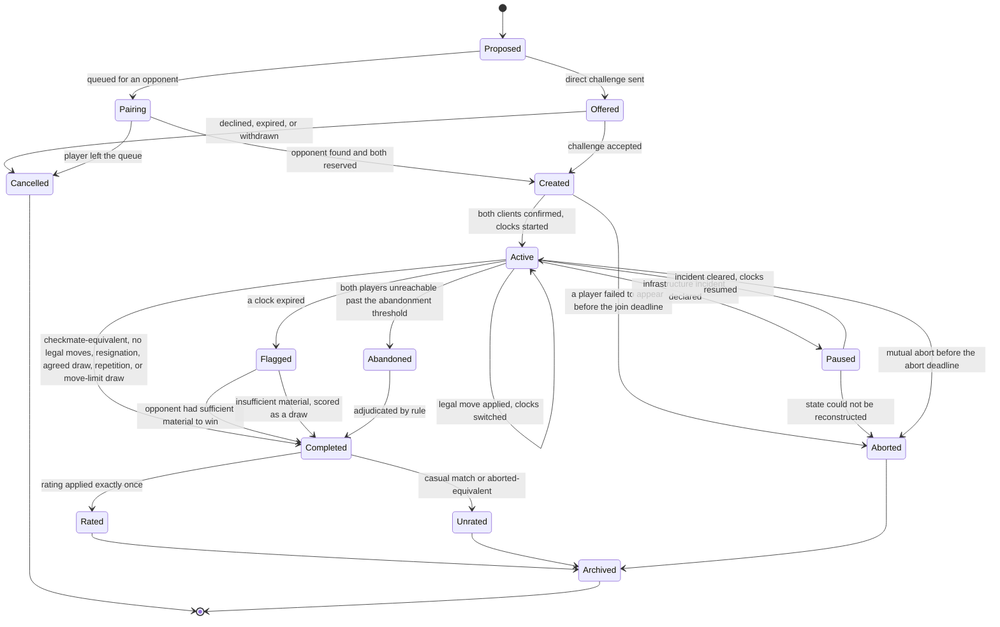
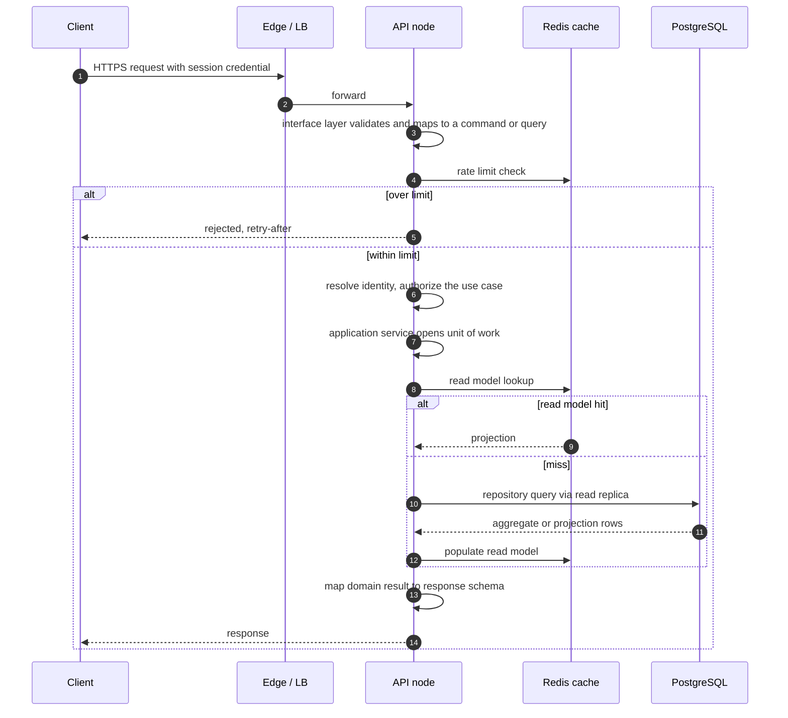
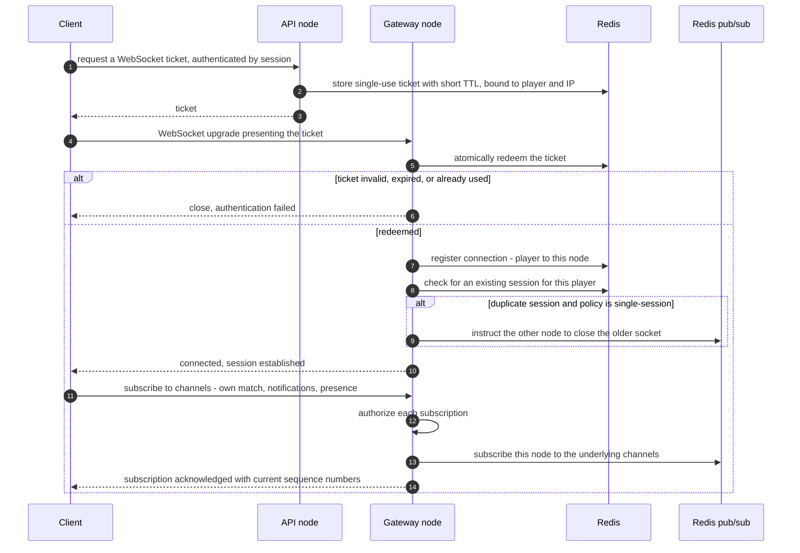
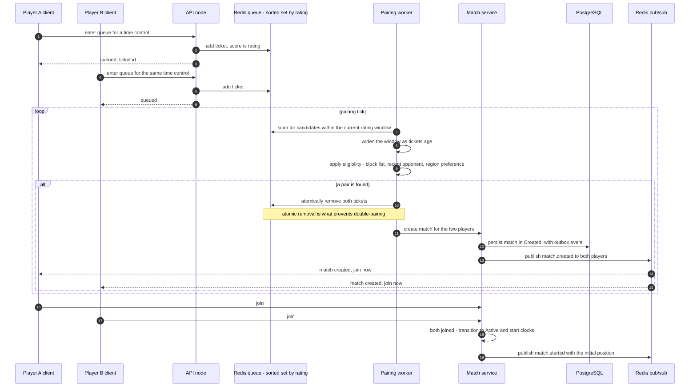
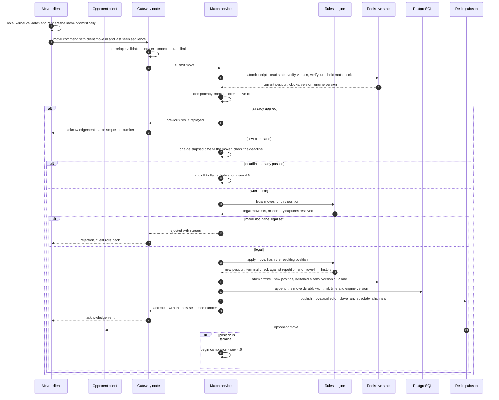
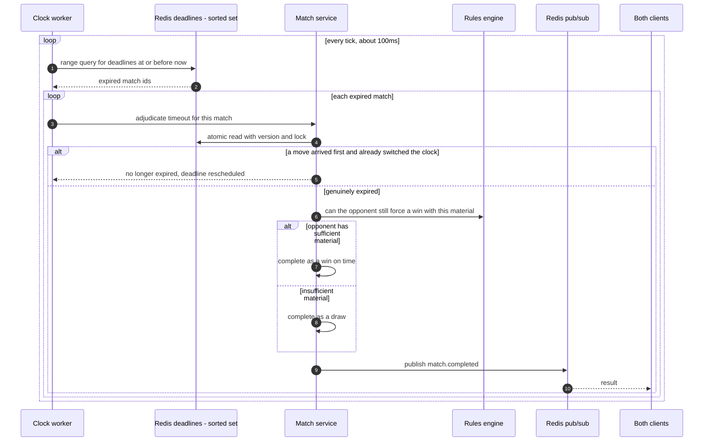
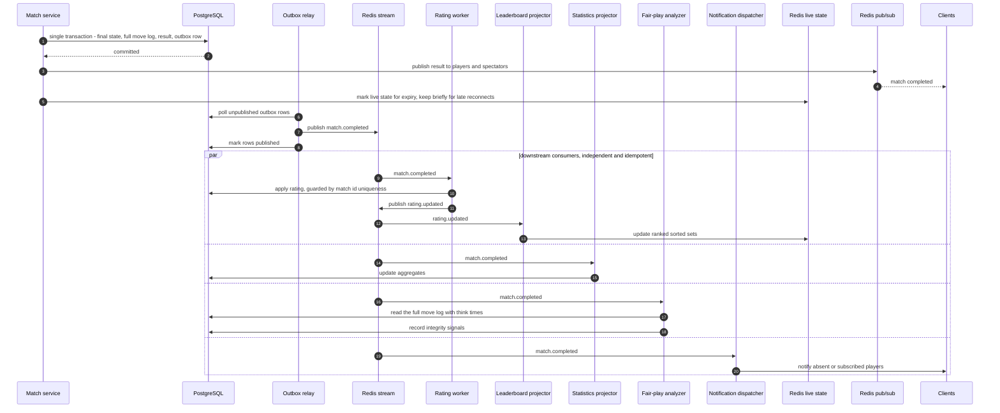
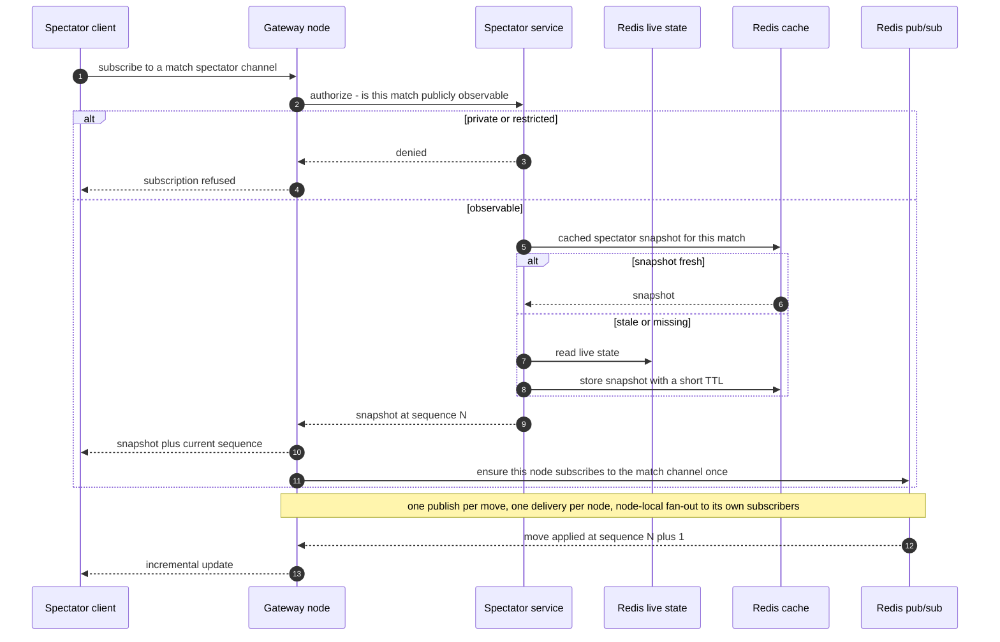
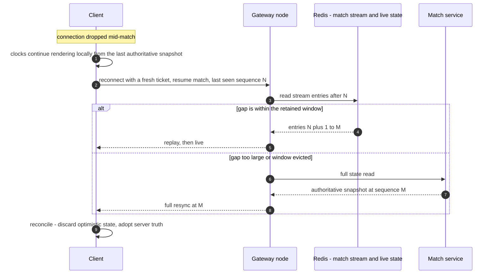
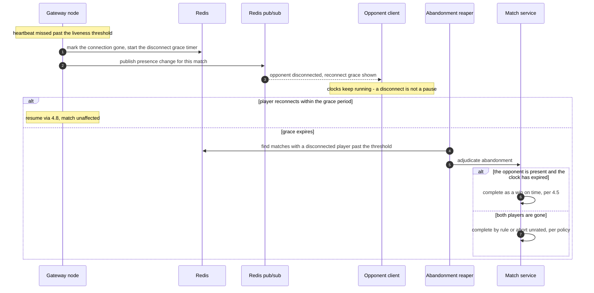

# System Design

> **Status:** Draft — proposed for review
> **Owner:** _Unassigned_
> **Last reviewed:** _Not yet reviewed_
> **Companion document:** [`architecture.md`](./architecture.md) — structure, modules, boundaries, dependency rules

## Purpose

Describes how Arena64 behaves at runtime: the critical paths, the exact sequence of
interactions along each, how concurrency and consistency are managed, what happens when
each component fails, and what capacity the design assumes.

`architecture.md` defines **what exists and what may depend on what**. This document
defines **what happens, in what order, and what breaks**. Decision identifiers of the form
`AD-nn` refer to that document.

## Scope

Sequence-level design of the paths that matter. Protocol wire formats, schema, and endpoint
definitions are out of scope and belong to [`websocket.md`](./websocket.md),
[`database.md`](./database.md), and `docs/03-backend/api.md`.

---

## 1. Design Tenets

Three rules decide most of the arguments in this document.

**T-1 — The move loop is sacred.**
Submitting a move touches exactly: one authorization check, one Redis read, one engine
call, one Redis write, one durable append, and one publish. Nothing else may be added to
that path. Every feature that wants to react to a move reacts to the *event*, off the path.
*Why:* this is the only interaction where latency is directly perceived as product quality,
and it is the interaction that happens most often.

**T-2 — A player must never lose a game to an infrastructure failure.**
Any component failure resolves to one of three outcomes: the game continues, the game is
paused, or the game is **aborted with no rating effect**. Never "the game is lost by the
player whose gateway node happened to restart."

**T-3 — Competitive records are exactly-once; everything else is eventually consistent.**
Ratings and results tolerate zero duplication and zero loss. Leaderboards, statistics,
notifications, and analysis tolerate seconds of lag and are expected to be recomputable.

---

## 2. Critical Paths

| # | Path | Frequency at peak | Latency budget | Failure tolerance |
| --- | --- | --- | --- | --- |
| CP-1 | **Submit a move** | ~5,000 / s | p99 < 25ms server-side | Zero — blocks play |
| CP-2 | **Clock flag adjudication** | ~50 / s | Within 250ms of the true deadline | Zero — a correctness rule |
| CP-3 | **Match state fan-out** | ~12,000 msg / s | p99 < 30ms gateway-internal | Low — visible stutter |
| CP-4 | **Connect and resume** | ~300 / s | p99 < 500ms | Low — visible as "reconnecting" |
| CP-5 | **Matchmaking pairing** | ~60 / s | p95 < 2s from queue entry | Medium — a spinner |
| CP-6 | **Match completion and result persistence** | ~60 / s | < 1s | Zero — permanent record |
| CP-7 | **Rating application** | ~60 / s | p99 < 30s after completion | Medium — eventual |
| CP-8 | **Leaderboard and statistics projection** | ~60 / s | < 60s | High — eventual |
| CP-9 | **Fair-play analysis** | ~60 / s | Minutes to hours | High — fully offline |

CP-1, CP-2, CP-3 and CP-6 are the paths where a regression is a product failure. The rest
degrade visibly but harmlessly. This ranking is what justifies the SLO-based worker
separation of AD-20.

---

## 3. Match Lifecycle

### Why these particular states

- **`Created` is distinct from `Active`.** A match exists before either clock starts. Without
  this state, a player whose client crashes between pairing and load either loses time they
  never had a chance to use, or the opponent waits indefinitely. `Created` has its own short
  join deadline and resolves to `Aborted` with no rating effect.
- **`Paused` exists because of T-2.** It is entered only by operator action or automatic
  incident detection, and it is the mechanism that turns an infrastructure failure into a
  delay rather than a loss. Clocks stop; nobody flags during an outage they did not cause.
- **`Flagged` is separate from `Completed`.** In draughts a flag fall is not automatically a
  loss — if the opponent cannot possibly force a win with the material remaining, the
  correct result is a draw. That adjudication is an engine call, not a clock decision, so it
  deserves its own state rather than being buried inside the clock worker.
- **`Rated` and `Unrated` are terminal-but-distinct.** Rating is applied exactly once
  (T-3); modelling it as an explicit transition gives the idempotency check somewhere to
  live, rather than relying on a nullable column being interpreted consistently everywhere.

---

## 4. Sequence Flows

### 4.1 Authenticated HTTP request

The shape is deliberately unremarkable. **Why it matters:** the HTTP path is *not* where
Arena64 is interesting, and keeping it conventional means all the design attention — and all
the review scrutiny — goes to the realtime paths that actually distinguish the platform.

### 4.2 Connect, authenticate, and subscribe

**Why the ticket is redeemed atomically (AD-09):** without a single atomic redeem, a
captured ticket could be replayed to open a second socket as the victim. Redemption must be
a compare-and-delete, not read-then-delete.

**Why the gateway returns current sequence numbers on subscribe:** it gives the client the
anchor it needs for the gap-detection logic in §4.8 without an extra round trip.

### 4.3 Matchmaking and match creation

**Why pairing is a worker rather than an inline match on request:** inline pairing means two
players entering the queue simultaneously can each match the other in two concurrent
requests, producing two matches for the same pair. Solving that inline requires a lock
around the whole queue, which serialises every queue entry on the platform. A pairing worker
scanning atomically removes both tickets in one operation, so double-pairing is impossible
by construction and queue entry stays lock-free.

**Why the rating window widens with age:** a fixed window either fails to pair players at
the rating extremes — where the population is thinnest and the experience is worst — or it
is set so wide that mid-rating players get mismatched. Widening trades match quality for
wait time only for the players who would otherwise not be paired at all.

**Why clocks start only after both players join, not at creation:** otherwise a player whose
client is still loading the board burns real time, and on a bullet time control that alone
can decide the game.

### 4.4 Submit a move — the hot path

#### Why each step is where it is

- **The client validates first (AD-23).** The piece must move the instant it is dropped. The
  local kernel shares the conformance corpus of AD-14, so a client-accepted move being
  server-rejected indicates a genuine defect, not a normal outcome — which means rejection
  rate is a usable correctness metric, not background noise.
- **Rate limiting sits in the gateway, before the service.** A flood of move commands must
  be discarded at the cheapest possible point. Letting it reach the match service means
  paying for Redis round trips on traffic that is going to be dropped anyway.
- **State read, version check, and lock acquisition are one atomic script.** Read-then-write
  across separate round trips permits a lost update if a move and a timeout adjudication
  race — the exact race described in §5. One atomic operation makes the sequence
  read-validate-write indivisible and halves the round trips on the hottest path (T-1).
- **The clock is charged before legality is checked.** A player who spends their remaining
  time thinking has flagged, whether or not the move they eventually send is legal.
  Reversing the order lets an illegal move buy time.
- **Terminal detection requires history, not just the position.** Repetition and
  move-limit draws are properties of the game, not the board. The repetition history travels
  with the live state in Redis for exactly this reason.
- **The durable append happens after the Redis write, not before.** Redis is authoritative
  for in-flight state (AD-18); the append is the recovery log. Ordering it first would put
  PostgreSQL latency inside the acknowledgement path in violation of T-1.
- **Publishing is fire-and-forget relative to the acknowledgement.** The mover's
  acknowledgement does not wait on fan-out to thousands of spectators. See §6 on the
  guarantee this trades away.

### 4.5 Clock adjudication and the flag race

#### The race, and the rule that resolves it

A move arriving at almost exactly the deadline is not an edge case — in bullet play it is a
routine occurrence, and getting it wrong produces the single most bitterly disputed class of
support ticket on any clocked-game platform.

**The rule:** a move is judged against **the timestamp at which the gateway received the
frame**, not the time at which the match service processed it. If the receive timestamp
precedes the deadline, the move stands and the flag does not fall.

**Why:** the alternative charges the player for the platform's own queueing, garbage
collection, and scheduling delays — the player made their move in time and lost because a
worker was busy. Anchoring to gateway receive time means internal latency can never cost a
player the game, which is a direct application of T-2. The atomic version check in §4.4 is
what makes this safe: whichever of the two writers commits first wins, and the loser
re-reads and finds the situation already resolved rather than overwriting it.

**Why a polling worker rather than per-match timers (AD-21):** an in-process timer dies with
its node and takes the match with it — silently, because nothing remains to notice the timer
is gone. A sorted set of deadlines is owned by no node, and a 100ms tick over a range query
costs one Redis operation regardless of whether there are 200 or 200,000 live matches.

### 4.6 Match completion and event fan-out

#### Why completion is shaped this way

- **One transaction for state, move log, result, and outbox row (AD-16).** These four facts
  are one fact. Splitting them creates a window in which a match is complete but nothing
  will ever rate it, and — because nothing recorded that the event was owed — no retry can
  discover the omission.
- **Players are told the result before the outbox relay runs.** The result is already
  committed; making players wait for rating propagation would add seconds to the most
  emotionally charged moment in the product for no correctness benefit.
- **Rating is guarded by uniqueness on match id, not by the worker being careful.**
  At-least-once delivery means the rating worker *will* see duplicates. Idempotency enforced
  at the database, rather than by application logic, is the difference between "we handle
  redelivery" and "we handle redelivery in every code path someone remembered to guard."
- **Leaderboard is downstream of rating, never of match completion.** A leaderboard built
  directly from match results would have to duplicate the rating algorithm, and the two
  copies would eventually disagree. This is dependency rule R-4 in its runtime form.
- **Live state is expired rather than deleted immediately.** A player who disconnects on the
  final move must be able to reconnect and see how the game ended, not receive a
  "match not found."

### 4.7 Spectator join and fan-out

#### Why spectating is designed separately

- **Snapshots are cached, not read per spectator.** A match that suddenly attracts 5,000
  spectators would otherwise generate 5,000 reads of live state in a few seconds — against
  the same Redis instance serving the move hot path. A short-TTL snapshot collapses that
  into one read. This is the concrete reason for the Redis role separation of AD-03.
- **Fan-out is one publish per node, not per spectator.** The bus delivers once to each
  gateway node holding subscribers; the node distributes locally. Fan-out cost therefore
  scales with the number of *nodes*, not the number of *spectators* — the difference between
  the bus surviving a viral match and melting during one.
- **Spectators receive increments, not full state.** A full position on every move to 5,000
  spectators is roughly a hundredfold more bandwidth than sending the move.
- **The delay tier is a policy knob on this channel (AD-10).** Because spectators are already
  on a separate channel with their own snapshot pipeline, adding a broadcast delay for
  high-rated games is a configuration change rather than a redesign — and it removes
  real-time engine coaching as an attack.

### 4.8 Reconnection and gap replay

**Why replay is preferred to resync (AD-12):** mobile clients disconnect constantly, often
for two or three seconds. A full resync on every blip is wasteful in aggregate and slow at
precisely the moment the player is anxious. Replay from a bounded stream covers the
overwhelming majority of drops in a few hundred bytes.

**Why the client keeps rendering clocks while disconnected:** freezing the clock display
implies the clock itself is frozen, which it is not — the player would return believing they
had time they did not have. Local rendering from the last authoritative snapshot keeps the
display honest, and the server's snapshot on resume corrects any drift.

**Why full resync remains as a fallback:** the stream window is bounded to keep memory
predictable. A player who disconnects for ten minutes must still be able to return, so
correctness cannot depend on the window being large enough.

### 4.9 Disconnection and abandonment

**Why a disconnect does not pause the clock:** if it did, deliberately disconnecting would
be the strongest defensive resource in the game — free thinking time on demand, and an
unfixable exploit in any timed format. The clock is the contract; the network is the
player's own responsibility. This is the one place where T-2 does *not* apply, and the
distinction is precise: an **infrastructure** failure is the platform's fault and pauses the
match (`Paused`), whereas a **client-side** network failure is not and does not.

---

## 5. Concurrency Control

A match is a single-writer aggregate in practice, but three writers can genuinely contend:
the mover, the clock worker, and an administrative adjudication.

| Mechanism | Applied to | Why |
| --- | --- | --- |
| **Monotonic version on live state, checked and incremented atomically** | Every match mutation | Makes read-validate-write indivisible. The loser of a race observes the new version and re-evaluates instead of overwriting |
| **Short-lived per-match lock inside the same atomic operation** | Move, flag, adjudication | Prevents two writers doing redundant engine work; the version check is the correctness guarantee, the lock is the efficiency one |
| **Turn ownership as a domain invariant** | Player moves | The opponent cannot move out of turn, so the common case has no contention at all |
| **Gateway receive timestamp as the temporal authority** | Move versus flag | Internal queueing delay must never cost a player the game (§4.5) |
| **Atomic removal of both queue tickets** | Pairing | Double-pairing becomes structurally impossible rather than merely unlikely (§4.3) |
| **Client-supplied move id** | Move submission | A retried command after a network blip must not apply the move twice |

### Why optimistic versioning rather than a pessimistic lock held across the operation

Holding a lock across engine evaluation and persistence would mean a worker that stalls
blocks the match until its lease expires — a visible freeze in the middle of a game. With
optimistic versioning the stalled writer simply loses the race and discards its work, and
the match never waits on anything but a single atomic Redis operation. Contention is rare
by construction because turn ownership already serialises the common path, so the optimistic
strategy's weakness — cost under high contention — does not apply here.

---

## 6. Consistency Model

| Data | Guarantee | Bounded staleness | Why this level |
| --- | --- | --- | --- |
| Live match position | **Strongly consistent, single-writer** | None | Two players must never see different boards |
| Move log | **Durable, ordered, gap-free** | None once acknowledged | The permanent record and the replay source for recovery |
| Match result | **Exactly-once, transactional** | None | Permanent and disputable |
| Rating | **Exactly-once, eventually visible** | p99 < 30s | Correctness is absolute, visibility is not |
| Leaderboard | Eventually consistent | < 60s | Nobody is harmed by a rank being a minute old |
| Statistics | Eventually consistent | < 5 min | Aggregates by nature |
| Presence | Best-effort, TTL-decayed | Seconds | A stale "online" indicator is a cosmetic defect |
| Quick messages | **Best-effort, at most once** | Seconds | Ephemeral courtesies. Losing one is acceptable; correct game state never depends on delivery ([ADR-004](../07-decisions/ADR-004-quick-messages-not-free-text-chat.md)) |
| Spectator view | Eventually consistent, monotonic | < 2s, optionally delayed by policy | Must never go backwards; may lag deliberately |
| Fair-play signals | Eventually consistent | Hours | Deliberately offline |

### Guarantees explicitly not made

- **The mover's acknowledgement does not guarantee the opponent has received the move.**
  Blocking on fan-out would couple the mover's latency to the slowest subscriber, including
  spectators. Delivery is guaranteed by sequencing and replay (§4.8) rather than by
  synchronous confirmation.
- **Spectators may lag players, and this is intentional.** Monotonic ordering is guaranteed;
  real-time parity is not, and for high-profile games it is actively undesirable (AD-10).
- **Read-your-writes holds only within a match.** A player who wins and immediately opens
  the leaderboard may not see their new rank yet. The result page reads through the match
  aggregate, so the *result* is always immediate; only the derived views lag.

---

## 7. Idempotency and Exactly-Once Semantics

At-least-once event delivery (AD-16) makes idempotency a hard requirement, not a virtue.

| Boundary | Key | Enforced by |
| --- | --- | --- |
| Move submission | Client move id, unique per match | Live-state check plus rejection on replay |
| Rating application | Match id | Database uniqueness — not application logic |
| Statistics aggregation | Event id in a processed-events ledger | Consumer ledger |
| Leaderboard projection | Naturally idempotent — a set operation to an absolute value | Structure, not bookkeeping |
| Notification dispatch | Event id plus recipient | Dispatcher ledger with a de-duplication window |
| Outbox publication | Outbox row id | Row marked published after acknowledgement |
| Queue entry | Player id — one live ticket per player | Set semantics of the queue |

**Why uniqueness is pushed to the database wherever the data is competitive:** an
application-level guard protects only the code paths someone remembered to guard. A
constraint protects every path, including the manual repair script an on-call engineer
writes at 3am during an incident — which is precisely when double-rating is most likely to
happen.

**Where projections are rebuildable, they are preferred over ledgers.** Leaderboards and
statistics can be recomputed from PostgreSQL, so a projection bug is a rebuild rather than
an unrecoverable corruption. This is the practical reason Redis holds them (AD-19) and
PostgreSQL holds their inputs.

---

## 8. Failure Modes and Degradation

Every row is an application of T-2: no failure below causes a player to lose a game.

| Failure | Immediate effect | Designed response | Player experience |
| --- | --- | --- | --- |
| **Gateway node crashes** | Its connections drop | Clients reconnect to another node, resume via §4.8; match state was never in the node | Brief "reconnecting", game continues |
| **API node crashes** | In-flight HTTP requests fail | Stateless — LB removes it, clients retry | A retried request |
| **Redis live-state primary fails** | In-flight positions unavailable | Failover to replica; matches that cannot be reconstructed from the move log are **aborted unrated**; affected matches enter `Paused` first | Some games pause, a few abort with no rating change |
| **Redis pub/sub fails** | Fan-out stops | Moves still apply and persist; clients poll state as a degraded fallback and resync on recovery | Board updates lag, then catch up |
| **Redis queues or streams fail** | Matchmaking and event delivery stall | Live matches unaffected; outbox retains events for replay on recovery | Cannot start new games, current games fine |
| **PostgreSQL primary fails** | Durable appends and completions fail | New matches refused, live matches enter `Paused` rather than continuing unrecorded | Games pause; nothing is lost |
| **Read replica lag spikes** | Stale profiles and leaderboards | Route affected reads to the primary or serve cached values with a staleness indicator | Slightly stale numbers |
| **Clock worker stops** | Nothing flags | High-severity alert; deadlines remain in Redis and are adjudicated on recovery using the true deadline, not the recovery time | Late results, correct results |
| **Outbox relay stops** | No ratings, stats, or notifications | Events accumulate durably and drain on recovery | Ratings appear late |
| **Rating worker stops** | Ratings not applied | Backlog drains; uniqueness prevents double-application on catch-up | Ratings appear late |
| **Fair-play analyzer backlogs** | Analysis delayed | Isolated queue (AD-20) — cannot affect anything else | No visible effect |
| **Notification provider down** | Push undelivered | Retry with backoff, then drop past a staleness horizon | Missing push, in-app intact |
| **Spectator surge on one match** | Fan-out pressure | Snapshot caching plus per-node fan-out (§4.7); spectator admission is shed before player traffic is touched | Spectators queue, players unaffected |
| **Engine defect discovered** | Some matches played under bad rules | Version stamping (AD-15) enumerates exactly which matches are affected | Targeted correction rather than blanket doubt |

### The load-shedding order

When capacity is exhausted, degradation follows a fixed priority — highest is preserved
longest:

1. **Moves and clocks in live matches** — never shed
2. **Match completion and result persistence** — never shed
3. **Reconnection and resume** — never shed
4. Quick messages in live matches
5. New match creation and matchmaking
6. Spectator admission
7. Leaderboard, statistics, and profile reads
8. Fair-play analysis

**Why in this order:** a player already in a game has an unfinishable obligation; a player
browsing a leaderboard does not. Refusing to start new games while protecting games in
progress is the only shedding strategy that never abandons a commitment the platform has
already made.

---

## 9. Observability Hooks

Instrumentation targets the paths of §2, because instrumenting everything equally means
noticing nothing.

### Metrics that define health

| Metric | Why it is the right signal |
| --- | --- |
| Move acknowledgement latency, p50/p95/p99, by tier | The single best proxy for perceived quality (CP-1) |
| **Server-rejected move rate** | Should be near zero given the shared corpus (AD-14). A rise means client and server rules have diverged — a correctness alarm, not a usage statistic |
| Clock adjudication error — actual versus intended flag time | Directly measures the CP-2 correctness guarantee |
| Fan-out delivery lag, publish to client, p99 | Measures CP-3 without depending on client reports |
| Live matches, concurrent connections, connections per node | Capacity planning inputs and the trigger for §10 scaling |
| Queue wait time by rating band and time control | Exposes the extremes where matchmaking is worst (§4.3) |
| **Outbox depth and age of the oldest unpublished row** | The earliest warning that the entire asynchronous half of the platform has stalled |
| Consumer lag per event stream | Isolates which projection is behind |
| Rating application delay, completion to applied | Direct SLO measurement for CP-7 |
| Redis operations per second and memory, **per role instance** | Role separation (AD-03) is only useful if measured per role |
| Reconnection rate and replay-versus-resync ratio | A rising resync ratio means the stream window is undersized |
| Matches aborted for infrastructure reasons | The direct measure of T-2 compliance — the number that should always be zero |

### Tracing

One trace spans the full move path: gateway receipt → service → engine → Redis → durable
append → publish. **Why the gateway must start the trace:** the queueing delay between frame
arrival and processing is the component most likely to breach the latency budget and the
component least visible from inside the application. A trace that starts at the service
measures everything except the part that is usually wrong.

Event traces propagate through the outbox, so a rating update is traceable back to the move
that ended the match — essential for investigating a disputed result.

### Structured log context

Every log on a gameplay path carries: match id, player id, sequence number, engine version,
and the correlation id. **Why engine version:** when a result is disputed, the first question
is which rules governed that game, and finding out must not require a database lookup during
an incident.

### Proposed SLOs

| Path | Objective |
| --- | --- |
| Move acknowledgement | p99 < 25ms server-side, 99.9% of the time |
| Clock adjudication accuracy | Within 250ms of the true deadline, 99.99% |
| Fan-out delivery | p99 < 30ms gateway-internal |
| Connect and resume | p99 < 500ms |
| Rating application | p99 < 30s after completion |
| **Completed-match durability** | 100% — zero tolerance |
| Matches aborted for infrastructure reasons | < 0.01% of matches |

---

## 10. Capacity Assumptions

Derived from assumption A-3 in `architecture.md §1`. **These are estimates for sizing, not
measurements**, and must be replaced by load-test results before launch.

### Peak load model

| Quantity | Assumed peak | Derivation |
| --- | --- | --- |
| Registered players | 500,000 | A-3 |
| Concurrent connections | 50,000 | ~40k players in matches plus lobby and spectators |
| Concurrent live matches | 20,000 | Two players per match |
| Moves per second | ~5,000 | 20k matches, roughly one move per match per 4s across the time-control mix |
| Matches completed per second | ~60 | 20k matches at a mean duration of ~5 minutes |
| Outbound realtime messages per second | ~12,000 | Two players plus mean spectators per move |
| Peak spectators on a single match | 5,000+ | Long-tailed and unpredictable — the spike case §4.7 exists for |

### What that implies per component

| Component | Implication | Headroom judgement |
| --- | --- | --- |
| **Gateway** | ~40k connections per tuned node → 2 nodes minimum, run 4+ for failure and deploy headroom | Connection count, not throughput, is the binding constraint |
| **Rules engine CPU** | ~5,000 evaluations/s; a checkers move generator is well under 100µs per call | Well within a small number of cores, but must not run on the event loop thread |
| **Redis live state** | ~10,000 ops/s and roughly 4KB per live match, about 80MB at 20k matches | A single instance is an order of magnitude away from its limit; memory is not the constraint |
| **Redis pub/sub** | ~5,000 publishes/s, amplified per subscribing node not per subscriber | The spectator spike is the risk, not steady state |
| **PostgreSQL writes** | ~5,000 small appends/s, batched to ~50 transactions/s, plus ~60 completion transactions/s | Comfortable for a single primary; the move log is the growth concern, not the write rate |
| **PostgreSQL growth** | ~5,000 moves/s at peak, tens of millions of rows per day of activity | Time partitioning and archival are required from the start, not deferred (`architecture.md §16`, axis 4) |
| **Read replicas** | Profile, leaderboard, statistics, history | Two initially; scaled by read latency, not by write load |

### Where the design breaks first, and what to do

| Order | First constraint reached | Response |
| --- | --- | --- |
| 1 | Gateway connection count | Add nodes — pre-planned, linear |
| 2 | Spectator fan-out on a viral match | Dedicated spectator gateway pool and delayed tier |
| 3 | PostgreSQL move-log size | Time partitioning and cold archival |
| 4 | Redis live-state throughput | Shard by match id — no operation spans two matches |
| 5 | PostgreSQL write throughput | Extract match history behind its existing port (AD-06) |

### AD-26 — The capacity model is a hypothesis, and load testing is a launch gate

**Why this is stated as a decision rather than a caveat:** every number above is arithmetic
over an assumption, and the assumption (A-3) comes from an unwritten vision document. The
useful property of the model is not its accuracy but that it identifies *which* constraint
binds first, so load testing can target the move hot path and spectator fan-out instead of
uniformly testing everything. A load test that does not attempt a 5,000-spectator match has
not tested the thing most likely to fail.

---

## 11. Related Documents

| Document | Relationship |
| --- | --- |
| [`architecture.md`](./architecture.md) | Structure, modules, layers, dependency rules, AD-01 to AD-25 |
| [`websocket.md`](./websocket.md) | Protocol detail behind §4.2, §4.8 — *placeholder* |
| [`events.md`](./events.md) | Event catalogue and envelope behind §4.6, §7 — *placeholder* |
| [`caching.md`](./caching.md) | Redis policy behind §6, §8 — *placeholder* |
| [`database.md`](./database.md) | Partitioning and durability behind §8, §10 — *placeholder* |
| [`security.md`](./security.md) | Threat model behind §4.2, §4.7 — *placeholder* |
| `specs/game-engine.md`, `specs/matchmaking.md`, `specs/spectator.md` | Behaviour these flows realise — *placeholders* |

## TODO

- [ ] Replace §10 with measured load-test results before launch (AD-26)
- [ ] Ratify the flag-race rule in §4.5 as product policy — it is user-visible and disputable
- [ ] Define the abandonment and disconnect grace thresholds in §4.9 per time control
- [ ] Fix the retained stream window in §4.8 against the measured reconnection distribution
- [ ] Specify `Paused` entry and exit criteria as an operational runbook
- [ ] Promote AD-26 to an ADR alongside AD-01 to AD-25
- [ ] Assign a document owner and move status from Draft to Approved
