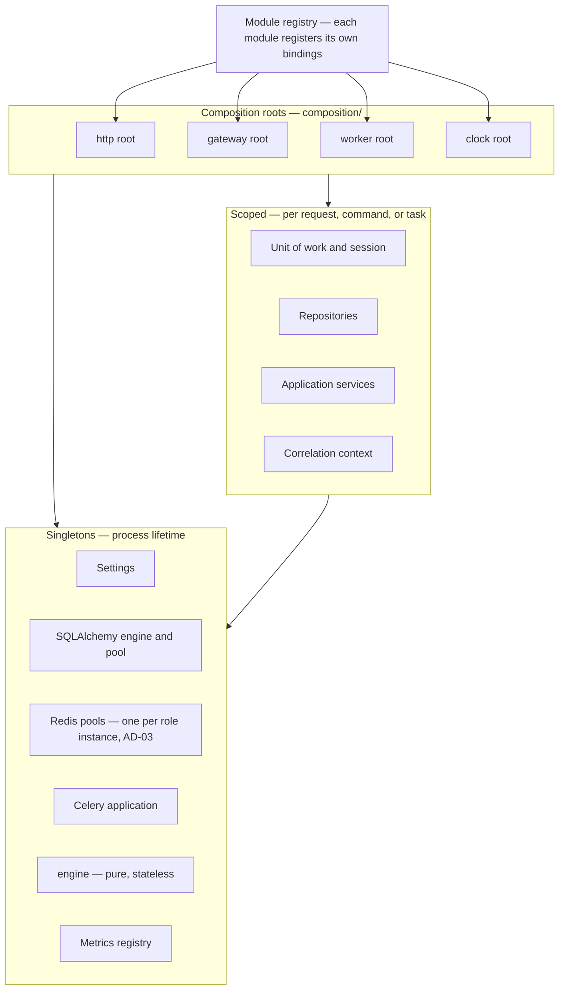
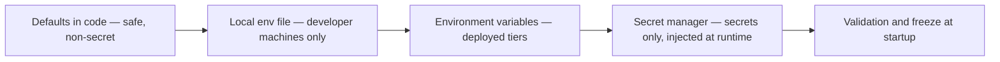
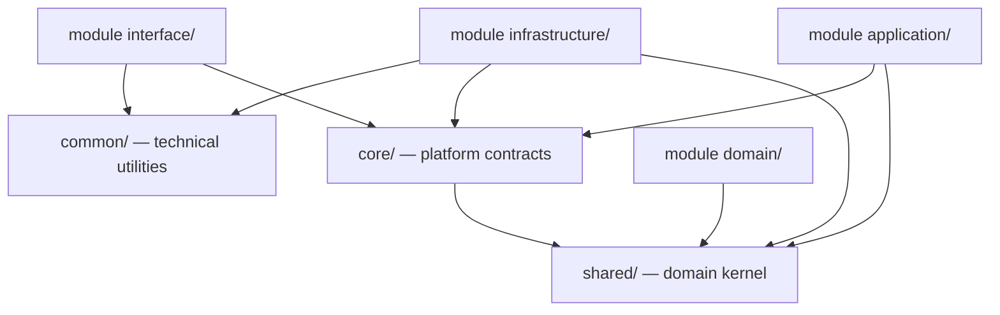
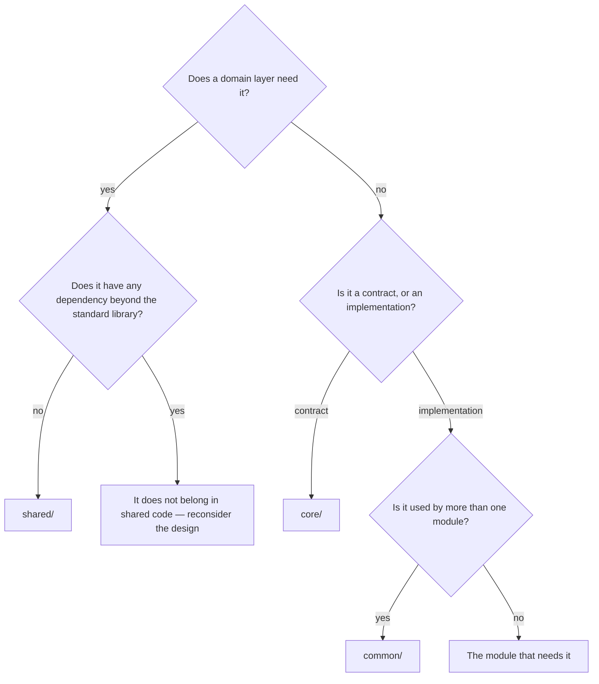

# Dependency Injection, Configuration, and Shared Packages

> **Status:** Draft — proposed for review
> **Owner:** _Unassigned_
> **Last reviewed:** _Not yet reviewed_
> **Companions:** [`services.md`](./services.md) · [`repositories.md`](./repositories.md)
> **Upstream:** [`../01-architecture/architecture.md`](../01-architecture/architecture.md) §8

## Purpose

Defines how Arena64's backend is wired: how dependencies are declared, scoped and resolved
across four entrypoints; how configuration reaches a module; and what belongs in each of the
three shared packages.

## Scope

Composition, lifetimes, registration, configuration, secrets, feature flags, and the
`shared` / `core` / `common` split. Service behaviour is in [`services.md`](./services.md);
repository contracts are in [`repositories.md`](./repositories.md). No code.

Decisions here are tagged `DI-nn`.

---

## 1. Dependency Injection

### 1.1 The composition root

A **composition root** is the one place where abstractions are bound to implementations.
Arena64 has four — one per runtime profile — sharing a single module registry.

**Why four roots rather than one:** the profiles need different adapters and different scope
policies. The HTTP root opens a scope per request; the gateway opens one per inbound command;
the worker opens one per task; the clock loop opens one per adjudication, not per tick. One
root with a single scope policy would force three of the four into the wrong shape — and the
gateway into the catastrophic one (§1.4).

**Why one shared registry:** a module's bindings are a property of the module, not of the
process running it. `game.SubmitMove` is resolved identically whether the caller is the
gateway, the HTTP tier, the clock loop, or an admin action — which is precisely the property
`architecture.md §9` depends on.

### DI-01 — FastAPI `Depends` bridges into the container; it does not *be* the container

Application wiring lives in an explicit container. FastAPI's dependency system is used only at
the routing layer, to open a scope and hand the route its already-resolved service.

**Why — this is the single most consequential decision in this document:** `Depends` only
exists inside an HTTP request. Arena64 has four callers of the same use cases, and three of
them have no request. Wiring the application through `Depends` would mean the Celery worker,
the WebSocket gateway, and the clock loop each construct services by hand — three parallel,
divergent, untested wiring paths for the same objects, guaranteed to drift the first time a
service gains a dependency. It would also make application-layer tests require an HTTP client
to obtain a service, which is absurd for a use case that has nothing to do with HTTP.

The bridge stays thin deliberately: a route's dependency opens the scope, resolves the service
by its port, and passes it in. Nothing about the use case is expressed in FastAPI vocabulary.

*The specific container library is pending an ADR. The requirements are: explicit registration,
scope support, async resolution, and override at the root for tests.*

### 1.2 Provider kinds

| Kind | Meaning | Example in Arena64 |
| --- | --- | --- |
| **Singleton** | One instance per process | Settings, SQLAlchemy engine, Redis pools, Celery app, `engine`, metrics registry, module registry |
| **Scoped** | One instance per request, command, task, or adjudication | Unit of work, session, repositories, application services, correlation context |
| **Transient** | A new instance per resolution | Rare — value factories, identifier generators |
| **Lazy resource** | A singleton whose connection is established on first use and closed at shutdown | Connection pools |

### 1.3 Lifetimes

| Component | Lifetime | Why |
| --- | --- | --- |
| `Settings` | Singleton | Immutable after startup (§2.4). Re-reading per request would make configuration a moving target mid-flight |
| SQLAlchemy engine and pool | Singleton | The pool *is* the shared resource. A per-request engine would open a connection per request and defeat pooling entirely |
| Redis pools (one per role, AD-03) | Singleton | Same, and role separation is only meaningful if each role's pool is sized independently |
| Celery application | Singleton | Holds broker connections and the task registry |
| `engine` — rules kernel | **Singleton** | Pure and stateless (AD-13), so per-resolution construction is pure waste on a 5,000-per-second path |
| Metrics registry | Singleton | Metric identity must be stable across the process |
| Unit of work and session | **Scoped** | A session is stateful and not concurrency-safe; sharing one across requests corrupts transactions |
| Repositories | Scoped | They hold the scope's session ([`repositories.md §5`](./repositories.md)) |
| Application services | Scoped | They own a transaction boundary, which is inherently per-use-case |
| Correlation context | Scoped | Per interaction by definition (`services.md §8.2`) |
| Clock port | Singleton | Stateless; the injected clock of AD-07 |

**Never singleton:** anything holding a session, a transaction, per-player state, or
request-scoped identity. A singleton service holding a session is the classic production-only
bug — it works under a single-threaded test and corrupts data under concurrency.

### 1.4 Scope per entrypoint

| Entrypoint | Scope opened per | Contains |
| --- | --- | --- |
| HTTP | Request | Session, repositories, services, correlation context |
| **Gateway** | **Inbound command** | Same — see DI-02 |
| Celery worker | Task | Same, plus correlation restored from message headers |
| Clock loop | Adjudication | Only what adjudication needs; a tick finding nothing expired opens no scope |

### DI-02 — The gateway scope is per command, never per connection

**Why:** a WebSocket connection lives for the length of a game — often an hour. A scope held
for the connection's lifetime would hold a database session for an hour, which means one
pooled connection per connected player. At the target of 40,000 concurrent player connections
(`system-design.md §10`) that exceeds any realistic pool by two orders of magnitude, and the
platform would deadlock on connection acquisition at a few hundred concurrent games — long
before any load test that only measured request throughput would notice.

Per-command scoping also matches the truth of the design: the connection is transport state
(held in Redis, AD-18), while the *use case* is a single move. Most inbound commands never
touch PostgreSQL at all, because the live match is in Redis.

### DI-03 — Celery tasks drive the same async services through a per-process event loop

Celery's worker model is synchronous; FastAPI and the gateway are async; the application
services and repositories are async throughout. Celery tasks are therefore thin adapters that
drive the same async use cases on a persistent event loop owned by the worker process.

**Why not two implementations:** the alternative — a sync repository adapter set alongside the
async one — doubles every adapter, doubles the contract test matrix ([`repositories.md §9`](./repositories.md)),
and creates two places where a query can diverge. The rating worker and the HTTP tier would be
running *different code* against the same tables, which is exactly the drift that produces
"works on the API, broken in the worker" defects.

**Why a per-process loop rather than per task:** creating and tearing down an event loop per
task would rebuild connection pools constantly, which is most of the cost the pools exist to
avoid.

**The cost, stated plainly:** this is a real piece of bootstrap machinery in
`entrypoints/worker/`, and it must be written carefully once — loop ownership, pool affinity,
and shutdown draining are easy to get subtly wrong. It is a contained, testable cost paid once,
against a permanent duplication tax on every adapter. **Revisit if** Celery's execution model
changes materially, or if a measured overhead in the bridge becomes significant relative to
task duration.

### DI-04 — Modules register their own bindings; the root never enumerates them

Each module exposes a registration hook. The composition root iterates the module registry and
invokes each.

**Why:** the alternative is a central wiring file listing every service in the platform. That
file becomes a merge-conflict magnet across every team, and — worse — a hidden coupling point:
adding a module would require editing shared code, which directly contradicts the extensibility
property of `services.md §11`. Self-registration means adding `achievements` touches
`achievements` and nothing else.

The root retains one responsibility the modules cannot have: choosing the **profile** — which
adapter set (production, test, in-memory) is active. That is a process-level decision, not a
module-level one.

### 1.5 Repository registration

Repository ports are bound per storage technology, and the binding is selected by profile.

| Profile | `MatchRepository` binds to | Used by |
| --- | --- | --- |
| `production` | SQLAlchemy adapter | Deployed environments |
| `integration` | SQLAlchemy adapter against a real test database | `tests/integration/`, `tests/contract/` |
| `unit` | In-memory fake | `tests/unit/` |

**Why profile-selected bindings rather than patching in tests:** monkeypatching reaches into a
module's internals from the outside, which is precisely what BR-1 forbids of production code
and should equally be forbidden of tests. A test that patches an import is coupled to the file
layout, so a refactor that moves a class breaks tests that never referenced the behaviour.
Profile selection at the root uses the same mechanism production uses — so if the wiring is
wrong, the tests fail for the right reason.

This is also what makes RP-05's fakes usable: application tests request the port and receive
the fake, with no knowledge that a choice was made.

### 1.6 Configuration injection

Configuration reaches a module as a **typed settings object injected as a dependency**. A
module never reads the environment.

**Why:** an environment read inside a module makes the platform's configuration surface
undiscoverable — the only way to learn what Arena64 needs to boot is to grep for environment
access across a hundred thousand lines. It also makes a module untestable under a different
configuration without mutating global process state, which leaks between tests and produces
order-dependent failures. A typed object injected at the root means each module's configuration
is enumerable from its own declaration (§2.1) and overridable per test with no globals.

### 1.7 Anti-patterns

| Anti-pattern | What it causes |
| --- | --- |
| Service locator — a module importing the container | Dependencies become invisible; BR-6 forbids it |
| Global session or global engine module attribute | Concurrency corruption, and untestable in isolation |
| Constructing an adapter inside a service | Hides the dependency and makes the service untestable without real infrastructure |
| `Depends` appearing in `application/` or `domain/` | Couples the use case to HTTP; DI-01 |
| Singleton service that holds a session | Works in tests, corrupts data in production |
| Reading settings at import time | Module import order becomes configuration-sensitive; failures move to collection time and become opaque |
| Overriding by monkeypatch instead of by profile | §1.5 |

---

## 2. Configuration

### 2.1 Settings model

Pydantic v2 settings, composed hierarchically, with **one prefixed section per module**.

| Section | Owns |
| --- | --- |
| `app` | Environment name, service profile, log level and format, release version |
| `postgres` | DSN, pool sizing, statement timeout, replica DSNs |
| `redis.live`, `redis.bus`, `redis.broker`, `redis.cache` | One section per role instance (AD-03) |
| `celery` | Broker URL, queue routing, prefetch, retry defaults |
| `gateway` | Connection limits, heartbeat interval, ticket TTL, replay window size |
| `game` | Time-control catalogue, abandonment thresholds, clock tick interval |
| `matchmaking` | Rating window start and widening policy, queue TTL |
| `<module>` | That module's own settings |

**Why per-module prefixes:** a module's configuration surface should be enumerable from its
name. It also removes an entire class of collision — five modules each wanting a `TIMEOUT` is
inevitable, and a flat namespace resolves it by whoever loaded last.

**Why one section per Redis role rather than one Redis section:** AD-03 separates Redis by role
precisely so a pub/sub flood cannot evict live match state. If all four shared one connection
string, the separation would exist on paper and collapse the first time someone deployed a
single instance because the config permitted it.

### 2.2 Layering and precedence

Later layers override earlier ones. Secrets are never sourced from the first two layers.

**Why environment variables for deployed tiers:** they keep configuration out of the image, so
the same artefact is promoted unchanged from staging to production — which is what makes a
staging test meaningful evidence about production.

### 2.3 Environments

| Environment | Distinguishing behaviour |
| --- | --- |
| `local` | Human-readable logs, permissive rate limits, seeded data, all four Redis roles may share one instance |
| `test` | In-memory fakes for repositories, deterministic injected clock, **no real infrastructure** |
| `ci` | Real PostgreSQL, Redis and broker in containers; contract and integration suites |
| `staging` | Production topology at reduced scale; production log format; real secrets from the secret manager |
| `production` | Full topology, role-separated Redis, strict limits |

### DI-05 — Celery eager mode is permitted in unit tests and forbidden in event-consumer tests

**Why:** eager mode executes a task inline at dispatch, which is convenient and quietly
falsifies the two properties that matter most about Arena64's asynchronous half. It makes
delivery look exactly-once, when it is at-least-once (AD-16) — so a consumer missing its
idempotency guard passes every test and double-rates matches in production. And it makes
dispatch look transactional, hiding the ordering that BE-10 depends on. Any test asserting
consumer behaviour under redelivery, retry, or ordering runs against a real broker in `ci`.

### DI-06 — Settings are validated at startup and immutable thereafter

A missing or malformed required setting aborts the process before it accepts traffic.

**Why:** the alternative is discovering a missing Redis password on the ten-thousandth
connection, hours after deploy, on a node already holding live matches. A gateway that refuses
to start is a deploy failure — visible, automatic to roll back, and harmful to nobody. A
gateway that starts and fails later is an outage that takes games with it. Immutability after
startup follows for the same reason: a setting that changes mid-process means two requests in
the same second can be governed by different configuration, and no log will explain why.

### 2.4 Secrets

| Rule | Detail |
| --- | --- |
| Never in the repository, the image, or a settings dump | Includes debug endpoints and error pages |
| Never logged | `services.md §8.5` |
| Injected at runtime from the secret manager | Not baked at build time |
| Typed as secret values that do not render in reprs | Prevents accidental exposure through an exception's repr — the most common leak path |
| Rotatable without downtime | See below |

**The WebSocket ticket signing key must support two active keys.** Tickets are short-lived
(AD-09) but non-zero-lived. Single-key rotation would invalidate every in-flight ticket at the
instant of rotation, so every player mid-connect would fail — turning a routine security
operation into a visible incident. Accepting both the outgoing and incoming key for one ticket
lifetime makes rotation invisible.

Current secret inventory: database credentials, Redis credentials, ticket signing key, session
signing key, push and email provider credentials.

### 2.5 Feature flags

Three kinds, with different lifecycles and different storage.

| Kind | Lifetime | Stored | Example |
| --- | --- | --- | --- |
| **Release flag** | Short — deleted after rollout | Configuration | Enable a new matchmaking implementation |
| **Operational flag / kill switch** | Permanent | **Redis, short-TTL cached** | Shed spectator admission, pause new matches, disable fair-play analysis |
| **Experiment flag** | Medium | Configuration or Redis | Rating-window widening policy, K-factor variants |

**Why operational flags live in Redis rather than configuration:** they must take effect in
seconds during an incident, without a deploy. Their entire purpose is to execute the
load-shedding order in `system-design.md §8` — refusing spectator admission while protecting
games in progress — and a shedding control that requires a deploy is not a control.

**Why release flags live in configuration instead:** they change on a deploy cadence anyway, and
putting them in a runtime store adds an availability dependency for something that gains
nothing from it.

### DI-07 — Flag evaluation fails open for gameplay and closed for privilege

If the flag store is unreachable, gameplay flags resolve to their permissive default and
privileged flags resolve to their restrictive default.

**Why the asymmetry:** a Redis blip must not stop people playing checkers — that would convert
a minor dependency failure into a total outage, violating tenet T-2. But an administrative or
moderation capability must never switch itself on because a lookup failed; the safe direction
for privilege is always off. The two defaults point in opposite directions because the cost of
being wrong points in opposite directions.

### DI-08 — No feature flag may gate the rules of checkers

Nothing in `engine` is flag-controlled. Rules change only by an engine version bump (AD-15).

**Why:** a flag that alters move legality means two matches played on the same day were
governed by different rules, with no record of which. AD-15's version stamp exists precisely so
a disputed game can be replayed under the semantics it was played under — and a flag defeats it
completely, because flag state at the moment of a move is not recorded anywhere and is not
reconstructible afterwards. Rules changes are versioned, enumerable, and permanent; flags are
none of those things.

---

## 3. Shared Packages

Three shared packages, distinguished by **what may import them** — the only distinction that
actually constrains anything.

### 3.1 `shared/` — the domain kernel

| Contains | Never contains |
| --- | --- |
| Typed identifiers — player, match, session | Business rules of any module |
| Primitive value objects with no rules | I/O of any kind |
| The clock **port** (AD-07) | A clock implementation |
| The error taxonomy base types (`services.md §7.1`) | Framework or driver imports |
| The domain event envelope | Anything mutable or stateful |

Importable by every layer, including `domain/`. Therefore it must remain framework-free and
tiny — R-5 in `architecture.md §7`: every change to it is a change to everything.

### 3.2 `core/` — platform contracts

| Contains | Never contains |
| --- | --- |
| The unit-of-work protocol | A SQLAlchemy session |
| The event publisher and outbox protocols | A Celery dispatch call |
| Pagination and result primitives | HTTP or WebSocket types |
| The settings base and profile enumeration | Concrete adapters |
| The container abstraction | Module business logic |

Importable by `application/` and above. `core/` is what the application layer programs against
so that it never names a technology.

### 3.3 `common/` — technical utilities

| Contains | Never contains |
| --- | --- |
| Session and engine factories | Domain concepts |
| Redis client factories, one per role | Business rules |
| The Celery application factory | Module-specific logic |
| Logging setup and correlation context binding | Anything a `domain/` layer could import |
| ASGI middleware, Pydantic base configuration | — |

Importable **only** by `infrastructure/` and `interface/`.

### DI-09 — Three shared packages, not one `utils/`

**Why:** a single `utils/` has no import rule, so every layer imports it. Within months it
holds a database helper next to a string formatter, and the moment the domain layer imports it
for the formatter, the domain has a transitive dependency on SQLAlchemy — silently, with no
review signal and no test that fails. The layering collapses without anyone deciding to
collapse it.

Splitting by *who may import* makes the rule mechanically checkable: `shared/` must import
nothing outside the standard library, `core/` must not import a driver, `common/` must not be
imported by `domain/`. Each is a one-line import-linter contract, and the boundary becomes a
build failure rather than a code-review argument nobody has the energy to have twice.

### 3.4 Where does this go?

The `STOP` branch is the important one: something a domain layer needs that carries a
dependency is a signal that the dependency belongs behind a port, not that the shared kernel
should grow.

---

## 4. Decisions

All are **Proposed** and should be promoted to ADRs in `docs/07-decisions/`.

| ID | Decision | Section |
| --- | --- | --- |
| DI-01 | `Depends` bridges into the container; it is not the container | §1.1 |
| DI-02 | The gateway scope is per command, never per connection | §1.4 |
| DI-03 | Celery tasks drive the same async services through a per-process event loop | §1.4 |
| DI-04 | Modules register their own bindings; the root never enumerates them | §1.4 |
| DI-05 | Celery eager mode forbidden in event-consumer tests | §2.3 |
| DI-06 | Settings validated at startup and immutable thereafter | §2.3 |
| DI-07 | Flags fail open for gameplay, closed for privilege | §2.5 |
| DI-08 | No feature flag may gate the rules of checkers | §2.5 |
| DI-09 | Three shared packages, not one `utils/` | §3 |

## 5. Related Documents

| Document | Relationship |
| --- | --- |
| [`services.md`](./services.md) | Module structure, transaction policy, logging, events |
| [`repositories.md`](./repositories.md) | Ports registered here; fakes selected by profile |
| [`../01-architecture/architecture.md`](../01-architecture/architecture.md) | AD-02 runtime profiles, AD-03 Redis roles, AD-07 clock port |
| [`../01-architecture/security.md`](../01-architecture/security.md) | Secret handling and ticket signing — *placeholder* |
| [`../01-architecture/system-design.md`](../01-architecture/system-design.md) | §8 load-shedding order, which the operational flags execute |

## TODO

- [ ] Choose the DI container library and record it as an ADR (DI-01)
- [ ] Promote DI-01 … DI-09 to numbered ADRs
- [ ] Specify the Celery event-loop bootstrap contract, including shutdown draining (DI-03)
- [ ] Enumerate the operational kill switches and map each to the §8 shedding order
- [ ] Define the secret rotation runbook, starting with the two-key ticket rotation (§2.4)
- [ ] Write the import-linter contracts for `shared/`, `core/`, `common/` (DI-09)
- [ ] Assign a document owner and move status from Draft to Approved
