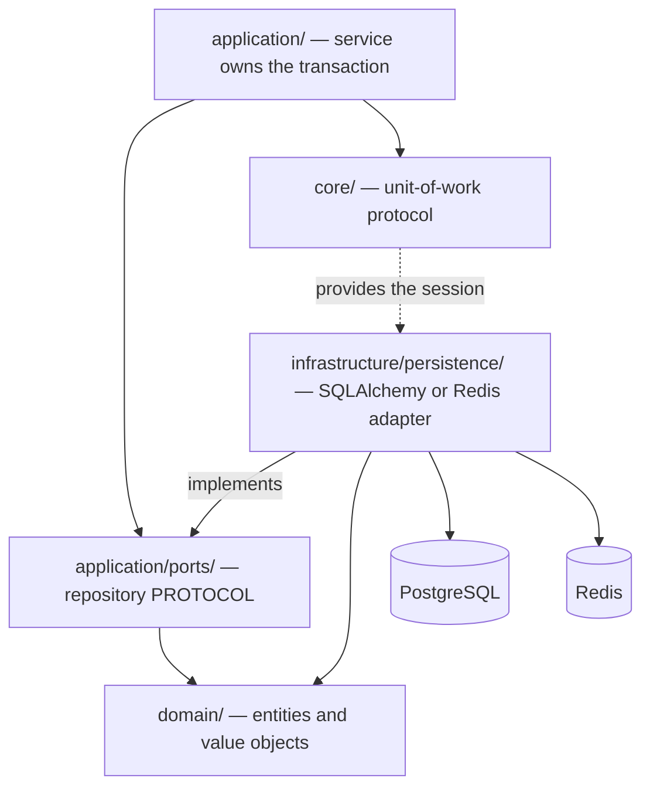
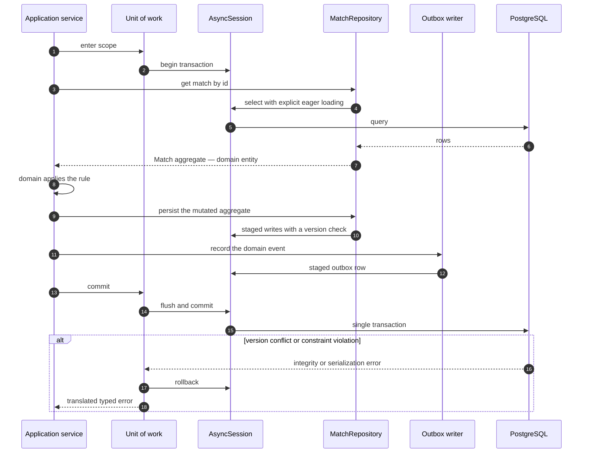

# Repository Layer

> **Status:** Draft — proposed for review
> **Owner:** _Unassigned_
> **Last reviewed:** _Not yet reviewed_
> **Companions:** [`services.md`](./services.md) · [`dependency-injection.md`](./dependency-injection.md)
> **Upstream:** [`../01-architecture/architecture.md`](../01-architecture/architecture.md) §9 · [`../01-architecture/system-design.md`](../01-architecture/system-design.md) §5–§7

## Purpose

Defines the data access abstraction that isolates Arena64's domain logic from PostgreSQL,
Redis, and every future storage decision: what a repository is, exactly what it may do, what
it must never do, and how it participates in a transaction it does not own.

## Scope

Repository contracts, the unit of work, the aggregate map, query conventions, and testing.
Transaction *policy* is in [`services.md §9`](./services.md); wiring is in
[`dependency-injection.md`](./dependency-injection.md). Schema is out of scope — that is
A64-004 and [`database.md`](../01-architecture/database.md).

Decisions here are tagged `RP-nn`. `AD-nn` and `BE-nn` cite
[`architecture.md`](../01-architecture/architecture.md) and [`services.md`](./services.md).

---

## 1. Position in the Architecture

The port is declared in `application/`, never in `infrastructure/` — AD-06. The consequence
worth restating: `architecture.md §16` plans to move match history to a read replica, then to
its own database. Because `MatchHistory` is a port owned by the application layer, that
migration replaces one adapter and touches no use case and no test.

---

## 2. What a Repository Is

> A repository is a **collection-like interface over one aggregate root**, expressed in
> domain terms, that hides the storage technology completely.

Three consequences that decide most of the rules below:

1. **The caller must not be able to tell what the storage is.** If a service knows a live
   match lives in Redis, AD-18's revisit clause — moving correspondence matches to PostgreSQL
   when "in-flight" means weeks rather than minutes — becomes a rewrite instead of an adapter
   swap.
2. **The unit of persistence is the aggregate, not the row.** A `Match` without its move log
   cannot be replayed, audited, or analysed for fair play. It is not a valid `Match`.
3. **The repository has no opinions.** It does not decide *whether* something may be saved.
   That is the domain's job.

---

## 3. What Repositories Are Allowed To Do

| Allowed | Detail |
| --- | --- |
| **Load an aggregate by identity** | Fully constituted, including the children the aggregate's invariants depend on |
| **Persist an aggregate** | Add or update, within the caller's unit of work |
| **Delete an aggregate** | Including cascade of its owned children |
| **Expose use-case-named queries** | `find_pairable_opponents`, `list_recent_matches_for_player` |
| **Return explicit read DTOs for list queries** | Where hydrating full aggregates would be wasteful (§6.2) |
| **Enforce optimistic concurrency** | Check and increment the aggregate's version; raise a typed conflict on mismatch |
| **Map between storage representation and domain entities** | Both directions; this is the repository's core job |
| **Translate driver exceptions into the error taxonomy** | Integrity violation to `Conflict`, deadlock to `TransientInfrastructureError` — `services.md §7.2` |
| **Apply eager loading deliberately** | See RP-04 |
| **Express a domain-defined predicate as a query for efficiency** | Only if the rule is defined in the domain and the method is named after it (§3.1) |

### 3.1 The one nuance: rules expressed as query predicates

`find_visible_friends_for` may filter blocked players in SQL rather than loading everything
and filtering in Python. That is legitimate — filtering a thousand rows in the application
after fetching them is worse in every respect.

**The line:** the rule's *definition* lives in the domain and is unit-tested there. The
repository merely applies it efficiently, and its method name states which rule it applies.
What is forbidden is a rule that exists **only** in SQL — because then it cannot be tested
without a database, cannot be reused by another query, and will silently diverge from the
domain version the first time either changes.

---

## 4. What Repositories Must Never Do

Each prohibition is followed by the specific failure it prevents in Arena64.

| Never | Because |
| --- | --- |
| **Open, commit, or roll back a transaction** | Applying a move, appending to the move log, and writing the outbox row must be one transaction. A repository that commits makes that impossible, and does it invisibly |
| **Return ORM objects, result rows, or the session** | Lazy-loading behaviour would spread into use cases, producing queries at points no reviewer can see. And `Match` carries the engine's position value object, which no row can express |
| **Accept or return Pydantic transport models** | Couples storage to the wire format; a v2 API would force a repository rewrite |
| **Contain business rules that exist nowhere else** | §3.1 |
| **Call another module's repository, or join across bounded contexts** | Violates BR-4 and destroys the extraction seam of `architecture.md §16` stages 4–5 |
| **Call a service, publish an event, or dispatch a Celery task** | Inverts the dependency direction; a repository that publishes makes AD-16's transactional ordering unverifiable |
| **Read the wall clock** | AD-07. A repository stamping its own timestamps makes time-dependent tests untestable and lets two clocks disagree within one transaction |
| **Expose a generic filter or query-builder API** | It is a query builder with extra steps. Callers compose queries nobody indexed, and no query has an owner |
| **Cache silently** | An invisible cache is an invisible staleness bug. Caching is an explicit decorating adapter with a documented TTL and invalidation rule ([`caching.md`](../01-architecture/caching.md)) |
| **Lazy-load aggregate children** | RP-04 |
| **Perform cross-aggregate reads to serve a view** | That is a read model — AD-08 and §6.3 |
| **Log at `INFO` per call** | BE-08. At ~5,000 moves per second the repository is the highest-frequency component in the platform |
| **Own retry logic** | Retry policy belongs to the service or the task (`services.md §7.3`); a retrying repository silently re-executes inside a transaction that is already doomed |

---

## 5. Unit of Work

### 5.1 Contract

The unit of work owns the SQLAlchemy `AsyncSession` and the database transaction. Repositories
are given that session; they never create one.

| Rule | Why |
| --- | --- |
| The service opens and closes the unit of work | `services.md §9.1` — the transaction boundary is the use case |
| Repositories are constructed with the active unit of work's session | A repository holding a module-level session would leak state between concurrent requests |
| The outbox writer enlists in the same unit of work | AD-16 |
| Repositories may flush; only the unit of work commits | Flushing to obtain a generated identity is legitimate. Committing is not |
| Exiting the scope without an explicit commit rolls back | Fail-safe: a forgotten commit loses work loudly instead of committing partial work quietly |
| **Redis adapters do not enlist** | They cannot. BE-09 governs the cross-store sequence |

### 5.2 Interaction

### 5.3 Scope per entrypoint

| Entrypoint | Unit-of-work scope | Why |
| --- | --- | --- |
| HTTP | One per request | The natural boundary; matches the use case |
| Gateway | **One per inbound command**, never per connection | A connection lives for an hour. A session held that long would pin a database connection per connected player; 40,000 connections would exhaust any pool many times over |
| Celery worker | One per task | The task is the use case |
| Clock loop | One per adjudication, not per tick | A tick may find zero expired matches, and must not hold a session to discover that |

---

## 6. Repository Kinds

Arena64 has three storage-backed abstractions. Calling all three "repositories" would be
comfortable and wrong, because only one of them has aggregates and invariants.

### 6.1 PostgreSQL repositories — the default

SQLAlchemy 2 async, explicit `select()` construction, explicit eager loading, keyset
pagination. Backing the player domain, the archived match record, ratings, moderation, and
the outbox.

### 6.2 Redis repositories — authoritative, not cached

`LiveMatch`, `QueueTicket`, `ConnectionRegistry`, `ClockDeadlines`.

**Why these are repositories and not "the Redis client":** because of consequence 1 in §2. If
`game.SubmitMove` called Redis directly, AD-18's documented revisit path would be unreachable.

### RP-01 — Redis repository ports expose their concurrency contract explicitly

The live-match port is not `save(match)`. It is a compare-and-set operation that takes the
version the caller read and can return a conflict.

**Why:** `system-design.md §5` makes optimistic versioning the correctness mechanism for the
move path — a move and a clock adjudication genuinely race. A port shaped like `save()` would
hide that the caller *must* handle a conflict, and the first caller to forget produces a lost
update in the platform's most correctness-critical path. Hiding a technology is the
repository's job; hiding a **concurrency contract the caller must satisfy** is a defect.

The general rule: repositories hide *where* and *how* data is stored. They never hide
*guarantees the caller is responsible for*.

### 6.3 Projection stores — not repositories

`leaderboard`, `statistics`, `achievements` write to **projection stores**: no aggregate, no
invariants, no version, rebuildable from PostgreSQL.

**Why the different name:** naming them repositories invites someone to put a domain rule in
one, and a rule inside a projection is a rule that vanishes on the next rebuild. The distinct
name also encodes the operational fact that matters most about them — they are disposable
(AD-19).

---

## 7. Aggregate and Repository Map

One repository per aggregate root. The exception is documented in RP-02.

| Module | Aggregate root | Abstraction | Store |
| --- | --- | --- | --- |
| `auth` | `Account` | `AccountRepository` | PostgreSQL |
| `auth` | `Session` | `SessionRepository` | PostgreSQL + Redis ticket store |
| `users` | `UserProfile` (includes preferences) | `UserProfileRepository` | PostgreSQL |
| `friends` | `FriendRequest` | `FriendRequestRepository` | PostgreSQL |
| `friends` | `Friendship` | `FriendshipRepository` | PostgreSQL |
| `friends` | `Block` | `BlockRepository` | PostgreSQL |
| `matchmaking` | `QueueTicket` | `QueueTicketRepository` | **Redis** |
| `matchmaking` | `Challenge` | `ChallengeRepository` | PostgreSQL |
| `game` | `Match` — live | `LiveMatchRepository` | **Redis**, authoritative (AD-18) |
| `game` | `Match` — archived | `MatchRepository` | PostgreSQL |
| `game` | *(none — write port)* | `MoveAppender` | PostgreSQL — RP-02 |
| `game` | *(none — read port)* | `MatchHistory` (published, BE-04) | PostgreSQL |
| `game` | *(none)* | `ClockDeadlineStore` | **Redis** |
| `spectator` | *(none)* | Reads `game` ports only | — |
| `chat` | `ChatThread` | `ChatThreadRepository` | PostgreSQL |
| `notifications` | `Notification` | `NotificationRepository` | PostgreSQL |
| `rating` | `PlayerRating` | `PlayerRatingRepository` | PostgreSQL |
| `leaderboard` | *(none)* | `LeaderboardProjectionStore` | **Redis**, rebuildable |
| `statistics` | *(none)* | `StatisticsProjectionStore` | PostgreSQL + Redis cache |
| `achievements` | `PlayerAchievement` | `PlayerAchievementRepository` | PostgreSQL |
| `replay` | *(none)* | Reads `game.MatchHistory` | — |
| `fairplay` | `IntegritySignal` | `IntegritySignalRepository` | PostgreSQL |
| `admin` | `ModerationCase` | `ModerationCaseRepository` | PostgreSQL |
| *platform* | *(none)* | `OutboxWriter`, `OutboxRelayStore` | PostgreSQL |

### RP-02 — The hot append path uses a narrow write-only port, not the aggregate repository

`MatchRepository` loads a whole `Match` including its move log, for replay, audit, and
adjudication. `MoveAppender` writes one move and reads nothing.

**Why the exception exists:** appending ply 201 through the aggregate repository would require
rehydrating 200 plies first. At ~5,000 appends per second that is absurd — it would be the
single largest source of database load on the platform, in service of an aggregate the caller
already holds in Redis.

**The rules that keep the exception safe:**

- A narrow write port is **append-only**. It never reads, never updates, never deletes.
- It is permitted **only** where the aggregate is already authoritative elsewhere — here,
  Redis holds the live match (AD-18), so the append is a durability log, not the source of
  truth.
- It is idempotent on match and ply (BE-09), because the write-behind flusher may re-send a
  batch after a crash.
- Any new instance requires an ADR. This one is not licence for a general escape hatch —
  without those three constraints it is simply a repository that skips the aggregate, which is
  how invariants get bypassed.

---

## 8. Query Conventions

### RP-03 — Keyset pagination, never offset

**Why, specifically for Arena64:** an active player accumulates tens of thousands of matches,
and the leaderboard spans hundreds of thousands of rated players. `OFFSET 50000` makes the
database scan and discard 50,000 rows, so the query gets *slower the deeper a player scrolls
into their own history*. Offset pagination is also unstable under concurrent inserts —
finishing a game while paging through match history silently shifts every subsequent page,
duplicating or skipping rows. Keyset pagination on an indexed ordering key is stable and has
constant cost at any depth.

The narrow exception is admin search over small, bounded result sets where jump-to-page is a
genuine requirement — and it is documented per query, not assumed.

### RP-04 — Eager loading is explicit and mandatory for aggregates

Loading an aggregate loads everything its invariants depend on, in a known number of queries.
Lazy loading is disabled.

**Why:** lazy loading is the mechanism by which a single `Match` load becomes 200 queries with
no visible call site, and it fails outright under async SQLAlchemy when a lazy attribute is
touched outside the session's context — a failure that appears in production and not in the
test that used a still-open session. Explicit eager loading makes the query count a property
of the code, reviewable in the diff.

### 8.2 Aggregates versus read DTOs

| Return | When | Why |
| --- | --- | --- |
| Full aggregate | The caller will mutate it, or needs its invariants | Correctness requires the whole thing |
| Read DTO | List views, search results, projections | Hydrating 50 full `Match` aggregates with move logs to render a history list would fetch megabytes to display fifty rows |

**Rule:** a read DTO is never mutated and never persisted. If a caller wants to change
something, it loads the aggregate.

### 8.3 Query objects

Permitted only where a query genuinely varies at runtime — admin search is the sole current
case — and always over a fixed, enumerated set of criteria.

**Why not generally:** a general query object is the generic filter API of §4 with a nicer
name. Its real cost is that no query has an owner, so no index can be designed deliberately,
and the slow query that appears in production six months later belongs to nobody.

### 8.4 Concurrency

| Mechanism | Where | Why there |
| --- | --- | --- |
| **Optimistic version** | Live match (Redis), `FriendRequest` status transitions | Contention is rare — turn ownership already serialises the common path (`system-design.md §5`) |
| **Unique constraint** | Rating application per match, friendship pair, queue ticket per player | The only check that is correct under concurrency (BE-06) |
| **Row lock on the aggregate root** | Rare check-then-act that cannot be expressed as a constraint | Targeted, predictable; far cheaper than raising the isolation level (`services.md §9.5`) |
| **Redis atomic script** | Live match CAS, atomic dual-ticket removal | Read-validate-write must be indivisible |

Pessimistic locks are never held across an engine call, an external call, or another
repository's I/O.

---

## 9. Testing

### RP-05 — Every repository port has an in-memory fake, and one contract suite runs against both

`architecture.md §9` requires application-layer tests to run without a database. That requires
fakes. Fakes drift.

**Why a shared contract suite is the load-bearing part:** a fake that has quietly diverged from
its real adapter produces the worst possible test outcome — a green suite over broken
behaviour. Running one suite against the fake, the PostgreSQL adapter, and (where applicable)
the Redis adapter means the fake is *proven* equivalent on every property the tests express,
so application tests built on it are trustworthy.

The suite must cover, for every port: round-trip fidelity of the aggregate, version-conflict
behaviour, constraint-violation translation into the domain error, ordering and pagination
stability, and not-found semantics.

| Test level | Uses | Location |
| --- | --- | --- |
| Domain | Nothing — pure | `tests/unit/` |
| Application | Fakes | `tests/unit/` |
| Repository contract | Fake **and** every real adapter | `tests/contract/` |
| Integration | Real PostgreSQL, Redis, broker | `tests/integration/` |

**Why contract tests run against real infrastructure and are still not "integration tests":**
they test one port in isolation, not a flow. Keeping them separate means a broken repository
fails a small, fast, unambiguous suite instead of surfacing as a confusing end-to-end failure.

---

## 10. Anti-Patterns

| Anti-pattern | What it causes here |
| --- | --- |
| Generic `BaseRepository` with `get`, `list`, `filter`, `save` | Every module inherits methods it does not want, and `filter` becomes the generic query API §4 forbids |
| Repository per table | `Match` and `Move` as separate repositories lets a caller construct a match with a partial move log — an unreplayable, unauditable record |
| The service passing a session to the repository | Makes the session a parameter, so any caller can pass a different one and silently escape the transaction |
| Repository returning `None` for "not permitted" | Conflates authorization with existence; the enumeration leak of `services.md §6` |
| Business logic in a query name like `get_active_valid_matches` | "Active" and "valid" are domain concepts with no definition; the rule exists only in SQL |
| Caching inside the repository | Invisible staleness. `game` would read a stale position and adjudicate a move against the wrong board |
| Cross-module join for a profile page | Breaks BR-4 and blocks stages 4–5 of `architecture.md §16`. Use a read model (AD-08) |
| Repository that commits "just this once" | Partial commit; the outbox row lands without the state change, or the reverse |

---

## 11. Repository Decisions

All are **Proposed** and should be promoted to ADRs in `docs/07-decisions/`.

| ID | Decision | Section |
| --- | --- | --- |
| RP-01 | Redis repository ports expose their concurrency contract explicitly | §6.2 |
| RP-02 | The hot append path uses a narrow write-only port, not the aggregate repository | §7 |
| RP-03 | Keyset pagination, never offset | §8 |
| RP-04 | Eager loading is explicit and mandatory; lazy loading disabled | §8 |
| RP-05 | Every port has a fake, and one contract suite runs against both | §9 |

## 12. Related Documents

| Document | Relationship |
| --- | --- |
| [`services.md`](./services.md) | Transaction policy, error taxonomy, module boundaries |
| [`dependency-injection.md`](./dependency-injection.md) | How repositories are registered and scoped |
| [`../01-architecture/architecture.md`](../01-architecture/architecture.md) | AD-06 port ownership, AD-08 read models, AD-18 data ownership |
| [`../01-architecture/system-design.md`](../01-architecture/system-design.md) | §5 concurrency, §6 consistency, §7 idempotency |
| [`../01-architecture/database.md`](../01-architecture/database.md) | Schema, indexes, partitioning — *placeholder, A64-004* |
| [`../01-architecture/caching.md`](../01-architecture/caching.md) | Cache decorating adapters — *placeholder* |

## TODO

- [ ] Promote RP-01 … RP-05 to numbered ADRs
- [ ] Confirm the aggregate map in §7 against A64-004's schema design
- [ ] Define the keyset ordering key for match history and the leaderboard (RP-03)
- [ ] Specify the write-behind flusher's batch size and catch-up behaviour (RP-02, BE-09)
- [ ] Write the repository contract suite skeleton (RP-05)
- [ ] Assign a document owner and move status from Draft to Approved
