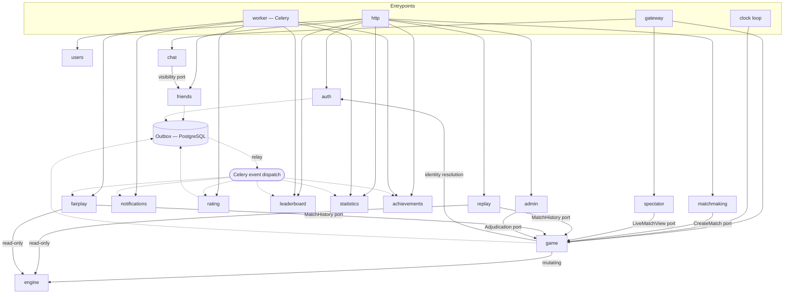
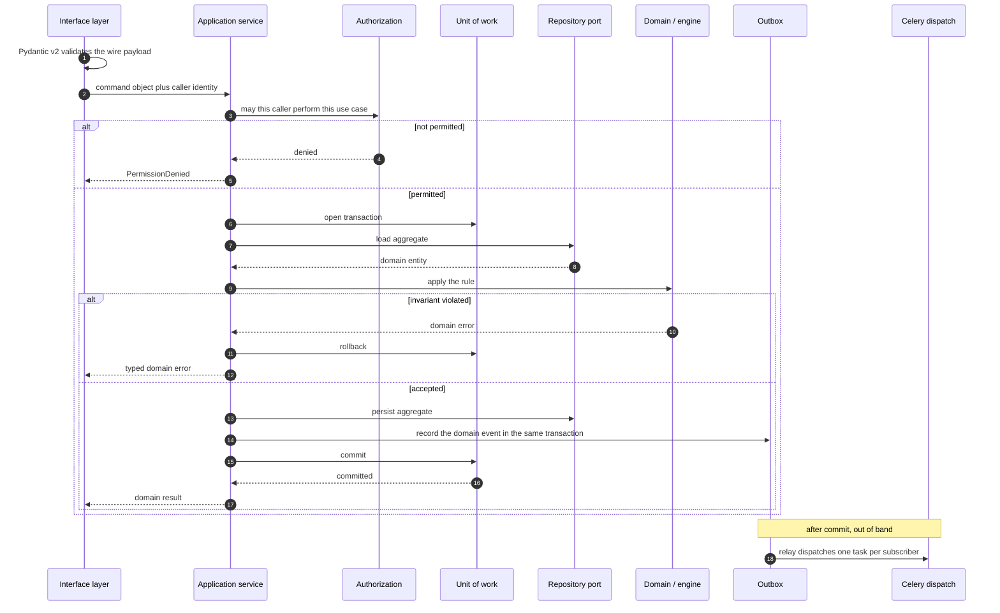
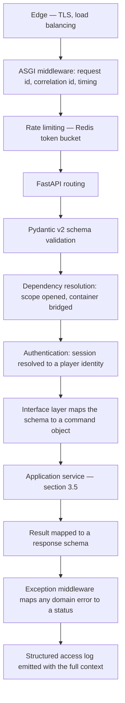
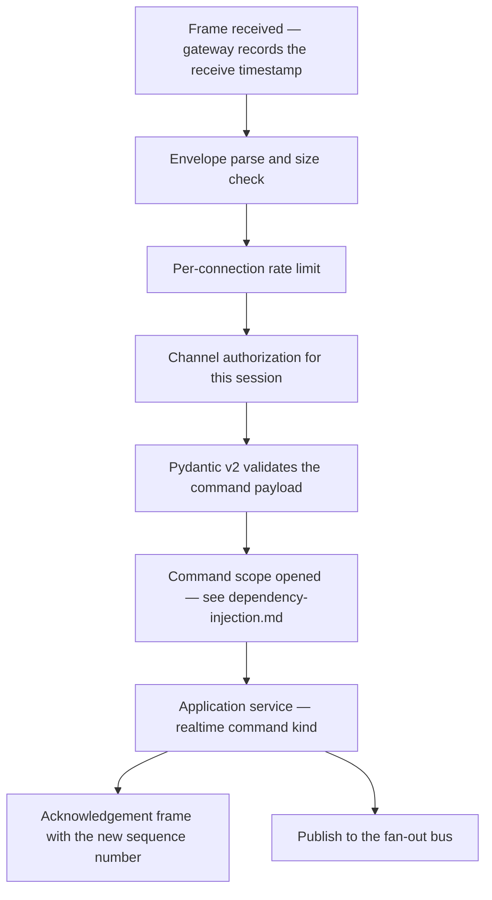
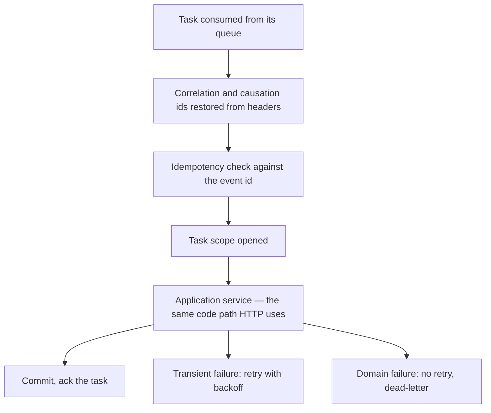
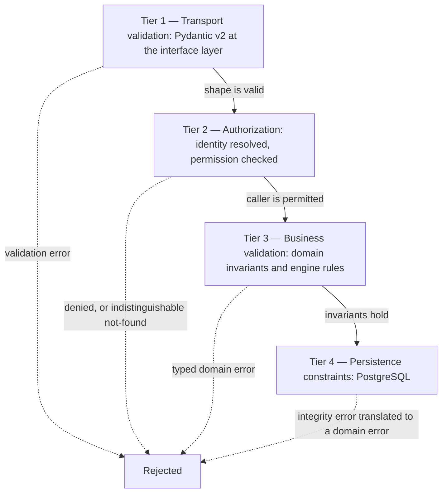
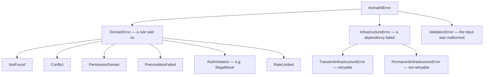
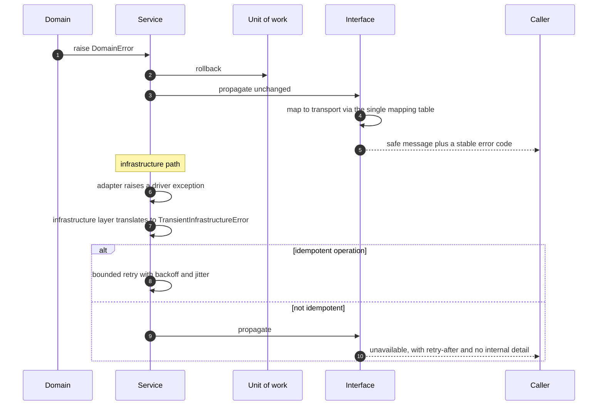
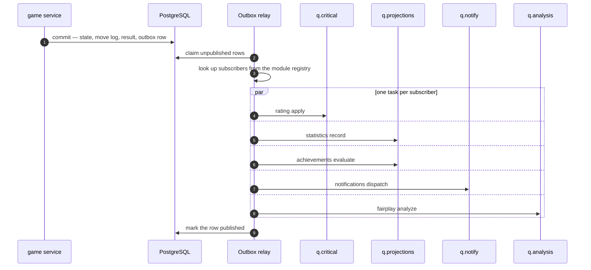

# Backend Architecture and Service Layer

> **Status:** Draft — proposed for review
> **Owner:** _Unassigned_
> **Last reviewed:** _Not yet reviewed_
> **Companions:** [`repositories.md`](./repositories.md) · [`dependency-injection.md`](./dependency-injection.md)
> **Upstream:** [`../01-architecture/architecture.md`](../01-architecture/architecture.md) · [`../01-architecture/system-design.md`](../01-architecture/system-design.md)

## Purpose

Defines how the Arena64 backend is physically organised, how its modules are bounded, and
how the service layer behaves — its responsibilities, its transaction ownership, its
validation and error flow, its logging, and how modules communicate.

`architecture.md` decided **what the modules are and what may depend on what**. This
document decides **where the code lives and how a service behaves**. Decisions there are
cited as `AD-nn`; decisions introduced here are `BE-nn`.

## Scope

Backend structure and the service layer. Repository contracts are in
[`repositories.md`](./repositories.md); wiring and configuration are in
[`dependency-injection.md`](./dependency-injection.md). No code, no endpoints, no schema.

## Stack this design assumes

Python 3.13 · FastAPI · SQLAlchemy 2 (async) · PostgreSQL · Redis · Celery · Pydantic v2.

---

## 1. Backend Folder Structure

```text
apps/api/
├── pyproject.toml
├── alembic/                        # migration scripts only — schema policy lives in database.md
├── src/
│   └── arena64/
│       ├── entrypoints/            # the runtime profiles of AD-02 — one per process type
│       │   ├── http/               # FastAPI application assembly, routers mounted, middleware
│       │   ├── gateway/            # WebSocket process: connection loop, dispatch, fan-out
│       │   ├── worker/             # Celery application, task registry, queue routing, beat
│       │   └── clock/              # dedicated clock-adjudication loop — deliberately NOT Celery
│       ├── shared/                 # shared DOMAIN kernel — importable by domain layers
│       ├── core/                   # platform contracts and abstractions — importable by application layers
│       ├── common/                 # technical utilities with real dependencies — infrastructure and interface only
│       ├── modules/                # the bounded contexts of architecture.md §6
│       │   ├── engine/             # pure rules kernel (AD-13) — no layers, it is not a use-case module
│       │   ├── game/
│       │   │   ├── domain/
│       │   │   ├── application/
│       │   │   ├── infrastructure/
│       │   │   ├── interface/
│       │   │   └── public/         # the ONLY package other modules may import
│       │   ├── matchmaking/        # …identical five-package shape for every module below
│       │   ├── spectator/
│       │   ├── auth/
│       │   ├── users/
│       │   ├── friends/
│       │   ├── chat/
│       │   ├── notifications/
│       │   ├── rating/
│       │   ├── leaderboard/
│       │   ├── statistics/
│       │   ├── achievements/
│       │   ├── replay/
│       │   ├── fairplay/
│       │   └── admin/
│       └── composition/            # composition roots and the module registry (see dependency-injection.md)
└── tests/
    ├── unit/                       # domain and application, no I/O, fakes only
    ├── integration/                # real PostgreSQL, real Redis, real Celery broker
    ├── contract/                   # repository contract suites and the engine conformance corpus (AD-14)
    └── e2e/                        # full stack across HTTP and WebSocket
```

### Why each directory exists

| Directory | Exists because | May contain | Must never contain |
| --- | --- | --- | --- |
| `src/` layout | Tests must import the *installed* package, exactly as production does. A flat layout lets tests accidentally import the working tree and pass against files that were never packaged | The distributable package | Anything not shipped |
| `entrypoints/` | AD-02 gives three process profiles with incompatible operational characteristics. Making them separate top-level packages makes it structurally obvious when someone adds an HTTP concern to the gateway | Process bootstrap, framework assembly, middleware, task registration | Business logic of any kind, repository implementations |
| `entrypoints/clock/` | See BE-01 below | The adjudication loop and its Redis reads | Celery tasks, HTTP handlers |
| `shared/` | The domain kernel every module's `domain/` layer needs — identifiers, the clock port, error base types, the event envelope | Framework-free value objects and protocols | Business rules, I/O, third-party imports |
| `core/` | Platform *contracts* the application layer programs against — the unit-of-work protocol, the event publisher protocol, pagination primitives, the settings base | Protocols, abstract types, pure policy | Concrete adapters, SQLAlchemy, Redis, FastAPI |
| `common/` | Technical plumbing that genuinely needs its dependencies — session factories, Redis client factories, the Celery app factory, logging setup, middleware | Framework-coupled utilities | Anything importable by a `domain/` layer |
| `modules/` | The bounded contexts. One directory per context, uniform interior | The five packages below | Cross-module imports outside `public/` |
| `modules/engine/` | AD-13 — a pure kernel with no layering, because it has no use cases and no I/O to layer against | Rules functions, immutable position types, hashing | Anything with a dependency |
| `<module>/domain/` | Entities, value objects, domain services, invariants | Business rules | FastAPI, SQLAlchemy, Redis, Celery, wall-clock reads, logging |
| `<module>/application/` | Use cases, port protocols, commands and results | Orchestration | Concrete infrastructure, transport types |
| `<module>/infrastructure/` | Adapters realising the ports | Repositories, Redis adapters, external clients | Other modules' internals |
| `<module>/interface/` | Transport bindings for this module | Routers, WebSocket handlers, Pydantic schemas | Domain entities in signatures, direct infrastructure use |
| `<module>/public/` | See BE-03 | Port protocols, DTOs, event types, error types | Implementations, ORM types, anything mutable |
| `composition/` | One place where abstractions are bound to implementations | Container config, module registry | Business logic |
| `alembic/` | Migrations are versioned artefacts with their own lifecycle | Migration scripts | Model definitions |
| `tests/contract/` | Fakes drift from real adapters, and the engine has two implementations (AD-14) | Shared suites run against every implementation of a port | Module-specific helpers |

### BE-01 — The clock loop is its own entrypoint, not a Celery task

**Why:** AD-21 requires flag adjudication accurate to within 250ms of the true deadline, on a
~100ms tick. Celery cannot serve that. Celery Beat's scheduler is built for
seconds-to-minutes granularity, and every dispatch costs a broker round trip plus a worker
prefetch — hundreds of milliseconds of jitter on a path whose entire error budget is 250ms.
Worse, Beat's at-least-once dispatch under clock skew would produce duplicate adjudication
attempts, and the queue is shared with work that can block.

The clock loop is therefore a small, dedicated async process that reads a Redis sorted set
directly and calls the `game` module's adjudication service in-process — one Redis range
query per tick regardless of whether 200 or 200,000 matches are live. It is the **only**
background component that is not a Celery worker, and that exception is deliberate and
documented rather than incidental.

### BE-02 — Modules are packages inside one distribution, not separate distributions

**Why:** separate installable packages per module would force a version-resolution step and a
release dance for every cross-module contract change, at a stage where all modules ship
together on every deploy anyway (AD-01). The boundary Arena64 needs is an *import* boundary,
and that is enforced far more cheaply by CI import contracts (§2) than by packaging. When a
module is genuinely extracted (`architecture.md §16`), packaging it becomes part of that
work — not a cost paid upfront by every module that will never be extracted.

---

## 2. Module Architecture

### 2.1 Anatomy

Every module has the same five packages. Uniformity is the point: a contributor who has read
`friends` can navigate `game`. The four inner layers and their dependency direction are
defined in `architecture.md §8` and are not restated here.

The fifth package is this document's addition.

### BE-03 — Every module publishes exactly one importable package: `public/`

`modules/<name>/public/` contains the module's **port protocols**, the **DTOs** crossing its
boundary, its **event types**, and its **error types**. Everything else — `domain/`,
`application/`, `infrastructure/`, `interface/` — is private.

**Why:** rule R-1 in `architecture.md §7` prohibits reaching into another module's internals,
but Python's import system does not enforce it and code review will not catch it reliably at
the hundredth pull request. A single published package makes the rule expressible as one
import-linter contract per module — *nothing may import `arena64.modules.X` except
`arena64.modules.X.public`* — which turns a convention into a build failure. Without one
named surface, the contract must enumerate forbidden paths, and the enumeration goes stale
the moment someone adds a package.

**Why events live in `public/`:** a subscriber must import the event type it consumes. If
event classes lived in `domain/`, every subscriber would need a private import and the
contract would need a carve-out — which is how exceptions become the rule.

### 2.2 Module manifest

Each module declares, in one place: its public ports, the events it **publishes**, the events
it **subscribes** to, its configuration prefix, and its Celery queue.

**Why a declared manifest rather than discovery:** the platform's dependency graph should be
derivable by reading fifteen small declarations, not by tracing imports across a hundred
thousand lines. It also makes the graph *testable* — CI can assert that the declared graph is
acyclic and that no module subscribes to an event nobody publishes, which is the failure mode
that otherwise surfaces as a feature silently never happening.

### 2.3 Module classes, and the rules that differ per class

Not all fifteen modules obey the same rules, and pretending they do produces either
over-constrained CRUD modules or under-constrained gameplay modules.

| Class | Modules | Transaction model | Entry path | Allowed to be slow? |
| --- | --- | --- | --- | --- |
| **Gameplay core** | `game`, `engine`, `matchmaking`, `spectator` | Redis CAS, write-behind to PostgreSQL | Gateway commands | **No** — CP-1 budget |
| **Player domain** | `auth`, `users`, `friends`, `chat`, `notifications` | One PostgreSQL transaction per use case | HTTP requests | Within normal request budgets |
| **Projections** | `rating`, `leaderboard`, `statistics`, `achievements` | PostgreSQL transaction inside a Celery task | Event subscription only | Yes — eventually consistent |
| **Read side** | `replay` | Read-only, no transaction | HTTP requests | Yes |
| **Operations** | `admin`, `fairplay` | PostgreSQL transaction; `fairplay` is long-running | HTTP / event subscription | `admin` no, `fairplay` yes |

Rules that vary by class:

- **Gameplay core may not depend on projections.** `game` must never read a rating or a
  statistic to decide anything. *Why:* it would couple the 5,000-moves-per-second path to a
  store whose whole design premise is that it may lag.
- **Projections have no synchronous callers and no public command ports.** Their `public/`
  package exposes query ports only. *Why:* the moment a projection accepts a command it stops
  being rebuildable, and rebuild is the entire reason projections are safe to keep in Redis
  (AD-19).
- **Only gameplay core may hold Redis-authoritative state.** Every other module treats Redis
  as a cache it can lose.

### 2.4 Module dependency graph



Solid arrows are synchronous in-process calls through a `public/` port. Dashed arrows are
asynchronous events. **Any edge not drawn is a boundary violation.**

### 2.5 Backend boundary rules

These extend R-1 … R-7 from `architecture.md §7` with the concrete mechanisms above.

| ID | Rule | Why |
| --- | --- | --- |
| BR-1 | Cross-module imports may only target `<module>/public/` | Makes R-1 lintable (BE-03) |
| BR-2 | A `public/` port is defined in terms of `shared/` and `public/` DTOs only | A port exposing a domain entity would make callers depend on the callee's internals through the type system while satisfying the import rule |
| BR-3 | A module may not import another module's Celery tasks | Tasks are an execution detail; coupling to them defeats the queue isolation of AD-20 |
| BR-4 | A module owns its tables exclusively; no cross-module joins | The seam that makes `architecture.md §16` stages 4 and 5 possible |
| BR-5 | `game.MatchHistory` is the single cross-module read port over match data | See BE-04 |
| BR-6 | No module imports `composition/` | A module that reaches for the container is a service locator, and its dependencies become invisible |

### BE-04 — `replay` and `fairplay` read match history through a `game` port, not their own copy

**Why:** both need the full move log of archived matches. The alternative — projecting the
move log into each consumer via events — would duplicate the largest table on the platform
twice over, for two read-only consumers, and add two more things that can silently diverge
from the competitive record. A published read-only port keeps one copy of the truth and still
satisfies BR-4, because `game` remains the sole owner and writer.

**The cost, stated:** this is a synchronous dependency on `game` from two modules, which
weakens `fairplay`'s extraction candidacy in `architecture.md §16`. Acceptable, because the
port is read-only and latency-tolerant — on extraction it becomes an internal API call rather
than a redesign.

---

## 3. Service Layer

An **application service** is one use case: one intent, one public method, one transaction.

### 3.1 Three service kinds

Arena64 cannot use a single service shape, because its write paths have genuinely different
transaction models (§2.3).

| Kind | Example | Transaction | Returns |
| --- | --- | --- | --- |
| **Command service** | `friends.AcceptFriendRequest` | One PostgreSQL transaction owned by the service | Domain result or typed error |
| **Query service** | `leaderboard.GetTopPlayers` | None, or a read-only session | Read DTO |
| **Realtime command service** | `game.SubmitMove` | Redis compare-and-set, plus a write-behind durable append | Domain result with the new sequence number |

**Why the third kind is named rather than disguised:** `game.SubmitMove` operates on Redis as
the authority (AD-18) under an atomic CAS, and touches PostgreSQL only through an append-only
writer and the outbox. Forcing it into the same unit-of-work shape as `AcceptFriendRequest`
would either put a PostgreSQL transaction inside the CP-1 latency budget, or quietly make the
unit-of-work abstraction lie about what it guarantees. Naming the difference lets a reviewer
see immediately which contract a service operates under.

### 3.2 Responsibilities

A service **must**:

| Responsibility | Note |
| --- | --- |
| Own exactly one transaction boundary | §9 |
| Authorize the use case before doing work | §6 — always before business validation |
| Load aggregates through repository ports | [`repositories.md`](./repositories.md) |
| Orchestrate domain objects and domain services | It calls rules; it does not contain them |
| Invoke `engine` for anything about checkers | `game` only (R-2) |
| Record domain events into the outbox inside the transaction | AD-16, §10 |
| Translate infrastructure failures into the error taxonomy | §7 |
| Return domain results or typed domain errors | Never transport artefacts |
| Enforce idempotency where the caller may retry | `system-design.md §7` |

### 3.3 Prohibited responsibilities

Each prohibition exists because its violation has a specific, predictable consequence for
Arena64.

| Prohibited | Consequence if allowed |
| --- | --- |
| Returning HTTP status codes or raising transport exceptions | `game.SubmitMove` has four callers — gateway, HTTP, clock loop, admin (`architecture.md §9`). A service that speaks HTTP is unusable from three of them |
| Accepting Pydantic **request** models as parameters | Couples the use case to a wire format, so a v2 API forces a service rewrite. Services take explicit command objects |
| Touching the SQLAlchemy session directly | Bypasses the repository contract and leaks ORM lifecycle into orchestration |
| Reading the wall clock | AD-07. Half of `game`'s rules are time-dependent; an injected clock makes a three-day correspondence timeout a microsecond-long unit test |
| Reading environment variables or global config | The module's configuration surface becomes undiscoverable and untestable ([`dependency-injection.md §2`](./dependency-injection.md)) |
| Calling another module's repository or ORM model | Violates BR-4 and destroys the extraction seam |
| Containing checkers rules | Rules live in `engine` (AD-13). A service with a conditional about captures is a rule the conformance corpus cannot cover |
| Publishing events outside the transaction | AD-16 — produces phantom or lost ratings |
| Dispatching a Celery task inline | §9.4 — the outbox is the only path; inline dispatch reintroduces the dual-write problem the outbox exists to solve |
| Performing network I/O inside an open transaction | §9.4 — a slow push provider would hold PostgreSQL locks |
| Catching an exception and continuing inside a transaction | Produces partial commits (`CLAUDE.md §9`) |
| Instantiating its own adapters | Makes dependencies invisible and untestable |
| Calling another module's service while a transaction is open | BE-05 |

### BE-05 — One transaction per use case; no cross-module service call inside an open transaction

If a use case needs another module's work, it either (a) completes its own transaction and
lets an event carry the rest, or (b) is invoked by an orchestrator that calls both services
in sequence, each with its own transaction.

**Why:** nested cross-module transactions produce lock acquisition orders nobody can reason
about — `friends` locking a row then calling `notifications`, while `notifications` elsewhere
locks in the opposite order, is a deadlock that appears only under production concurrency.
Worse, a partial failure would leave one module committed and another rolled back with no
record that reconciliation is owed. Per-module transactions make every cross-module
interaction either atomic-within-one-module or explicitly eventual.

### 3.4 Orchestration

Orchestration is the service's job; computation is not. Two orchestration patterns exist, and
only two.

**Pattern A — event choreography (default).** The service commits its own change and emits an
event. Downstream modules react. Used for everything downstream of `match.completed`.

**Pattern B — explicit sequential orchestration (exception).** A dedicated orchestrating
service calls two modules in sequence, each transactionally, with a documented compensating
action if the second fails. **Arena64 has exactly one instance**, and it exists because Redis
and PostgreSQL cannot share a transaction.

#### The pairing compensation, in full

`system-design.md §4.3` removes both queue tickets from Redis atomically, then creates the
match in PostgreSQL. Those two stores cannot commit together.

| Step | Store | Failure handling |
| --- | --- | --- |
| 1. Atomically remove both tickets | Redis | If it fails, nothing happened — retry the tick |
| 2. Create the match in `Created` | PostgreSQL | **If this fails, both tickets must be reinserted** |
| 3. Publish `match.created` via the outbox | PostgreSQL, same transaction as 2 | Atomic with 2 by construction |

**Why compensation rather than a different ordering:** creating the match first and removing
tickets second is worse — a crash between them leaves two players still queued *and* holding
a live match, so they get paired again into a second match. Removing tickets first fails
safe: the worst outcome is two players silently dropped from the queue, which the
compensating reinsertion fixes and which a queue-entry timeout catches even if compensation
itself fails.

**Why this is the only sanctioned instance:** every additional compensating action is a place
where the system can reach a state no single transaction describes. This one is forced by
AD-18's store split. A second requires an ADR.

### 3.5 Service interaction flow



The critical detail is the position of the outbox write: **inside** the transaction, and the
dispatch **outside** it. That single ordering is what AD-16 buys.

---

## 4. Request Lifecycle

### 4.1 HTTP request



**Why authentication sits after schema validation but before the service:** a malformed
payload is cheaper to reject than a session lookup, and the service must receive an already
resolved identity so it never has to know how the caller authenticated. `game.SubmitMove`
receives a player identity whether it arrived over HTTP, over a WebSocket frame, from the
clock loop, or from an admin action.

### 4.2 WebSocket command



**Why the receive timestamp is captured before anything else:** it is the temporal authority
that resolves the flag race (`system-design.md §4.5`). Taken after parsing and rate limiting,
the platform's own queueing delay could cost a player the game — which tenet T-2 forbids.

**Why the scope is per command, not per connection:** a connection lives for an hour. A scope
held that long would pin a database session per connected player, and 40,000 connections
would exhaust any pool many times over. See
[`dependency-injection.md §1.4`](./dependency-injection.md).

### 4.3 Celery task



**Why a domain error must not be retried:** an event that violates a domain invariant will
violate it identically on every redelivery. Retrying forever occupies a worker slot and, on a
shared queue, starves work that could succeed. See §7.3.

---

## 5. Configuration, Shared Packages, Dependency Injection

Specified in [`dependency-injection.md`](./dependency-injection.md) — dependency injection,
configuration, and the `core` / `common` / `shared` split. Not duplicated here.

---

## 6. Validation Flow

Arena64 validates in four tiers. Each exists because the tier above cannot do its job.



### Tier 1 — Transport validation

Pydantic v2 models at the interface layer: types, ranges, enum membership, string bounds,
required fields. Rejects before any I/O.

**Why Pydantic v2 specifically matters here:** its validation core is compiled, which is what
makes it viable in front of the ~5,000 moves-per-second command path. A pure-Python validator
there would consume a measurable share of the CP-1 budget.

**Rule:** transport models never leave the interface layer. The service receives a command
object built from them (§3.3).

### Tier 2 — Authorization

Runs **before** business validation, always.

**Why the order is not negotiable:** business validation reveals existence. If `replay`
checked "does this match exist" before "may this caller view it", the difference between *not
found* and *not permitted* becomes an enumeration oracle — an attacker can discover which
private matches exist from status codes or timing. Authorizing first means unauthorized
callers get an identical answer whether or not the resource exists.

### Tier 3 — Business validation

Domain invariants, enforced in `domain/` or by `engine`. Across Arena64: a friend request
cannot be sent to a blocked player; a queue ticket cannot be redeemed twice; a move must be in
the engine's legal set with mandatory captures resolved; a rating period cannot be applied to
a match already rated.

**Rule:** business validation produces typed domain errors, never exceptions carrying
transport meaning.

### Tier 4 — Persistence constraints

Uniqueness and referential integrity in PostgreSQL. The service catches the integrity
violation and translates it into the same domain error tier 3 would have produced.

### BE-06 — Database constraints are the authoritative check, not a redundant one

**Why:** tiers 3 and 4 look duplicative and are not. Every check-then-act in tier 3 is a
time-of-check-to-time-of-use race. Two concurrent friend requests between the same pair both
pass "not already friends", because both read before either wrote. Two redeliveries of
`match.completed` both pass "not yet rated". **Only the constraint is correct under
concurrency.** Tier 3 exists to produce a good error message on the common path; tier 4 exists
to be right. Removing tier 4 because tier 3 "already checks" is the single most common way a
platform ends up with duplicate ratings.

The corollary: a constraint violation must map to the *same* domain error as the tier-3 check,
so no caller can distinguish which fired and none depends on the race.

---

## 7. Error Handling

### 7.1 Taxonomy

Rooted in `shared/`, so every layer can raise and catch it without importing a framework.



| Category | Meaning | Retryable | Logged at |
| --- | --- | --- | --- |
| `ValidationError` | The caller sent something malformed | No | `DEBUG` |
| `DomainError` | The caller asked for something the rules forbid | **No** | `INFO` or `DEBUG` |
| `TransientInfrastructureError` | Deadlock, connection reset, Redis timeout, lock contention | **Yes** | `WARN` |
| `PermanentInfrastructureError` | Misconfiguration, missing table, auth failure to a dependency | No | `ERROR` |
| Unhandled exception | A defect | No | `ERROR` with stack |

### BE-07 — A domain error is not an application error

`IllegalMove`, `NotFound`, `AlreadyFriends` are **normal outcomes**. They log below `WARN`,
they never page anyone, and they never appear on an error dashboard.

**Why this matters more for Arena64 than for a typical service:** rejected moves should be
near zero by construction, because the client runs the same rules corpus (AD-14). If domain
errors were logged as errors, the noise floor from ordinary rejected friend requests and
expired queue tickets would bury exactly the signal that matters — a rise in `IllegalMove`
meaning client and server rules have diverged (`system-design.md §9`). Keeping domain outcomes
out of the error channel is what makes that alarm usable.

### 7.2 Exception flow



**Rules:**

1. Adapters translate driver exceptions at the infrastructure boundary. A database or Redis
   driver exception must never escape into `application/` — otherwise the application layer
   depends on the driver through its except clauses, a dependency the type system never shows.
2. Services propagate domain errors unchanged. Wrapping loses the type the caller branches on.
3. **One transport mapping table per entrypoint**, in the interface layer. The same
   `PreconditionFailed` maps to an HTTP status in `entrypoints/http` and to a WebSocket error
   frame code in `entrypoints/gateway`. *Why:* services serve four callers; transport meaning
   cannot live in them.
4. Users get a safe message and a stable machine-readable code; operators get detail in logs.
   Never leak stack traces, SQL, or internal identifiers to a client.
5. Cleanup is deterministic on every path, including failure.

### 7.3 Retry policy

| Context | Policy |
| --- | --- |
| HTTP request | No automatic retry — the client decides. Deadlocks are the exception: one bounded in-process retry of the whole use case |
| WebSocket command | No retry. The client resubmits with the same client move id, and idempotency makes it safe |
| Celery task, transient error | Retry with exponential backoff and jitter, bounded attempts |
| Celery task, domain error | **No retry — dead-letter immediately** |
| Celery task, unhandled exception | Retry once, then dead-letter, then alert |

**Why domain errors dead-letter rather than retry:** a dead-lettered event is a visible,
inspectable artefact that says "this can never be processed", which is actionable. An
infinitely retrying event is invisible until the queue backs up.

---

## 8. Logging

### 8.1 Structured logging

All logs are structured key-value records — JSON in deployed environments, human-readable
locally. Context is bound to a context variable and carried automatically, not passed by hand
through call signatures.

**Why context-variable binding rather than explicit parameters:** the alternative threads a
logger or context object through every service and repository signature, which pollutes the
domain layer with an infrastructure concern and gets skipped precisely where it is most needed
— deep inside a failing call. Context variables propagate through `asyncio` tasks and can be
re-established at the Celery task boundary from message headers, which is the only way a
rating update can carry the identity of the move that caused it.

*The library choice is pending an ADR; the requirement is contextvar-based binding that works
under both `asyncio` and Celery's execution model.*

### 8.2 The three identifiers

| Identifier | Scope | Generated | Why it exists separately |
| --- | --- | --- | --- |
| `request_id` | One HTTP request or one WebSocket frame | At the edge, or on frame receipt | Ties together the log lines of a single interaction |
| `correlation_id` | The entire causal chain | At the originating request; **propagated through the outbox and Celery headers** | A rating update has no request. Its correlation id ties it back to the move that ended the match — the first thing you need when a player disputes a rating |
| `causation_id` | The immediate parent event or command | Set by the publisher | Distinguishes *what directly caused this* from *what story this belongs to*. In a fan-out to six consumers, correlation is shared and causation is not |

**Why all three rather than one:** a single id cannot answer both "show me everything from this
user action" and "what specifically triggered this handler". During a fan-out investigation
those are different questions, and conflating them means reconstructing the tree by timestamp
— which fails exactly when the system is under load and timestamps interleave.

### 8.3 Always-bound context on gameplay paths

`match_id`, `player_id`, `sequence`, `engine_version`, plus the three identifiers above.

**Why `engine_version` is bound rather than looked up:** when a result is disputed, the first
question is which rules governed that game (AD-15). Answering it must not require a database
query during an incident.

### 8.4 Levels

| Level | Arena64 meaning | Examples |
| --- | --- | --- |
| `ERROR` | A human must look — a defect, or a dependency that is not recovering | Unhandled exception, outbox relay unable to publish, `PermanentInfrastructureError` |
| `WARN` | Handled, but abnormal and worth noticing | Redis failover detected, Celery task retry, deadlock retry, ticket redemption replay, rate limit breached by an authenticated player |
| `INFO` | A significant business event | Match created, match completed, account registered, moderation action taken, deploy lifecycle |
| `DEBUG` | Diagnostic detail | Individual move application, cache hit or miss, repository query timing |
| `TRACE` | Deliberately enabled, temporarily | Full envelope dumps during protocol work |

### BE-08 — Individual moves are not logged at `INFO`

**Why:** ~5,000 moves per second is on the order of 400 million log lines per day from one
event type. The cost is not only storage — it is that every genuinely interesting line is
diluted by a factor of thousands, and log search stops being usable during the incident when
you need it most. Per-move visibility comes from **metrics** (rates, latency histograms,
rejection ratios) and **traces** (sampled), which is what those tools exist for. `INFO` on the
gameplay path is reserved for match-level lifecycle events, at roughly sixty per second rather
than five thousand.

### 8.5 Never logged

Session tokens, WebSocket tickets, password material of any kind, password reset tokens, full
email addresses in gameplay logs, and **chat message bodies**.

**Why chat bodies specifically:** chat is archived in PostgreSQL for moderation and dispute
resolution, where it is access-controlled, auditable, and subject to retention and erasure
policy. Copying it into the log pipeline puts the same personal data in a system with
different retention, broader read access, and no erasure path — converting a moderation
feature into a privacy liability. Moderation reads the archive; it never reads logs.

---

## 9. Transactions

### 9.1 Boundaries

| Rule | Detail |
| --- | --- |
| The boundary is the application service method | One use case, one transaction. Never the router, never the repository |
| One unit of work per scope | HTTP request, WebSocket command, or Celery task — never per connection |
| Repositories enlist; they do not own | [`repositories.md §5`](./repositories.md) |
| The outbox write is inside the transaction | AD-16 |
| Flush for identities, commit only at the boundary | A service may flush to obtain a generated identifier; only the unit of work commits |
| Read-only use cases declare themselves read-only | Enables replica routing without the service knowing replicas exist |

### 9.2 The three transaction models

| Model | Used by | Guarantee |
| --- | --- | --- |
| **PostgreSQL transaction** | Player domain, projections, admin, match completion | Full ACID within one module's tables |
| **Redis compare-and-set** | Live match mutation, queue tickets, connection registry | Atomic per key space; a monotonic version makes read-validate-write indivisible (`system-design.md §5`) |
| **Cross-store sequence** | Move submission, pairing | **Not atomic.** Governed by BE-09 |

### BE-09 — PostgreSQL commit is the commit point; Redis writes are idempotent or compensated

Redis and PostgreSQL cannot share a transaction. Arena64 therefore obeys one rule at every
cross-store boundary: **either the Redis write is idempotent and safely replayable, or there is
a documented compensating action.**

Applied to the two places it matters:

| Path | Order | Failure between the two | Resolution |
| --- | --- | --- | --- |
| **Move submission** | Redis CAS first, durable append second | The append is lost | The append is a **write-behind flush from the authoritative Redis state**, batched and idempotent on match and ply. A crash delays it; the flusher catches up from live state. Nothing is lost while Redis holds the match |
| **Pairing** | Redis ticket removal first, PostgreSQL match creation second | Players are silently unqueued | Compensating reinsertion of both tickets (§3.4), backstopped by a queue-entry timeout |

**Why the move path is ordered Redis-first:** Redis is authoritative for in-flight state
(AD-18). Ordering PostgreSQL first would place its latency inside the acknowledgement path,
violating tenet T-1 — and it would not even improve durability, since the position would still
be authoritative in Redis and any mismatch would have to be resolved in Redis's favour anyway.

**Why the append is idempotent on match and ply:** the flusher may re-send a batch after a
crash. Without idempotency the durable move log — the platform's recovery source and audit
record — could contain duplicates, which is worse than missing entries because it corrupts
replay silently instead of failing loudly.

### 9.3 Rollback strategy

| Situation | Behaviour |
| --- | --- |
| Any exception escapes the service method | Automatic rollback |
| A domain error is returned | **Also rolls back.** The operation did not happen; partial writes are worse than the error |
| Deadlock or serialization failure | Rollback, then one bounded retry of the whole use case, only if idempotent |
| Celery task failure | Rollback, then the retry policy of §7.3 |
| Redis CAS version mismatch | No rollback needed — nothing was written. The caller re-reads and re-evaluates |
| Partial cross-store completion | BE-09 |

### 9.4 What may never happen inside an open transaction

| Forbidden | Why |
| --- | --- |
| Dispatching a Celery task | Dual write. If the transaction rolls back, the task still runs — the exact failure the outbox prevents |
| Publishing to Redis pub/sub | Same, and fan-out latency would sit inside the lock window |
| Calling an external service | A slow push provider would hold row locks. One vendor's latency spike becomes a platform-wide write stall |
| Calling another module's service | BE-05 |
| Long-running computation | `fairplay` analysis inside a transaction would hold a connection for minutes |
| Waiting on a user | There is no such thing as a transaction spanning a request boundary |

### 9.5 Isolation

Default `READ COMMITTED`. Where a check-then-act must be atomic, the mechanism is a
**constraint** (preferred) or a row lock on the aggregate root — **not** a higher isolation
level.

**Why not `SERIALIZABLE` globally:** it would make every ordinary friend request a
serialization-failure retry candidate under load, converting a rare correctness concern into a
constant performance and complexity tax on paths that never needed it. Targeted locking plus
BE-06's constraints gives the same correctness with predictable cost — and unlike an isolation
level, a constraint also protects the repair script someone runs manually during an incident.

---

## 10. Event Publishing

### 10.1 The decision: event or direct call

> **Is a player blocked on the outcome?** If yes, direct call. If no, event.

| Interaction | Mechanism | Why |
| --- | --- | --- |
| `matchmaking` → `game.CreateMatch` | **Direct call** | Both players are watching a spinner, and the match must exist before either is told to join |
| `spectator` → `game.LiveMatchView` | **Direct call** | A spectator is waiting for a snapshot |
| `admin` → `game.Adjudicate` | **Direct call** | A moderator is waiting, and the action must succeed or fail visibly |
| `replay` / `fairplay` → `game.MatchHistory` | **Direct call** | Read-only, and duplicating the move log is worse (BE-04) |
| `game` → `rating` | **Event** | Nobody waits, and rating must never be able to fail a match completion |
| `game` → `statistics`, `achievements`, `fairplay`, `notifications` | **Event** | Same, and each has a different SLO (AD-20) |
| `rating` → `leaderboard` | **Event** | Preserves R-4's one-way chain and keeps the rating algorithm in one place |
| `auth` → `notifications` | **Event** | A welcome email must not be able to fail a registration |
| `friends` → `notifications` | **Event** | Delivery retries; the request already succeeded |

### 10.2 Publishing rules

| Rule | Why |
| --- | --- |
| Events are recorded to the outbox **inside** the transaction, never dispatched inline | AD-16 |
| Event payloads are **self-contained facts** | A consumer that must call back into `game` for details reintroduces the coupling the event removed — and does it at the worst moment, when the consumer is draining a backlog and would hammer the source |
| Payloads are **bounded** | `match.completed` carries result, players, ratings at start, time control, ply count, engine version — **not the move log**. Two of six consumers need the log; embedding it would multiply broker traffic roughly fiftyfold for their benefit. They read it through the BE-04 port |
| Event names are versioned; changes are additive | A new required field is a new version, never a mutation of the existing one |
| Consumers are idempotent on event id | Delivery is at-least-once (`system-design.md §7`) |
| Events are named in the past tense, as facts | `match.completed`, not `complete_match`. A command can be refused; a fact cannot |
| No in-process synchronous event handlers | Hidden coupling inside a transaction, with no retry, no visibility, and no isolation |

### BE-10 — The relay dispatches one Celery task per (event, subscriber), not one per event



**Why per-subscriber dispatch:** a single task invoking all handlers in sequence would share
one retry envelope. If `notifications` failed on its third-party provider, the retry would
re-run `rating` — which already succeeded. Idempotency should stop the double rating, but
relying on the guard to absorb an entirely avoidable duplicate is exactly the erosion that ends
in a corrupted competitive record. Per-subscriber tasks mean a failing consumer retries only
itself.

**Why this also enables AD-20:** each subscriber's task is routed to its own queue, so the
fair-play analyzer's minutes-long jobs cannot delay the rating worker's seconds-long ones.

### 10.3 Queue routing

| Queue | Consumers | SLO | Isolation rationale |
| --- | --- | --- | --- |
| `q.critical` | Outbox relay, rating | Seconds | Delay here delays everything downstream, and rating is competitive |
| `q.projections` | Statistics, achievements, leaderboard | < 60s | Tolerates lag, rebuildable |
| `q.notify` | Notification dispatch | Seconds | Talks to third parties that fail and rate-limit — must not block anything else |
| `q.analysis` | Fair-play | Minutes to hours | CPU-bound; sharing a queue would starve everything |
| `q.maintenance` | Retention, erasure, exports, archival | Hours | Scheduled bulk work |

*(The clock loop appears in no queue — BE-01.)*

---

## 11. Future Extensibility

### 11.1 Adding a module

The test of whether the boundaries are real is whether a new module can be added without
touching an existing one.

| Step | Detail |
| --- | --- |
| 1 | Create `modules/<name>/` with the five packages of §2.1 |
| 2 | Define the `public/` surface: ports, DTOs, events, errors |
| 3 | Declare the manifest (§2.2): published events, subscribed events, config prefix, queue |
| 4 | Register bindings via the module's own registration hook — **not** by editing a central wiring file ([`dependency-injection.md §1.5`](./dependency-injection.md)) |
| 5 | Add the import-linter contract for the new module |
| 6 | Add repository contract tests if it introduces a new port |
| 7 | Mount routers or subscribe tasks in the relevant entrypoint |

**What must not be required:** modifying `game`, modifying another module's code, editing a
central list of subscribers, or adding a branch to a shared dispatcher.

### 11.2 The property, demonstrated

`achievements` was added to this architecture during this task. It required a new module
directory, subscriptions to `match.completed` and `statistics.updated`, its own tables, and a
query port. It required **zero changes** to `game`, `rating`, or `statistics` — because `game`
publishes facts without knowing who listens, and the relay derives subscribers from the
registry rather than from a hard-coded list (BE-10).

### 11.3 A worked future example — Tournaments

| Concern | Resolution |
| --- | --- |
| Consumes | `match.completed`, to advance brackets |
| Calls | `game.CreateMatch` — the same port `matchmaking` uses |
| Publishes | `tournament.round.started`, consumed by `notifications` |
| Must not | Write match state (R-3), or reach into `matchmaking`'s queues |
| Transaction model | Player-domain class — one PostgreSQL transaction per use case |
| New infrastructure | None |

That it needs no new mechanism is the evidence the seams are in the right places.

### 11.4 Removing or extracting a module

Extraction criteria are in `architecture.md §16`. The backend prerequisite is that a module's
only inbound coupling is its `public/` package: at that point extraction replaces in-process
port calls with a network adapter behind the same protocol, and no consumer changes. A module
that has accumulated cross-module imports outside `public/` is not extractable — which is why
BR-1 is enforced in CI rather than by review.

---

## 12. Backend Decisions

All are **Proposed** and should be promoted to ADRs in `docs/07-decisions/`.

| ID | Decision | Section |
| --- | --- | --- |
| BE-01 | The clock loop is its own entrypoint, not a Celery task | §1 |
| BE-02 | Modules are packages in one distribution, not separate distributions | §1 |
| BE-03 | Every module publishes exactly one importable package, `public/` | §2 |
| BE-04 | `replay` and `fairplay` read history through a `game` port | §2 |
| BE-05 | One transaction per use case; no cross-module call inside one | §3 |
| BE-06 | Database constraints are the authoritative check, not a redundant one | §6 |
| BE-07 | A domain error is not an application error | §7 |
| BE-08 | Individual moves are not logged at `INFO` | §8 |
| BE-09 | PostgreSQL commit is the commit point; Redis writes are idempotent or compensated | §9 |
| BE-10 | The relay dispatches one Celery task per (event, subscriber) | §10 |

## 13. Related Documents

| Document | Relationship |
| --- | --- |
| [`repositories.md`](./repositories.md) | Repository contracts, unit of work, aggregate map |
| [`dependency-injection.md`](./dependency-injection.md) | Wiring, lifetimes, configuration, shared packages |
| [`../01-architecture/architecture.md`](../01-architecture/architecture.md) | Module map, dependency rules, AD-01 … AD-26 |
| [`../01-architecture/system-design.md`](../01-architecture/system-design.md) | Runtime flows this layer implements |
| [`../01-architecture/events.md`](../01-architecture/events.md) | Event catalogue and envelope — *placeholder* |
| [`../01-architecture/database.md`](../01-architecture/database.md) | Schema, partitioning, the durable move log — *placeholder* |
| `docs/02-development/CLAUDE.md` | Binding engineering rules |

## TODO

- [ ] Promote BE-01 … BE-10 to numbered ADRs
- [ ] Choose the structured logging library and record it as an ADR (§8.1)
- [ ] Define the module manifest format (§2.2) and the CI check that validates the graph
- [ ] Write the import-linter contract set implementing BR-1 … BR-6
- [ ] Specify the write-behind flusher's batching and catch-up behaviour with A64-004 (§9.2)
- [ ] Assign a document owner and move status from Draft to Approved
