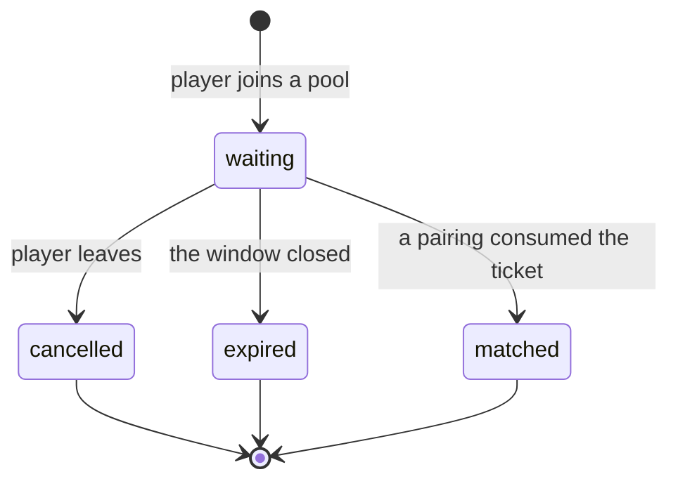

# Matchmaking

> **Status:** Partial — §1–§9 specify the **queue domain** and its boundary with
> `game`, and are implemented (A64-014.1, A64-015.2). Pairing, challenges and
> acceptance are still unspecified.
> **Owner:** _Unassigned_
> **Related:** `templates/feature-spec.md`,
> [`domain-model.md §10.2`](../docs/01-architecture/domain-model.md),
> [`database.md §8.1a`](../docs/01-architecture/database.md),
> [`specs/game-engine.md`](game-engine.md)

## Description

Queueing, opponent selection, match creation, and direct challenge flows.

---

## 1. Scope of the queue domain

A64-014.1 builds the foundation every matchmaking workflow stands on, and
nothing that consumes it.

| In | Out — and where it goes |
| --- | --- |
| Entering a pool, leaving one, reading your own ticket | Pairing two tickets — A64-015.3 |
| One live ticket per player (QT-1) | Rating-window expansion (QT-5) — A64-015.3 |
| The rating snapshot at entry (QT-2) | Opponent eligibility (QT-3) — A64-015.3 |
| Expiry, and the atomic claim that records it (QT-4's mechanism) | Acceptance — later |
| The three durable queue events | Match creation — `game` |
| | Realtime queue updates — the gateway (AD-09) |

**The exclusions are consumers, not gaps.** Pairing scans `queue_snapshot`,
claims through `claim_due`, and creates a match through the `matchmaking →
game` port architecture.md §7 already draws — whose published half is §8. None of them changes the ticket.

## 2. The aggregate

`QueueTicket` — one player's standing request to be paired. Aggregate root,
**PostgreSQL-authoritative** (database.md §8.1a reverses what §8.1 said).

| Field | Notes |
| --- | --- |
| `id` | UUIDv7, application-generated (DB-07) |
| `player_id` | Opaque across contexts, no foreign key (DM-06) |
| `pool` | A `QueuePool` value — `(variant, queue_type, region)`. See §2.1 |
| `rating_snapshot` | The rating **at entry** (QT-2), never a live reference |
| `entered_at` | The pairing order, and the input to QT-5's widening window |
| `expires_at` | Absolute, so a deploy that changes the TTL does not re-date live tickets |
| `status` | `waiting` \| `matched` \| `cancelled` \| `expired` |
| `resolved_at` | Set exactly when `status` is terminal |

### 2.1 The pool

`QueuePool` (A64-015.2) — **two players in the same pool are candidates for
each other; two players in different pools never are, whatever their ratings.**

| Component | Values | Notes |
| --- | --- | --- |
| `variant` | `russian_8x8` | A `game.public.ProductVariant`, never the engine's `BoardVariant` — §8 |
| `queue_type` | `ranked` \| `casual` | The split that changes what a match *means* |
| `region` | `global` \| `europe` \| `north_america` \| `south_america` \| `asia` \| `africa` \| `oceania` | AD-25's pairing-by-geography policy input. Reference data wearing an enum's clothes until `reference` exists (DB-08) |

A pool is a **value**, frozen and compared by value, because a pairing scan
groups by it, a metric is labelled by it, and a future Redis index would be
keyed by `identifier()` — `"russian_8x8:ranked:global"`, ordered widest to
narrowest.

Constructing a pool re-asks `game.public.require_offered` whether the variant
is still on the menu, so a row written for a withdrawn variant fails loudly at
rehydration rather than being scanned into a pairing for a game the platform no
longer runs.

**Time control is deliberately absent.** A pool is really `(variant, mode, time
control, region)` and this one carries three of the four. `reference.time_control`
(database.md §6.2) does not exist in code, and inventing a speed class here
would put the definition of "blitz" in the module least entitled to own it —
rating categories (DM-10) and leaderboards would inherit the guess. When
`reference.time_control` ships, `QueuePool` gains a field and remains the one
place that changes.

### States

Four of domain-model.md §10.2's seven. `Widening` is a property of a scan
rather than of a ticket; `Reserved` needs a pairing to reserve anything;
`Abandoned` is `expired` with a cause only continuous presence can know.
`matched` has a transition and no caller — a status the database can hold and
the domain cannot reach is a status nothing can explain.

**Preparing for acceptance** (A64-014.1's own requirement): an acceptance flow
inserts `reserved` between `waiting` and `matched` and adds a deadline. Neither
changes anything written today — the terminal states stay terminal, and the
partial unique index that enforces QT-1 keys on `waiting` alone, which
`reserved` would join.

## 3. Business rules

| # | Rule | Enforced by |
| --- | --- | --- |
| QT-1 | One live ticket per player, **across all pools** | `uq_queue_ticket__one_live_per_player` — partial unique on `player_id` where `status = 'waiting'`. `QueueService.join` reads first for a cheap error; the index is what holds under concurrency (BE-06) |
| QT-2 | The ticket carries the rating **at entry**, not a reference | `RatingSnapshotProvider`, read before the transaction opens (BE-05) |
| QT-4 | Claiming is atomic and safe for N workers | `SELECT ... FOR UPDATE SKIP LOCKED` in `QueueRepository.claim_due` — the outbox's mechanism, reused rather than reinvented |
| — | A player must be **eligible** to enter a pool | `QueueEligibilityPolicy` — see §3.1 |
| — | A pool must name a variant the platform **offers** | `QueuePool.__post_init__`, via `game.public.require_offered` (§8) |
| — | A ticket past `expires_at` is not live, whatever a worker has recorded | Applied in the query (`QueueRepository.active_ticket`), so no reader can forget it |
| — | Leaving is idempotent | `DELETE` semantics, and one answer for both cases so a status code never reports queue state back to a probe |

QT-3 (opponent eligibility) and QT-5 (the widening window) are pairing rules
and are unimplemented — see §1.

### 3.1 Entry eligibility

A64-015.1 asked one question inline. A64-015.2 makes it a port —
`QueueEligibilityPolicy.require_eligible(player_id, *, pool)` — because the
questions still to come belong to modules that mostly do not exist, and a
service that grew an `if` per module would end up holding five ports and
answering a question none of them is about.

| Check | Owner | Status |
| --- | --- | --- |
| Positively recorded offline | `users` (presence) | **Implemented** — `PresenceEligibilityPolicy` |
| Account suspended or closed | `auth` | No published port |
| Active sanction | `admin` | Module does not exist |
| Already in a live match | `game` | No match exists to be in |
| Region locked out | `admin` | Not a rule anybody has written |

**Only a recorded sign-out refuses.** `PresenceProvider.presence_for` collapses
an expired window, an unrecorded player and an unreachable Redis into `None`,
and permitting on `None` is the safe direction: refusing would make a cache blip
an outage of matchmaking (C-7, system-design.md T-2).

**The refusal names no cause.** One `QueueNotPermitted` message for every check,
from the first one onwards. The checks this port will grow include block
relationships (BL-2 makes a blocked pair unpairable) and sanctions, and a
refusal that varied by cause — particularly one that varied by *who else is in
the pool* — would let a player probe the block graph by queueing repeatedly,
which is exactly what BL-1 exists to prevent.

**Block filtering is not here.** It is a pairing-time exclusion between two
specific players (QT-3), and it belongs to the scan that has both of them.

`AlwaysEligible` is the implementation for a deployment with presence disabled —
a real class rather than a mock, so the composition root has something to wire
when `PRESENCE_ENABLED` is off.

## 4. API

All three are authenticated; **the actor is the token and never a parameter**,
so queueing as somebody else is not expressible.

| Method | Path | Success | Failures |
| --- | --- | --- | --- |
| `POST` | `/matchmaking/queue` | `201` — the ticket, with the pool's depth | `401`, `409` already queued, `422` malformed or recorded offline, `429` |
| `DELETE` | `/matchmaking/queue` | `204`, **idempotent** | `401`, `429` |
| `GET` | `/matchmaking/queue/me` | `200` — the ticket, with the pool's depth | `401`, `404` not queued |

**The request body carries `queue_type`, an optional `region` and an optional
`variant`, and nothing else** — `extra="forbid"`, so a client-supplied
`rating_snapshot` is a `422` rather than a self-reported skill level on the
endpoint that decides who you play.

`variant` is typed as `ProductVariant`, so the generated OpenAPI document lists
`russian_8x8` as the only accepted value and a generated client cannot express a
request for anything else. It defaults to `russian_8x8`, which keeps a client
written against A64-014.1's two-field body working unchanged.

**There is no endpoint that reads another player's ticket**, and there is not
meant to be: who is queueing right now is exactly what would let somebody wait
for a favourable pool.

**Rate limits.** Joining and leaving share one per-user budget
(`RATE_LIMIT_MATCHMAKING_QUEUE_USER_LIMIT`, default 30 per 5 minutes) — the
abuse is pool churn, which is one behaviour rather than two. The read carries
none: it is what a client polls while waiting.

## 5. Events

Written to the outbox in the same transaction as the ticket (AD-16). Nothing
subscribes yet; the relay marks an unwanted entry published and counts it
separately, so an unsubscribed event costs one row.

| Event | `occurred_at` | Payload beyond ids and pool |
| --- | --- | --- |
| `matchmaking.queue_ticket_enqueued` | `entered_at` | `rating_snapshot`, `expires_at` |
| `matchmaking.queue_ticket_cancelled` | the cancellation | `waited_for_seconds` |
| `matchmaking.queue_ticket_expired` | the ticket's **`expires_at`**, not the sweep's instant | `waited_for_seconds` |

"Pool" in every payload is `variant`, `queue_type` and `region` as three
primitive fields (A64-015.2 added the first). A subscriber routes by pool, and a
pairing worker for one variant must be able to discard another's event without
reading the ticket back.

Cancellation and expiry are distinct because a consumer acts differently on
them: a cancellation is a decision, an expiry is an absence.

## 6. Expiry

`MATCHMAKING_TICKET_TTL_SECONDS` (default 600) sets the window.
`expires_at` is the rule; a sweep is the bookkeeping. A due ticket reads as
absent from `GET /matchmaking/queue/me` and never blocks a re-queue, even
before a worker has recorded it.

The sweep is a `platform.tasks` handler (`matchmaking.queue.expire`) on a
`PeriodicTaskScheduler`, claiming in bounded batches with `SKIP LOCKED`. It
runs in two transactions — the claim, then the resolutions and their events —
so a worker that dies between them leaves tickets the next sweep claims again.

**Repeated expiration is safe**, which the two-transaction shape makes a
requirement rather than a nicety. Both the claim and the resolution carry
`status = 'waiting'`, so a ticket already expired is not re-stamped, not counted
again, and does not produce a second `QueueTicketExpired`. A duplicate event
would tell a subscriber twice that a player left a queue they were already out
of — and, once pairing exists, would fire for a ticket that has since been
matched.

**A64-015.2 adds no background work.** The task-dispatch seam (AD-17) and the
outbox boundary (AD-16) are unchanged: one periodic handler, the same two
transactions, the same three events. The only difference is that each payload
now names its variant. Pairing is the next thing to run off a schedule, and it
is A64-015.3's to add.

**The sweep is pool-blind.** One worker drains every pool, which is why
`ix_queue_ticket__due` does not lead with `variant` — a variant column at its
front would force one pass per pool per tick for no benefit. Contrast
`ix_queue_ticket__pool`, which a pairing scan reads one pool at a time and which
therefore *does* lead with `variant`.

## 7. Test scenarios

| Scenario | Where |
| --- | --- |
| Join, duplicate rejected, leave, expiration, repeated expiration | `tests/unit/test_queue_service.py` |
| The state machine and both database-mirrored invariants | `tests/unit/test_queue_ticket.py` |
| Pool identity, the offered-variant guard | `tests/unit/test_queue_pool.py` |
| Entry eligibility, and that the refusal names no cause | `tests/unit/test_queue_eligibility.py` |
| The published surface `matchmaking` reaches `game` through | `tests/unit/test_game_public_api.py` |
| That `matchmaking` imports only `game.public`, and no `engine` | `tests/unit/test_matchmaking_boundaries.py` |
| Two workers claim disjoint sets; two joins race one constraint | `tests/contract/test_queue_repository.py` |
| Status codes, the wire shapes, the OpenAPI document, variant selection | `tests/contract/test_matchmaking_queue_api.py` |
| The architecture contracts | `tests/unit/test_import_contracts.py` |

**Not testable while one variant is offered:** that a pool scan excludes another
variant's tickets. `ProductVariant` has one member and `queue_variant` one label,
so no second-variant ticket can be written to assert against. The filter is in
`QueueRepository.queue_snapshot` and in the index; the test arrives with the
second variant.

---

## 8. The `game` boundary

A64-015.2 realises the `matchmaking → game` edge architecture.md §7 draws.
`matchmaking` reaches `game` through `game.public` and reaches `engine` not at
all (R-1, R-2) — enforced by two import-linter contracts and asserted by
`tests/unit/test_matchmaking_boundaries.py`.

### 8.1 What `game.public` publishes

| Name | Purpose |
| --- | --- |
| `ProductVariant` | The variants a **player** may choose |
| `variant_catalogue()`, `is_offered()`, `require_offered()` | The catalogue, and its guard |
| `board_variant_of()` | `ProductVariant` → the engine's `BoardVariant` |
| `game_engine_version()` | The engine version a new match would be stamped with (AD-15) |
| `GameEngineServices`, `engine_services()` | The engine's stateless collaborators, wired once |

`Match`, `MoveRecord`, `MatchResult` and the draw-rule set are **not**
published. R-3 keeps the modules that care about matches on the event bus;
`matchmaking`'s edge points the other way — it will *ask* `game` to create a
match, and that port does not exist yet.

### 8.2 Product variants

| Variant | Engine | Offered | Why |
| --- | --- | --- | --- |
| `russian_8x8` | Plays it | **Yes** | The launch variant |
| `english_8x8` | Plays it | No | A **testing and configuration fixture** — `specs/game-engine/audit.md` §9. It is the only second value for three rule axes and it carries the engine's one external perft oracle, so it cannot be deleted; it must not be on the menu |
| `international_10x10` | Plays it | No | Its draw rules are a placeholder rather than a claim (`game-engine.md` §7.7). Offering it would ship Russian's rules under another name |

Two enums for one identifier, sharing their values: `ProductVariant` is a strict
subset of `BoardVariant`, and the subsetting is the point. The distinction is
made **by type at the boundary** rather than by a validator over the wider enum,
so the fixture never appears in the OpenAPI document as an accepted value and
the platform's own error messages cannot advertise it.

The database mirrors this. `matchmaking.queue_variant` is a native enum whose
members are `ProductVariant`'s, not `BoardVariant`'s — the one enum in this
schema whose members are deliberately *not* all declared up front, because
declaring `english_8x8` would make the fixture storable.

### 8.3 Stateless collaborators are wired once

Every engine collaborator — `MoveGenerator`, `MoveValidator`, `MoveApplier`,
`TerminalStateEvaluator`, `DrawRuleSet`, `ReplayEngine` — holds no per-match
state (`specs/game-engine/audit.md` §14). One instance therefore serves the
process, and `engine_services()` is the single accessor.

It is a frozen record behind an `lru_cache`, not a module-level mutable: shared
state that could be reassigned is global mutable state however stateless its
members are. FastAPI reaches it through `EngineServicesDep` in
`presentation/dependencies/`, so a route handler or a future pairing worker
never constructs its own.

**Nothing consumes it yet.** A64-015.2 wires the graph; A64-015.3's pairing is
the first caller.

---

## 9. Unresolved rules decisions blocking persisted games

Games are **not** persisted in A64-015.2 and no `Match` is created, so none of
the following blocks the queue. All of them block the first stored game, because
a threshold guessed now becomes a draw awarded wrongly in a rated match, and
changing it later invalidates the games already recorded under it (AD-15).

Carried forward from `game-engine.md` §7 and `specs/game-engine/audit.md`:

| Decision | Classification | Notes |
| --- | --- | --- |
| Threefold repetition draws | **Confirmed** | Implemented and tested |
| Russian 8x8 "15 moves by kings only" material limit | **External rules research required** | The commonly cited figure is 15 moves; no authoritative federation text has been read for this repository |
| Russian 8x8 three-versus-one endgame limit | **External rules research required** | Cited variously as 15 or 5 moves depending on whether the lone king holds the long diagonal |
| A generic no-capture / no-progress ply limit | **Product decision required** | No draughts federation defines one; it is a platform anti-stalling policy, not a rules import |
| International 10x10 draw rules | **Not relevant** | The variant is not offered (§8.2). Its `DrawRules` is a placeholder and is labelled as one |
| English 8x8 draw rules | **Not relevant** | Fixture only (§8.2) |

`MaterialPlyLimit` exists as a type and each unresolved threshold is absent
rather than defaulted, so a game cannot be drawn under a number nobody chose.

The engine version is **2** and A64-015.2 does not move it: no rule changed.
Resolving any threshold above is a rules change and must bump it.

## TODO

- [ ] Resolve §9's two research items and one product decision **before any game is persisted**
- [ ] Specify **pairing**: the scan, QT-3's eligibility, QT-5's widening window, and the two-phase claim (A64-015.3)
- [ ] Add `time_control` to `QueuePool` when `reference.time_control` ships (§2.1)
- [ ] Specify **acceptance**: the `reserved` state, its deadline, and what a declined acceptance does to both tickets
- [ ] Specify **challenges** — `matchmaking.challenge` (database.md §8.1), direct and open
- [ ] Define the `matchmaking → game` match-creation port with `game`
- [ ] Decide a retention horizon for resolved tickets (database.md §8.1a's known gap)
- [ ] Define realtime queue updates over the gateway (AD-09)
- [ ] Assign a document owner and promote the status
