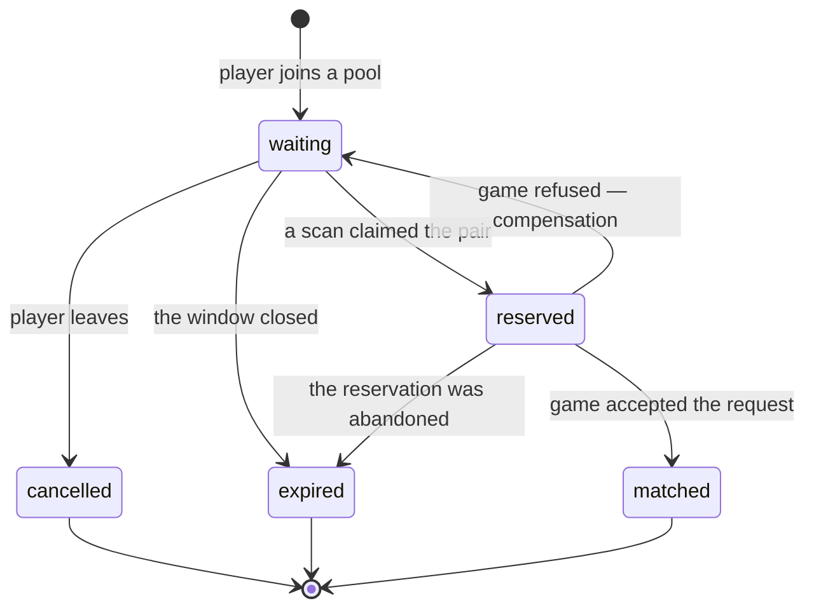

# Matchmaking

> **Status:** Partial — §1–§10 specify the **queue domain**, its boundary with
> `game`, and **pairing**, and are implemented (A64-014.1, A64-015.2,
> A64-015.3). Challenges and acceptance are still unspecified, and no match is
> persisted yet — see §9.8.
> **Owner:** _Unassigned_
> **Related:** `templates/feature-spec.md`,
> [`domain-model.md §9.2`](../docs/01-architecture/domain-model.md),
> [`database.md §8.1a`](../docs/01-architecture/database.md),
> [`specs/game-engine.md`](game-engine.md)

## Description

Queueing, opponent selection, match creation, and direct challenge flows.

---

## 1. Scope of the queue domain

A64-014.1 builds the foundation every matchmaking workflow stands on, and
nothing that consumes it.

A64-015.3 closed most of it. What remains out is listed against its owner.

| In | Out — and where it goes |
| --- | --- |
| Entering a pool, leaving one, reading your own ticket | Acceptance: the countdown, the decline, the deadline — A64-015.4 |
| One live ticket per player (QT-1) | Persisting a `Match` — `game`, A64-015.4 |
| The rating snapshot at entry (QT-2) | Direct challenges — `matchmaking.challenge`, later |
| Expiry, and the atomic claim that records it (QT-4) | Realtime queue updates — the gateway (AD-09) |
| **Pairing**: the scan, QT-3, QT-5, the two-phase claim (§10) | Rating changes — `rating`, on `match.completed` |
| The four durable queue events | |

**The exclusions are consumers, not gaps.** Pairing scans `queue_snapshot`,
claims through `claim_pair`, and asks for a match through the `matchmaking →
game` command architecture.md §7 draws — whose published half is §8. None of
them changes the ticket's shape.

## 2. The aggregate

`QueueTicket` — one player's standing request to be paired. Aggregate root,
**PostgreSQL-authoritative** (database.md §8.1a reverses what §8.1 said).

| Field | Notes |
| --- | --- |
| `id` | UUIDv7, application-generated (DB-07) |
| `player_id` | Opaque across contexts, no foreign key (DM-06) |
| `pool` | A `QueuePool` value — `(variant, queue_type, region)`. See §2.1 |
| `rating_snapshot` | The rating **at entry** (QT-2), never a live reference |
| `entered_at` | The pairing order, and the input to QT-5's widening window |
| `expires_at` | Absolute, so a deploy that changes the TTL does not re-date live tickets |
| `status` | `waiting` \| `matched` \| `cancelled` \| `expired` |
| `resolved_at` | Set exactly when `status` is terminal |

### 2.1 The pool

`QueuePool` (A64-015.2) — **two players in the same pool are candidates for
each other; two players in different pools never are, whatever their ratings.**

| Component | Values | Notes |
| --- | --- | --- |
| `variant` | `russian_8x8` | A `game.public.ProductVariant`, never the engine's `BoardVariant` — §8 |
| `queue_type` | `ranked` \| `casual` | The split that changes what a match *means* |
| `region` | `global` \| `europe` \| `north_america` \| `south_america` \| `asia` \| `africa` \| `oceania` | AD-25's pairing-by-geography policy input. Reference data wearing an enum's clothes until `reference` exists (DB-08) |

A pool is a **value**, frozen and compared by value, because a pairing scan
groups by it, a metric is labelled by it, and a future Redis index would be
keyed by `identifier()` — `"russian_8x8:ranked:global"`, ordered widest to
narrowest.

Constructing a pool re-asks `game.public.require_offered` whether the variant
is still on the menu, so a row written for a withdrawn variant fails loudly at
rehydration rather than being scanned into a pairing for a game the platform no
longer runs.

**Time control is deliberately absent.** A pool is really `(variant, mode, time
control, region)` and this one carries three of the four. `reference.time_control`
(database.md §6.2) does not exist in code, and inventing a speed class here
would put the definition of "blitz" in the module least entitled to own it —
rating categories (DM-10) and leaderboards would inherit the guess. When
`reference.time_control` ships, `QueuePool` gains a field and remains the one
place that changes.

### States

Five of domain-model.md §9.2's seven, since A64-015.3 added `reserved`.
`Widening` is a property of a scan rather than of a ticket — the ticket carries
`entered_at` and the scan derives the window from its age. `Abandoned` is
`expired` with a cause only continuous presence could know.

**`waiting` and `reserved` are both live.** Neither carries `resolved_at`, both
are covered by QT-1's uniqueness, and both are reported to their owner as "you
are queued". They differ in one way, and it is the mechanism the whole scan
rests on: **a pairing scan reads only `waiting`**, so a reserved pair is
invisible to every other worker's next scan.

**`reserved -> waiting` is the only backward edge**, and it is compensation
rather than a state machine loop — §9.6. The ticket keeps its `entered_at`,
so a player whose match creation failed returns to the place in line they held.

**`reserved -> expired` is the abandonment path.** A worker that dies between
reserving a pair and settling it leaves two reserved tickets; the expiry sweep
covers them once their own window closes, because a live status that nothing
can clear would lock both players out of the queue through QT-1 forever.

## 3. Business rules

| # | Rule | Enforced by |
| --- | --- | --- |
| QT-1 | One live ticket per player, **across all pools** | `uq_queue_ticket__one_live_per_player` — partial unique on `player_id` where `status IN ('waiting', 'reserved')`. `QueueService.join` reads first for a cheap error; the index is what holds under concurrency (BE-06) |
| QT-2 | The ticket carries the rating **at entry**, not a reference | `RatingSnapshotProvider`, read before the transaction opens (BE-05) |
| QT-3 | Two players who cannot be paired are never paired | The scan, not entry — §9.4 |
| QT-4 | Claiming is atomic and safe for N workers | `SELECT ... FOR UPDATE SKIP LOCKED` in `QueueRepository.claim_due` and `.claim_pair` — the outbox's mechanism, reused twice rather than reinvented |
| QT-5 | The rating window widens with the wait | `RatingWindowPolicy` — §9.3 |
| — | A player must be **eligible** to enter a pool | `QueueEligibilityPolicy` — see §3.1 |
| — | A pool must name a variant the platform **offers** | `QueuePool.__post_init__`, via `game.public.require_offered` (§8) |
| — | A ticket past `expires_at` is not live, whatever a worker has recorded | Applied in the query (`QueueRepository.active_ticket`), so no reader can forget it |
| — | Leaving is idempotent | `DELETE` semantics, and one answer for both cases so a status code never reports queue state back to a probe |

QT-3 and QT-5 are pairing rules and live in §9. They are listed here because
they are queue-domain rules that the scan happens to enforce, not scan-local
policy — a future acceptance flow must not be able to bypass either.

### 3.1 Entry eligibility

A64-015.1 asked one question inline. A64-015.2 makes it a port —
`QueueEligibilityPolicy.require_eligible(player_id, *, pool)` — because the
questions still to come belong to modules that mostly do not exist, and a
service that grew an `if` per module would end up holding five ports and
answering a question none of them is about.

| Check | Owner | Status |
| --- | --- | --- |
| Positively recorded offline | `users` (presence) | **Implemented** — `PresenceEligibilityPolicy` |
| Account suspended or closed | `auth` | No published port |
| Active sanction | `admin` | Module does not exist |
| Already in a live match | `game` | No match exists to be in |
| Region locked out | `admin` | Not a rule anybody has written |

**Only a recorded sign-out refuses.** `PresenceProvider.presence_for` collapses
an expired window, an unrecorded player and an unreachable Redis into `None`,
and permitting on `None` is the safe direction: refusing would make a cache blip
an outage of matchmaking (C-7, system-design.md T-2).

**The refusal names no cause.** One `QueueNotPermitted` message for every check,
from the first one onwards. The checks this port will grow include block
relationships (BL-2 makes a blocked pair unpairable) and sanctions, and a
refusal that varied by cause — particularly one that varied by *who else is in
the pool* — would let a player probe the block graph by queueing repeatedly,
which is exactly what BL-1 exists to prevent.

**Block filtering is not here.** It is a pairing-time exclusion between two
specific players (QT-3), and it belongs to the scan that has both of them.

`AlwaysEligible` is the implementation for a deployment with presence disabled —
a real class rather than a mock, so the composition root has something to wire
when `PRESENCE_ENABLED` is off.

## 4. API

All three are authenticated; **the actor is the token and never a parameter**,
so queueing as somebody else is not expressible.

| Method | Path | Success | Failures |
| --- | --- | --- | --- |
| `POST` | `/matchmaking/queue` | `201` — the ticket, with the pool's depth | `401`, `409` already queued, `422` malformed or recorded offline, `429` |
| `DELETE` | `/matchmaking/queue` | `204`, **idempotent** | `401`, `429` |
| `GET` | `/matchmaking/queue/me` | `200` — the ticket, with the pool's depth | `401`, `404` not queued |

**The request body carries `queue_type`, an optional `region` and an optional
`variant`, and nothing else** — `extra="forbid"`, so a client-supplied
`rating_snapshot` is a `422` rather than a self-reported skill level on the
endpoint that decides who you play.

`variant` is typed as `ProductVariant`, so the generated OpenAPI document lists
`russian_8x8` as the only accepted value and a generated client cannot express a
request for anything else. It defaults to `russian_8x8`, which keeps a client
written against A64-014.1's two-field body working unchanged.

**There is no endpoint that reads another player's ticket**, and there is not
meant to be: who is queueing right now is exactly what would let somebody wait
for a favourable pool.

**Rate limits.** Joining and leaving share one per-user budget
(`RATE_LIMIT_MATCHMAKING_QUEUE_USER_LIMIT`, default 30 per 5 minutes) — the
abuse is pool churn, which is one behaviour rather than two. The read carries
none: it is what a client polls while waiting.

## 5. Events

Written to the outbox in the same transaction as the ticket (AD-16). Nothing
subscribes yet; the relay marks an unwanted entry published and counts it
separately, so an unsubscribed event costs one row.

| Event | Aggregate | `occurred_at` | Payload beyond ids and pool |
| --- | --- | --- | --- |
| `matchmaking.queue_ticket_enqueued` | `queue_ticket` | `entered_at` | `rating_snapshot`, `expires_at` |
| `matchmaking.queue_ticket_cancelled` | `queue_ticket` | the cancellation | `waited_for_seconds` |
| `matchmaking.queue_ticket_expired` | `queue_ticket` | the ticket's **`expires_at`**, not the sweep's instant | `waited_for_seconds` |
| `matchmaking.players_paired` | **`match`** | the match's creation | `pairing_id`, both player and ticket ids by side, `waited_for_seconds` |

**`players_paired` is one event about two tickets**, which is the opposite of
the choice the three above make — and the difference is real. Enqueued,
cancelled and expired are each one ticket's whole story; a pairing is not, and
every consumer of it needs both halves. Two per-ticket events would make every
consumer join them back together, and the first to act on a half-delivered pair
would announce a match to one player.

Its aggregate is the **match**, not a ticket: that is the subject an operator
queries for and the identifier every downstream context (`rating`,
`statistics`, `replay`) will key on. It is published in the same transaction as
the two `matched` transitions, and a **compensated** pairing publishes nothing
— nothing durable happened.

"Pool" in every payload is `variant`, `queue_type` and `region` as three
primitive fields (A64-015.2 added the first). A subscriber routes by pool, and a
pairing worker for one variant must be able to discard another's event without
reading the ticket back.

Cancellation and expiry are distinct because a consumer acts differently on
them: a cancellation is a decision, an expiry is an absence.

## 6. Expiry

`MATCHMAKING_TICKET_TTL_SECONDS` (default 600) sets the window.
`expires_at` is the rule; a sweep is the bookkeeping. A due ticket reads as
absent from `GET /matchmaking/queue/me` and never blocks a re-queue, even
before a worker has recorded it.

The sweep is a `platform.tasks` handler (`matchmaking.queue.expire`) on a
`PeriodicTaskScheduler`, claiming in bounded batches with `SKIP LOCKED`. It
runs in two transactions — the claim, then the resolutions and their events —
so a worker that dies between them leaves tickets the next sweep claims again.

**Repeated expiration is safe**, which the two-transaction shape makes a
requirement rather than a nicety. Both the claim and the resolution carry
`status = 'waiting'`, so a ticket already expired is not re-stamped, not counted
again, and does not produce a second `QueueTicketExpired`. A duplicate event
would tell a subscriber twice that a player left a queue they were already out
of — and, once pairing exists, would fire for a ticket that has since been
matched.

**A64-015.2 adds no background work.** The task-dispatch seam (AD-17) and the
outbox boundary (AD-16) are unchanged: one periodic handler, the same two
transactions, the same three events. The only difference is that each payload
now names its variant. Pairing is the next thing to run off a schedule, and it
is A64-015.3's to add.

**The sweep is pool-blind.** One worker drains every pool, which is why
`ix_queue_ticket__due` does not lead with `variant` — a variant column at its
front would force one pass per pool per tick for no benefit. Contrast
`ix_queue_ticket__pool`, which a pairing scan reads one pool at a time and which
therefore *does* lead with `variant`.

## 7. Test scenarios

| Scenario | Where |
| --- | --- |
| Join, duplicate rejected, leave, expiration, repeated expiration | `tests/unit/test_queue_service.py` |
| The state machine and both database-mirrored invariants | `tests/unit/test_queue_ticket.py` |
| Pool identity, the offered-variant guard | `tests/unit/test_queue_pool.py` |
| Entry eligibility, and that the refusal names no cause | `tests/unit/test_queue_eligibility.py` |
| The published surface `matchmaking` reaches `game` through | `tests/unit/test_game_public_api.py` |
| That `matchmaking` imports only `game.public`, and no `engine` | `tests/unit/test_matchmaking_boundaries.py` |
| Two workers claim disjoint sets; two joins race one constraint | `tests/contract/test_queue_repository.py` |
| Status codes, the wire shapes, the OpenAPI document, variant selection | `tests/contract/test_matchmaking_queue_api.py` |
| The architecture contracts | `tests/unit/test_import_contracts.py` |
| Ordering, the widening window, exclusions, determinism, sides | `tests/unit/test_pairing_engine.py` |
| Claim sequencing, compensation, idempotency, pool isolation | `tests/unit/test_pairing_service.py` |
| The pool wire format and the pairing task | `tests/unit/test_pairing_task.py` |
| `reserve`/`release`/`complete`, abandoned reservations, two workers on one pair | `tests/contract/test_queue_repository.py` |
| The batch block read, and that it is **one statement** | `tests/contract/test_pairing_exclusions.py` |

**Not testable while one variant is offered:** that a pool scan excludes another
variant's tickets. `ProductVariant` has one member and `queue_variant` one label,
so no second-variant ticket can be written to assert against. The filter is in
`QueueRepository.queue_snapshot` and in the index; the test arrives with the
second variant.

---

## 8. The `game` boundary

A64-015.2 realises the `matchmaking → game` edge architecture.md §7 draws.
`matchmaking` reaches `game` through `game.public` and reaches `engine` not at
all (R-1, R-2) — enforced by two import-linter contracts and asserted by
`tests/unit/test_matchmaking_boundaries.py`.

### 8.1 What `game.public` publishes

| Name | Purpose |
| --- | --- |
| `ProductVariant` | The variants a **player** may choose |
| `variant_catalogue()`, `is_offered()`, `require_offered()` | The catalogue, and its guard |
| `board_variant_of()` | `ProductVariant` → the engine's `BoardVariant` |
| `game_engine_version()` | The engine version a new match would be stamped with (AD-15) |
| `GameEngineServices`, `engine_services()` | The engine's stateless collaborators, wired once |
| `CreateMatchRequest`, `CreateMatchResult`, `MatchParticipant`, `PlayerSide` | The command `matchmaking` sends to create a match — A64-015.3 |
| `MatchCreationUseCase`, `MatchCreationRefused`, `MatchCreationUnavailable`, `UnavailableMatchCreation` | The port that accepts it, its refusals, and the implementation that ships until matches are stored |

`Match`, `MoveRecord`, `MatchResult` and the draw-rule set are **not**
published, and A64-015.3 did not change that. R-3 keeps the modules that care
about matches on the event bus; `matchmaking`'s edge points the other way, and
it is answered with a **command `game` accepts** rather than a type it hands
out. A caller can ask for a match to exist; it cannot advance one.

**The request carries no time control**, and §9's own list names one. The
reason is the one `QueuePool` already records: `reference.time_control`
(database.md §6.2) does not exist in code, and inventing a speed class in
`matchmaking` would put the definition of "blitz" in the module least entitled
to own it. A nullable placeholder would be worse than the gap — it would be a
contract saying a time control is optional when every real match has one. When
`reference.time_control` ships, `QueuePool` gains a component and this request
gains a field, in one change.

### 8.2 Product variants

| Variant | Engine | Offered | Why |
| --- | --- | --- | --- |
| `russian_8x8` | Plays it | **Yes** | The launch variant |
| `english_8x8` | Plays it | No | A **testing and configuration fixture** — `specs/game-engine/audit.md` §9. It is the only second value for three rule axes and it carries the engine's one external perft oracle, so it cannot be deleted; it must not be on the menu |
| `international_10x10` | Plays it | No | Its draw rules are a placeholder rather than a claim (`game-engine.md` §7.7). Offering it would ship Russian's rules under another name |

Two enums for one identifier, sharing their values: `ProductVariant` is a strict
subset of `BoardVariant`, and the subsetting is the point. The distinction is
made **by type at the boundary** rather than by a validator over the wider enum,
so the fixture never appears in the OpenAPI document as an accepted value and
the platform's own error messages cannot advertise it.

The database mirrors this. `matchmaking.queue_variant` is a native enum whose
members are `ProductVariant`'s, not `BoardVariant`'s — the one enum in this
schema whose members are deliberately *not* all declared up front, because
declaring `english_8x8` would make the fixture storable.

### 8.3 Stateless collaborators are wired once

Every engine collaborator — `MoveGenerator`, `MoveValidator`, `MoveApplier`,
`TerminalStateEvaluator`, `DrawRuleSet`, `ReplayEngine` — holds no per-match
state (`specs/game-engine/audit.md` §14). One instance therefore serves the
process, and `engine_services()` is the single accessor.

It is a frozen record behind an `lru_cache`, not a module-level mutable: shared
state that could be reassigned is global mutable state however stateless its
members are. FastAPI reaches it through `EngineServicesDep` in
`presentation/dependencies/`, so a route handler or a future pairing worker
never constructs its own.

**Nothing consumes it yet.** A64-015.2 wires the graph; A64-015.3's pairing is
the first caller.

---

---

## 9. Pairing — A64-015.3

One pool, one scan, at most one match. `PairingEngine` decides;
`PairingService` orchestrates; neither knows about HTTP and only the second
knows about a transaction.

### 9.1 One pool at a time

A scan is handed exactly one `QueuePool` and reads
`ix_queue_ticket__pool`, which leads with `(variant, queue_type, region)`.
Two players in different pools are never candidates for each other, whatever
their ratings — rated never meets casual, one variant never meets another,
and regions are separate when a player names one.

The scan is scheduled **per pool**: `PairingTask` takes one
`QueuePool.identifier()` in its payload and `app_factory` builds one
`PeriodicTaskScheduler` per pool from `every_pool()`. Fourteen today.

`QueuePool.identifier()` — `"russian_8x8:ranked:global"` — is therefore no
longer only a log label. It is the task's wire format, and it is the key a
**future Redis pool index** would use (`from_identifier` is the other half of
the round trip). No Redis index is built in this task: A64-015.3 rules it out
until something has been measured, and the identifier existing is what makes
adding one later a change in one module.

**A reserved ticket is not scannable.** `ix_queue_ticket__pool` keeps the
predicate `status = 'waiting'` even though "live" widened elsewhere, which is
what makes a claimed pair invisible to every other worker.

### 9.2 Candidate ordering

Deterministic end to end, because two workers reading one pool at one instant
must reach the same conclusion. No randomness, no set iteration, no dependence
on row order — `PairingEngine` re-sorts its input rather than trusting the
query.

**Candidates**, in order:

| # | Key | Why |
| --- | --- | --- |
| 1 | `entered_at` ascending | The longest wait is served first |
| 2 | `id` ascending | A total tiebreak. UUIDv7, so it is itself time-ordered |

**Partners**, for a given candidate:

| # | Key | Why |
| --- | --- | --- |
| 1 | `abs(rating difference)` ascending | The closest game available |
| 2 | `entered_at` ascending | Then the longest wait |
| 3 | `id` ascending | Then the total tiebreak |

The **first candidate with any compatible partner wins**. A scan that searched
for the globally closest rating match would starve whoever had waited longest,
which is the failure mode a queue is judged on.

### 9.3 The rating window — QT-5

`RatingWindowPolicy`, from four settings, monotonic and bounded:

    width(age) = min(initial + floor(age / every) * by, maximum)

| Setting | Default | Meaning |
| --- | --- | --- |
| `MATCHMAKING_RATING_WINDOW_INITIAL` | 100 | The gap a fresh ticket accepts |
| `MATCHMAKING_RATING_WINDOW_WIDEN_EVERY_SECONDS` | 15 | One step |
| `MATCHMAKING_RATING_WINDOW_WIDEN_BY` | 50 | What a step adds |
| `MATCHMAKING_RATING_WINDOW_MAXIMUM` | 600 | Where it stops |

**Stepped rather than continuous**, so two workers whose clocks differ by a
millisecond compute the same width everywhere except within that millisecond of
a boundary. A continuous function would make every scan a different scan.

**Bounded**, because an unbounded window eventually pairs a beginner with the
top of the ladder. Expiring is the honest answer to a thin pool, and
`expires_at` already says it.

**A pair is compatible when the gap fits inside _both_ windows.** The narrower
governs. The alternative would let a player who has waited five minutes drag in
somebody who joined a second ago and asked for a close game: a long wait buys
*access* to more opponents, never the right to impose a bad game on one.

The rating is `QueueTicket.rating_snapshot` (QT-2) — never a live lookup, so a
rating that moves mid-scan cannot make one scan pair inconsistently.

### 9.4 Pairwise exclusion — QT-3

Two vetoes, unioned into one `PairExclusions` before the engine sees them.

| Source | Port | Status |
| --- | --- | --- |
| Blocked either way (BL-2) | `friends.public.PairingExclusions` | **Implemented** |
| Immediately previous opponent | `RecentOpponentProvider` | **Deferred** — §9.7 |

**Here and not at entry.** A block is a fact about a *pair*, and it can only be
answered where both players are in hand. `QueueEligibilityPolicy` (§3.1) stays
responsible for single-player eligibility only.

**Symmetric**, though a block is not (BL-1). A blocker paired with the person
they blocked would have gained nothing from blocking them.

**One query for the whole batch.** `blocked_pairs_among` takes every candidate
and restricts both sides of the predicate to that set, so the result is bounded
by the blocks *within* the pool rather than by either player's whole list. A
per-candidate form would be an N+1 inside a job that runs several times a
second. A contract test counts the statements.

**Reveals nothing.** A skipped pairing is indistinguishable from a pool that
had nobody suitable, which is what BL-1 requires.

### 9.5 The atomic claim

Three transactions, and the boundaries are the design:

    read      snapshot the pool, batch the exclusions       no transaction
    claim     lock both tickets, reserve them               transaction 1
    create    ask `game` for a match                        no transaction
    settle    mark both matched, publish the event          transaction 2
              — or release both back to `waiting`           transaction 2'

`claim_pair` is `SELECT ... FOR UPDATE SKIP LOCKED` over exactly two ids, with
`status = 'waiting' AND expires_at > now`. It returns **both tickets or
nothing** — never one. A single locked ticket is not a claim on a pair, and
returning it would hand the loser half a pairing plus a lock the winner needs.

`SKIP LOCKED` makes the loser *skip* rather than *wait*: two workers that chose
the same pair would otherwise serialise, and the second would hold a lock on
tickets the first is about to reserve. No distributed lock, no `claimed_by`
column, no check-then-act — the same mechanism the outbox proved.

`reserve`, `release` and `complete` are one `UPDATE` each, guarded by a
compare-and-set on the expected status **and** by a subquery asserting that
every row still matches. All-or-nothing is the statement's property, not the
caller's rollback: without the subquery, a pair with one cancelled ticket would
move the other one and report failure.

**The create step is outside a transaction on purpose.** services.md BE-05
forbids a cross-context call inside an open one — it would hold two row locks
across another module's work. The price of letting go is the reservation, and
that is what `reserved` is for.

**The claim commits before `game` is called**, which is what makes the
reservation visible to every other worker.

### 9.6 Compensation

`game` refused, or anything else went wrong: both tickets go back to `waiting`.

| Property | How |
| --- | --- |
| Neither player is lost from the queue | `release` is called on every failure path, refusal or fault |
| Both keep their place in line | `release` writes `status` and `resolved_at` only — `entered_at` is not in the statement |
| Nothing is announced | No event. Nothing durable happened, and "a pairing was attempted and abandoned" is an implementation detail of a background job |
| The failure is observable | `pairing_compensated` at `WARNING` with the pool, the pairing id and the reason; `pairing_release_failed` at `ERROR` if the release itself does not apply |

A **fault** (an unreachable database, a bug in `game`) compensates identically
to a **refusal**. Two players are waiting either way, so the recovery must not
depend on which.

The one genuinely bad outcome is a `complete` that does not apply *after* a
match was created — a match exists whose tickets do not say so. It is logged as
`pairing_settle_failed` at `ERROR` with both identifiers, and the
reconciliation is manual until a match carries a durable link back to its
tickets (A64-015.4).

### 9.7 Idempotency

`pairing_id = uuid5(namespace, sorted(ticket_id, ticket_id))` — **derived,
never generated**, so it survives a process restart with no stored state.

The contract, stated once on `MatchCreationUseCase.create_match`: calling twice
with the same `pairing_id` returns the same `match_id`, with `created=False` on
every call after the first.

It exists for one crash: a worker that dies after `game` committed the match
and before it settled the tickets. The retry re-derives the same key, `game`
returns the match it already has, and the settle completes. Without it, one
ticket pair becomes two matches — two games for two players who agreed to one.

Sides are derived from the same identifier (its parity), so a replayed pairing
assigns the same sides as the attempt that crashed. "The longer wait moves
first" was rejected: light moves first in Russian draughts, so it would be a
measurable permanent edge handed to whoever the pool made wait.

### 9.8 What is wired and not switched on

`MATCHMAKING_PAIRING_ENABLED` defaults to **`false`**, and that is the only
honest setting today.

`game` has a `Match` aggregate (A64-014.6) and no repository, no table and no
migration for one. `game.public.UnavailableMatchCreation` is therefore what a
scan reaches, and every pairing it found would be reserved, refused and
released — the compensation path working exactly as designed, several times a
second, forever, for no match.

So the engine, the service, the task and the whole object graph ship and are
tested; the schedule does not run. A64-015.4 replaces the match-creation
adapter and flips the default in the same change.

The **previous-opponent** exclusion is deferred for the same reason: there is
no match history to read. `NoRecentOpponents` excludes nobody, which is the
safe direction — a rematch is a disappointment and an empty pool is an outage.
When `game` publishes the read, `RecentOpponentProvider` is satisfied by
`game.public` and nothing else in the graph changes.

### 9.9 Performance

| Concern | Answer |
| --- | --- |
| Pool scan | `ix_queue_ticket__pool`, partial on `waiting`, leading with the pool — bounded by concurrency rather than by history |
| Candidate batch | `MATCHMAKING_CANDIDATE_BATCH_SIZE`, default **200**, the oldest first |
| Block reads | One statement per scan, restricted to the batch on both sides |
| Recent opponents | One call per scan, same shape |
| Claim | Two rows by primary key, `SKIP LOCKED` |
| Settle | One `UPDATE` for both tickets |
| Pool configuration | Resolved once per task run from the payload; no per-candidate lookup |

No Redis, no cache, and no pool index — none of them is justified before a
measurement, and `QueuePool.identifier()` is what makes adding one cheap.

---

## 10. Unresolved rules decisions blocking persisted games

Games are **not** persisted in A64-015.2 and no `Match` is created, so none of
the following blocks the queue. All of them block the first stored game, because
a threshold guessed now becomes a draw awarded wrongly in a rated match, and
changing it later invalidates the games already recorded under it (AD-15).

Carried forward from `game-engine.md` §7 and `specs/game-engine/audit.md`:

| Decision | Classification | Notes |
| --- | --- | --- |
| Threefold repetition draws | **Confirmed** | Implemented and tested |
| Russian 8x8 "15 moves by kings only" material limit | **External rules research required** | The commonly cited figure is 15 moves; no authoritative federation text has been read for this repository |
| Russian 8x8 three-versus-one endgame limit | **External rules research required** | Cited variously as 15 or 5 moves depending on whether the lone king holds the long diagonal |
| A generic no-capture / no-progress ply limit | **Product decision required** | No draughts federation defines one; it is a platform anti-stalling policy, not a rules import |
| International 10x10 draw rules | **Not relevant** | The variant is not offered (§8.2). Its `DrawRules` is a placeholder and is labelled as one |
| English 8x8 draw rules | **Not relevant** | Fixture only (§8.2) |

`MaterialPlyLimit` exists as a type and each unresolved threshold is absent
rather than defaulted, so a game cannot be drawn under a number nobody chose.

The engine version is **2** and A64-015.2 does not move it: no rule changed.
Resolving any threshold above is a rules change and must bump it.

## TODO

- [ ] Resolve §9's two research items and one product decision **before any game is persisted**
- [ ] Ship **match persistence** in `game` and replace `UnavailableMatchCreation`, then default `MATCHMAKING_PAIRING_ENABLED` to `true` (§9.8)
- [ ] Satisfy `RecentOpponentProvider` from `game.public` once match history exists (§9.7)
- [ ] Add `time_control` to `QueuePool` and to `CreateMatchRequest` when `reference.time_control` ships (§2.1, §8.1)
- [ ] Give a stored match a durable link back to its queue tickets, so `pairing_settle_failed` becomes reconcilable rather than manual (§9.6)
- [ ] Replace `every_pool()` with a scan of pools that actually have waiting tickets, when the pool count makes it worth a query (§9.1)
- [ ] Specify **acceptance**: the `reserved` state, its deadline, and what a declined acceptance does to both tickets
- [ ] Specify **challenges** — `matchmaking.challenge` (database.md §8.1), direct and open
- [ ] Define the `matchmaking → game` match-creation port with `game`
- [ ] Decide a retention horizon for resolved tickets (database.md §8.1a's known gap)
- [ ] Define realtime queue updates over the gateway (AD-09)
- [ ] Assign a document owner and promote the status
