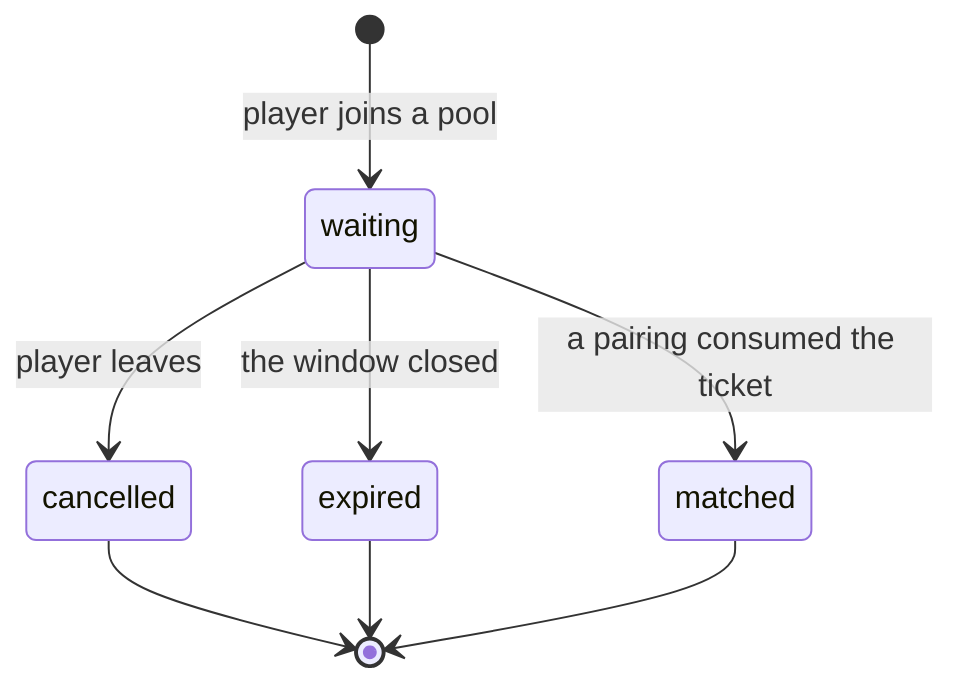

# Matchmaking

> **Status:** Partial — §1–§7 specify the **queue domain** and are implemented
> (A64-014.1). Pairing, challenges and acceptance are still unspecified.
> **Owner:** _Unassigned_
> **Related:** `templates/feature-spec.md`,
> [`domain-model.md §10.2`](../docs/01-architecture/domain-model.md),
> [`database.md §8.1a`](../docs/01-architecture/database.md)

## Description

Queueing, opponent selection, match creation, and direct challenge flows.

---

## 1. Scope of the queue domain

A64-014.1 builds the foundation every matchmaking workflow stands on, and
nothing that consumes it.

| In | Out — and where it goes |
| --- | --- |
| Entering a pool, leaving one, reading your own ticket | Pairing two tickets — A64-014.2 |
| One live ticket per player (QT-1) | Rating-window expansion (QT-5) — A64-014.2 |
| The rating snapshot at entry (QT-2) | Opponent eligibility (QT-3) — A64-014.2 |
| Expiry, and the atomic claim that records it (QT-4's mechanism) | Acceptance — later |
| The three durable queue events | Match creation — `game` |
| | Realtime queue updates — the gateway (AD-09) |

**The exclusions are consumers, not gaps.** Pairing scans `queue_snapshot`,
claims through `claim_due`, and creates a match through the `matchmaking →
game` port architecture.md §7 already draws. None of them changes the ticket.

## 2. The aggregate

`QueueTicket` — one player's standing request to be paired. Aggregate root,
**PostgreSQL-authoritative** (database.md §8.1a reverses what §8.1 said).

| Field | Notes |
| --- | --- |
| `id` | UUIDv7, application-generated (DB-07) |
| `player_id` | Opaque across contexts, no foreign key (DM-06) |
| `queue_type` | `ranked` \| `casual` — the split that changes what a match *means* |
| `region` | `global` \| `europe` \| `north_america` \| `south_america` \| `asia` \| `africa` \| `oceania`. AD-25's pairing-by-geography policy input. Reference data wearing an enum's clothes until `reference` exists (DB-08) |
| `rating_snapshot` | The rating **at entry** (QT-2), never a live reference |
| `entered_at` | The pairing order, and the input to QT-5's widening window |
| `expires_at` | Absolute, so a deploy that changes the TTL does not re-date live tickets |
| `status` | `waiting` \| `matched` \| `cancelled` \| `expired` |
| `resolved_at` | Set exactly when `status` is terminal |

### States

Four of domain-model.md §10.2's seven. `Widening` is a property of a scan
rather than of a ticket; `Reserved` needs a pairing to reserve anything;
`Abandoned` is `expired` with a cause only continuous presence can know.
`matched` has a transition and no caller — a status the database can hold and
the domain cannot reach is a status nothing can explain.

**Preparing for acceptance** (A64-014.1's own requirement): an acceptance flow
inserts `reserved` between `waiting` and `matched` and adds a deadline. Neither
changes anything written today — the terminal states stay terminal, and the
partial unique index that enforces QT-1 keys on `waiting` alone, which
`reserved` would join.

## 3. Business rules

| # | Rule | Enforced by |
| --- | --- | --- |
| QT-1 | One live ticket per player, **across all pools** | `uq_queue_ticket__one_live_per_player` — partial unique on `player_id` where `status = 'waiting'`. `QueueService.join` reads first for a cheap error; the index is what holds under concurrency (BE-06) |
| QT-2 | The ticket carries the rating **at entry**, not a reference | `RatingSnapshotProvider`, read before the transaction opens (BE-05) |
| QT-4 | Claiming is atomic and safe for N workers | `SELECT ... FOR UPDATE SKIP LOCKED` in `QueueRepository.claim_due` — the outbox's mechanism, reused rather than reinvented |
| — | A player recorded **offline** may not queue | `QueueService.join`, via `users.public.PresenceProvider`. **Only a recorded sign-out refuses**; unknown presence is permitted, because it collapses an expired window, an unrecorded player and an unreachable Redis (C-7) |
| — | A ticket past `expires_at` is not live, whatever a worker has recorded | Applied in the query (`QueueRepository.active_ticket`), so no reader can forget it |
| — | Leaving is idempotent | `DELETE` semantics, and one answer for both cases so a status code never reports queue state back to a probe |

QT-3 (opponent eligibility) and QT-5 (the widening window) are pairing rules
and are unimplemented — see §1.

## 4. API

All three are authenticated; **the actor is the token and never a parameter**,
so queueing as somebody else is not expressible.

| Method | Path | Success | Failures |
| --- | --- | --- | --- |
| `POST` | `/matchmaking/queue` | `201` — the ticket, with the pool's depth | `401`, `409` already queued, `422` malformed or recorded offline, `429` |
| `DELETE` | `/matchmaking/queue` | `204`, **idempotent** | `401`, `429` |
| `GET` | `/matchmaking/queue/me` | `200` — the ticket, with the pool's depth | `401`, `404` not queued |

**The request body carries `queue_type` and an optional `region`, and nothing
else** — `extra="forbid"`, so a client-supplied `rating_snapshot` is a `422`
rather than a self-reported skill level on the endpoint that decides who you
play.

**There is no endpoint that reads another player's ticket**, and there is not
meant to be: who is queueing right now is exactly what would let somebody wait
for a favourable pool.

**Rate limits.** Joining and leaving share one per-user budget
(`RATE_LIMIT_MATCHMAKING_QUEUE_USER_LIMIT`, default 30 per 5 minutes) — the
abuse is pool churn, which is one behaviour rather than two. The read carries
none: it is what a client polls while waiting.

## 5. Events

Written to the outbox in the same transaction as the ticket (AD-16). Nothing
subscribes yet; the relay marks an unwanted entry published and counts it
separately, so an unsubscribed event costs one row.

| Event | `occurred_at` | Payload beyond ids and pool |
| --- | --- | --- |
| `matchmaking.queue_ticket_enqueued` | `entered_at` | `rating_snapshot`, `expires_at` |
| `matchmaking.queue_ticket_cancelled` | the cancellation | `waited_for_seconds` |
| `matchmaking.queue_ticket_expired` | the ticket's **`expires_at`**, not the sweep's instant | `waited_for_seconds` |

Cancellation and expiry are distinct because a consumer acts differently on
them: a cancellation is a decision, an expiry is an absence.

## 6. Expiry

`MATCHMAKING_TICKET_TTL_SECONDS` (default 600) sets the window.
`expires_at` is the rule; a sweep is the bookkeeping. A due ticket reads as
absent from `GET /matchmaking/queue/me` and never blocks a re-queue, even
before a worker has recorded it.

The sweep is a `platform.tasks` handler (`matchmaking.queue.expire`) on a
`PeriodicTaskScheduler`, claiming in bounded batches with `SKIP LOCKED`. It
runs in two transactions — the claim, then the resolutions and their events —
so a worker that dies between them leaves tickets the next sweep claims again.

## 7. Test scenarios

| Scenario | Where |
| --- | --- |
| Join, duplicate rejected, leave, expiration | `tests/unit/test_queue_service.py` |
| The state machine and both database-mirrored invariants | `tests/unit/test_queue_ticket.py` |
| Two workers claim disjoint sets; two joins race one constraint | `tests/contract/test_queue_repository.py` |
| Status codes, the wire shapes, the OpenAPI document | `tests/contract/test_matchmaking_queue_api.py` |
| The architecture contracts | `tests/unit/test_import_contracts.py` |

## TODO

- [ ] Specify **pairing**: the scan, QT-3's eligibility, QT-5's widening window, and the two-phase claim (A64-014.2)
- [ ] Specify **acceptance**: the `reserved` state, its deadline, and what a declined acceptance does to both tickets
- [ ] Specify **challenges** — `matchmaking.challenge` (database.md §8.1), direct and open
- [ ] Define the `matchmaking → game` match-creation port with `game`
- [ ] Decide a retention horizon for resolved tickets (database.md §8.1a's known gap)
- [ ] Define realtime queue updates over the gateway (AD-09)
- [ ] Assign a document owner and promote the status
