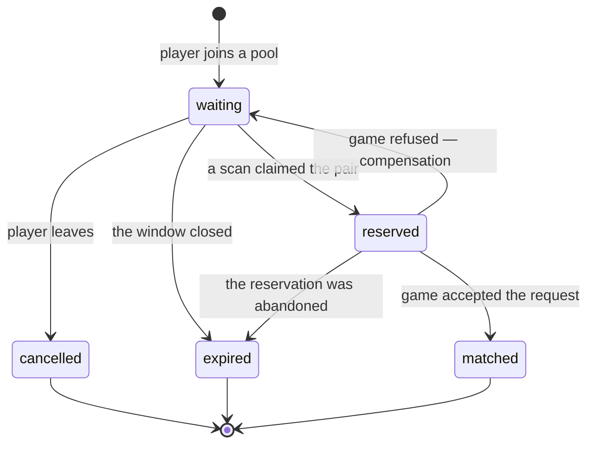
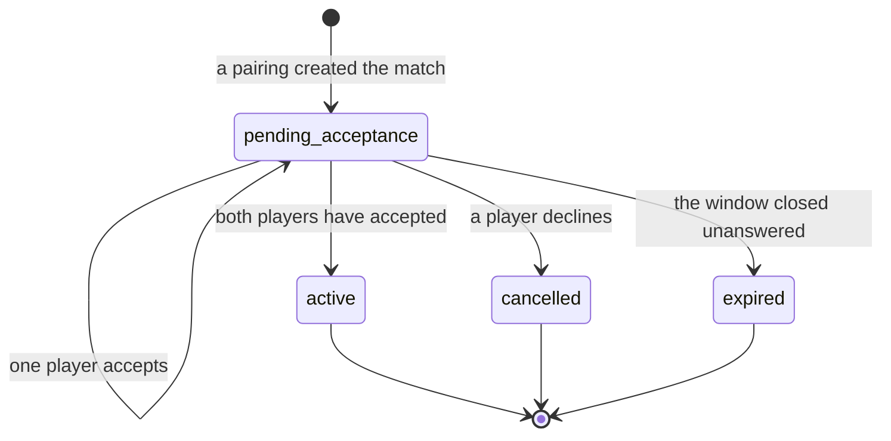

# Matchmaking

> **Status:** Partial — §1–§13 specify the **queue domain**, its boundary with
> `game`, **pairing**, **match persistence and acceptance**, **recovery,
> realtime delivery and retention**, and the **audit and operational
> hardening** that closed the epic. All are implemented (A64-014.1 through
> A64-015.6). Challenges remain unspecified.
> **Readiness:** **READY WITH DOCUMENTED LIMITATIONS**. See
> [`specs/matchmaking/audit.md`](matchmaking/audit.md) for the evidence and the four
> limitations, of which the acceptance deadline (§12, §2 of the audit) is the first
> worth revisiting.
> **Owner:** _Unassigned_
> **Related:** `templates/feature-spec.md`,
> [`specs/matchmaking/audit.md`](matchmaking/audit.md),
> [`domain-model.md §9.2`](../docs/01-architecture/domain-model.md),
> [`database.md §8.1a`](../docs/01-architecture/database.md),
> [`specs/game-engine.md`](game-engine.md)

## Description

Queueing, opponent selection, match creation, and direct challenge flows.

---

## 1. Scope of the queue domain

A64-014.1 builds the foundation every matchmaking workflow stands on, and
nothing that consumes it.

A64-015.3 closed most of it. What remains out is listed against its owner.

| In | Out — and where it goes |
| --- | --- |
| Entering a pool, leaving one, reading your own ticket | Acceptance: the countdown, the decline, the deadline — A64-015.4 |
| One live ticket per player (QT-1) | Persisting a `Match` — `game`, A64-015.4 |
| The rating snapshot at entry (QT-2) | Direct challenges — `matchmaking.challenge`, later |
| Expiry, and the atomic claim that records it (QT-4) | Realtime queue updates — the gateway (AD-09) |
| **Pairing**: the scan, QT-3, QT-5, the two-phase claim (§10) | Rating changes — `rating`, on `match.completed` |
| The four durable queue events | |

**The exclusions are consumers, not gaps.** Pairing scans `queue_snapshot`,
claims through `claim_pair`, and asks for a match through the `matchmaking →
game` command architecture.md §7 draws — whose published half is §8. None of
them changes the ticket's shape.

## 2. The aggregate

`QueueTicket` — one player's standing request to be paired. Aggregate root,
**PostgreSQL-authoritative** (database.md §8.1a reverses what §8.1 said).

| Field | Notes |
| --- | --- |
| `id` | UUIDv7, application-generated (DB-07) |
| `player_id` | Opaque across contexts, no foreign key (DM-06) |
| `pool` | A `QueuePool` value — `(variant, queue_type, region)`. See §2.1 |
| `rating_snapshot` | The rating **at entry** (QT-2), never a live reference |
| `entered_at` | The pairing order, and the input to QT-5's widening window |
| `expires_at` | Absolute, so a deploy that changes the TTL does not re-date live tickets |
| `status` | `waiting` \| `matched` \| `cancelled` \| `expired` |
| `resolved_at` | Set exactly when `status` is terminal |

### 2.1 The pool

`QueuePool` (A64-015.2) — **two players in the same pool are candidates for
each other; two players in different pools never are, whatever their ratings.**

| Component | Values | Notes |
| --- | --- | --- |
| `variant` | `russian_8x8` | A `game.public.ProductVariant`, never the engine's `BoardVariant` — §8 |
| `queue_type` | `ranked` \| `casual` | The split that changes what a match *means* |
| `region` | `global` \| `europe` \| `north_america` \| `south_america` \| `asia` \| `africa` \| `oceania` | AD-25's pairing-by-geography policy input. Reference data wearing an enum's clothes until `reference` exists (DB-08) |

A pool is a **value**, frozen and compared by value, because a pairing scan
groups by it, a metric is labelled by it, and a future Redis index would be
keyed by `identifier()` — `"russian_8x8:ranked:global"`, ordered widest to
narrowest.

Constructing a pool re-asks `game.public.require_offered` whether the variant
is still on the menu, so a row written for a withdrawn variant fails loudly at
rehydration rather than being scanned into a pairing for a game the platform no
longer runs.

**Time control is the fourth component** — A64-020.5A-pre. A pool is
`(variant, mode, time control, region)` and this one now carries all four;
`identifier()` reads `russian_8x8:ranked:blitz_3_2:global`, widest to
narrowest, with the clock before the region because it is the coarser split.

What the pool carries is a **`TimeControlId` and nothing else**. The
durations and the speed class live on the ticket as a snapshot (§2.2), which
is what keeps this type pure: `identifier()` is a wire format a pairing task
is dispatched with, so `from_identifier` reconstructs a pool from a string
with no database in reach, and `every_pool()` enumerates pools at
composition time without a query. A resolved control would round-trip
through neither.

A **retired** control still parses, unlike a withdrawn variant. Retiring one
stops new tickets being written for it and must not stop the ones already
waiting from being paired or swept; a withdrawn variant is a game the
platform no longer runs at all.

The prediction this section used to make held exactly: the definition of
"blitz" is `reference`'s, `matchmaking` never guesses one, and every rating
category inherits the catalogue's answer.

### States

Five of domain-model.md §9.2's seven, since A64-015.3 added `reserved`.
`Widening` is a property of a scan rather than of a ticket — the ticket carries
`entered_at` and the scan derives the window from its age. `Abandoned` is
`expired` with a cause only continuous presence could know.

**`waiting` and `reserved` are both live.** Neither carries `resolved_at`, both
are covered by QT-1's uniqueness, and both are reported to their owner as "you
are queued". They differ in one way, and it is the mechanism the whole scan
rests on: **a pairing scan reads only `waiting`**, so a reserved pair is
invisible to every other worker's next scan.

**`reserved -> waiting` is the only backward edge**, and it is compensation
rather than a state machine loop — §9.6. The ticket keeps its `entered_at`,
so a player whose match creation failed returns to the place in line they held.

**`reserved -> expired` is the abandonment path.** A worker that dies between
reserving a pair and settling it leaves two reserved tickets; the expiry sweep
covers them once their own window closes, because a live status that nothing
can clear would lock both players out of the queue through QT-1 forever.

## 3. Business rules

| # | Rule | Enforced by |
| --- | --- | --- |
| QT-1 | One live ticket per player, **across all pools** | `uq_queue_ticket__one_live_per_player` — partial unique on `player_id` where `status IN ('waiting', 'reserved')`. `QueueService.join` reads first for a cheap error; the index is what holds under concurrency (BE-06) |
| QT-2 | The ticket carries the rating **at entry**, not a reference | `RatingSnapshotProvider`, read before the transaction opens (BE-05) |
| QT-3 | Two players who cannot be paired are never paired | The scan, not entry — §9.4 |
| QT-4 | Claiming is atomic and safe for N workers | `SELECT ... FOR UPDATE SKIP LOCKED` in `QueueRepository.claim_due` and `.claim_pair` — the outbox's mechanism, reused twice rather than reinvented |
| QT-5 | The rating window widens with the wait | `RatingWindowPolicy` — §9.3 |
| — | A player must be **eligible** to enter a pool | `QueueEligibilityPolicy` — see §3.1 |
| — | A pool must name a variant the platform **offers** | `QueuePool.__post_init__`, via `game.public.require_offered` (§8) |
| — | A ticket past `expires_at` is not live, whatever a worker has recorded | Applied in the query (`QueueRepository.active_ticket`), so no reader can forget it |
| — | Leaving is idempotent | `DELETE` semantics, and one answer for both cases so a status code never reports queue state back to a probe |

QT-3 and QT-5 are pairing rules and live in §9. They are listed here because
they are queue-domain rules that the scan happens to enforce, not scan-local
policy — a future acceptance flow must not be able to bypass either.

### 3.1 Entry eligibility

A64-015.1 asked one question inline. A64-015.2 makes it a port —
`QueueEligibilityPolicy.require_eligible(player_id, *, pool)` — because the
questions still to come belong to modules that mostly do not exist, and a
service that grew an `if` per module would end up holding five ports and
answering a question none of them is about.

| Check | Owner | Status |
| --- | --- | --- |
| Positively recorded offline | `users` (presence) | **Implemented** — `PresenceEligibilityPolicy` |
| Account suspended or closed | `auth` | No published port |
| Active sanction | `admin` | Module does not exist |
| Already in a live match | `game` | No match exists to be in |
| Region locked out | `admin` | Not a rule anybody has written |

**Only a recorded sign-out refuses.** `PresenceProvider.presence_for` collapses
an expired window, an unrecorded player and an unreachable Redis into `None`,
and permitting on `None` is the safe direction: refusing would make a cache blip
an outage of matchmaking (C-7, system-design.md T-2).

**The refusal names no cause.** One `QueueNotPermitted` message for every check,
from the first one onwards. The checks this port will grow include block
relationships (BL-2 makes a blocked pair unpairable) and sanctions, and a
refusal that varied by cause — particularly one that varied by *who else is in
the pool* — would let a player probe the block graph by queueing repeatedly,
which is exactly what BL-1 exists to prevent.

**Block filtering is not here.** It is a pairing-time exclusion between two
specific players (QT-3), and it belongs to the scan that has both of them.

`AlwaysEligible` is the implementation for a deployment with presence disabled —
a real class rather than a mock, so the composition root has something to wire
when `PRESENCE_ENABLED` is off.

## 4. API

All three are authenticated; **the actor is the token and never a parameter**,
so queueing as somebody else is not expressible.

| Method | Path | Success | Failures |
| --- | --- | --- | --- |
| `POST` | `/matchmaking/queue` | `201` — the ticket, with the pool's depth | `401`, `409` already queued, `422` malformed or recorded offline, `429` |
| `DELETE` | `/matchmaking/queue` | `204`, **idempotent** | `401`, `429` |
| `GET` | `/matchmaking/queue/me` | `200` — the ticket, with the pool's depth | `401`, `404` not queued |

**The request body carries `queue_type`, an optional `region` and an optional
`variant`, and nothing else** — `extra="forbid"`, so a client-supplied
`rating_snapshot` is a `422` rather than a self-reported skill level on the
endpoint that decides who you play.

`variant` is typed as `ProductVariant`, so the generated OpenAPI document lists
`russian_8x8` as the only accepted value and a generated client cannot express a
request for anything else. It defaults to `russian_8x8`, which keeps a client
written against A64-014.1's two-field body working unchanged.

**There is no endpoint that reads another player's ticket**, and there is not
meant to be: who is queueing right now is exactly what would let somebody wait
for a favourable pool.

**Rate limits.** Joining and leaving share one per-user budget
(`RATE_LIMIT_MATCHMAKING_QUEUE_USER_LIMIT`, default 30 per 5 minutes) — the
abuse is pool churn, which is one behaviour rather than two. The read carries
none: it is what a client polls while waiting.

## 5. Events

Written to the outbox in the same transaction as the ticket (AD-16). Nothing
subscribes yet; the relay marks an unwanted entry published and counts it
separately, so an unsubscribed event costs one row.

| Event | Aggregate | `occurred_at` | Payload beyond ids and pool |
| --- | --- | --- | --- |
| `matchmaking.queue_ticket_enqueued` | `queue_ticket` | `entered_at` | `rating_snapshot`, `expires_at` |
| `matchmaking.queue_ticket_cancelled` | `queue_ticket` | the cancellation | `waited_for_seconds` |
| `matchmaking.queue_ticket_expired` | `queue_ticket` | the ticket's **`expires_at`**, not the sweep's instant | `waited_for_seconds` |
| `matchmaking.players_paired` | **`match`** | the match's creation | `pairing_id`, both player and ticket ids by side, `waited_for_seconds` |

**`players_paired` is one event about two tickets**, which is the opposite of
the choice the three above make — and the difference is real. Enqueued,
cancelled and expired are each one ticket's whole story; a pairing is not, and
every consumer of it needs both halves. Two per-ticket events would make every
consumer join them back together, and the first to act on a half-delivered pair
would announce a match to one player.

Its aggregate is the **match**, not a ticket: that is the subject an operator
queries for and the identifier every downstream context (`rating`,
`statistics`, `replay`) will key on. It is published in the same transaction as
the two `matched` transitions, and a **compensated** pairing publishes nothing
— nothing durable happened.

"Pool" in every payload is `variant`, `queue_type` and `region` as three
primitive fields (A64-015.2 added the first). A subscriber routes by pool, and a
pairing worker for one variant must be able to discard another's event without
reading the ticket back.

Cancellation and expiry are distinct because a consumer acts differently on
them: a cancellation is a decision, an expiry is an absence.

## 6. Expiry

`MATCHMAKING_TICKET_TTL_SECONDS` (default 600) sets the window.
`expires_at` is the rule; a sweep is the bookkeeping. A due ticket reads as
absent from `GET /matchmaking/queue/me` and never blocks a re-queue, even
before a worker has recorded it.

The sweep is a `platform.tasks` handler (`matchmaking.queue.expire`) on a
`PeriodicTaskScheduler`, claiming in bounded batches with `SKIP LOCKED`. It
runs in two transactions — the claim, then the resolutions and their events —
so a worker that dies between them leaves tickets the next sweep claims again.

**Repeated expiration is safe**, which the two-transaction shape makes a
requirement rather than a nicety. Both the claim and the resolution carry
`status = 'waiting'`, so a ticket already expired is not re-stamped, not counted
again, and does not produce a second `QueueTicketExpired`. A duplicate event
would tell a subscriber twice that a player left a queue they were already out
of — and, once pairing exists, would fire for a ticket that has since been
matched.

**A64-015.2 adds no background work.** The task-dispatch seam (AD-17) and the
outbox boundary (AD-16) are unchanged: one periodic handler, the same two
transactions, the same three events. The only difference is that each payload
now names its variant. Pairing is the next thing to run off a schedule, and it
is A64-015.3's to add.

**The sweep is pool-blind.** One worker drains every pool, which is why
`ix_queue_ticket__due` does not lead with `variant` — a variant column at its
front would force one pass per pool per tick for no benefit. Contrast
`ix_queue_ticket__pool`, which a pairing scan reads one pool at a time and which
therefore *does* lead with `variant`.

## 7. Test scenarios

| Scenario | Where |
| --- | --- |
| Join, duplicate rejected, leave, expiration, repeated expiration | `tests/unit/test_queue_service.py` |
| The state machine and both database-mirrored invariants | `tests/unit/test_queue_ticket.py` |
| Pool identity, the offered-variant guard | `tests/unit/test_queue_pool.py` |
| Entry eligibility, and that the refusal names no cause | `tests/unit/test_queue_eligibility.py` |
| The published surface `matchmaking` reaches `game` through | `tests/unit/test_game_public_api.py` |
| That `matchmaking` imports only `game.public`, and no `engine` | `tests/unit/test_matchmaking_boundaries.py` |
| Two workers claim disjoint sets; two joins race one constraint | `tests/contract/test_queue_repository.py` |
| Status codes, the wire shapes, the OpenAPI document, variant selection | `tests/contract/test_matchmaking_queue_api.py` |
| The architecture contracts | `tests/unit/test_import_contracts.py` |
| Ordering, the widening window, exclusions, determinism, sides | `tests/unit/test_pairing_engine.py` |
| Claim sequencing, compensation, idempotency, pool isolation | `tests/unit/test_pairing_service.py` |
| The pool wire format and the pairing task | `tests/unit/test_pairing_task.py` |
| `reserve`/`release`/`complete`, abandoned reservations, two workers on one pair | `tests/contract/test_queue_repository.py` |
| The batch block read, and that it is **one statement** | `tests/contract/test_pairing_exclusions.py` |

**Not testable while one variant is offered:** that a pool scan excludes another
variant's tickets. `ProductVariant` has one member and `queue_variant` one label,
so no second-variant ticket can be written to assert against. The filter is in
`QueueRepository.queue_snapshot` and in the index; the test arrives with the
second variant.

---

## 8. The `game` boundary

A64-015.2 realises the `matchmaking → game` edge architecture.md §7 draws.
`matchmaking` reaches `game` through `game.public` and reaches `engine` not at
all (R-1, R-2) — enforced by two import-linter contracts and asserted by
`tests/unit/test_matchmaking_boundaries.py`.

### 8.1 What `game.public` publishes

| Name | Purpose |
| --- | --- |
| `ProductVariant` | The variants a **player** may choose |
| `variant_catalogue()`, `is_offered()`, `require_offered()` | The catalogue, and its guard |
| `board_variant_of()` | `ProductVariant` → the engine's `BoardVariant` |
| `game_engine_version()` | The engine version a new match would be stamped with (AD-15) |
| `GameEngineServices`, `engine_services()` | The engine's stateless collaborators, wired once |
| `CreateMatchRequest`, `CreateMatchResult`, `MatchParticipant`, `PlayerSide` | The command `matchmaking` sends to create a match — A64-015.3 |
| `MatchCreationUseCase`, `MatchCreationRefused` | The port that accepts it, and its one expected refusal |
| `PendingMatchView`, `MatchRecordStatus`, `MatchAcceptanceUseCase` | The acceptance handshake — accept, decline, read your own (A64-015.4) |
| `MatchAcceptanceExpiryUseCase` | The sweep that expires unanswered pairings |
| `RecentOpponentReader` | QT-3's rematch guard, as a batch read. **Matches a player actually sat down to** — `active` or `completed` — since A64-020.5A; an offer that expired or was declined is not a game they played, and counting one barred the pair *permanently*, because the reader has no time window |
| `PairingReconciliationReader`, `PairingSettlement` | Did this reserved queue ticket produce a match |
| `AbandonedMatchRetention` | Deleting the pairings that never became games (A64-015.5) |
| `MatchCreated`, `MatchAcceptedByPlayer`, `MatchActivated`, `MatchDeclined`, `MatchAcceptanceExpired` | The five durable match events (A64-015.5) |
| `MATCH_ANSWER_LATENCY`, `MATCH_OUTCOMES`, `AnswerLatency`, `MatchOutcome` | The two measurements that inform `MATCHMAKING_RESERVATION_TTL_SECONDS` (A64-015.5) |
| `MatchNotFound`, `MatchNotPending`, `NotAMatchParticipant`, `AcceptanceWindowClosed` | The acceptance refusals |

`MatchCreationUnavailable` and `UnavailableMatchCreation` were published here
until A64-015.4 and are **deleted**: `game` can persist a match, so an adapter
that refused every request is one somebody could wire back.

`Match`, `MoveRecord`, `MatchResult` and the draw-rule set are **not**
published, and A64-015.3 did not change that. R-3 keeps the modules that care
about matches on the event bus; `matchmaking`'s edge points the other way, and
it is answered with a **command `game` accepts** rather than a type it hands
out. A caller can ask for a match to exist; it cannot advance one.

**The request carries a time control** — A64-020.5A-pre, and the change §9
predicted. `MatchTimeControl` is primitive-only and `game`-agnostic, like
`SeatRating` beside it and for the same reason: `game` must not import
`reference` any more than it imports `rating`.

It comes off a **ticket**, never from the catalogue. Both tickets in a pair
carry the same snapshot by construction — they are in one pool, and a ticket
refuses a snapshot whose id is not its pool's — so the scan neither reads
`reference` nor can disagree with what the players were told, and an
operator editing a row while two people wait cannot change the game they
were promised.

It is **optional on the port**, which is a gap rather than a policy. Every
queue pairing supplies one. A tournament does not: `specs/tournament.md` has
no time control on a `TournamentFormat`, and inventing one in the module
that creates the match rather than the one that runs the competition would
be the same mistake this section used to warn about. A system-activated
match carrying a control is refused outright by `CreateMatchRequest`, so the
task that gives tournaments a clock is made to schedule its deadline rather
than discovering months later that nobody flags.

### 8.2 Product variants

| Variant | Engine | Offered | Why |
| --- | --- | --- | --- |
| `russian_8x8` | Plays it | **Yes** | The launch variant |
| `english_8x8` | Plays it | No | A **testing and configuration fixture** — `specs/game-engine/audit.md` §9. It is the only second value for three rule axes and it carries the engine's one external perft oracle, so it cannot be deleted; it must not be on the menu |
| `international_10x10` | Plays it | No | Its draw rules are a placeholder rather than a claim (`game-engine.md` §7.7). Offering it would ship Russian's rules under another name |

Two enums for one identifier, sharing their values: `ProductVariant` is a strict
subset of `BoardVariant`, and the subsetting is the point. The distinction is
made **by type at the boundary** rather than by a validator over the wider enum,
so the fixture never appears in the OpenAPI document as an accepted value and
the platform's own error messages cannot advertise it.

The database mirrors this. `matchmaking.queue_variant` is a native enum whose
members are `ProductVariant`'s, not `BoardVariant`'s — the one enum in this
schema whose members are deliberately *not* all declared up front, because
declaring `english_8x8` would make the fixture storable.

### 8.3 Stateless collaborators are wired once

Every engine collaborator — `MoveGenerator`, `MoveValidator`, `MoveApplier`,
`TerminalStateEvaluator`, `DrawRuleSet`, `ReplayEngine` — holds no per-match
state (`specs/game-engine/audit.md` §14). One instance therefore serves the
process, and `engine_services()` is the single accessor.

It is a frozen record behind an `lru_cache`, not a module-level mutable: shared
state that could be reassigned is global mutable state however stateless its
members are. FastAPI reaches it through `EngineServicesDep` in
`presentation/dependencies/`, so a route handler or a future pairing worker
never constructs its own.

**Nothing consumes it yet.** A64-015.2 wires the graph; A64-015.3's pairing is
the first caller.

---

---

## 9. Pairing — A64-015.3

One pool, one scan, at most one match. `PairingEngine` decides;
`PairingService` orchestrates; neither knows about HTTP and only the second
knows about a transaction.

### 9.1 One pool at a time

A scan is handed exactly one `QueuePool` and reads
`ix_queue_ticket__pool`, which leads with `(variant, queue_type, region)`.
Two players in different pools are never candidates for each other, whatever
their ratings — rated never meets casual, one variant never meets another,
and regions are separate when a player names one.

The scan is scheduled **per pool**: `PairingTask` takes one
`QueuePool.identifier()` in its payload and `app_factory` builds one
`PeriodicTaskScheduler` per pool from `every_pool()`. Fourteen today.

`QueuePool.identifier()` — `"russian_8x8:ranked:global"` — is therefore no
longer only a log label. It is the task's wire format, and it is the key a
**future Redis pool index** would use (`from_identifier` is the other half of
the round trip). No Redis index is built in this task: A64-015.3 rules it out
until something has been measured, and the identifier existing is what makes
adding one later a change in one module.

**A reserved ticket is not scannable.** `ix_queue_ticket__pool` keeps the
predicate `status = 'waiting'` even though "live" widened elsewhere, which is
what makes a claimed pair invisible to every other worker.

### 9.2 Candidate ordering

Deterministic end to end, because two workers reading one pool at one instant
must reach the same conclusion. No randomness, no set iteration, no dependence
on row order — `PairingEngine` re-sorts its input rather than trusting the
query.

**Candidates**, in order:

| # | Key | Why |
| --- | --- | --- |
| 1 | `entered_at` ascending | The longest wait is served first |
| 2 | `id` ascending | A total tiebreak. UUIDv7, so it is itself time-ordered |

**Partners**, for a given candidate:

| # | Key | Why |
| --- | --- | --- |
| 1 | `abs(rating difference)` ascending | The closest game available |
| 2 | `entered_at` ascending | Then the longest wait |
| 3 | `id` ascending | Then the total tiebreak |

The **first candidate with any compatible partner wins**. A scan that searched
for the globally closest rating match would starve whoever had waited longest,
which is the failure mode a queue is judged on.

### 9.3 The rating window — QT-5

`RatingWindowPolicy`, from four settings, monotonic and bounded:

    width(age) = min(initial + floor(age / every) * by, maximum)

| Setting | Default | Meaning |
| --- | --- | --- |
| `MATCHMAKING_RATING_WINDOW_INITIAL` | 100 | The gap a fresh ticket accepts |
| `MATCHMAKING_RATING_WINDOW_WIDEN_EVERY_SECONDS` | 15 | One step |
| `MATCHMAKING_RATING_WINDOW_WIDEN_BY` | 50 | What a step adds |
| `MATCHMAKING_RATING_WINDOW_MAXIMUM` | 600 | Where it stops |

**Stepped rather than continuous**, so two workers whose clocks differ by a
millisecond compute the same width everywhere except within that millisecond of
a boundary. A continuous function would make every scan a different scan.

**Bounded**, because an unbounded window eventually pairs a beginner with the
top of the ladder. Expiring is the honest answer to a thin pool, and
`expires_at` already says it.

**A pair is compatible when the gap fits inside _both_ windows.** The narrower
governs. The alternative would let a player who has waited five minutes drag in
somebody who joined a second ago and asked for a close game: a long wait buys
*access* to more opponents, never the right to impose a bad game on one.

The rating is `QueueTicket.rating_snapshot` (QT-2) — never a live lookup, so a
rating that moves mid-scan cannot make one scan pair inconsistently.

### 9.4 Pairwise exclusion — QT-3

Two vetoes, unioned into one `PairExclusions` before the engine sees them.

| Source | Port | Status |
| --- | --- | --- |
| Blocked either way (BL-2) | `friends.public.PairingExclusions` | **Implemented** |
| Immediately previous opponent | `RecentOpponentProvider` | **Deferred** — §9.7 |

**Here and not at entry.** A block is a fact about a *pair*, and it can only be
answered where both players are in hand. `QueueEligibilityPolicy` (§3.1) stays
responsible for single-player eligibility only.

**Symmetric**, though a block is not (BL-1). A blocker paired with the person
they blocked would have gained nothing from blocking them.

**One query for the whole batch.** `blocked_pairs_among` takes every candidate
and restricts both sides of the predicate to that set, so the result is bounded
by the blocks *within* the pool rather than by either player's whole list. A
per-candidate form would be an N+1 inside a job that runs several times a
second. A contract test counts the statements.

**Reveals nothing.** A skipped pairing is indistinguishable from a pool that
had nobody suitable, which is what BL-1 requires.

### 9.5 The atomic claim

Three transactions, and the boundaries are the design:

    read      snapshot the pool, batch the exclusions       no transaction
    claim     lock both tickets, reserve them               transaction 1
    create    ask `game` for a match                        no transaction
    settle    mark both matched, publish the event          transaction 2
              — or release both back to `waiting`           transaction 2'

`claim_pair` is `SELECT ... FOR UPDATE SKIP LOCKED` over exactly two ids, with
`status = 'waiting' AND expires_at > now`. It returns **both tickets or
nothing** — never one. A single locked ticket is not a claim on a pair, and
returning it would hand the loser half a pairing plus a lock the winner needs.

`SKIP LOCKED` makes the loser *skip* rather than *wait*: two workers that chose
the same pair would otherwise serialise, and the second would hold a lock on
tickets the first is about to reserve. No distributed lock, no `claimed_by`
column, no check-then-act — the same mechanism the outbox proved.

`reserve`, `release` and `complete` are one `UPDATE` each, guarded by a
compare-and-set on the expected status **and** by a subquery asserting that
every row still matches. All-or-nothing is the statement's property, not the
caller's rollback: without the subquery, a pair with one cancelled ticket would
move the other one and report failure.

**The create step is outside a transaction on purpose.** services.md BE-05
forbids a cross-context call inside an open one — it would hold two row locks
across another module's work. The price of letting go is the reservation, and
that is what `reserved` is for.

**The claim commits before `game` is called**, which is what makes the
reservation visible to every other worker.

### 9.6 Compensation

`game` refused, or anything else went wrong: both tickets go back to `waiting`.

| Property | How |
| --- | --- |
| Neither player is lost from the queue | `release` is called on every failure path, refusal or fault |
| Both keep their place in line | `release` writes `status` and `resolved_at` only — `entered_at` is not in the statement |
| Nothing is announced | No event. Nothing durable happened, and "a pairing was attempted and abandoned" is an implementation detail of a background job |
| The failure is observable | `pairing_compensated` at `WARNING` with the pool, the pairing id and the reason; `pairing_release_failed` at `ERROR` if the release itself does not apply |

A **fault** (an unreachable database, a bug in `game`) compensates identically
to a **refusal**. Two players are waiting either way, so the recovery must not
depend on which.

The one genuinely bad outcome is a `complete` that does not apply *after* a
match was created — a match exists whose tickets do not say so. It is logged as
`pairing_settle_failed` at `ERROR` with both identifiers, and the
reconciliation is manual until a match carries a durable link back to its
tickets (A64-015.4).

### 9.7 Idempotency

`pairing_id = uuid5(namespace, sorted(ticket_id, ticket_id))` — **derived,
never generated**, so it survives a process restart with no stored state.

The contract, stated once on `MatchCreationUseCase.create_match`: calling twice
with the same `pairing_id` returns the same `match_id`, with `created=False` on
every call after the first.

It exists for one crash: a worker that dies after `game` committed the match
and before it settled the tickets. The retry re-derives the same key, `game`
returns the match it already has, and the settle completes. Without it, one
ticket pair becomes two matches — two games for two players who agreed to one.

Sides are derived from the same identifier (its parity), so a replayed pairing
assigns the same sides as the attempt that crashed. "The longer wait moves
first" was rejected: light moves first in Russian draughts, so it would be a
measurable permanent edge handed to whoever the pool made wait.

### 9.8 Switched on since A64-015.4

`MATCHMAKING_PAIRING_ENABLED` defaults to **`true`**.

It shipped `false` for exactly one task, and the reason was concrete: `game`
had a `Match` aggregate (A64-014.6) and no repository, no table and no
migration for one, so a scan reached `UnavailableMatchCreation` and every
pairing it found would have been reserved, refused and released — several
times a second, forever, for no match.

A64-015.4 supplied the five things required before the flag could flip, and
each is an object rather than an assertion:

| Requirement | What satisfies it |
| --- | --- |
| Durable match creation | `game.match`, written by `PersistentMatchCreation` |
| `pairing_id` idempotency | `uq_match__pairing_id` |
| Ticket settlement | `PairingService._complete`, unchanged from A64-015.3 |
| Automatic reconciliation | `MATCHMAKING_RECONCILIATION_ENABLED`, §10.5 |
| Acceptance timeout | `MATCHMAKING_RESERVATION_TTL_SECONDS`, §10.3 |

The **previous-opponent** exclusion landed with them — see §10.6.

### 9.9 Performance

| Concern | Answer |
| --- | --- |
| Pool scan | `ix_queue_ticket__pool`, partial on `waiting`, leading with the pool — bounded by concurrency rather than by history |
| Candidate batch | `MATCHMAKING_CANDIDATE_BATCH_SIZE`, default **200**, the oldest first |
| Block reads | One statement per scan, restricted to the batch on both sides |
| Recent opponents | One call per scan, same shape |
| Claim | Two rows by primary key, `SKIP LOCKED` |
| Settle | One `UPDATE` for both tickets |
| Pool configuration | Resolved once per task run from the payload; no per-candidate lookup |

No Redis, no cache, and no pool index — none of them is justified before a
measurement, and `QueuePool.identifier()` is what makes adding one cheap.

---

## 10. Match persistence and acceptance — A64-015.4

A pairing was, until A64-015.4, an event and two settled tickets. It is now a
**row two people have to agree to**.

### 10.1 The persistence boundary

`game` owns the match; `matchmaking` owns the queue tickets. Neither reads the
other's table, and the edge is `game.public` in both directions — §8.1 lists
the whole surface.

The aggregate is still not published. R-3 has not moved: a consumer holding a
`MatchRecord` could activate a match nobody accepted, so what crosses is
**commands `game` accepts** and **views it hands out**.

**Two match lifecycles, and they are not a duplication.** `game.domain.match`
holds the *rules* state machine — has a move been played, has the game ended —
and `game.domain.match_record` holds the *platform* one: does this contest
exist and may it be played. `MatchStatus.CREATED` means "no move has been
played", which a match only reaches once acceptance has already succeeded;
`MatchRecordStatus.PENDING_ACCEPTANCE` is the state before that, in which no
rules-bearing `Match` exists at all.

### 10.2 `pairing_id` idempotency

`uq_match__pairing_id` — a **unique index**, not a check-then-insert.

`pairing_id` is derived from the two claimed ticket ids (§9.7), so a retry
re-derives it exactly. The repository inserts inside a `SAVEPOINT`, lets the
index refuse the loser, and re-reads by `pairing_id` — so two workers retrying
one pairing at the same instant both come away with the same `match_id`, and
the second is told `created=False`.

The alternative fails under precisely the traffic it exists for: both read no
row, both insert, and two players who agreed to one game have two. A-4 makes
that permanent.

### 10.3 One deadline, two rows

`MATCHMAKING_RESERVATION_TTL_SECONDS` (default **30**) is the reservation
deadline *and* the acceptance deadline. `PairingService._claim` computes
`now + this` once, writes it to both reserved tickets as `reserved_until`, and
sends the same instant to `game` as the match's `acceptance_deadline`.

It must be strictly shorter than `MATCHMAKING_TICKET_TTL_SECONDS`, and a
settings validator refuses the process otherwise (DI-06).

### 10.4 Acceptance state transitions

| Rule | Enforced by |
| --- | --- |
| A newly paired match is never `active` | `MatchRecord`'s default, and `ck_match__active_iff_both_accepted` |
| Only a participant may respond | the side is *derived* from the caller's id; there is no side parameter |
| A repeat acceptance is idempotent | `MatchRecord.accepted_by` returns the same value |
| Both accepted activates | in the same value that records the second answer |
| One decline cancels | whatever the other side did |
| A late answer is refused | by the *instant*, not by the sweep having run |
| Two answers at once | `SELECT ... FOR UPDATE` — **not** `SKIP LOCKED` |

### 10.5 Ticket settlement and reconciliation

Match creation and ticket settlement do **not** share a transaction
(services.md BE-05). The sequence is:

    claim + reserve both tickets      transaction 1  (matchmaking)
    create the match                  transaction 2  (game)
    settle both tickets, publish      transaction 3  (matchmaking)

`matchmaking.pairing.reconcile` closes the gap. It claims reservations past
`reserved_until` with `SELECT ... FOR UPDATE SKIP LOCKED`, asks `game` whether
each produced a match, and acts:

| Durable state | Action |
| --- | --- |
| Reservation, match exists | settle as `matched`, with the match's `created_at` |
| Reservation, no match, ticket in date | return to `waiting` with its original `entered_at` |
| Reservation, no match, ticket due | expire it |
| Pending match past its deadline | expire the match, through `game`'s published sweep |

Every write is a compare-and-set: **running it twice is running it once**.

### 10.6 Recent opponents — QT-3

`GameRecentOpponents` satisfies `matchmaking`'s own `RecentOpponentProvider`
structurally, so the composition root wires one object with no adapter.

Its current definition is **wider than QT-3's, knowingly**: it excludes the
most recent match that is no longer awaiting acceptance, rather than the most
recent *completed* one, because no match can complete yet. The error is in the
safe direction.

### 10.7 API

Three endpoints, on the queue's prefix — a player who has been paired and has
not answered is, as far as the product is concerned, still being matched.

| Method | Path | Success | Failures |
| --- | --- | --- | --- |
| `GET` | `/matchmaking/matches/pending` | `200` — the player's **current** match, with an opponent preview | `401`, `404` none |
| `POST` | `/matchmaking/matches/{match_id}/accept` | `200`, **idempotent** | `401`, `404`, `409`, `429` |
| `POST` | `/matchmaking/matches/{match_id}/decline` | `200` — the cancelled match | `401`, `404`, `409`, `429` |

`404` covers "no such match" **and** "not yours", indistinguishably.

The response is named from the reader's seat — `your_side`, `you_accepted`,
`opponent_accepted` — and carries no `pairing_id`, no queue ticket id, no
`reserved_until` and no `settled_at`. It carries the match's **time
control** since A64-020.5A-pre.

### 10.8 "Pending" means *current*, and includes an active match

**`pending_acceptance` or `active`** — A64-020.5A. Nothing else, and no time
window.

Acceptance is bilateral, so one player answers **first** and the match
activates on the *other* one's request. The first acceptor's own response
therefore reads `pending_acceptance`, and while this endpoint returned
pending matches alone their next poll answered `404`: the one player who
could not learn their game had begun was the one who had agreed to it
soonest. The realtime seam is unwired (§11.4), so polling is their only
channel.

`PendingMatchResponse.status` had published the wider contract from the
start — *"a client that polls after answering sees the outcome rather than a
`404`"* — so this is the implementation catching up with a documented
promise rather than a new capability. A contract test asserted the narrow
behaviour and is corrected; it encoded an outdated requirement.

**A caller branches on `status`.** A lobby shows an acceptance dialog for
`pending_acceptance` and hands off to the game for `active`. The realtime
notifier pushes the first and **skips** the second: both players can agree
before the relay reaches the `match_created` entry, and an offer delivered
over a game already in progress is worse than one delivered late.

**No retention rule.** A match leaves this read by being played to an end,
declined or expiring — transitions the domain already makes. A horizon would
be a second, softer definition of "current" that nothing else shares.

Served by `ix_match__current_{light,dark}`, partial on the same two
statuses. `ix_match__pending_deadline` and
`ck_match__settled_at_iff_not_pending` deliberately keep the narrow
predicate: an `active` match can never become overdue, and it is settled.

---

## 11. Recovery, realtime status and retention — A64-015.5

A64-015.4 left three things open, and each is closed here: the
acceptance-failure policy, the poll-only delivery of a pending match, and the
two relations the handshake fills without bound.

### 11.1 The acceptance-failure policy

**A participant who accepted is requeued; a participant who explicitly
declined earns a cooldown. Silence earns neither.**

| What happened | The accepting player | The other player |
| --- | --- | --- |
| One accepted, one declined | requeued, original `entered_at` | cooldown, not requeued |
| One accepted, one stayed silent | requeued, original `entered_at` | nothing |
| Neither answered | — (nobody accepted) | nothing, for both |

Three properties, each a decision:

**The accepting player keeps their priority, not just their place.**
`entered_at` is the pairing order's sort key *and* the input to QT-5's widening
window, so a fresh instant would cost them both — and the second is the one
that hurts, because they would be re-entered with a narrow search after
already waiting. §11.2's requeue therefore preserves `entered_at`, the pool
and the rating snapshot, and takes a **fresh** `expires_at`.

**Silence is not a decline.** A decline is an observed decision; silence has a
dozen causes the platform cannot distinguish. Punishing all of them for the
one that deserves it would make the queue hostile to anybody on a train.

**Neither player is told what happened to the other.** The requeued player
gets a ticket; they are not told whether their opponent refused them or simply
vanished.

It is enforced by `MatchOutcomeService`, an **outbox consumer** on
`game.match_declined` and `game.match_acceptance_expired` — not a branch inside
acceptance. Three reasons: the decline happens in `game` and the requeue is a
`matchmaking` write; the expiry path has no request at all; and a failed
requeue must not fail a player's `200` on decline.

### 11.2 Requeue semantics

`QueueService.requeue(ticket_id)` returns the new ticket, or `None` when it
**correctly did not apply** — the source is gone, it never produced a match,
the player already holds a live ticket, they are no longer eligible, or
somebody already requeued it.

| Field | Requeued | Why |
| --- | --- | --- |
| `entered_at` | **preserved** | The whole policy |
| `pool` | preserved | They asked for that game |
| `rating_snapshot` | preserved | QT-2 fixes it at entry, and no game was played |
| `expires_at` | **fresh** | The original window has usually closed |
| `source_ticket_id` | set | Provenance, and the idempotency key |

**Idempotency is the index**, `uq_queue_ticket__requeued_from`. The event
ledger stops most redeliveries and cannot stop two workers processing one
entry concurrently; a partial unique index can.

**Eligibility is re-asked.** A player may have signed out in the intervening
thirty seconds, or — the case that matters — declined a *different* match and
earned a cooldown. Requeueing anyway would let a decline be laundered through
somebody else's.

### 11.3 The decline cooldown

`MATCHMAKING_DECLINE_COOLDOWN_SECONDS` (default **60**). Durable
(`matchmaking.queue_cooldown`), enforced on the join path by
`CooldownEligibilityPolicy`, and **extended rather than accumulated** by a
repeat — one `INSERT ... ON CONFLICT DO UPDATE ... GREATEST`, which is what
makes "a repeated decline does not bypass the cooldown" a constraint under
concurrency rather than a read-then-write.

It is **not** a sanction: no appeal, no record beyond its own expiry, no
escalation. Anything that should escalate belongs to `admin`.

`QueueCooldownActive` is a `409` carrying `queue_cooldown_active` and
`Retry-After`. It is the **one queue refusal that names its cause**, and the
line is whose fact it is: `QueueNotPermitted` stays silent because its future
causes are facts about other people (a block, a sanction), and this one is the
caller's own action taken seconds ago. *A refusal may name its cause only when
the cause is something the caller already knows they did.*

### 11.4 Realtime delivery, and polling as fallback

A pending match is **pushed**:

    business transaction  the match and `game.match_created`, one commit
    outbox                the relay claims the entry, ledger-deduplicated
    PendingMatchNotifier  re-reads, authorises, renders
    PendingMatchSink      the gateway delivery port

`GET /matchmaking/matches/pending` **remains**, and is the recovery path: a
reconnect, a cold start, a deployment with
`MATCHMAKING_REALTIME_DELIVERY_ENABLED=false`, or simple doubt. A client that
only polls still works; a client that only listens is correct until the first
dropped connection.

**Nothing is trusted from the payload except identity** (§6). Every question
is asked at delivery: still a participant, **still awaiting an answer**,
deadline not passed, block state now. "Still pending" became an explicit
status check in A64-020.5A rather than a property of the read — see §10.8. A block that appeared inside the window withholds the
opponent's **name** and never the match — withholding the offer would leave a
player holding a match they cannot see, which the deadline would then expire
against them.

The sink is `LoggingPendingMatchSink` until AD-09's gateway exists. That is a
seam rather than a stub: everything upstream is real, and only the socket is
missing.

### 11.5 Answer-latency metrics

The thirty-second deadline is a **product assumption**, and §7 forbids moving
it on intuition. Two measurements, published from `game.public.metrics`
because the setting they inform is `matchmaking`'s:

| Metric | Labels | Answers |
| --- | --- | --- |
| `game.match_answer_latency_seconds` | `first_response`, `both_accepted`, `declined`, `expired` | how long players actually take |
| `game.match_outcomes_total` | `both_accepted`, `declined`, `expired` | how often each ending happens |

**The tuning process.** Let the histogram run over a period that covers a
weekend — acceptance latency is a human behaviour. Then:

- `p99` of `first_response` well inside the window → the deadline may come
  down, provided the `expired` share does not rise;
- `expired` material **and** a long `first_response` tail → the window is too
  short and people are being timed out mid-decision;
- `expired` material and **no** tail → the players are not there at all, and
  the answer is presence rather than a longer deadline.

The third case is the one a shorter deadline would misdiagnose, which is why
the counter and the histogram must be read together.

### 11.6 Reconciliation observability

`matchmaking.reconciliation_actions_total`, labelled by
`ReconciliationAction`. Seven values, and together they answer §9's real
question — *where do workers fail?*

| Label | Meaning |
| --- | --- |
| `settled` | a match existed and its ticket caught up |
| `released` | an orphaned reservation went back to `waiting` |
| `expired` | a reservation whose ticket had itself fallen due |
| `requeued` | §11.1's policy put an accepting player back |
| `pending_match_cancelled` | a match nobody answered was expired |
| `no_action` | a healthy, empty tick |
| `reconciliation_failed` | the claim, the read or the write failed |

    before match creation           `released` rises
    after creation, before settle   `settled` rises
    during acceptance handling      `pending_match_cancelled` and `requeued`
    during cleanup                  `reconciliation_failed` rises
    nothing is wrong                `no_action` rises, the rest are flat

Beside it, `matchmaking.acceptance_failure_actions_total` counts the same
handshakes **per player** (`requeued`, `requeue_skipped`, `cooldown_applied`,
`no_action`) — the policy's view rather than the ticket funnel's.

**No label carries an identifier.** Every value comes from a `StrEnum`, so the
number of time series each metric can produce is fixed at import time, and a
test asserts it.

### 11.7 Retention

| Relation | Horizon | Measured on |
| --- | --- | --- |
| `matchmaking.queue_ticket`, terminal rows | 72h | `resolved_at` |
| `game.match`, cancelled and expired | 168h | `settled_at` |
| `matchmaking.queue_cooldown`, lapsed | 1h | `expires_at` |

One job (`matchmaking.queue.prune`, on the `maintenance` queue), bounded
batches, `SKIP LOCKED`, idempotent. `game` owns the match rows and publishes
the sweep; the *horizon* is the same product judgement as the queue's, so the
module with the opinion supplies it.

**The safety property is the predicate, not the horizon.** A live queue ticket
(`resolved_at IS NOT NULL` excludes it) and an `active` or `pending_acceptance`
match are unreachable from the deletes **however they are configured**. A
misconfigured window can delete too much history; it cannot delete a player
out of the queue, cannot delete the reservation reconciliation is about to
recover, and cannot delete a game.

Two counts are reported and acted on by nobody: `live_tickets_past_horizon`
and `unresolved_matches_past_horizon`. Both are zero on a healthy platform and
each is otherwise the only signal that a sweep has stopped.

### 11.8 The shared acceptance factory

`build_match_acceptance(session, events=, clock=, metrics=)` is the single
construction site, reached by four callers: the three HTTP routes, the
reconciliation task's expiry sweep, the realtime consumer's re-read, and the
composition root. What is hoisted is the **factory, not the service** — a
shared instance would hold a session that outlives the unit of work it serves.

---

## 12. Audit trails and operational hardening — A64-015.6

The closing task of the epic added no player-visible behaviour. What it added
is the ability to **answer questions afterwards** — why a player was barred,
what recovery did to a ticket — and the bounds that keep the machinery from
degrading quietly. `specs/matchmaking/audit.md` records the audit itself,
including what was found and what is deliberately left open.

### 12.1 The cooldown audit trail

§11.3's bar is one row per player, extended by `GREATEST` on a repeat
decline. That is the right shape for the join path and it discards history:
a second decline overwrites the first's expiry and nothing records that there
were two.

`matchmaking.queue_cooldown_audit` is the record. **Append-only**, one row per
decline, carrying the player, the reason, the match that caused it, the window
that was actually in force, and whether a bar was already standing when it
landed.

| Property | Rule |
| --- | --- |
| Idempotency | `uq_queue_cooldown_audit__source`, partial unique on `(player_id, source_match_id)`. A redelivered `game.match_declined` writes one row |
| Transaction | The audit row and the enforcement row commit **together**. A bar with no record of why is what this relation exists to prevent |
| `extended_existing` | Read *before* the write — "was a bar in force when this landed" — because comparing expiries only detects the rarer case where the old bar outlasted the new one |
| Retention | `MATCHMAKING_COOLDOWN_AUDIT_RETENTION_HOURS`, default 2160 (90 days), against the bar's own one hour. The dispute arrives after the window closed |
| Reach | Operations and support. **No route reaches it**, and no schema exposes it |

It is **not a sanction**. There is no actor, no severity, no note and no
escalation count; a cooldown is a mechanical consequence of one action with a
duration from a settings file. Moderation belongs to `admin`, and §11.3's
carried-forward note still stands.

### 12.2 The pairing reconciliation timeline

§11.6 publishes `matchmaking.pairing_reconciled` on every recovery. Until this
task nothing consumed it: the log line beside it is aggregated per tick (it
says *five tickets were settled*, not which), sits on the log pipeline's
retention, and cannot be joined to a ticket id — which is the only identifier
a support conversation starts from.

`matchmaking.pairing_timeline` is the projection. One row per reconciled
ticket, written by the `matchmaking_reconciliation_timeline` outbox consumer.

| Property | Rule |
| --- | --- |
| Idempotency | `uq_pairing_timeline__event`, unique on the outbox entry id. Duplicate delivery is a no-op rather than a second row |
| Source of truth | The **event payload**, never a re-read of the ticket — by projection time the ticket may have been paired again or pruned |
| Ordering | `occurred_at` from the event, `recorded_at` from the clock. The gap between them is relay lag, which is what "why was this late" is asking |
| `pairing_id` | Nullable and **null on every row today**. `PairingReconciled` identifies a ticket, because the reconciler may hold one half of a pair. The column and its partial index ship empty rather than back-filled with a guess |
| Retention | `MATCHMAKING_TIMELINE_RETENTION_HOURS`, default 336 (14 days), bounded by the outbox horizon it is a projection of (AD-19) |
| Reach | Operations and support. No route, no schema |

### 12.3 Outbox consumer isolation

The relay had three consumers on one loop, iterated **sequentially**, with **no
timeout on any of them**. Three consequences, and the third is the one that
mattered: a tick cost the sum of its consumers; which consumer was delayed by
which was decided by a list literal at the composition root; and a consumer
that *hung* stopped the relay for that process indefinitely.

`ConsumerPolicy` gives each consumer a timeout and `run_once` dispatches them
concurrently. A tick now costs the slowest consumer, and one that exceeds its
budget fails **its own slice** — those entries are retried, and every other
consumer's work in the tick has already committed.

| Consumer | Budget | Why |
| --- | --- | --- |
| `matchmaking_reconciliation_timeline` | 10s | One insert per entry, no cross-module port |
| `matchmaking_acceptance_failure` | 15s | Writes the queue; the requeue must not wait on a socket |
| `matchmaking_pending_match` | 10s | Will be a network write when AD-09's gateway lands |
| `social_notifications` | 20s | The most collaborators |
| anything unregistered | 30s | A runaway guard, not a latency target |

Durability is unchanged: every entry is still claimed once, every consumer
still has its own `processed_event` partition, and the retry is still on the
row. Concurrency is safe because each consumer opens its own session, which
`SessionScopedNotificationHandler` already guaranteed for a different reason.

**Known residual.** An entry's `attempt_count` is per *entry*, not per
consumer, so a consumer that fails an entry consistently still spends that
entry's shared attempt budget. Making it per-consumer means a second relation
and an outbox redesign; it is recorded in `specs/matchmaking/audit.md` rather
than pretended away.

### 12.4 Metrics volume

Every metric before this task was per-match or per-run, so one structured log
record per measurement was the volume of business events. The pairing scan is
not that: `MATCHMAKING_PAIRING_INTERVAL_SECONDS` is one second and
`every_pool()` returns fourteen pools, so a naive counter there is ~1.2 million
records a day on a platform with no players on it.

`AggregatingMetrics` sums **counters** in memory and emits one record per
series per flush; **observations pass straight through**. The asymmetry is
arithmetic rather than compromise:

- a counter summed over an interval loses nothing — the sum *is* the counter;
- an observation summed over an interval loses the distribution, which is the
  only thing an observation is for and exactly what §11.5's deadline evidence
  reads.

`MATCHMAKING`-wide the accumulator is bounded by the label enums rather than by
traffic, which is what makes an in-memory accumulator safe here and would make
it a leak in a system that labelled by identifier. `platform.metrics.flush`
drains it every `METRICS_FLUSH_INTERVAL_SECONDS`.

### 12.5 Pairing scan observability

| Metric | Labels | Answers |
| --- | --- | --- |
| `matchmaking.pairing_scans_total` | `outcome` — `paired`, `idle`, `no_pair`, `claim_lost`, `creation_refused` | Did the scan run, and what came of it |
| `matchmaking.pairing_candidates_total` | — | `rate(candidates)/rate(scans)` is the mean pool depth a scan sees |
| `matchmaking.pairing_exclusions_total` | `reason` — `blocked`, `recent_opponent` | Why a pool with waiting players is not pairing |

Exclusions are counted **per excluded pair per scan**, from the two mappings
the service already holds — O(1) at the point they are merged. They are
deliberately *not* counted per candidate comparison: the engine compares up to
n² pairs, and incrementing there would be ~20,000 dictionary updates per scan
at the default batch size. What that gives up is "how often did the rating
window specifically reject a pair", and that is recorded as known debt.

### 12.6 Retention covers every relation the module owns

Five now, each with its own horizon and each **counted even when it deleted
nothing** — a series reading zero says "the job ran and found nothing", an
absent series says "the job did not run", and only the first lets an operator
conclude the relation is not growing.

| Relation | Horizon | Measured on |
| --- | --- | --- |
| `queue_ticket` | 72h | `resolved_at` |
| `game.match` (abandoned) | 168h | `settled_at` |
| `queue_cooldown` | 1h past expiry | `expires_at` |
| `queue_cooldown_audit` | 2160h | `applied_at` |
| `pairing_timeline` | 336h | `occurred_at` |

The safety property is still the predicate rather than the horizon, and the
audit relations add one ordering rule enforced at construction:
`cooldown_audit_retention` must exceed `cooldown_retention`, because an audit
trail pruned before the thing it explains answers nothing.

### 12.7 One recorder per process

The composition root and `matchmaking`'s `get_metrics` each built their own
recorder. That was redundancy until §12.4 made the recorder **stateful**, at
which point it became counters that nothing drained — the request path
accumulated into an object `MetricsFlushTask` never saw.
`platform.metrics.process_metrics()` is now the single accessor both reach.

---

## 13. Unresolved rules decisions blocking persisted games

Games are **not** persisted in A64-015.2 and no `Match` is created, so none of
the following blocks the queue. All of them block the first stored game, because
a threshold guessed now becomes a draw awarded wrongly in a rated match, and
changing it later invalidates the games already recorded under it (AD-15).

Carried forward from `game-engine.md` §7 and `specs/game-engine/audit.md`:

| Decision | Classification | Notes |
| --- | --- | --- |
| Threefold repetition draws | **Confirmed** | Implemented and tested |
| Russian 8x8 "15 moves by kings only" material limit | **External rules research required** | The commonly cited figure is 15 moves; no authoritative federation text has been read for this repository |
| Russian 8x8 three-versus-one endgame limit | **External rules research required** | Cited variously as 15 or 5 moves depending on whether the lone king holds the long diagonal |
| A generic no-capture / no-progress ply limit | **Product decision required** | No draughts federation defines one; it is a platform anti-stalling policy, not a rules import |
| International 10x10 draw rules | **Not relevant** | The variant is not offered (§8.2). Its `DrawRules` is a placeholder and is labelled as one |
| English 8x8 draw rules | **Not relevant** | Fixture only (§8.2) |

`MaterialPlyLimit` exists as a type and each unresolved threshold is absent
rather than defaulted, so a game cannot be drawn under a number nobody chose.

The engine version is **2** and A64-015.2 does not move it: no rule changed.
Resolving any threshold above is a rules change and must bump it.

## TODO

- [ ] Resolve §13's two research items and one product decision **before any game is played**
- [ ] **Tune `MATCHMAKING_RESERVATION_TTL_SECONDS` from the histogram** (§11.5), once it has run over a weekend. Thirty seconds is still an assumption; it is now a measurable one
- [ ] Replace `LoggingPendingMatchSink` with AD-09's gateway (§11.4). Everything upstream is real; only the socket is missing
- [ ] Give **tournament** fixtures a time control (§8.1). Queue matches are timed since A64-020.5A-pre; a tournament pairing is still untimed, and `CreateMatchRequest` refuses a system-activated match that carries a clock until activation schedules its deadline
- [ ] Replace `every_pool()` with a scan of pools that actually have waiting tickets (§9.1). **Now warranted**: A64-020.5A-pre took the count from fourteen to fifty-six, of which at most a handful are ever non-empty, and a second variant makes it a hundred and twelve
- [ ] Specify **challenges** — `matchmaking.challenge` (database.md §8.1), direct and open
- [ ] Revisit the decline cooldown once there is a fair-play signal to feed (§11.3). It is deliberately not a sanction, and `admin` is where escalation belongs
- [ ] Make the outbox's attempt budget per-consumer rather than per-entry (§12.3). It needs a second relation, so it is a task rather than a fix
- [ ] Populate `pairing_timeline.pairing_id` if `PairingReconciled` ever carries one (§12.2)
- [ ] Replace the logging metrics sink with a real exporter when one exists (§12.4). Everything upstream of the sink is already real
- [ ] Assign a document owner and promote the status

**Done since A64-015.3:** match persistence and the `pairing_id` unique index
(§10.2); `MATCHMAKING_PAIRING_ENABLED` defaulted to `true` (§9.8);
`RecentOpponentProvider` satisfied from `game.public` (§10.6); a durable link
from a match back to its queue tickets, which made `pairing_settle_failed`
reconcilable rather than manual (§10.5); acceptance specified and implemented
(§10.4); **the acceptance-failure policy resolved** (§11.1); realtime delivery
with polling as its fallback (§11.4); retention for resolved tickets and
abandoned matches (§11.7).
